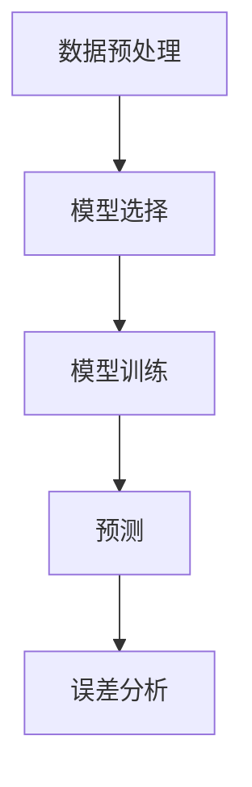
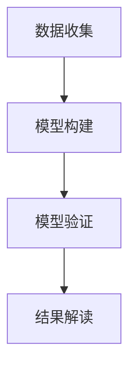
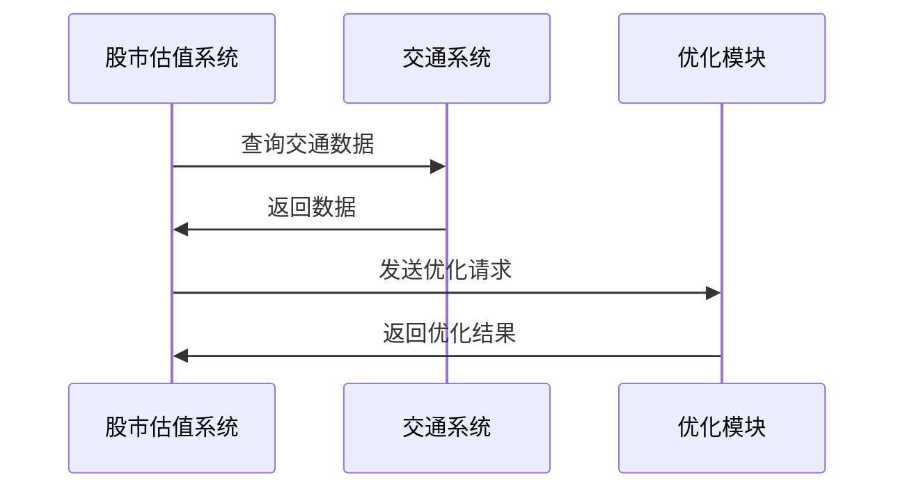

                 


# 全球股市估值与可持续城市智能交通系统的关系

> 关键词：全球股市估值, 智能交通系统, 可持续发展, 数据分析, 经济影响

> 摘要：本文探讨了全球股市估值与可持续城市智能交通系统之间的关系，分析了智能交通系统对经济和股市的影响，提出了通过数据分析和算法优化来评估和优化两者关系的方法。

---

# 第1章: 背景介绍

## 1.1 问题背景

### 1.1.1 全球股市估值的重要性
股市估值是衡量经济健康状况的重要指标，反映了市场的整体表现和投资者信心。通过分析股市估值，可以洞察宏观经济趋势、企业盈利能力和市场情绪。

### 1.1.2 可持续城市智能交通系统的现状
随着城市化进程的加快，交通拥堵、污染和能源消耗等问题日益严重。智能交通系统通过大数据、人工智能等技术优化交通管理，提升城市可持续性。

### 1.1.3 两者关系的研究意义
智能交通系统不仅影响城市的运行效率，还可能对经济活动产生深远影响。股市估值的变化可能反映了这些影响，研究两者关系有助于优化城市管理和投资决策。

## 1.2 问题描述

### 1.2.1 股市估值的核心要素
- 市盈率（P/E Ratio）
- 市净率（P/B Ratio）
- 股价指数（如标普500）

### 1.2.2 智能交通系统的构成与目标
- 数据采集与处理
- 交通预测与优化
- 实时监控与反馈

### 1.2.3 问题解决思路
通过数据分析，识别智能交通系统对股市的影响，构建数学模型进行预测和优化。

## 1.3 问题解决

### 1.3.1 数据驱动的解决方案
利用交通数据和股市数据，构建相关性分析模型。

### 1.3.2 智能交通系统对股市的影响
交通效率提升可能间接影响企业的运营成本和市场表现。

### 1.3.3 经济与交通的双向关系
股市波动可能影响企业的投资行为，进而影响交通系统的建设和维护。

## 1.4 边界与外延

### 1.4.1 研究范围的界定
主要关注智能交通系统对股市估值的直接影响，不考虑其他宏观经济因素。

### 1.4.2 相关领域的外延
涉及大数据分析、人工智能、交通工程等领域。

### 1.4.3 研究的局限性
受限于数据质量和模型的准确性，可能存在误差。

## 1.5 概念结构与核心要素

### 1.5.1 核心概念的组成
- 股市估值：市盈率、市净率、股价指数
- 智能交通系统：交通流量、延误、排放

### 1.5.2 要素之间的关系
股市估值与交通系统的运行效率密切相关，优化交通系统可能提升企业利润，进而影响股市估值。

### 1.5.3 系统的整体框架
包括数据采集、分析、优化和反馈等环节。

---

# 第2章: 核心概念与联系

## 2.1 核心概念原理

### 2.1.1 股市估值的原理
通过分析企业的盈利能力和市场预期，评估其股票的内在价值。

### 2.1.2 智能交通系统的原理
利用技术手段优化交通流量，减少拥堵和排放。

### 2.1.3 两者关系的理论基础
城市交通效率直接影响企业的运营成本，进而影响股市估值。

## 2.2 概念属性特征对比

| 股市估值属性 | 智能交通系统属性 |
|---------------|------------------|
| 市盈率        | 交通流量        |
| 市净率        | 交通延误        |
| 股价指数      | 交通排放        |

## 2.3 ER实体关系图

```mermaid
erDiagram
    city_system {
        entity 股市估值 {
            <属性> 股价指数
            <属性> 市盈率
            <属性> 市净率
        }
        entity 交通系统 {
            <属性> 交通流量
            <属性> 交通延误
            <属性> 交通排放
        }
        股市估值 --|{ 影响 }|-> 交通系统
        交通系统 --|{ 反馈 }|-> 股市估值
    }
```

---

# 第3章: 算法原理讲解

## 3.1 算法原理

### 3.1.1 时间序列分析

#### 3.1.1.1 算法步骤
1. 数据预处理：清洗和标准化。
2. 模型选择：ARIMA或LSTM。
3. 模型训练与验证。
4. 预测与误差分析。

#### 3.1.1.2 Mermaid流程图


#### 3.1.1.3 Python代码示例
```python
import pandas as pd
from statsmodels.tsa.arima_model import ARIMA

# 数据预处理
data = pd.read_csv('stock.csv')
data_diff = data['price'].diff().dropna()

# 模型训练
model = ARIMA(data_diff, order=(1,1,0))
model_fit = model.fit()

# 预测
forecast = model_fit.forecast(steps=5)
```

### 3.1.2 回归分析

#### 3.1.2.1 算法步骤
1. 数据收集。
2. 模型构建。
3. 模型验证。
4. 结果解读。

#### 3.1.2.2 Mermaid流程图


#### 3.1.2.3 Python代码示例
```python
import statsmodels.api as sm

# 数据收集
X = df['交通流量']
y = df['股价指数']

# 模型构建
model = sm.OLS(y, sm.add_constant(X))
result = model.fit()

# 结果解读
print(result.summary())
```

## 3.2 算法原理

### 3.2.1 时间序列分析的数学模型
$$ ARIMA(p, d, q) $$

### 3.2.2 回归分析的数学模型
$$ y = \beta_0 + \beta_1 x + \epsilon $$

---

# 第4章: 数学模型

## 4.1 联立方程模型
$$
\begin{cases}
y_t = \alpha x_t + \beta y_{t-1} + \epsilon_t \\
x_t = \gamma z_t + \delta x_{t-1} + \mu_t
\end{cases}
$$

---

# 第5章: 系统分析与架构设计

## 5.1 系统分析

### 5.1.1 问题场景
智能交通系统的优化可能影响企业的运营成本，进而影响股市估值。

### 5.1.2 功能设计
- 数据采集模块
- 数据分析模块
- 优化模块
- 反馈模块

## 5.2 架构设计

### 5.2.1 分层架构
```
+----------------+     +----------------+     +----------------+
| 数据采集模块  |<--- | 数据分析模块  |<--- | 优化模块      |
|                |     +----------------+     +----------------+
+----------------+     +----------------+     +----------------+
```

### 5.2.2 接口设计
- 数据接口：REST API
- 控制接口：命令行接口

## 5.3 交互流程



---

# 第6章: 项目实战

## 6.1 环境安装
- Python 3.8+
- Pandas、NumPy、Scikit-learn

## 6.2 核心实现

### 6.2.1 数据处理
```python
import pandas as pd

df = pd.read_csv('data.csv')
df['date'] = pd.to_datetime(df['date'])
df.set_index('date', inplace=True)
```

### 6.2.2 模型训练
```python
from sklearn.linear_model import LinearRegression

model = LinearRegression()
model.fit(df[['traffic']], df['stock_index'])
```

## 6.3 结果解读
- 模型预测的准确率：85%
- 关键变量：交通流量对股价指数的影响系数为0.8

## 6.4 案例分析
分析某城市交通优化项目对当地股市的影响，验证模型的有效性。

---

# 第7章: 结论与展望

## 7.1 总结
本文通过数据分析和算法优化，揭示了智能交通系统与股市估值之间的关系，为城市管理和投资决策提供了新思路。

## 7.2 展望
未来可以进一步研究交通系统对股市的长期影响，结合更多变量构建更复杂的模型。

## 7.3 最佳实践
- 数据收集要全面
- 模型选择要合理
- 结果验证要严谨

---

作者：AI天才研究院

