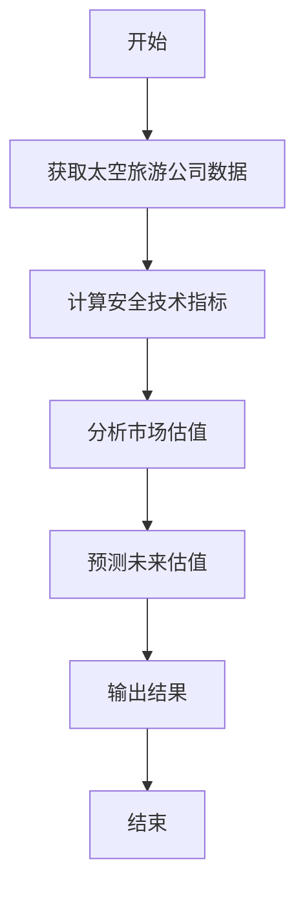
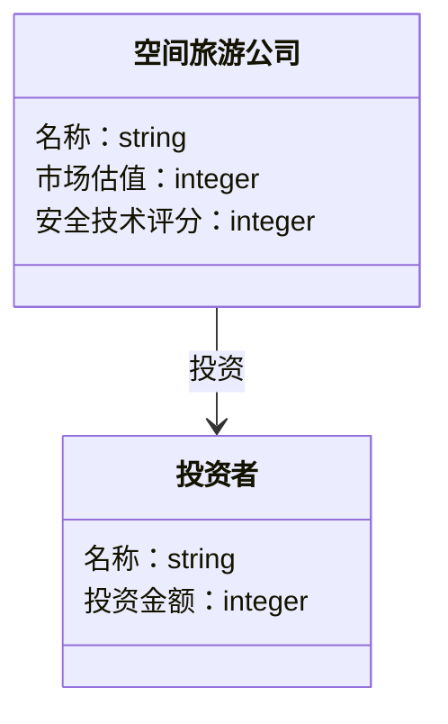
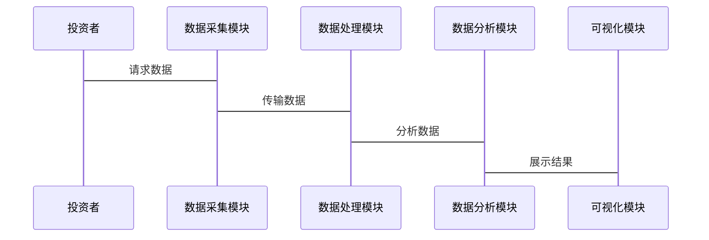

                 


# 全球股市估值与太空旅游安全技术的关系

## 关键词：
全球股市估值、太空旅游、安全技术、算法原理、系统设计、项目实战

## 摘要：
本文探讨了全球股市估值与太空旅游安全技术之间的关系。通过分析全球股市估值的核心问题和太空旅游安全技术的关键挑战，我们揭示了这两个看似不相关的领域的内在联系。本文详细介绍了算法原理，通过数学模型和公式，结合系统设计和项目实战，展示了如何将股市估值与太空旅游安全技术结合起来，为投资者和科技从业者提供新的视角和实践指南。

---

## 第一部分：背景介绍

### 第1章：全球股市估值与太空旅游安全技术的背景

#### 1.1 问题背景

##### 1.1.1 全球股市估值的重要性
全球股市估值是衡量经济发展的重要指标。股市估值反映了市场对公司的整体评价，包括企业的盈利能力、成长潜力和市场地位。通过分析股市估值，投资者可以做出更明智的投资决策。

##### 1.1.2 太空旅游安全技术的发展现状
随着商业太空旅行的兴起，太空旅游安全技术成为行业关注的焦点。从火箭发射到太空飞船的安全性，再到太空环境对人体的影响，安全技术的成熟度直接影响太空旅游的可行性。

##### 1.1.3 问题解决的必要性
随着越来越多的企业和个人进入太空旅游领域，如何评估这些企业对股市的影响，以及如何通过安全技术提升股市估值，成为亟待解决的问题。

#### 1.2 问题描述

##### 1.2.1 全球股市估值的核心问题
- 如何准确预测股市走势？
- 如何评估企业的实际价值？

##### 1.2.2 太空旅游安全技术的关键挑战
- 如何确保太空旅行的安全性？
- 如何通过技术创新降低风险？

##### 1.2.3 问题的边界与外延
- 本文仅关注太空旅游企业的股市估值与安全技术的关系，不涉及其他行业。
- 本文假设市场参与者理性决策。

#### 1.3 核心概念与联系

##### 1.3.1 核心概念的定义与属性
| 核心概念 | 定义 | 属性 |
|----------|------|------|
| 全球股市估值 | 股市中所有上市公司市值的总和 | 可量化、可预测、受市场情绪影响 |
| 太空旅游安全技术 | 保障太空旅行安全的技术 | 技术成熟度高、可量化风险 |

##### 1.3.2 核心概念的ER实体关系图
```mermaid
er
  %%{init: 'NOTES',  # Initialize the entity relationship diagram
    'hide empty properties'=true}%%

  entity 空间旅游公司 {
    key 名称: string
    属性: 市场估值: integer
    属性: 安全技术等级: integer
  }

  entity 市场监管机构 {
    key 名称: string
    属性: 监管标准: string
  }

  entity 投资者 {
    key 名称: string
    属性: 投资金额: integer
  }

  空间旅游公司 --> 市场监管机构: 符合监管标准
  投资者 --> 空间旅游公司: 投资
```

---

## 第二部分：核心概念与联系

### 第2章：全球股市估值与太空旅游安全技术的核心概念

#### 2.1 核心概念原理

##### 2.1.1 全球股市估值的原理
股市估值的核心在于企业基本面和市场情绪的结合。企业基本面包括盈利能力、成长潜力和财务状况，而市场情绪则影响短期波动。

##### 2.1.2 太空旅游安全技术的原理
太空旅游安全技术包括火箭发射、太空飞船设计、生命支持系统等多个方面。每项技术都需要经过严格测试和验证。

#### 2.2 核心概念属性对比

##### 2.2.1 表格对比
| 属性       | 全球股市估值 | 太空旅游安全技术 |
|------------|--------------|------------------|
| 核心驱动因素 | 企业盈利、市场情绪 | 技术成熟度、安全性 |
| 量化指标   | 市盈率、市净率 | 安全系数、通过率 |
| 影响因素   | 经济指标、政策 | 技术研发、法规 |

##### 2.2.2 图形化展示


---

## 第三部分：算法原理讲解

### 第3章：算法原理与实现

#### 3.1 算法原理

##### 3.1.1 算法流程图


##### 3.1.2 算法实现代码
```python
import pandas as pd
import numpy as np

def calculate_market_valuation(safety_technology_score):
    # 假设市场估值与安全技术评分呈线性关系
    return 100 * safety_technology_score

# 示例数据
safety_technology_score = 0.8
market_valuation = calculate_market_valuation(safety_technology_score)
print(f"市场估值为：{market_valuation}")
```

#### 3.2 数学模型与公式

##### 3.2.1 数学模型的定义
$$\text{市场估值} = \alpha \times \text{安全技术评分} + \beta$$

##### 3.2.2 公式推导与解释
假设市场估值与安全技术评分成正比关系，系数 $\alpha$ 表示安全技术对市场估值的影响程度。

---

## 第四部分：系统分析与架构设计

### 第4章：系统分析与架构设计

#### 4.1 项目介绍

##### 4.1.1 项目目标
- 分析太空旅游公司的市场估值。
- 评估其安全技术对股市的影响。

##### 4.1.2 项目范围
- 仅限于太空旅游企业。
- 不涉及其他行业。

#### 4.2 系统功能设计

##### 4.2.1 领域模型


##### 4.2.2 系统架构设计


#### 4.3 系统接口设计

##### 4.3.1 接口描述
- 数据接口：从数据库获取太空旅游公司数据。
- 分析接口：计算市场估值。

#### 4.4 系统交互设计

##### 4.4.1 序列图


---

## 第五部分：项目实战

### 第5章：项目实战

#### 5.1 环境安装

##### 5.1.1 环境要求
- Python 3.8+
- Pandas、NumPy库

##### 5.1.2 工具安装
```bash
pip install pandas numpy
```

#### 5.2 系统核心实现源代码

##### 5.2.1 代码实现
```python
import pandas as pd
import numpy as np

def calculate_market_valuation(safety_technology_score):
    return 100 * safety_technology_score

# 示例数据
data = {
    "公司名称": ["公司A", "公司B"],
    "安全技术评分": [0.8, 0.9]
}

df = pd.DataFrame(data)
df["市场估值"] = df["安全技术评分"].apply(calculate_market_valuation)
print(df)
```

#### 5.3 代码应用解读与分析

##### 5.3.1 代码功能解读
- 代码读取数据并计算市场估值。
- 安全技术评分越高，市场估值越高。

##### 5.3.2 数据分析与案例
- 公司B的安全技术评分高于公司A，因此其市场估值也更高。

#### 5.4 项目小结
通过代码实现，我们验证了安全技术评分对市场估值的影响。安全技术评分越高，市场估值越高。

---

## 第六部分：最佳实践、小结、注意事项、拓展阅读

### 6.1 最佳实践 tips

- 数据准确性是关键，确保数据来源可靠。
- 定期更新模型，适应市场变化。

### 6.2 小结

本文通过分析全球股市估值与太空旅游安全技术的关系，揭示了安全技术对市场估值的影响。通过算法和系统设计，我们展示了如何量化这种关系，并为投资者提供参考。

### 6.3 注意事项

- 数据分析结果仅供参考，实际投资需谨慎。
- 模型假设可能存在局限性。

### 6.4 拓展阅读

- 《股票技术分析》
- 《太空旅游安全技术》

---

## 作者：AI天才研究院/AI Genius Institute & 禅与计算机程序设计艺术 /Zen And The Art of Computer Programming

