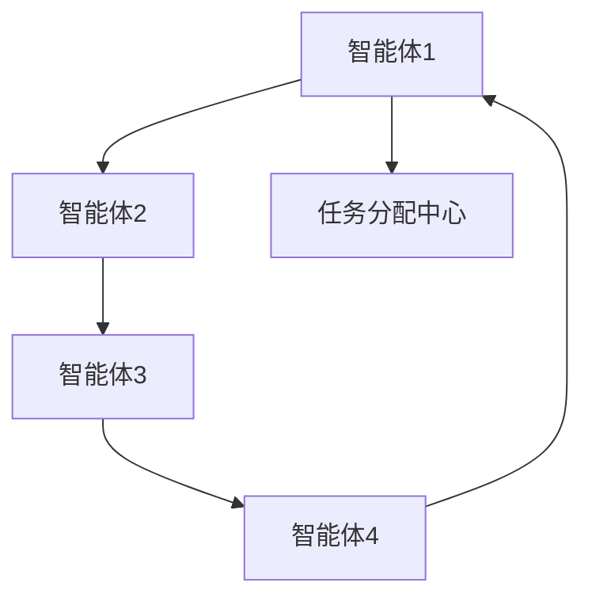
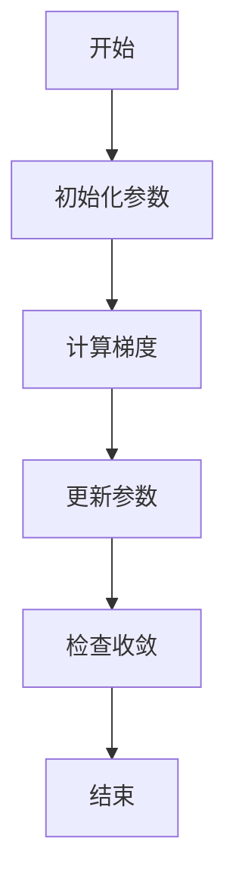
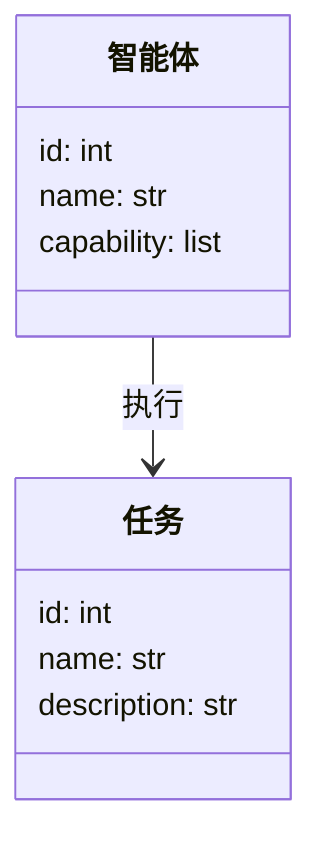

                 


# 分布式协作AI Agent：多LLM系统的群体智能

## 关键词：分布式协作AI Agent, 多LLM系统, 群体智能, 分布式系统, 人工智能

## 摘要：  
本文深入探讨了分布式协作AI Agent在多LLM系统中的应用，分析了群体智能的核心原理和实现机制。通过系统化的分析，我们揭示了分布式协作的优势与挑战，并提出了高效的解决方案。文章从理论到实践，详细阐述了算法原理、系统架构设计和项目实现，为读者提供了全面的技术指导。

---

# 第一部分: 分布式协作AI Agent的背景与概念

## 第1章: 分布式协作AI Agent概述

### 1.1 问题背景与描述

#### 1.1.1 当前AI发展的挑战  
人工智能（AI）技术的快速发展带来了许多新的可能性，但也面临着诸多挑战。单体AI模型的计算能力有限，难以应对复杂的分布式任务。传统的集中式AI系统在处理大规模数据时效率低下，且容易成为单点故障。  

#### 1.1.2 分布式协作AI Agent的提出  
为了克服上述问题，分布式协作AI Agent的概念应运而生。通过将任务分解为多个子任务，并由多个AI Agent协同完成，可以提高系统的整体效率和容错能力。  

#### 1.1.3 群体智能的核心问题  
群体智能强调多个个体通过协作完成复杂任务的能力。在多LLM系统中，每个LLM（大语言模型）可以看作一个智能体，通过分布式协作实现群体智能。  

---

### 1.2 多LLM系统的核心概念

#### 1.2.1 分布式协作的定义  
分布式协作是指多个智能体通过局部信息交换，共同完成全局任务的过程。与集中式协作不同，分布式协作强调去中心化和自治性。  

#### 1.2.2 多LLM系统的特性  
多LLM系统具有以下特性：  
- **异构性**：不同LLM可能有不同的能力和知识覆盖范围。  
- **动态性**：系统的结构和任务需求可能随时间变化。  
- **协作性**：智能体之间需要高效地交换信息和协调行动。  

#### 1.2.3 群体智能的边界与外延  
群体智能的边界在于智能体的协作程度和任务的复杂性。外延则包括分布式计算、多智能体系统和自适应算法等。  

---

### 1.3 核心要素与组成结构

#### 1.3.1 分布式协作的关键要素  
分布式协作AI Agent的核心要素包括：  
1. **智能体**：具有感知和决策能力的个体。  
2. **通信机制**：智能体之间交换信息的渠道。  
3. **协作协议**：定义智能体之间的交互规则。  

#### 1.3.2 系统组成与功能模块  
多LLM系统通常由以下模块组成：  
1. **任务分配模块**：将全局任务分解为子任务。  
2. **协作控制模块**：协调智能体的行动。  
3. **知识共享模块**：促进智能体之间的知识交换。  

#### 1.3.3 群体智能的数学模型  
群体智能可以表示为一个数学模型，其中每个智能体的行为可以用概率分布描述：  
$$ P(a|s) = \frac{1}{Z} \sum_{i=1}^{n} \exp(\theta_i s) $$  
其中，$a$是动作，$s$是状态，$\theta_i$是参数，$Z$是归一化因子。  

---

## 第2章: 分布式协作AI Agent的核心概念与联系

### 2.1 核心概念的原理分析

#### 2.1.1 分布式协作的机制  
分布式协作的核心机制包括：  
1. **信息交换**：智能体之间共享局部信息。  
2. **决策协调**：基于共享信息进行决策。  
3. **任务分解**：将复杂任务分解为多个子任务。  

#### 2.1.2 多LLM系统的交互方式  
多LLM系统通过以下方式实现协作：  
1. **消息传递**：智能体之间通过消息传递信息。  
2. **状态同步**：定期同步系统状态以保持一致性。  
3. **共识机制**：通过共识算法达成一致决策。  

#### 2.1.3 群体智能的决策模型  
群体智能的决策模型基于分布式计算和概率推理，通过多个智能体的协作实现最优决策。  

---

### 2.2 概念属性特征对比表

| 概念       | 分布式协作 | 集中式协作 | 备注                     |
|------------|------------|------------|--------------------------|
| 控制方式     | 去中心化   | 中心化     | 分布式系统更灵活         |
| 故障容错性   | 高         | 低         | 分布式系统抗单点故障     |
| 扩展性       | 高         | 有限       | 分布式系统更容易扩展       |

---

### 2.3 ER实体关系图与Mermaid流程图

#### 2.3.1 ER实体关系图  
```mermaid
erd
  table 分布式协作系统
    智能体: id, name, capability
    任务: id, name, description
    协作关系: 智能体id, 任务id, role
```

#### 2.3.2 Mermaid协作流程图  


---

## 第3章: 分布式协作AI Agent的算法原理

### 3.1 算法原理概述

#### 3.1.1 分布式协作的基本算法  
分布式协作算法的核心是任务分配和协作控制。常用算法包括：  
1. **分布式一致性算法**：如Paxos、Raft。  
2. **分布式优化算法**：如分布式梯度下降。  

#### 3.1.2 多LLM系统的共识机制  
多LLM系统需要通过共识机制达成一致决策，常用算法包括：  
1. **拜占庭容错（BFT）**：适用于异构环境。  
2. **实用拜占庭协议（PBFT）**：优化的拜占庭容错算法。  

#### 3.1.3 群体智能的决策算法  
群体智能的决策算法基于概率推理和博弈论，通过多个智能体的协作实现最优决策。  

---

### 3.2 算法的数学模型与公式

#### 3.2.1 分布式协作的数学模型  
$$ f(x) = \sum_{i=1}^{n} w_i x_i $$  
其中，$w_i$是权重，$x_i$是输入。  

#### 3.2.2 多LLM系统的优化公式  
$$ \theta^{new} = \theta^{old} + \alpha \nabla L $$  
其中，$\alpha$是学习率，$\nabla L$是损失函数的梯度。  

---

### 3.3 算法流程图与代码实现

#### 3.3.1 Mermaid算法流程图  


#### 3.3.2 Python代码实现  
```python
def distributed_optimization(theta, gradients):
    new_theta = theta + alpha * sum(gradients)
    return new_theta
```

---

## 第4章: 分布式协作AI Agent的系统分析与架构设计

### 4.1 问题场景介绍

#### 4.1.1 任务分解  
将复杂任务分解为多个子任务，分配给不同的智能体完成。  

#### 4.1.2 任务分配策略  
基于智能体的能力和负载，动态分配任务。  

---

### 4.2 系统功能设计

#### 4.2.1 功能模块设计  
系统功能模块包括：  
1. **任务管理模块**：负责任务的分解和分配。  
2. **协作控制模块**：协调智能体的行动。  
3. **知识共享模块**：促进智能体之间的知识交换。  

#### 4.2.2 领域模型设计  
领域模型用Mermaid类图表示：  


---

### 4.3 系统架构设计

#### 4.3.1 架构设计  
系统架构设计用Mermaid架构图表示：  


#### 4.3.2 接口设计  
系统接口包括：  
1. **任务分配接口**：分配任务给智能体。  
2. **协作控制接口**：协调智能体的行动。  
3. **知识共享接口**：促进智能体之间的知识交换。  

---

## 第5章: 分布式协作AI Agent的项目实战

### 5.1 环境安装

#### 5.1.1 安装依赖  
安装必要的依赖库，如：  
- Python 3.8+  
- PyTorch  
- transformers  

#### 5.1.2 安装步骤  
```bash
pip install torch transformers
```

---

### 5.2 系统核心实现

#### 5.2.1 核心代码  
```python
import torch
from transformers import AutoTokenizer, AutoModelForCausalLM

class Agent:
    def __init__(self, model_name):
        self.model = AutoModelForCausalLM.from_pretrained(model_name)
        self.tokenizer = AutoTokenizer.from_pretrained(model_name)

    def generate(self, input_text):
        inputs = self.tokenizer(input_text, return_tensors="pt")
        outputs = self.model.generate(inputs.input_ids, max_length=100)
        return self.tokenizer.decode(outputs[0], skip_special_tokens=True)

    def collaborate(self, other_agents):
        # 实现协作逻辑
        pass
```

---

### 5.3 案例分析与实现解读

#### 5.3.1 实际案例  
以一个多LLM系统为例，实现分布式协作。  

#### 5.3.2 代码解读  
```python
agent1 = Agent("gpt2")
agent2 = Agent("roberta")
agent3 = Agent("bert")

agents = [agent1, agent2, agent3]
# 分配任务
task = "回答用户问题"
agent1.generate(task)
agent2.generate(task)
agent3.generate(task)
```

---

## 第6章: 分布式协作AI Agent的最佳实践

### 6.1 小结

#### 6.1.1 核心要点总结  
分布式协作AI Agent通过多智能体的协作实现群体智能，具有高效性和容错性。  

#### 6.1.2 关键成功因素  
- **智能体的设计**：智能体的能力和知识覆盖范围直接影响协作效果。  
- **通信机制**：高效的通信机制是协作的关键。  
- **算法的选择**：选择合适的算法可以提高协作效率。  

---

### 6.2 注意事项

#### 6.2.1 系统设计中的注意事项  
- 确保系统具有良好的扩展性。  
- 处理好智能体之间的通信延迟。  

#### 6.2.2 实际应用中的注意事项  
- 定期监控系统状态。  
- 及时优化协作算法。  

---

### 6.3 拓展阅读

#### 6.3.1 推荐读物  
- 《分布式系统：原理与设计》  
- 《群体智能：算法与应用》  

#### 6.3.2 其他资源  
- [分布式计算论文](https://example.com/paper)  
- [群体智能开源项目](https://example.com/projects)  

---

# 作者：AI天才研究院 & 禅与计算机程序设计艺术

---

感谢您的阅读！希望这篇文章能为您提供有价值的技术见解和实践指导。

