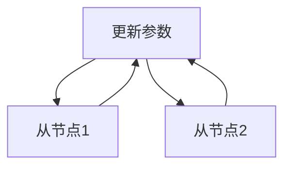
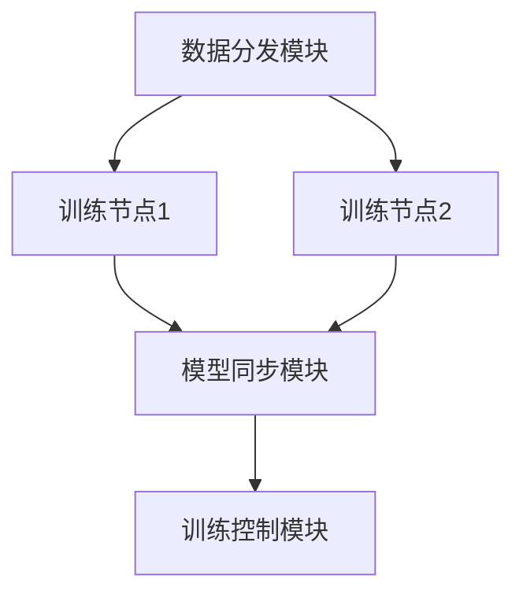
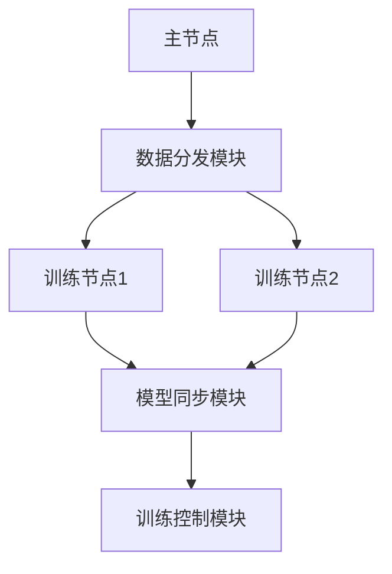
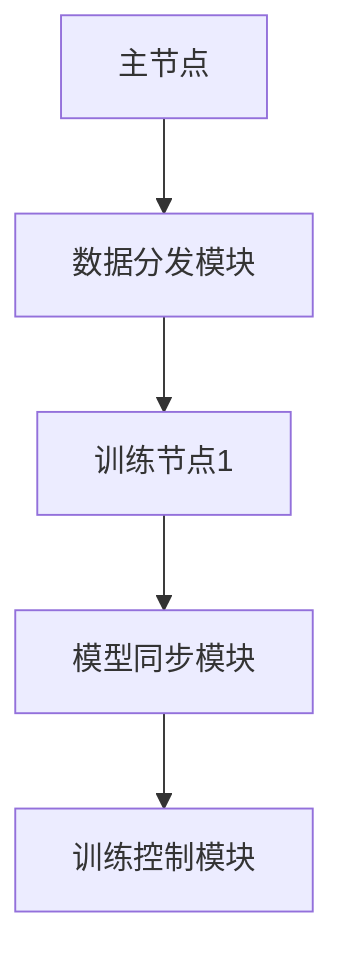

                 


# 分布式训练：加速大规模AI Agent的开发

---

## 关键词：分布式训练，AI Agent，大规模数据，并行计算，模型同步，通信机制

---

## 摘要：

随着人工智能技术的快速发展，AI Agent（智能体）的应用场景越来越广泛。然而，AI Agent的开发面临着数据规模大、计算复杂度高、训练效率低等挑战。为了应对这些挑战，分布式训练技术应运而生。本文将深入探讨分布式训练在AI Agent开发中的应用，从基本原理到系统架构设计，再到实战案例，全面解析如何通过分布式训练加速大规模AI Agent的开发。通过本文的分析，读者将能够理解分布式训练的核心思想，掌握其在实际项目中的应用方法，并能够根据实际需求设计高效的分布式训练系统。

---

# 第一部分：分布式训练与AI Agent开发背景

## 第1章：分布式训练与AI Agent概述

### 1.1 分布式训练的背景与意义

#### 1.1.1 从单机训练到分布式训练的演进

传统的AI模型训练通常在单台机器上完成，这种方式在数据规模较小时表现良好。然而，随着AI应用的场景越来越复杂，数据量呈指数级增长，单机训练的效率变得越来越低。为了提高训练效率，分布式训练应运而生。分布式训练通过将计算任务分散到多台机器或多个GPU上，充分利用计算资源，显著缩短了训练时间。

#### 1.1.2 分布式训练在AI Agent开发中的重要性

AI Agent是一种能够感知环境、自主决策并执行任务的智能体。其开发需要处理大规模的数据和复杂的计算任务。分布式训练通过并行计算和资源优化，能够显著提升AI Agent的训练效率，使其能够在更短的时间内完成复杂任务的开发。

#### 1.1.3 大规模AI Agent开发的挑战与机遇

大规模AI Agent的开发面临数据量大、计算复杂度高、模型更新频繁等挑战。然而，这些挑战也为分布式训练技术提供了广阔的应用场景。通过分布式训练，AI Agent的开发效率和性能可以得到显著提升。

---

### 1.2 AI Agent的基本概念与特点

#### 1.2.1 AI Agent的定义

AI Agent是一种能够感知环境、自主决策并执行任务的智能体。它可以基于环境反馈不断优化自己的行为，以实现特定的目标。

#### 1.2.2 AI Agent的核心特点

- **自主性**：AI Agent能够在没有外部干预的情况下自主决策。
- **反应性**：能够根据环境变化实时调整行为。
- **学习能力**：通过训练和经验不断优化自身的性能。

#### 1.2.3 AI Agent与传统AI的区别

与传统AI相比，AI Agent更加注重自主性和实时性，能够与环境进行交互并动态调整行为。这使得AI Agent在机器人控制、自动驾驶、智能推荐等领域有更广泛的应用。

---

### 1.3 分布式训练与AI Agent开发的关系

#### 1.3.1 分布式训练如何加速AI Agent开发

分布式训练通过并行计算和资源优化，显著提升了AI Agent的训练效率。通过将训练任务分散到多个计算节点，分布式训练能够充分利用计算资源，缩短训练时间。

#### 1.3.2 分布式训练在大规模数据处理中的优势

分布式训练能够处理大规模数据，通过数据并行和模型并行的方式，将数据和计算任务分散到多个节点，显著提升了数据处理效率。

#### 1.3.3 分布式训练对AI Agent性能的提升

通过分布式训练，AI Agent的模型能够更快地迭代和优化，从而提升其在实际应用中的性能和效果。

---

## 1.4 本章小结

本章通过介绍分布式训练的背景与意义，详细阐述了AI Agent的基本概念和特点，并探讨了分布式训练在AI Agent开发中的重要作用。通过本章的分析，读者可以理解分布式训练的核心思想及其在AI Agent开发中的应用价值。

---

# 第二部分：分布式训练的核心技术

## 第2章：分布式训练的基本原理

### 2.1 分布式训练的原理

#### 2.1.1 分布式训练的核心思想

分布式训练的核心思想是通过将计算任务分散到多个计算节点，充分利用计算资源，提升训练效率。其核心思想包括数据并行和模型并行，通过这两种方式实现计算任务的并行处理。

#### 2.1.2 分布式训练的实现方式

分布式训练可以通过多种方式实现，包括数据并行、模型并行、混合并行等。每种实现方式都有其优缺点，适用于不同的场景。

#### 2.1.3 分布式训练的优缺点对比

- **优点**：通过并行计算提升训练效率，充分利用计算资源。
- **缺点**：需要处理节点间的通信和同步问题，增加了系统复杂性。

---

### 2.2 数据并行与模型并行

#### 2.2.1 数据并行的定义与实现

数据并行是指将训练数据分散到多个计算节点，每个节点处理一部分数据。数据并行通过并行处理数据，显著提升了训练速度。

#### 2.2.2 模型并行的定义与实现

模型并行是指将模型的参数分散到多个计算节点，每个节点处理模型的一部分。模型并行适用于模型参数较多的情况，能够充分利用计算资源。

#### 2.2.3 数据并行与模型并行的对比与选择

- **数据并行**：适用于数据量大但模型参数较少的情况。
- **模型并行**：适用于模型参数多但数据量较小的情况。

通过对比数据并行和模型并行，可以根据具体场景选择合适的实现方式。

---

### 2.3 分布式训练中的同步策略

#### 2.3.1 同步策略的分类

同步策略是分布式训练中重要的组成部分，常见的同步策略包括：

- **同步更新**：所有节点完成计算后，将参数同步到主节点。
- **异步更新**：节点在计算过程中直接更新参数，无需等待其他节点完成。

#### 2.3.2 同步策略的实现原理

同步策略的实现需要考虑节点间的通信和参数同步。通过合理的同步策略，可以提升分布式训练的效率和稳定性。

#### 2.3.3 同步策略对训练效率的影响

同步策略的选择直接影响训练效率。同步更新能够保证模型的一致性，但可能会引入通信开销。异步更新能够提升训练速度，但可能会导致模型不一致。

---

### 2.4 分布式训练中的通信机制

#### 2.4.1 通信机制的定义与作用

通信机制是分布式训练中节点之间交换数据和参数的机制。通信机制的实现直接影响分布式训练的效率和性能。

#### 2.4.2 常见的通信机制实现

- **点对点通信**：节点之间直接通信。
- **集中式通信**：通过中心节点进行通信。

#### 2.4.3 通信机制对训练性能的影响

通信机制的选择影响节点之间的数据传输效率。高效的通信机制能够显著提升训练速度，降低通信开销。

---

## 2.5 本章小结

本章详细介绍了分布式训练的核心原理，包括数据并行、模型并行、同步策略和通信机制。通过对比和分析，读者可以理解分布式训练实现方式的选择及其对训练效率的影响。

---

# 第三部分：分布式训练的算法原理

## 第3章：分布式训练的算法原理

### 3.1 分布式训练的核心算法

#### 3.1.1 分布式训练的同步过程

通过mermaid绘制同步过程的流程图：



#### 3.1.2 分布式训练的数学模型

模型参数的同步可以通过以下公式实现：

$$
\theta_{new} = \frac{1}{n} \sum_{i=1}^{n} \theta_i
$$

其中，$\theta_{new}$ 表示同步后的参数，$\theta_i$ 表示各个节点的参数，$n$ 表示节点的数量。

---

### 3.2 数据并行与模型并行的实现

#### 3.2.1 数据并行的实现步骤

1. 将数据集分散到多个节点。
2. 每个节点独立训练模型。
3. 将模型参数同步到主节点。

#### 3.2.2 模型并行的实现步骤

1. 将模型参数分散到多个节点。
2. 每个节点训练模型的一部分。
3. 将模型参数同步到主节点。

---

### 3.3 分布式训练的优化算法

#### 3.3.1 分布式SGD算法

分布式随机梯度下降（Distributed SGD）是一种常用的分布式训练算法。其实现步骤如下：

1. 将数据集分散到多个节点。
2. 每个节点计算梯度。
3. 将梯度同步到主节点。
4. 更新模型参数。

数学公式表示为：

$$
\theta_{new} = \theta_{old} - \eta \cdot \frac{1}{n} \sum_{i=1}^{n} g_i
$$

其中，$\eta$ 表示学习率，$g_i$ 表示各个节点的梯度。

---

## 3.4 本章小结

本章通过详细讲解分布式训练的核心算法，包括同步过程、数学模型和优化算法，帮助读者理解分布式训练的实现原理。通过mermaid流程图和数学公式的结合，进一步提升了内容的清晰度和可读性。

---

# 第四部分：分布式训练的系统架构设计

## 第4章：分布式训练的系统架构

### 4.1 系统功能设计

#### 4.1.1 系统功能模块

- **数据分发模块**：将数据分散到多个节点。
- **模型同步模块**：实现模型参数的同步。
- **训练控制模块**：控制训练过程。

#### 4.1.2 系统功能流程

通过mermaid绘制系统功能流程图：



---

### 4.2 系统架构设计

#### 4.2.1 系统架构图

通过mermaid绘制系统架构图：



---

### 4.3 系统接口设计

#### 4.3.1 系统接口描述

- **数据分发接口**：实现数据的分散和分配。
- **模型同步接口**：实现模型参数的同步。
- **训练控制接口**：控制训练过程的启动和终止。

#### 4.3.2 接口交互流程

通过mermaid绘制接口交互流程图：



---

## 4.4 本章小结

本章通过系统功能设计和架构设计，详细阐述了分布式训练系统的实现方式。通过mermaid图的绘制，进一步明确了系统各模块之间的关系和交互流程。

---

# 第五部分：分布式训练的项目实战

## 第5章：分布式训练的实战案例

### 5.1 环境搭建

#### 5.1.1 环境要求

- **硬件要求**：多台计算节点，每台节点配置至少一块GPU。
- **软件要求**：安装分布式训练框架（如TensorFlow、PyTorch）。

#### 5.1.2 环境配置

1. 安装分布式训练框架。
2. 配置网络通信。
3. 启动分布式训练环境。

---

### 5.2 核心实现

#### 5.2.1 数据并行的实现

```python
import tensorflow as tf
from tensorflow import distribute

# 初始化分布式策略
strategy = distribute.MirroredStrategy()

# 定义模型
with strategy.scope():
    model = build_model()
    loss_fn = tf.keras.losses.SparseCategoricalCrossentropy()
    optimizer = tf.keras.optimizers.Adam()

# 定义训练函数
def train_function(train_dataset):
    model.fit(train_dataset, epochs=10, verbose=0)
```

#### 5.2.2 模型并行的实现

```python
import tensorflow as tf
from tensorflow import distribute

# 初始化分布式策略
strategy = distribute.MirroredStrategy()

# 定义模型
with strategy.scope():
    model = build_model()
    loss_fn = tf.keras.losses.SparseCategoricalCrossentropy()
    optimizer = tf.keras.optimizers.Adam()

# 定义训练函数
def train_function(train_dataset):
    model.fit(train_dataset, epochs=10, verbose=0)
```

---

### 5.3 案例分析

#### 5.3.1 案例背景

以一个大规模图像分类任务为例，数据集包含 millions of images，需要通过分布式训练加速模型训练。

#### 5.3.2 案例实现

通过数据并行和模型并行的结合，实现大规模数据的分布式训练。

#### 5.3.3 案例效果

通过分布式训练，模型的训练时间显著缩短，训练效率大幅提升。

---

## 5.4 本章小结

本章通过实战案例，详细讲解了分布式训练的环境搭建和核心实现。通过具体的代码示例和案例分析，进一步加深了读者对分布式训练实现的理解。

---

# 第六部分：分布式训练的最佳实践与总结

## 第6章：最佳实践与总结

### 6.1 分布式训练的最佳实践

#### 6.1.1 环境配置

- 确保网络通信稳定。
- 合理分配计算资源。

#### 6.1.2 模型优化

- 合理选择数据并行和模型并行的方式。
- 优化同步策略和通信机制。

#### 6.1.3 性能调优

- 通过监控系统性能，优化资源分配。
- 定期清理不必要的数据和日志。

---

### 6.2 注意事项

- 分布式训练需要考虑节点间的通信开销。
- 同步策略的选择直接影响训练效率。
- 模型优化需要结合具体场景。

---

### 6.3 未来研究方向

- 探索更高效的同步策略。
- 研究更优化的通信机制。
- 开发更智能的分布式训练框架。

---

## 6.4 本章小结

本章总结了分布式训练的最佳实践，提出了注意事项和未来研究方向。通过本章的分析，读者可以更好地理解和应用分布式训练技术。

---

# 作者：AI天才研究院/AI Genius Institute & 禅与计算机程序设计艺术 /Zen And The Art of Computer Programming

---

本文通过系统化的分析和实践，全面探讨了分布式训练在AI Agent开发中的应用。从背景介绍到系统架构设计，再到实战案例，层层深入，帮助读者理解分布式训练的核心思想和实现方法。希望本文能够为AI Agent的开发提供有价值的参考和指导。

