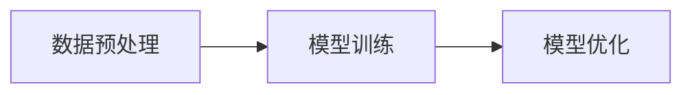
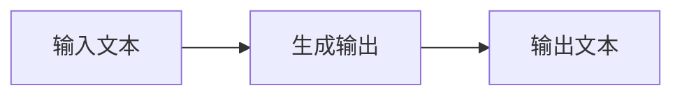
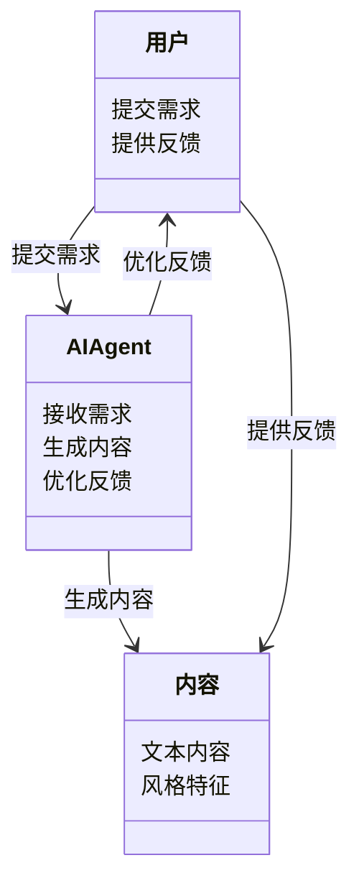

                 


# 创意写作 AI Agent：LLM 辅助内容创作与文案生成

---

## 关键词：
创意写作、AI Agent、LLM、大语言模型、内容生成、文案优化

---

## 摘要：
本文深入探讨了创意写作AI Agent的核心概念、算法原理、系统架构及实际应用场景。通过分析大语言模型（LLM）在创意写作中的作用，结合具体的项目实战和最佳实践，本文为读者提供了从理论到实践的全面指导，帮助创作者高效利用AI工具提升写作效率和内容质量。

---

## 第一部分：创意写作与AI Agent的背景介绍

### 第1章：创意写作的背景与挑战

#### 1.1 创意写作的定义与特点
创意写作是一种通过创造性思维和表达能力，将思想、情感、故事等转化为文字内容的过程。其特点包括：
- **创造性**：内容需要独特的视角和表达方式。
- **多样性**：涵盖小说、散文、文案等多种形式。
- **个性化**：强调作者的独特风格。

#### 1.2 AI在创意写作中的作用
随着AI技术的快速发展，AI在创意写作中的作用日益显著：
- **灵感激发**：AI可以提供创意建议和主题推荐。
- **内容生成**：AI能够快速生成初稿或文案。
- **优化改进**：AI可以对内容进行润色和优化。

#### 1.3 LLM在创意写作中的应用
大语言模型（LLM）通过海量数据训练，具备强大的文本生成能力：
- **文本生成**：LLM可以生成高质量的文本内容。
- **上下文理解**：LLM能够理解上下文，提供连贯的生成结果。
- **风格匹配**：LLM可以根据需求调整文本的风格和语气。

### 第2章：AI Agent的基本概念与原理

#### 2.1 AI Agent的定义与分类
AI Agent是一种能够感知环境并执行任务的智能体，主要分为：
- **简单反射型AI Agent**：基于规则的简单响应。
- **基于模型的AI Agent**：具备复杂推理和决策能力。

#### 2.2 LLM的基本原理
大语言模型通过以下步骤实现文本生成：
1. **数据预处理**：清洗和标注训练数据。
2. **模型训练**：利用监督学习优化模型参数。
3. **生成推理**：基于输入生成输出文本。

#### 2.3 AI Agent与LLM的关系
AI Agent通过调用LLM API实现文本生成功能，LLM为AI Agent提供强大的内容生成能力。

---

## 第二部分：创意写作AI Agent的核心概念与联系

### 第3章：创意写作AI Agent的核心概念

#### 3.1 创意写作AI Agent的定义
创意写作AI Agent是一种能够辅助创作者完成创意写作任务的智能工具，具备以下特点：
- **智能性**：能够理解用户需求并生成相应内容。
- **交互性**：支持用户与AI之间的实时互动。
- **适应性**：可以根据用户反馈优化生成内容。

#### 3.2 创意写作AI Agent的核心要素
创意写作AI Agent的核心要素包括：
- **用户需求**：用户的写作目标和风格偏好。
- **内容生成**：AI生成的文本内容。
- **反馈优化**：用户对生成内容的反馈与优化。

#### 3.3 创意写作AI Agent的实体关系图

```mermaid
entity 用户 {
  用户需求
  用户反馈
}

entity AI Agent {
  内容生成
  反馈优化
}

entity 内容 {
  文本内容
  风格特征
}

关系 用户 --> AI Agent：提交需求
关系 AI Agent --> 内容：生成文本
关系 用户 --> 内容：提供反馈
关系 AI Agent --> 用户：优化反馈
```

---

## 第三部分：创意写作AI Agent的算法原理

### 第4章：LLM的训练与生成机制

#### 4.1 LLM的训练过程



- **数据预处理**：清洗、标注和格式化训练数据。
- **模型训练**：利用监督学习优化模型参数。
- **模型优化**：通过调整超参数提升模型性能。

#### 4.2 LLM的生成机制



- **输入文本**：用户提供的输入内容。
- **生成输出**：模型基于输入生成输出文本。
- **输出文本**：生成的文本内容。

#### 4.3 LLM的数学模型与公式

- **交叉熵损失函数**：
  $$ \text{loss} = -\sum_{i=1}^{n} \log P(y_i | y_{<i}) $$
  
- **梯度下降优化**：
  $$ \theta = \theta - \eta \frac{\partial \text{loss}}{\partial \theta} $$

---

## 第四部分：创意写作AI Agent的系统分析与架构设计

### 第5章：创意写作AI Agent的系统分析

#### 5.1 系统功能设计

- **用户输入模块**：接收用户的输入需求。
- **内容生成模块**：调用LLM生成文本内容。
- **反馈优化模块**：根据用户反馈优化生成内容。

#### 5.2 系统架构设计



---

## 第五部分：创意写作AI Agent的项目实战

### 第6章：创意写作AI Agent的实现与应用

#### 6.1 环境安装
安装必要的Python库：
```bash
pip install transformers
pip install torch
```

#### 6.2 核心代码实现

```python
from transformers import GPT2LMHeadModel, GPT2Tokenizer

tokenizer = GPT2Tokenizer.from_pretrained('gpt2')
model = GPT2LMHeadModel.from_pretrained('gpt2')

def generate_text(prompt, max_length=50):
    inputs = tokenizer(prompt, return_tensors='np')
    outputs = model.generate(
        inputs.input_ids,
        max_length=max_length,
        temperature=0.7,
        do_sample=True
    )
    return tokenizer.decode(outputs[0][0], skip_special_tokens=True)
```

#### 6.3 代码解读与分析
- **tokenizer**：文本编码器，用于将输入文本转换为模型可理解的格式。
- **model**：文本生成模型，基于GPT-2架构。
- **generate_text**：文本生成函数，支持长度和温度参数的调节。

#### 6.4 实际案例分析
案例：生成一篇科幻小说的开头。
- **输入**：用户输入“在一个遥远的星球上，…”
- **输出**：生成一段科幻小说的开头。

---

## 第六部分：创意写作AI Agent的最佳实践与总结

### 第7章：最佳实践

- **明确需求**：用户需明确写作目标和风格。
- **选择合适的模型**：根据需求选择合适的LLM模型。
- **优化反馈**：及时提供反馈以优化生成内容。

### 第8章：小结
创意写作AI Agent通过结合LLM的强大生成能力，为创作者提供了高效的内容创作工具。本文从背景、原理、架构到实现，全面介绍了创意写作AI Agent的核心内容。

### 第9章：注意事项
- **数据隐私**：注意保护用户数据和隐私。
- **模型局限性**：AI生成的内容可能存在偏差或不准确。

### 第10章：拓展阅读
推荐学习以下内容：
- 大语言模型的训练与优化。
- AI在创意写作中的其他应用。

---

## 作者：
作者：AI天才研究院 & 禅与计算机程序设计艺术

---

通过以上内容，本文为创意写作AI Agent的实现与应用提供了全面的理论支持和实践指导，帮助创作者和开发者更好地理解和应用这一技术。

