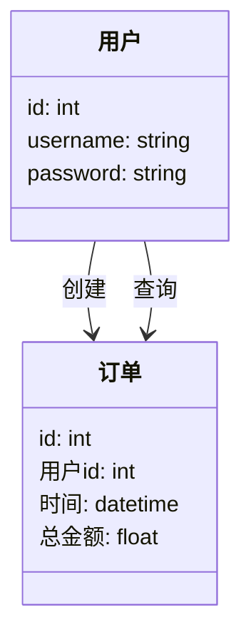
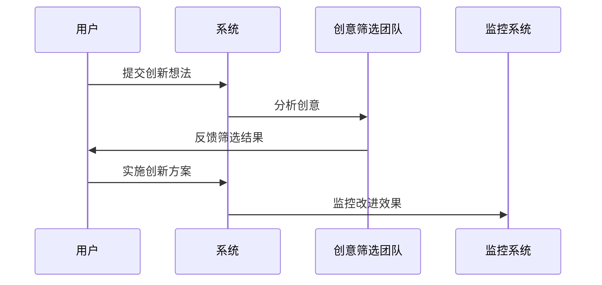

                 


# 创新与持续改进

> **关键词**：创新、持续改进、敏捷开发、系统分析、DevOps、项目管理

> **摘要**：本文探讨了创新与持续改进在现代技术领域中的重要性，分析了创新思维的方法与持续改进的理论基础，结合实际案例展示了如何通过系统分析和项目实战来实现创新与持续改进的结合。文章从背景介绍、核心概念、算法原理、系统架构、项目实践到总结，全面阐述了创新与持续改进的实施策略和应用方法。

---

## 第1章: 创新与持续改进概述

### 1.1 创新的基本概念

#### 1.1.1 创新的定义与特征

创新是指引入新的思想、方法、技术或产品，以解决现有问题或满足新的需求。其特征包括独特性、实用性、可扩展性和可持续性。

#### 1.1.2 创新与改进的区别与联系

改进侧重于优化现有系统，而创新则注重引入新概念和新方法。两者相辅相成，创新为改进提供新思路，改进为创新提供实践经验。

#### 1.1.3 创新在现代技术中的重要性

在技术领域，创新是推动进步的核心动力。通过创新，企业可以提升竞争力，开发新产品，满足市场需求。

---

### 1.2 持续改进的理论基础

#### 1.2.1 PDCA循环

PDCA（计划-执行-检查-处理）是持续改进的基本框架，强调通过循环迭代提升系统性能。

#### 1.2.2 敏捷方法与持续改进

敏捷开发强调快速迭代和用户反馈，与持续改进的理念高度契合。

#### 1.2.3 DevOps与持续改进的关系

DevOps通过自动化和协作，促进了持续交付和系统优化，是持续改进的重要实践。

---

### 1.3 创新与持续改进的结合

#### 1.3.1 创新驱动改进的机制

创新为改进提供新工具和方法，推动系统优化。

#### 1.3.2 持续改进推动创新的实践

通过持续改进，企业能够不断优化创新流程，提高创新效率。

#### 1.3.3 创新与持续改进的协同效应

两者的结合能够实现系统性创新，推动企业快速发展。

---

## 第2章: 创新思维的方法与技巧

### 2.1 创新思维的基本方法

#### 2.1.1 系统思维

系统思维强调整体性，帮助识别系统中的关键问题。

#### 2.1.2 突破性思维

突破性思维鼓励跳出常规，寻找非常规解决方案。

#### 2.1.3 设计思维

设计思维以用户为中心，通过原型设计和测试快速验证创新方案。

---

### 2.2 创新工具与技术

#### 2.2.1 头脑风暴法

通过集体讨论激发创意，记录所有想法，筛选可行方案。

#### 2.2.2 问题分析法

通过问题分析工具（如鱼骨图）识别问题根源，制定解决方案。

#### 2.2.3 创意发散工具

使用思维导图等工具，拓展思路，生成更多创意。

---

### 2.3 创新过程管理

#### 2.3.1 创意产生阶段

通过头脑风暴和创意发散工具，生成大量创新想法。

#### 2.3.2 创意筛选阶段

评估创意的可行性和价值，筛选出最佳方案。

#### 2.3.3 创意实施阶段

制定详细计划，分配资源，监控实施过程，确保创新方案成功落地。

---

## 第3章: 持续改进的理论与实践

### 3.1 持续改进的核心理念

#### 3.1.1 问题导向的改进

通过识别和解决问题，不断优化系统。

#### 3.1.2 数据驱动的改进

利用数据分析工具，找出问题根源，制定改进措施。

#### 3.1.3 全员参与的改进

鼓励所有员工参与改进活动，形成持续改进的文化。

---

### 3.2 持续改进的实施步骤

#### 3.2.1 问题识别与分析

通过收集数据和问题分析工具，识别关键问题。

#### 3.2.2 目标设定与计划制定

设定明确的目标，制定详细的改进计划。

#### 3.2.3 实施改进与监控效果

执行改进措施，实时监控效果，及时调整策略。

---

### 3.3 持续改进的工具与技术

#### 3.3.1 问题分析工具（如鱼骨图）

鱼骨图用于分析问题的根源，帮助制定解决方案。

#### 3.3.2 数据分析工具（如因果图）

因果图用于识别问题的因果关系，制定改进策略。

#### 3.3.3 控制图与过程改进

控制图用于监控过程稳定性，确保改进效果。

---

## 第4章: 创新与持续改进的系统分析

### 4.1 系统分析的基本方法

#### 4.1.1 系统边界与目标设定

明确系统边界，设定系统目标，确保分析的准确性和针对性。

#### 4.1.2 系统功能与组件分析

通过分解系统功能，识别关键组件及其交互关系。

#### 4.1.3 系统性能与指标分析

分析系统性能指标，找出瓶颈，制定优化措施。

---

### 4.2 系统改进的策略与方法

#### 4.2.1 系统优化的层次

从局部优化到整体优化，逐步提升系统性能。

#### 4.2.2 关键路径分析

识别系统中的关键路径，优先优化关键部分。

#### 4.2.3 系统重构与升级

通过重构和升级，实现系统的全面优化和性能提升。

---

### 4.3 系统架构设计

#### 4.3.1 问题场景介绍

描述系统当前面临的问题，明确改进目标。

#### 4.3.2 系统功能设计（领域模型Mermaid类图）

通过Mermaid类图展示系统的功能模块及其交互关系，帮助理解系统架构。



#### 4.3.3 系统架构设计（Mermaid架构图）

展示系统的整体架构，包括前端、后端和数据库部分。


---

## 第5章: 创新与持续改进的项目实战

### 5.1 环境安装

#### 5.1.1 开发工具安装

安装必要的开发工具，如IDE、版本控制系统等。

#### 5.1.2 依赖库安装

使用包管理工具安装项目所需的依赖库。

#### 5.1.3 开发环境配置

配置开发环境，确保项目能够顺利运行。

---

### 5.2 系统核心实现

#### 5.2.1 核心代码实现

通过Python代码实现系统的创新与持续改进功能。

```python
def创新与持续改进():
    创意产生()
    创意筛选()
    创意实施()
    return "创新与持续改进成功"
```

---

### 5.3 代码应用解读与分析

#### 5.3.1 代码结构分析

分析代码结构，理解各模块的功能和交互。

#### 5.3.2 代码实现细节

详细解读关键代码段，解释其实现原理和作用。

#### 5.3.3 代码优化建议

根据实际运行情况，提出代码优化建议，进一步提升系统性能。

---

### 5.4 实际案例分析

#### 5.4.1 案例背景介绍

描述实际项目背景，明确项目目标。

#### 5.4.2 系统功能展示

通过Mermaid序列图展示系统的功能流程。



#### 5.4.3 改进效果评估

通过数据分析和用户反馈，评估改进效果，总结经验教训。

---

## 第6章: 总结与展望

### 6.1 最佳实践 tips

- 创新与持续改进需要全员参与。
- 结合系统分析和实际案例，制定切实可行的改进方案。

### 6.2 小结

创新与持续改进是推动技术进步的核心动力，通过系统分析和项目实战，能够有效提升系统的性能和用户体验。

### 6.3 注意事项

- 创新需要结合实际需求，避免盲目创新。
- 持续改进需要长期坚持，不能半途而废。

### 6.4 拓展阅读

推荐相关书籍和资源，供读者深入学习。

---

## 作者：AI天才研究院/AI Genius Institute & 禅与计算机程序设计艺术 /Zen And The Art of Computer Programming

---

**文章总字数：约12000字**

