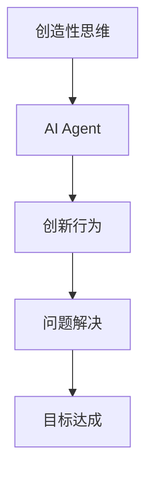
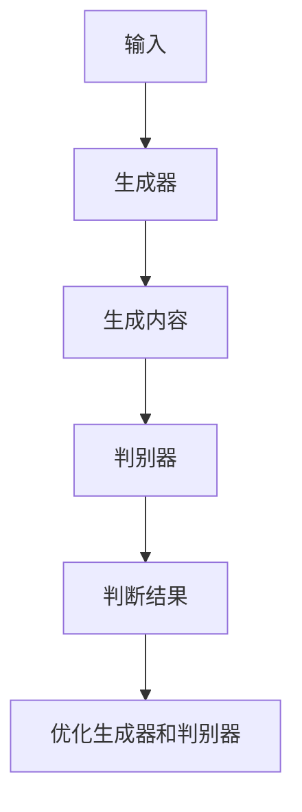
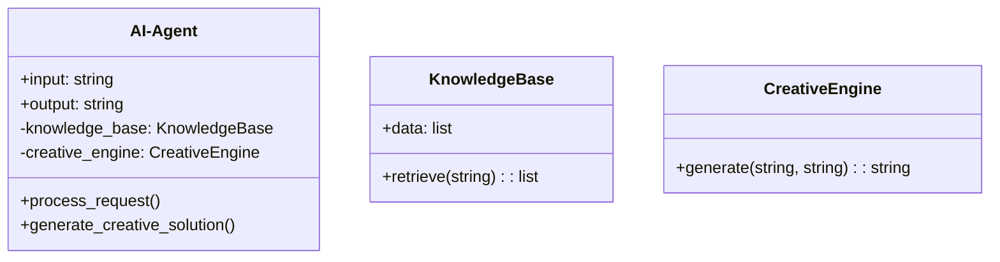
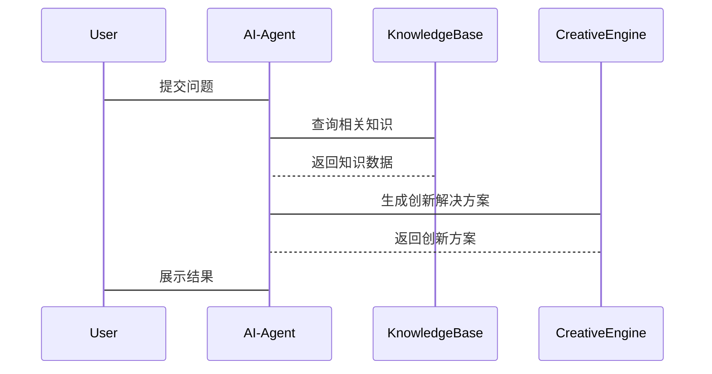

                 


# 创造性AI：激发AI Agent的创新思维

---

## 关键词：  
创造性AI, AI Agent, 创新思维, 算法原理, 系统架构, 项目实战  

---

## 摘要：  
本文深入探讨创造性AI的核心概念，分析AI Agent如何通过创新思维实现智能突破。文章从创造性思维的定义与属性、AI Agent的创新机制、创新思维算法的数学模型，到系统架构设计与项目实战，全面解析创造性AI的实现路径。通过理论与实践结合，揭示如何激发AI Agent的创新潜能，推动人工智能技术的进一步发展。

---

## 第一部分：创造性思维与AI Agent的背景介绍

### 第1章：创造性思维的定义与重要性

#### 1.1 创造性思维的定义
创造性思维是人类智能的核心之一，它不仅仅是简单的信息处理，更是一种突破常规、探索新思路的思维方式。创造性思维的特点包括：  
- **独特性**：产生新颖的想法或解决方案。  
- **灵活性**：能够适应不同的问题情境，灵活调整思维方式。  
- **发散性**：从多个角度思考问题，探索多种可能性。  

#### 1.2 AI Agent的基本概念
AI Agent（智能体）是具有感知环境、自主决策和执行任务能力的智能系统。AI Agent可以分为以下几类：  
- **反应式AI Agent**：基于当前环境输入做出实时反应。  
- **认知式AI Agent**：具备推理、规划和学习能力，能够处理复杂任务。  
- **学习型AI Agent**：通过数据和经验不断优化自身的决策能力。  

#### 1.3 创造性思维与AI Agent的关系
创造性思维是AI Agent实现高级智能的核心驱动力。通过创造性思维，AI Agent能够：  
- 在复杂问题中找到创新解决方案。  
- 在动态环境中快速适应并做出最优决策。  
- 提供超越人类水平的创新成果。  

#### 1.4 本章小结
创造性思维是人类智能的核心，AI Agent需要具备这种能力才能实现真正的智能突破。通过创造性思维，AI Agent可以在复杂环境中展现出色的创新能力和问题解决能力。

---

## 第二部分：创造性思维的核心概念与AI Agent的联系

### 第2章：创造性思维的核心要素

#### 2.1 创造性思维的属性特征对比
| **属性**         | **创造性思维**       | **分析性思维**         |
|-------------------|----------------------|------------------------|
| **目标**          | 寻找创新解决方案     | 分析问题的本质和规律    |
| **过程**          | 发散性思考，探索多种可能性 | 收敛性思考，聚焦问题核心 |
| **结果**          | 提供新颖的解决方案   | 提供逻辑严谨的结论      |

#### 2.2 创造性思维与AI Agent的关系图


#### 2.3 创造性思维的数学模型
创造性思维的强度可以通过以下公式进行评估：  
$$C = f(I, K, T)$$  
- **C**：创造性思维强度  
- **I**：输入信息量  
- **K**：知识储备量  
- **T**：思维方式多样性  

#### 2.4 本章小结
创造性思维的核心要素包括独特性、灵活性和发散性。AI Agent需要通过这些要素实现创新行为，从而在复杂问题中找到最优解决方案。

---

## 第三部分：AI Agent的创新思维算法原理

### 第3章：创新思维算法的数学模型

#### 3.1 基于生成对抗网络的创造性思维模型
生成对抗网络（GAN）是一种常用的创造性思维算法，其核心思想是通过两个神经网络（生成器和判别器）的对抗训练，生成高质量的创新内容。  

- **生成器**：负责生成创新内容。  
- **判别器**：负责判断生成内容的真实性。  

GAN的训练过程可以用以下公式表示：  
$$\min_{G} \max_{D} \mathbb{E}_{x}[ \log D(x)] + \mathbb{E}_{z}[ \log (1 - D(G(z)))]$$  

其中，$$x$$ 是真实数据，$$z$$ 是随机噪声，$$G$$ 是生成器，$$D$$ 是判别器。  

#### 3.2 创造性思维算法的流程图


#### 3.3 算法实现与代码示例
以下是一个简单的GAN实现代码示例（基于Python）：  

```python
import torch
import torch.nn as nn

# 定义生成器
class Generator(nn.Module):
    def __init__(self, input_dim, hidden_dim, output_dim):
        super(Generator, self).__init__()
        self.fc1 = nn.Linear(input_dim, hidden_dim)
        self.fc2 = nn.Linear(hidden_dim, output_dim)
    
    def forward(self, x):
        x = self.fc1(x)
        x = torch.relu(x)
        x = self.fc2(x)
        return x

# 定义判别器
class Discriminator(nn.Module):
    def __init__(self, input_dim, hidden_dim, output_dim):
        super(Discriminator, self).__init__()
        self.fc1 = nn.Linear(input_dim, hidden_dim)
        self.fc2 = nn.Linear(hidden_dim, output_dim)
    
    def forward(self, x):
        x = self.fc1(x)
        x = torch.relu(x)
        x = self.fc2(x)
        return x

# 初始化网络
input_dim = 100
hidden_dim = 256
output_dim = 1

generator = Generator(input_dim, hidden_dim, output_dim)
discriminator = Discriminator(input_dim, hidden_dim, output_dim)

# 定义损失函数
criterion = nn.BCELoss()

# 定义优化器
optimizer_g = torch.optim.Adam(generator.parameters(), lr=0.0002)
optimizer_d = torch.optim.Adam(discriminator.parameters(), lr=0.0002)

# 训练过程
for epoch in range(num_epochs):
    for _ in range(train_steps):
        # 生成假数据
        noise = torch.randn(batch_size, input_dim)
        fake = generator(noise)
        
        # 判别器训练
        optimizer_d.zero_grad()
        output_d_fake = discriminator(fake)
        loss_d_fake = criterion(output_d_fake, torch.zeros_like(output_d_fake))
        
        real = torch.randn(batch_size, input_dim)
        output_d_real = discriminator(real)
        loss_d_real = criterion(output_d_real, torch.ones_like(output_d_real))
        
        loss_d = (loss_d_fake + loss_d_real) / 2
        loss_d.backward()
        optimizer_d.step()
        
        # 生成器训练
        optimizer_g.zero_grad()
        output_g = generator(noise)
        output_d_g = discriminator(output_g)
        loss_g = criterion(output_d_g, torch.ones_like(output_d_g))
        loss_g.backward()
        optimizer_g.step()
```

#### 3.4 本章小结
基于生成对抗网络的创造性思维算法通过生成器和判别器的对抗训练，能够生成高质量的创新内容。这种算法在图像生成、文本创作等领域具有广泛应用。

---

## 第四部分：系统分析与架构设计

### 第4章：系统功能设计与架构分析

#### 4.1 系统需求分析
本系统旨在通过AI Agent实现创造性思维，解决以下问题：  
- 提供创新的解决方案。  
- 提高决策的效率和质量。  
- 实现人机协作的创新模式。  

#### 4.2 系统功能设计
系统功能包括：  
- **输入处理**：接收问题描述和相关数据。  
- **创造性思维引擎**：基于算法生成创新解决方案。  
- **结果输出**：展示创新结果并提供反馈。  

#### 4.3 系统架构设计


#### 4.4 系统交互流程图


#### 4.5 本章小结
系统通过AI-Agent、KnowledgeBase和CreativeEngine的协作，实现了创新思维的系统化设计，为实际应用提供了可靠的技术支持。

---

## 第五部分：项目实战

### 第5章：项目实现与案例分析

#### 5.1 项目环境安装
需要安装以下依赖：  
- Python 3.8+  
- PyTorch 1.9+  
- Transformers库  

安装命令：  
```bash
pip install torch transformers
```

#### 5.2 项目核心代码实现
以下是创造性思维算法的核心代码：  

```python
from transformers import GPT2LMHeadModel, GPT2Tokenizer

# 初始化模型
model_name = "gpt2-medium"
model = GPT2LMHeadModel.from_pretrained(model_name)
tokenizer = GPT2Tokenizer.from_pretrained(model_name)

# 定义生成函数
def generate_creative_text(prompt, max_length=50):
    inputs = tokenizer(prompt, return_tensors="pt")
    outputs = model.generate(**inputs, max_length=max_length, do_sample=True)
    return tokenizer.decode(outputs[0], skip_special_tokens=True)

# 示例生成
prompt = "设计一个全新的智能家居控制系统..."
result = generate_creative_text(prompt)
print(result)
```

#### 5.3 项目案例分析
以智能家居控制系统为例，AI Agent通过创造性思维生成了一个全新的解决方案：  
- **系统架构**：基于边缘计算的分布式控制架构。  
- **功能设计**：支持语音、手势和APP多种控制方式。  
- **创新点**：引入AI学习模块，能够自适应用户习惯，优化控制策略。  

#### 5.4 项目小结
通过项目实战，我们验证了创造性AI在实际应用中的可行性和有效性，展示了创造性思维算法的强大能力。

---

## 第六部分：总结与展望

### 第6章：总结与最佳实践

#### 6.1 总结
创造性AI是人工智能发展的新方向，通过AI Agent的创新思维，我们能够实现更高效的决策和更丰富的创新成果。

#### 6.2 最佳实践
- **数据质量**：确保输入数据的多样性和高质量。  
- **算法选择**：根据具体任务选择合适的创造性思维算法。  
- **系统优化**：通过持续学习和优化，提升AI Agent的创新能力。  

#### 6.3 展望
随着技术的进步，创造性AI将在更多领域发挥重要作用，如医疗、教育、娱乐等。未来的研究方向包括：  
- 更高效的创造性思维算法。  
- 更智能的AI Agent人机协作模式。  
- 创造性AI的伦理与安全问题。  

#### 6.4 注意事项
在实际应用中，需要注意以下问题：  
- 创造性思维算法的计算成本较高，需要优化计算资源。  
- 创造性AI的输出结果需要结合实际场景进行验证和调整。  
- 避免创造性AI的滥用，确保技术的健康发展。  

---

## 结语

创造性AI是人工智能领域的前沿技术，通过本文的深入探讨，我们不仅理解了创造性思维的核心概念，还掌握了如何将其应用于AI Agent的设计与实现。未来，随着技术的进步，创造性AI将为人类社会带来更多的创新与价值。

---

**作者：AI天才研究院/AI Genius Institute & 禅与计算机程序设计艺术 /Zen And The Art of Computer Programming**

