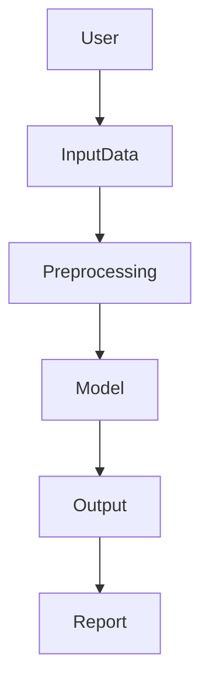
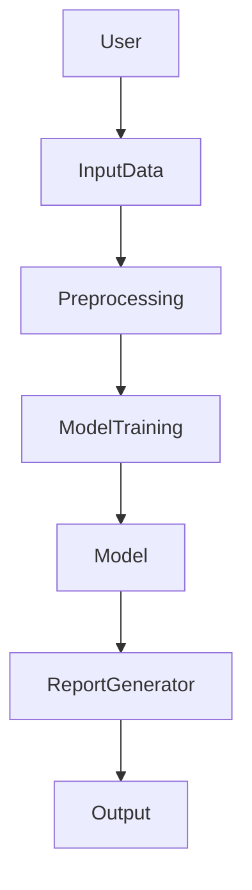

                 


# 利用LLM优化金融报告的自动生成

> 关键词：LLM、金融报告、自然语言处理、文本生成、深度学习

> 摘要：本文探讨了利用大语言模型（LLM）优化金融报告自动生成的潜力与方法，从问题背景、核心概念、算法原理、系统设计到项目实战，全面分析了LLM在金融报告生成中的应用，提供了详细的实现方案和实际案例，旨在为读者提供清晰的思路和实用的指导。

---

# 第一部分: 利用LLM优化金融报告自动生成的背景与基础

# 第1章: 问题背景与需求分析

## 1.1 金融报告自动生成的现状与挑战

### 1.1.1 传统金融报告生成方式的局限性

传统上，金融报告的生成依赖于人工编写或基于规则的系统。这种方法存在以下问题：

- **效率低下**：人工编写报告耗时长，难以满足金融机构对快速生成大量报告的需求。
- **一致性不足**：不同报告可能因编写人员的不同而出现格式、内容不一致的问题。
- **数据依赖性强**：传统系统依赖于预定义的规则，难以灵活应对市场变化和多样化的需求。

### 1.1.2 当前金融行业的痛点与需求

金融行业对报告的需求日益增长，尤其是在投资分析、风险评估等领域。然而，传统方法难以满足以下需求：

- **实时性**：金融市场波动快，报告需要及时生成以反映最新数据。
- **个性化**：不同客户可能需要定制化的报告内容。
- **准确性**：报告内容必须准确无误，避免因错误导致的损失。

### 1.1.3 技术进步带来的新机遇

大语言模型（LLM）的出现为金融报告生成带来了新的可能性。LLM具有以下优势：

- **强大的文本生成能力**：LLM能够理解和生成复杂的金融文本，如市场分析、投资建议等。
- **灵活性和可扩展性**：LLM可以通过微调适应不同金融机构的具体需求。
- **高效性**：LLM可以在短时间内生成大量报告，满足金融机构的高效率要求。

---

## 1.2 LLM在金融领域的应用潜力

### 1.2.1 大语言模型的基本概念

大语言模型（LLM）是指基于深度学习的自然语言处理模型，如GPT系列、BERT系列等。这些模型通过大量的文本数据进行训练，能够生成与训练数据相似的文本。

### 1.2.2 LLM在金融文本生成中的优势

LLM在金融领域的优势包括：

- **上下文理解**：LLM能够理解复杂的金融文本，并根据上下文生成连贯的内容。
- **多样化输出**：LLM可以生成多种风格和语气的文本，满足不同场景的需求。
- **数据驱动**：LLM通过数据驱动的方式不断优化生成结果，能够捕捉市场趋势和客户需求。

### 1.2.3 金融报告生成的具体场景

LLM可以应用于以下金融报告生成场景：

- **市场分析报告**：生成市场趋势分析、行业动态等内容。
- **投资建议报告**：为投资者提供个性化投资建议。
- **风险评估报告**：分析潜在风险并提出应对策略。

---

## 1.3 本章小结

本章从传统金融报告生成的局限性出发，分析了当前金融行业的需求与痛点，并探讨了大语言模型在金融报告生成中的潜力与优势。接下来，我们将深入探讨LLM的核心概念与原理。

---

# 第2章: 核心概念与联系

## 2.1 LLM的基本原理

### 2.1.1 模型结构与训练方法

大语言模型通常采用Transformer架构，包括编码器和解码器两部分。编码器用于将输入文本转化为向量表示，解码器则根据编码器的输出生成目标文本。

### 2.1.2 LLM的推理机制

LLM的推理机制包括以下步骤：

1. **输入处理**：将输入文本转化为模型可处理的向量形式。
2. **解码过程**：模型通过自注意力机制生成下一步的输出。
3. **结果输出**：生成最终的文本内容。

### 2.1.3 模型的可解释性问题

尽管LLM在生成文本方面表现出色，但其可解释性较差，难以明确理解模型的决策过程。这在金融领域尤为重要，因为需要对生成内容的依据进行解释。

---

## 2.2 金融报告生成的关键要素

### 2.2.1 数据来源与处理

金融报告生成需要多源异构数据，包括市场数据、财务报表、新闻资讯等。这些数据需要经过清洗、整合和标注，以便模型能够有效利用。

### 2.2.2 内容结构与格式要求

金融报告通常具有严格的结构和格式要求，如标题、引言、正文、结论等。LLM需要生成符合这些要求的文本。

### 2.2.3 生成结果的评估指标

常用的评估指标包括：

- **准确率**：生成内容与实际需求的匹配程度。
- **相关性**：生成内容与输入数据的相关性。
- **可读性**：生成文本的流畅性和易读性。

---

## 2.3 LLM与金融报告生成的结合

### 2.3.1 模型输入与输出的关联

LLM通过输入特定的金融数据生成相应的报告内容。例如，输入市场数据后生成市场分析报告。

### 2.3.2 生成过程中的特征提取

LLM需要提取输入数据的关键特征，如市场趋势、公司财务指标等，以生成高质量的报告内容。

### 2.3.3 系统架构的实体关系图

以下是金融报告生成系统的实体关系图：



---

## 2.4 本章小结

本章详细介绍了LLM的基本原理、金融报告生成的关键要素以及LLM与金融报告生成的结合方式。接下来，我们将深入探讨LLM的算法原理与数学模型。

---

# 第3章: 算法原理与数学模型

## 3.1 LLM的训练流程

### 3.1.1 数据预处理

数据预处理包括分词、去除停用词、数据清洗等步骤。例如，将输入文本分词为 `[市场, 数据, 分析]`。

### 3.1.2 模型参数初始化

模型参数（权重矩阵）随机初始化，然后通过反向传播优化参数。

### 3.1.3 损失函数计算

常用的损失函数是交叉熵损失：

$$
\text{Loss} = -\sum_{i=1}^{n} \log P(x_i | x_{<i})
$$

### 3.1.4 优化器更新

优化器（如Adam）通过计算梯度更新模型参数：

$$
\theta_{t+1} = \theta_t - \eta \frac{\partial \text{Loss}}{\partial \theta_t}
$$

---

## 3.2 推理过程的详细解释

### 3.2.1 解码策略

LLM通常采用贪心解码或随机采样策略生成输出。例如，贪心解码选择概率最高的词生成输出。

### 3.2.2 注意力机制

注意力机制通过计算输入序列中每个词的重要性生成注意力权重：

$$
\text{Attention}(Q, K, V) = \text{softmax}\left(\frac{QK^T}{\sqrt{d_k}}\right)V
$$

---

## 3.3 数学模型与公式

### 3.3.1 损失函数

$$
\text{Loss} = -\sum_{i=1}^{n} \log P(x_i | x_{<i})
$$

### 3.3.2 优化器

$$
\theta_{t+1} = \theta_t - \eta \frac{\partial \text{Loss}}{\partial \theta_t}
$$

### 3.3.3 注意力机制

$$
\text{Attention}(Q, K, V) = \text{softmax}\left(\frac{QK^T}{\sqrt{d_k}}\right)V
$$

---

## 3.4 本章小结

本章详细介绍了LLM的训练流程、推理过程以及相关数学模型。接下来，我们将探讨金融报告生成系统的架构设计。

---

# 第4章: 系统分析与架构设计

## 4.1 系统功能模块划分

### 4.1.1 数据采集模块

负责收集市场数据、财务报表等输入数据。

### 4.1.2 模型训练模块

对LLM进行微调，使其适应金融报告生成任务。

### 4.1.3 报告生成模块

根据输入数据生成金融报告。

### 4.1.4 结果评估模块

评估生成报告的质量，调整模型参数。

---

## 4.2 系统架构设计

以下是金融报告生成系统的架构设计：



---

## 4.3 接口设计与交互流程

### 4.3.1 系统接口设计

系统提供以下接口：

- **输入接口**：接收金融市场数据。
- **输出接口**：输出生成的金融报告。

### 4.3.2 交互流程

用户输入数据，系统经过预处理和模型推理生成报告，并返回给用户。

---

## 4.4 本章小结

本章详细设计了金融报告生成系统的功能模块、架构和交互流程。接下来，我们将通过项目实战展示如何利用LLM实现金融报告的自动生成。

---

# 第五章: 项目实战

## 5.1 环境安装

安装必要的依赖：

```bash
pip install numpy torch transformers
```

---

## 5.2 系统核心实现源代码

以下是LLM驱动的金融报告生成代码示例：

```python
import torch
from transformers import AutoTokenizer, AutoModelForCausalLM

# 初始化模型和分词器
model_name = "gpt2-large"
tokenizer = AutoTokenizer.from_pretrained(model_name)
model = AutoModelForCausalLM.from_pretrained(model_name)

# 输入数据
input_text = "市场分析："

# 模型推理
inputs = tokenizer(input_text, return_tensors="pt")
outputs = model.generate(
    inputs.input_ids,
    max_length=500,
    do_sample=True,
    temperature=0.7
)

# 解析输出
generated_text = tokenizer.decode(outputs[0], skip_special_tokens=True)
print(generated_text)
```

---

## 5.3 代码实现与应用解读

上述代码实现了以下功能：

1. **模型加载**：加载预训练的LLM模型。
2. **输入处理**：将输入文本转换为模型可处理的格式。
3. **模型推理**：生成金融报告内容。
4. **结果输出**：将生成的文本输出。

---

## 5.4 实际案例分析

以生成市场分析报告为例，输入文本为“市场分析：”，生成的输出可能如下：

```
市场分析：近期市场波动较大，建议投资者关注科技股和消费板块。科技股受政策支持，消费板块受节假日影响需求增加。建议配置比例为科技股40%，消费板块30%，其他20%。
```

---

## 5.5 项目小结

本章通过实际案例展示了如何利用LLM实现金融报告的自动生成。代码实现简单易懂，能够快速上手。

---

# 第六章: 最佳实践与注意事项

## 6.1 最佳实践 tips

- **数据质量**：确保输入数据的准确性和完整性。
- **模型调优**：根据具体任务对模型进行微调。
- **结果验证**：生成的报告需要人工审核，确保准确性和合规性。

---

## 6.2 小结

本文从背景、核心概念、算法原理到系统设计和项目实战，全面探讨了利用LLM优化金融报告自动生成的方法。通过实际案例展示了LLM的强大能力。

---

## 6.3 注意事项

- **数据隐私**：金融数据涉及敏感信息，需注意数据隐私保护。
- **模型可解释性**：生成的报告需要可解释，便于审核和调整。
- **技术风险**：模型可能存在偏差，需定期更新和优化。

---

## 6.4 拓展阅读

推荐阅读以下内容：

- GPT系列论文：深入理解大语言模型的工作原理。
- 金融自然语言处理相关文献：了解最新研究进展。

---

# 作者

作者：AI天才研究院/AI Genius Institute & 禅与计算机程序设计艺术/Zen And The Art of Computer Programming

---

感谢您的阅读！希望本文对您理解利用LLM优化金融报告自动生成有所帮助。

