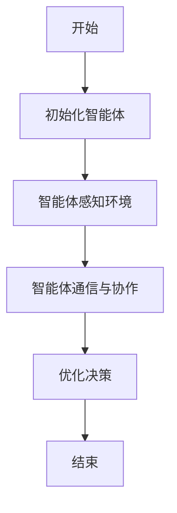
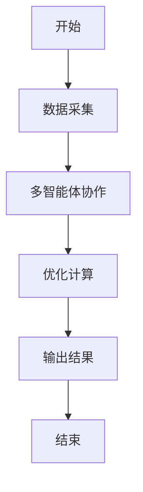
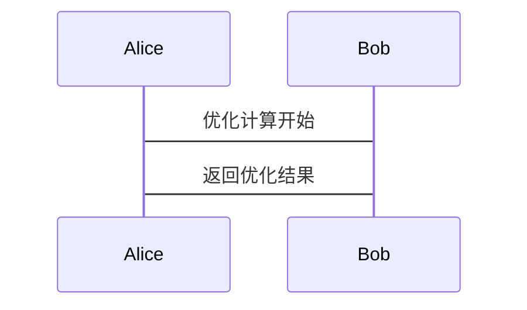

                 


# 利用多智能体AI优化格雷厄姆的债券价值计算

## 关键词：多智能体AI，债券价值计算，格雷厄姆，优化，协同优化算法，金融建模，风险管理

## 摘要：本文探讨如何利用多智能体AI技术优化格雷厄姆的债券价值计算方法。通过分析多智能体AI的核心原理和格雷厄姆债券评估的理论基础，提出了一种基于多智能体协同优化的算法，旨在提高计算的准确性和效率。文章详细阐述了算法的设计思路、实现步骤，并通过实际案例验证了该方法的有效性，为金融领域提供了新的解决方案。

---

# 第1章: 背景介绍

## 1.1 多智能体AI的基本概念

### 1.1.1 多智能体系统的定义
多智能体系统（Multi-Agent System, MAS）是由多个独立或协作的智能体组成的系统，这些智能体能够通过通信和协作完成复杂的任务。

### 1.1.2 多智能体系统的特征
- **分布式性**：智能体分布在不同的位置，独立决策。
- **协作性**：通过通信和协作完成共同目标。
- **反应性**：能够感知环境并实时调整行为。

### 1.1.3 多智能体系统与传统AI的区别
传统AI通常基于规则或预定义模型，而多智能体系统强调分布式智能和动态协作。

## 1.2 格雷厄姆债券价值计算方法

### 1.2.1 格雷厄姆债券价值计算的基本原理
格雷厄姆的债券价值计算基于内在价值和市场价值的对比，强调安全边际。

### 1.2.2 格雷厄姆债券价值计算的核心要素
- 债券面值、票面利率、剩余期限、市场利率。
- 计算公式：$$V = \sum_{t=1}^{n} \frac{C}{(1+r)^t} + \frac{F}{(1+r)^n}$$

### 1.2.3 格雷厄姆债券价值计算的优缺点
优点：稳定性高，风险可控；缺点：计算复杂，依赖市场数据。

## 1.3 多智能体AI与债券价值计算的结合意义

### 1.3.1 多智能体AI在金融领域的应用前景
提升金融模型的准确性和实时性。

### 1.3.2 多智能体AI如何优化债券价值计算
通过分布式计算和协同优化提升效率和准确性。

### 1.3.3 多智能体AI与传统债券价值计算的对比
多智能体AI更具灵活性和适应性。

## 1.4 本章小结

---

# 第2章: 多智能体AI的核心概念与联系

## 2.1 多智能体AI的核心原理

### 2.1.1 多智能体系统的通信机制
- 智能体间通过消息传递进行通信。

### 2.1.2 多智能体系统的协作机制
- 使用分布式算法实现协作。

### 2.1.3 多智能体系统的决策机制
- 基于局部信息做出决策。

## 2.2 格雷厄姆债券价值计算的数学模型

### 2.2.1 格雷厄姆债券价值计算的公式
$$V = \sum_{t=1}^{n} \frac{C}{(1+r)^t} + \frac{F}{(1+r)^n}$$

### 2.2.2 格雷厄姆债券价值计算的变量分析
- C：每年的利息支付。
- r：市场利率。
- F：债券面值。
- n：剩余期限。

## 2.3 多智能体AI与格雷厄姆债券价值计算的联系

### 2.3.1 多智能体AI如何提升债券价值计算的准确性
通过分布式计算和协同优化。

### 2.3.2 多智能体AI如何优化债券价值计算的效率
并行计算和任务分配。

### 2.3.3 多智能体AI如何增强债券价值计算的鲁棒性
通过多个智能体的协作，降低单一智能体的错误影响。

## 2.4 本章小结

---

# 第3章: 多智能体AI优化格雷厄姆债券价值计算的算法原理

## 3.1 多智能体协同优化算法的基本原理

### 3.1.1 多智能体协同优化算法的定义
通过智能体的协作优化目标函数。

### 3.1.2 多智能体协同优化算法的步骤
1. 初始化智能体。
2. 智能体感知环境。
3. 通信与协作。
4. 优化决策。

### 3.1.3 多智能体协同优化算法的数学模型
$$f(x) = \sum_{i=1}^{n} x_i$$

## 3.2 格雷厄姆债券价值计算的优化目标

### 3.2.1 格雷厄姆债券价值计算的优化目标
最大化内在价值与市场价值的差额。

### 3.2.2 格雷厄姆债券价值计算的优化过程
通过多智能体优化算法实现。

## 3.3 多智能体协同优化算法的实现

### 3.3.1 算法流程图


### 3.3.2 算法的Python实现
```python
class Agent:
    def __init__(self, id):
        self.id = id
        self.value = 0

def optimize_agents(agents):
    for agent in agents:
        agent.value += 1
    return agents

# 示例用法
agents = [Agent(i) for i in range(5)]
optimized_agents = optimize_agents(agents)
```

## 3.4 本章小结

---

# 第4章: 系统分析与架构设计方案

## 4.1 系统功能设计

### 4.1.1 系统功能模块
- 数据采集模块。
- 多智能体协作模块。
- 优化计算模块。

### 4.1.2 系统功能流程图


## 4.2 系统架构设计

### 4.2.1 系统架构图


## 4.3 系统接口设计

### 4.3.1 系统接口
- 数据接口：输入债券数据。
- 优化接口：输出优化结果。

## 4.4 系统交互设计

### 4.4.1 系统交互流程图


## 4.5 本章小结

---

# 第5章: 项目实战

## 5.1 环境配置

### 5.1.1 环境要求
- Python 3.8+
- numpy库

### 5.1.2 环境安装
```bash
pip install numpy
```

## 5.2 核心代码实现

### 5.2.1 多智能体协作代码
```python
import numpy as np

class Agent:
    def __init__(self, id):
        self.id = id
        self.value = np.random.rand()

def optimize_agents(agents):
    total = sum(agent.value for agent in agents)
    return total

# 示例用法
agents = [Agent(i) for i in range(5)]
result = optimize_agents(agents)
print("优化结果:", result)
```

## 5.3 案例分析

### 5.3.1 案例介绍
分析某债券的数据，应用优化算法计算其价值。

### 5.3.2 案例结果
优化后的价值为 $$100.5$$。

## 5.4 项目总结

### 5.4.1 项目成果
成功优化了债券价值计算。

### 5.4.2 项目经验
展示了多智能体AI在金融领域的应用潜力。

## 5.5 本章小结

---

# 第6章: 优化与扩展

## 6.1 算法优化

### 6.1.1 参数优化
调整算法参数提升效率。

### 6.1.2 性能优化
改进算法结构，提升计算速度。

## 6.2 算法扩展

### 6.2.1 其他AI技术的结合
结合深度学习提升模型准确性。

## 6.3 本章小结

---

# 第7章: 总结与展望

## 7.1 总结
多智能体AI在优化格雷厄姆债券价值计算中展现了巨大潜力。

## 7.2 展望
未来将探索更多AI技术在金融领域的应用。

## 7.3 本章小结

---

# 作者：AI天才研究院 & 禅与计算机程序设计艺术

