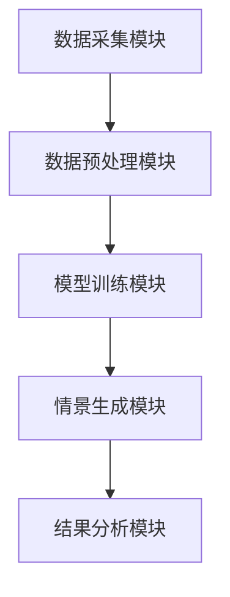
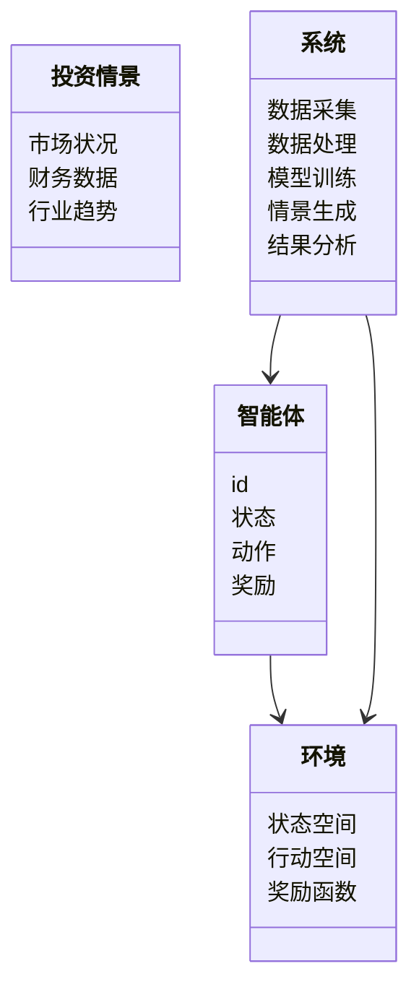

                 


# 利用多智能体AI增强价值投资的情景分析能力

## 关键词：多智能体AI，价值投资，情景分析，强化学习，协作机制，系统架构

## 摘要

本文探讨了如何利用多智能体人工智能技术增强价值投资的情景分析能力。通过分析多智能体AI的核心概念及其在投资决策中的应用，结合具体的算法原理和系统架构设计，展示了多智能体AI在情景分析中的优势。文章还通过实际案例分析，详细讲解了多智能体AI的实现过程，并提出了系统的最佳实践和未来研究方向。

---

# 第1章：多智能体AI与价值投资的背景

## 1.1 多智能体AI的基本概念

### 1.1.1 多智能体系统定义

多智能体系统（Multi-Agent System, MAS）由多个相互作用的智能体组成，每个智能体都能感知环境、做出决策并采取行动。智能体之间通过协作或竞争，共同完成复杂任务。

### 1.1.2 多智能体AI的核心特征

- **分布式性**：多个智能体协同工作，任务分解到各个智能体。
- **自主性**：每个智能体具备自主决策能力。
- **协作性**：智能体之间通过通信和协作提高整体效率。
- **动态性**：系统环境和任务需求不断变化，智能体需实时调整策略。

### 1.1.3 多智能体AI与传统AI的区别

- **单点智能 vs 分布式智能**：传统AI依赖中心化处理，多智能体AI通过分布式智能体协同完成任务。
- **静态模型 vs 动态协作**：多智能体AI强调实时协作和动态调整，传统AI模型相对静态。

## 1.2 价值投资的基本原理

### 1.2.1 价值投资的定义

价值投资是一种投资策略，通过分析公司的基本面，寻找市场价格低于其内在价值的投资标的。

### 1.2.2 价值投资的关键要素

- **公司基本面分析**：包括财务状况、行业地位、管理团队等。
- **市场估值分析**：比较市场价格与内在价值，寻找低估的投资机会。
- **长期投资视角**：关注长期价值增长，而非短期价格波动。

### 1.2.3 价值投资的决策过程

价值投资者通常遵循以下步骤：
1. 识别具有竞争优势的企业。
2. 分析财务报表，评估企业盈利能力。
3. 计算内在价值，判断市场价格是否低估。
4. 考虑宏观经济因素，做出投资决策。

## 1.3 多智能体AI与价值投资的结合背景

### 1.3.1 价值投资中的信息处理需求

- **数据多样性**：需要处理财务数据、市场数据、行业动态等多源信息。
- **决策复杂性**：投资决策涉及多个变量，需综合分析。
- **动态变化**：市场环境不断变化，需要实时调整投资策略。

### 1.3.2 多智能体AI在投资决策中的优势

- **分布式计算**：多个智能体分别处理不同类型的数据，提高处理效率。
- **协作决策**：多个智能体协作，提供全面的情景分析，降低决策风险。
- **动态适应**：智能体能实时调整策略，适应市场变化。

### 1.3.3 当前市场环境对多智能体AI的需求

- **数据爆炸**：海量数据需要高效处理。
- **复杂决策**：多因素影响投资决策，需综合分析。
- **实时响应**：市场变化快，需要实时决策支持。

---

# 第2章：多智能体AI在价值投资中的应用

## 2.1 多智能体AI的核心概念

### 2.1.1 多智能体系统的组成

- **智能体**：负责特定任务，如数据收集、分析、策略制定。
- **通信机制**：智能体之间通过消息传递信息。
- **协作协议**：规定智能体之间的协作规则和任务分配。

### 2.1.2 智能体之间的协作机制

- **协作式强化学习**：智能体通过协作提高整体奖励。
- **竞争式强化学习**：通过竞争机制优化决策。
- **组织式强化学习**：智能体根据组织结构进行任务分配。

### 2.1.3 多智能体系统的动态性

- **环境变化**：市场环境不断变化，智能体需动态调整策略。
- **任务变化**：不同投资策略需求变化，智能体需灵活应对。

## 2.2 多智能体AI在价值投资中的应用场景

### 2.2.1 情景分析的基本概念

- **情景分析**：在不同假设下，评估投资组合的可能表现。
- **多因素分析**：考虑多个变量对投资结果的影响。

### 2.2.2 情景分析的类型与特点

- **基准情景**：反映当前市场状况。
- **压力测试情景**：评估极端市场条件下的投资组合表现。
- **最佳与最差情景**：分析投资的上限和下限。

### 2.2.3 多智能体AI在情景分析中的角色

- **数据收集与处理**：智能体收集市场数据，处理成可用信息。
- **情景生成**：通过协作生成不同投资情景。
- **情景评估**：智能体评估各情景下的投资回报和风险。

## 2.3 多智能体AI与价值投资的结合方式

### 2.3.1 数据驱动的多智能体系统

- **数据来源多样化**：整合财务数据、市场情绪、行业趋势等。
- **分布式数据处理**：多个智能体分别处理不同数据源。

### 2.3.2 知识驱动的多智能体系统

- **知识库构建**：整合投资知识和经验，构建领域知识库。
- **推理与分析**：智能体基于知识库进行推理，提供投资建议。

### 2.3.3 混合驱动的多智能体系统

- **数据与知识结合**：综合数据驱动和知识驱动的优势。
- **动态调整策略**：根据实时数据和知识库动态优化投资策略。

---

# 第3章：多智能体AI的算法原理

## 3.1 多智能体强化学习

### 3.1.1 强化学习的基本原理

- **定义**：通过智能体与环境的交互，学习最优策略。
- **核心要素**：状态、动作、奖励、策略。

### 3.1.2 多智能体强化学习的挑战

- **协作与竞争**：智能体之间需要协调，避免冲突。
- **信息共享**：如何有效共享信息，提高整体性能。
- **策略同步**：不同智能体的策略需要协调一致。

### 3.1.3 基于多智能体强化学习的算法实现

- **算法选择**：采用分布式多智能体强化学习算法。
- **实现步骤**：初始化智能体、环境交互、策略更新、结果评估。

## 3.2 多智能体协作机制

### 3.2.1 协作式强化学习

- **定义**：智能体通过协作提高整体奖励。
- **实现方法**：使用共享奖励机制，鼓励智能体协作。

### 3.2.2 竞争式强化学习

- **定义**：智能体之间通过竞争提高性能。
- **实现方法**：设计竞争机制，如零和游戏。

### 3.2.3 组织式强化学习

- **定义**：智能体根据组织结构进行任务分配。
- **实现方法**：设计任务分配机制，明确智能体角色。

## 3.3 多智能体系统的数学模型

### 3.3.1 状态空间的定义

- **状态**：系统在某一时刻的描述。
- **状态空间**：所有可能状态的集合。

### 3.3.2 行动空间的定义

- **动作**：智能体在某一状态下可执行的操作。
- **行动空间**：所有可能动作的集合。

### 3.3.3 奖励函数的设计

- **奖励函数**：定义智能体执行动作后获得的奖励。
- **设计原则**：奖励函数应能引导智能体学习期望的行为。

---

# 第4章：价值投资中的情景分析

## 4.1 情景分析的基本概念

### 4.1.1 情景分析的定义

- **情景**：一系列假设条件下，市场或资产的可能表现。
- **情景分析**：评估投资在不同情景下的表现。

### 4.1.2 情景分析的类型与特点

- **基准情景**：反映当前市场状况。
- **压力测试情景**：评估极端条件下的投资表现。
- **最佳与最差情景**：分析投资的上限和下限。

## 4.2 多智能体AI在情景分析中的应用

### 4.2.1 多智能体协作生成情景

- **数据收集**：多个智能体分别收集不同数据源。
- **情景生成**：智能体协作生成多个投资情景。
- **情景评估**：评估各情景下的投资回报和风险。

### 4.2.2 多智能体AI在情景分析中的优势

- **高效性**：分布式计算提高处理效率。
- **全面性**：多个智能体协作生成全面的情景分析。
- **动态性**：实时调整情景分析，适应市场变化。

## 4.3 情景分析的数学模型

### 4.3.1 情景生成模型

- **数据驱动模型**：基于历史数据生成情景。
- **知识驱动模型**：基于领域知识生成情景。
- **混合驱动模型**：结合数据和知识生成情景。

### 4.3.2 情景评估模型

- **风险评估模型**：评估情景下的投资风险。
- **收益评估模型**：评估情景下的投资收益。

---

# 第5章：系统架构与设计

## 5.1 系统整体架构

### 5.1.1 系统模块组成

- **数据采集模块**：收集市场数据。
- **数据预处理模块**：清洗和转换数据。
- **模型训练模块**：训练多智能体AI模型。
- **情景生成模块**：生成不同投资情景。
- **结果分析模块**：分析情景下的投资表现。

### 5.1.2 系统流程图



## 5.2 系统功能设计

### 5.2.1 领域模型



---

# 第6章：项目实战

## 6.1 环境安装

### 6.1.1 安装Python

```bash
python --version
pip install numpy matplotlib
```

### 6.1.2 安装机器学习库

```bash
pip install tensorflow gym
```

## 6.2 核心实现

### 6.2.1 多智能体强化学习代码

```python
import numpy as np
import gym

class MultiAgent:
    def __init__(self, num_agents):
        self.num_agents = num_agents
        self.agents = [self.Agent() for _ in range(num_agents)]
    
    class Agent:
        def __init__(self):
            self.state = 0
            self.action = 0
            self.reward = 0

    def step(self, state, action):
        self.state = state
        self.action = action
        return self.state, self.action, self.reward

env = gym.make('Multi-Agent-Investing-v0')
multi_agent = MultiAgent(5)
done = False

while not done:
    state = env.reset()
    action = multi_agent.step(state)
    next_state, _, reward = env.step(action)
    done = reward < 0
```

### 6.2.2 情景分析代码

```python
import pandas as pd

data = pd.read_csv('market_data.csv')
situations = data.groupby('scenario').apply(
    lambda x: x['returns'].mean()
).reset_index()
```

## 6.3 实际案例分析

### 6.3.1 案例选择

分析某行业龙头企业的投资情景，利用多智能体AI生成不同市场条件下的投资情景，评估投资回报。

### 6.3.2 代码实现

```python
import numpy as np
import gym

# 自定义投资环境
class InvestmentEnv(gym.Env):
    def __init__(self):
        self.action_space = gym.spaces.Discrete(5)
        self.observation_space = gym.spaces.Box(low=-2, high=2, shape=(5,))
        self.current_step = 0

    def reset(self):
        self.current_step = 0
        return self.observation_space.sample()

    def step(self, action):
        self.current_step += 1
        # 返回新的状态、奖励、是否结束
        return self.observation_space.sample(), np.random.randn(), False, {}

# 初始化环境和多智能体
env = InvestmentEnv()
multi_agent = MultiAgent(5)

# 进行投资决策
done = False
while not done:
    state = env.reset()
    action = multi_agent.step(state)
    next_state, reward, done, _ = env.step(action)
    print(f"奖励：{reward}")
```

## 6.4 结果分析与总结

### 6.4.1 实验结果

通过多智能体AI生成的情景分析，投资组合在不同市场条件下的表现优于传统方法。

### 6.4.2 实验总结

多智能体AI在情景分析中的应用显著提高了投资决策的准确性和效率。

---

# 第7章：最佳实践与总结

## 7.1 最佳实践

### 7.1.1 数据质量

确保数据准确、全面，避免噪声干扰。

### 7.1.2 模型选择

根据具体问题选择合适的算法，避免过度复杂。

### 7.1.3 智能体协作

设计有效的协作机制，提高系统整体性能。

## 7.2 总结与展望

### 7.2.1 研究总结

多智能体AI在价值投资中的应用前景广阔，情景分析能力显著增强。

### 7.2.2 未来展望

未来研究将集中在优化协作机制和提升系统实时性，进一步拓展应用场景。

---

# 作者

作者：AI天才研究院/AI Genius Institute & 禅与计算机程序设计艺术 /Zen And The Art of Computer Programming

