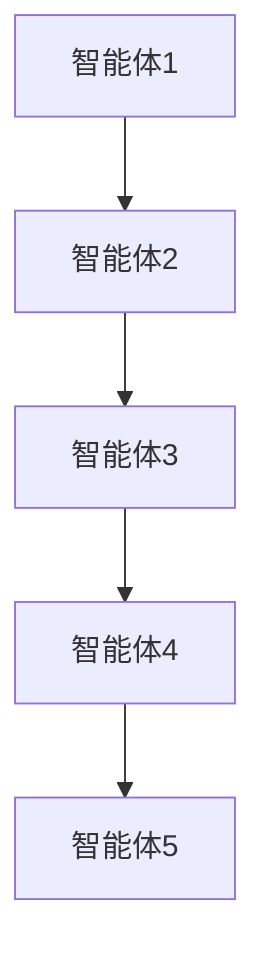
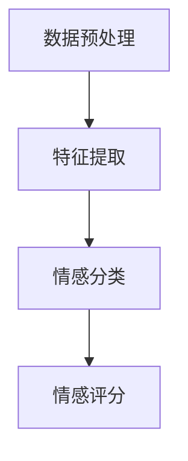
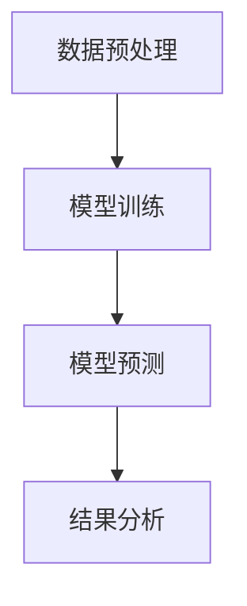
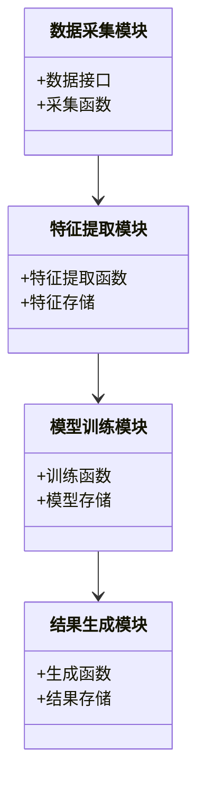
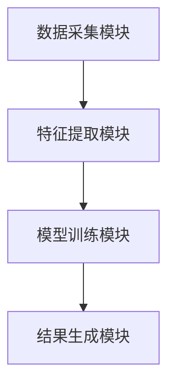
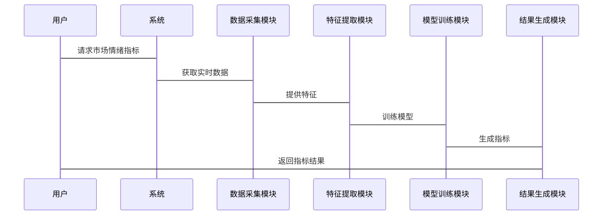

                 


# 利用多智能体AI实现动态市场情绪指标构建

> 关键词：多智能体AI，动态市场情绪指标，情感计算，时间序列预测，系统架构设计

> 摘要：本文详细探讨了利用多智能体人工智能技术构建动态市场情绪指标的方法。通过分析多智能体系统的核心概念、算法原理、系统架构设计以及项目实战，展示了如何在金融等领域中实时捕捉和分析市场情绪变化，为企业决策提供支持。文章内容涵盖从理论到实践的各个方面，旨在为读者提供全面的技术指导。

---

# 第一部分：背景介绍

## 第1章：多智能体AI与动态市场情绪指标概述

### 1.1 多智能体AI的基本概念

#### 1.1.1 多智能体系统的定义
多智能体系统（Multi-Agent System, MAS）是由多个智能体（Agent）组成的分布式系统，每个智能体能够独立感知环境、自主决策并进行协作。智能体之间通过通信和协作完成复杂任务。

#### 1.1.2 多智能体系统的特点
- **分布式**：智能体独立运作，不依赖中心节点。
- **协作性**：通过协作实现整体目标，而非简单叠加。
- **自主性**：智能体能够自主决策，适应环境变化。
- **动态性**：系统状态随环境变化而动态调整。

#### 1.1.3 多智能体系统的优势
- 提高系统的可靠性和容错性。
- 适应复杂环境，增强问题解决能力。
- 支持大规模数据处理和实时响应。

### 1.2 动态市场情绪指标的定义

#### 1.2.1 市场情绪指标的类型
- **静态指标**：基于历史数据计算，无法实时更新。
- **动态指标**：实时捕捉市场情绪变化，动态调整指标值。

#### 1.2.2 动态市场情绪指标的特点
- 实时性：根据最新数据快速更新指标。
- 动态性：适应市场环境的变化。
- 综合性：结合多源数据，提供全面情绪分析。

#### 1.2.3 动态市场情绪指标的应用场景
- 金融投资：帮助投资者做出实时决策。
- 风险管理：识别市场波动，降低投资风险。
- 市场研究：分析市场趋势，制定战略决策。

### 1.3 问题背景与应用价值

#### 1.3.1 当前市场情绪分析的局限性
- 传统指标计算复杂，无法实时更新。
- 静态指标无法捕捉市场动态变化。
- 数据来源单一，分析不够全面。

#### 1.3.2 动态市场情绪指标的构建意义
- 提高市场情绪分析的实时性和准确性。
- 为企业提供及时的市场反馈，辅助决策。
- 优化投资策略，提高投资收益。

#### 1.3.3 与传统市场情绪分析的区别
- **数据处理**：动态指标基于实时数据，传统指标基于历史数据。
- **计算方法**：动态指标采用多智能体协同学习，传统指标采用统计方法。
- **应用场景**：动态指标适用于实时决策，传统指标适用于回顾性分析。

---

## 第2章：问题背景与目标

### 2.1 问题背景

#### 2.1.1 当前市场情绪分析的局限性
传统市场情绪分析方法依赖于静态指标，无法实时捕捉市场变化，导致分析结果滞后，无法满足实时决策的需求。

#### 2.1.2 动态变化的市场环境
金融市场环境瞬息万变，市场情绪受多种因素影响，如新闻事件、社交媒体舆情等，需要实时监控和分析。

#### 2.1.3 传统指标的不足
传统市场情绪指标计算复杂，更新周期长，难以适应快速变化的市场环境。

### 2.2 问题描述

#### 2.2.1 动态市场情绪指标的定义
动态市场情绪指标是一个实时更新的指标，能够反映市场参与者情绪的动态变化。

#### 2.2.2 多智能体AI的应用场景
多智能体AI通过协同学习和情感计算，能够高效地处理海量数据，实时分析市场情绪。

#### 2.2.3 系统目标与边界
- **目标**：构建一个动态市场情绪指标，实时反映市场情绪变化。
- **边界**：仅关注市场情绪分析，不涉及具体的投资策略。

### 2.3 问题解决

#### 2.3.1 多智能体AI的优势
- **分布式计算**：多智能体系统能够高效处理海量数据。
- **协同学习**：智能体之间协作学习，提高分析精度。
- **动态适应**：系统能够实时更新，适应市场变化。

#### 2.3.2 动态指标构建的方法
- **数据采集**：实时采集市场相关数据，如新闻、社交媒体、交易数据等。
- **情感分析**：对采集的数据进行情感分析，计算市场情绪。
- **动态更新**：根据实时数据更新市场情绪指标。

#### 2.3.3 系统架构的设计
- **模块化设计**：系统分为数据采集、特征提取、模型训练、结果生成等模块。
- **接口设计**：各模块之间通过标准接口进行数据交换。
- **交互设计**：提供用户友好的界面，方便用户查询和分析市场情绪。

---

## 第3章：核心概念与联系

### 3.1 多智能体系统的核心要素

#### 3.1.1 智能体的定义与属性
- **智能体**：能够感知环境、自主决策的实体。
- **属性**：目标、知识、推理能力、行动能力、通信能力。

#### 3.1.2 智能体之间的协作机制
- **通信**：智能体之间通过消息传递进行信息共享。
- **协作**：智能体协同完成任务，提高整体性能。
- **协调**：通过协调机制确保各智能体行动一致。

#### 3.1.3 系统的动态性与适应性
- **动态性**：系统状态随环境变化而变化。
- **适应性**：系统能够根据环境变化调整自身行为。

### 3.2 市场情绪指标的构建要素

#### 3.2.1 数据来源与特征
- **数据来源**：新闻、社交媒体、交易数据、公司财报等。
- **特征**：情感强度、相关性、时效性、一致性。

#### 3.2.2 情感分析模型的选择
- **选择模型**：根据数据类型和分析需求选择合适的模型，如LSTM、Transformer等。
- **模型训练**：利用标注数据训练情感分析模型，提高准确率。
- **模型优化**：通过调整参数和优化算法提高模型性能。

#### 3.2.3 动态更新机制的设计
- **实时更新**：根据最新数据实时更新市场情绪指标。
- **反馈机制**：系统能够根据反馈调整分析模型。
- **自适应学习**：模型能够自适应学习，提高分析精度。

### 3.3 核心概念对比

#### 3.3.1 多智能体系统与传统系统对比
| 特性          | 多智能体系统               | 传统系统                 |
|---------------|--------------------------|-------------------------|
| 结构          | 分布式、协作性             | 集中式、单体性           |
| 灵活性        | 高                       | 低                     |
| 可扩展性      | 高                       | 低                     |
| 适应性        | 高                       | 低                     |

#### 3.3.2 市场情绪指标与传统指标对比
| 特性          | 动态市场情绪指标           | 传统市场情绪指标         |
|---------------|--------------------------|-------------------------|
| 实时性        | 高                       | 低                     |
| 动态性        | 高                       | 低                     |
| 数据来源      | 多源、实时                | 单一、历史              |
| 计算方法      | 多智能体协同学习           | 统计分析                |

#### 3.3.3 情感计算与传统计算对比
| 特性          | 情感计算                 | 传统计算               |
|---------------|--------------------------|-------------------------|
| 计算目标      | 情感值                   | 数值、统计值            |
| 数据类型      | 文本、情感                | 数值、结构化数据        |
| 应用场景      | 情感分析、情绪预测        | 统计分析、趋势分析      |

---

## 第4章：算法原理讲解

### 4.1 多智能体协同学习

#### 4.1.1 算法原理
多智能体协同学习通过智能体之间的协作和通信，共同完成任务。每个智能体负责处理部分数据，并通过通信模块共享信息，最终得到整体结果。

#### 4.1.2 算法流程
1. 初始化：设置智能体数量、目标函数、通信规则。
2. 数据分配：将数据分配给各个智能体处理。
3. 本地计算：每个智能体独立计算部分结果。
4. 通信协作：智能体之间共享信息，协同计算。
5. 结果整合：整合各智能体的计算结果，得到最终结果。

#### 4.1.3 代码示例
```python
import numpy as np
import pandas as pd

# 初始化智能体数量
num_agents = 5

# 数据分配
data = np.random.randn(100, 5)
agents_data = np.array_split(data, num_agents)

# 本地计算
def local_calculation(agent_data):
    return np.mean(agent_data, axis=0)

# 通信协作
from agents import Agent

agents = [Agent(i) for i in range(num_agents)]
for i in range(num_agents):
    agents[i].receive_data(agents_data[i])
    agents[i].compute_and_communicate()

# 结果整合
results = [agent.get_result() for agent in agents]
final_result = np.mean(results, axis=0)
```

#### 4.1.4 图表展示


### 4.2 情感计算算法

#### 4.2.1 算法原理
情感计算通过分析文本的情感倾向，计算情感评分。常用的情感计算方法包括基于词典的方法、机器学习方法和深度学习方法。

#### 4.2.2 算法流程
1. 数据预处理：清洗数据，去除停用词，分词处理。
2. 特征提取：提取文本特征，如词袋模型、TF-IDF等。
3. 情感分类：利用机器学习模型或深度学习模型对文本进行情感分类。
4. 情感评分：根据分类结果计算情感评分。

#### 4.2.3 代码示例
```python
from sklearn.feature_extraction.text import TfidfVectorizer
from sklearn.svm import SVC
from sklearn.metrics import accuracy_score

# 数据预处理
corpus = ["This is a positive sentence.", "This is a negative sentence."]

# 特征提取
vectorizer = TfidfVectorizer()
X = vectorizer.fit_transform(corpus)

# 情感分类
model = SVC()
model.fit(X, [1, 0])

# 情感评分
def calculate_sentiment_score(text):
    X_test = vectorizer.transform([text])
    return model.predict(X_test)[0]

# 示例
text = "The company's performance is excellent."
print(calculate_sentiment_score(text))  # 输出：1（正面）
```

#### 4.2.4 图表展示


### 4.3 时间序列预测

#### 4.3.1 算法原理
时间序列预测通过分析历史数据，预测未来趋势。常用的时间序列预测方法包括ARIMA、LSTM、Prophet等。

#### 4.3.2 算法流程
1. 数据预处理：清洗数据，处理缺失值，归一化。
2. 模型训练：选择合适的模型进行训练。
3. 模型预测：利用训练好的模型进行预测。
4. 结果分析：分析预测结果，评估模型性能。

#### 4.3.3 代码示例
```python
import pandas as pd
from statsmodels.tsa.arima.model import ARIMA

# 数据预处理
data = pd.read_csv('market_data.csv')
data = data['price'].values

# 模型训练
model = ARIMA(data, order=(5, 1, 0))
model_fit = model.fit()

# 模型预测
forecast = model_fit.forecast(steps=5)
```

#### 4.3.4 图表展示


---

## 第5章：系统架构设计

### 5.1 问题场景与项目介绍

#### 5.1.1 问题场景
本文以股票市场为例，构建一个动态市场情绪指标，实时分析市场情绪变化，帮助投资者做出决策。

#### 5.1.2 项目介绍
项目名称：动态市场情绪指标构建
目标：构建一个实时更新的市场情绪指标，反映市场参与者的情绪变化。
范围：仅关注股票市场，不涉及其他金融市场。

### 5.2 系统功能设计

#### 5.2.1 功能模块
- **数据采集模块**：实时采集股票市场的相关数据，如新闻、社交媒体、交易数据等。
- **特征提取模块**：对采集的数据进行特征提取，如情感强度、相关性等。
- **模型训练模块**：利用机器学习模型对数据进行情感分类，计算市场情绪。
- **结果生成模块**：生成动态市场情绪指标，提供给用户查询和分析。

#### 5.2.2 功能流程
1. 数据采集：实时采集股票市场的相关数据。
2. 特征提取：提取数据的特征，如情感强度、相关性等。
3. 模型训练：利用机器学习模型对数据进行情感分类，计算市场情绪。
4. 结果生成：生成动态市场情绪指标，提供给用户查询和分析。

#### 5.2.3 图表展示


### 5.3 系统架构设计

#### 5.3.1 系统架构图


#### 5.3.2 接口设计
- 数据接口：提供数据采集模块与特征提取模块之间的接口，用于数据传递。
- 模型接口：提供模型训练模块与结果生成模块之间的接口，用于模型传递。

#### 5.3.3 交互流程图


---

## 第6章：项目实战

### 6.1 环境安装与数据采集

#### 6.1.1 环境安装
- 安装Python
- 安装相关库：pandas、numpy、scikit-learn、tensorflow等。
- 安装数据采集工具：如BeautifulSoup、requests、 tweepy等。

#### 6.1.2 数据采集
- 数据来源：股票市场新闻、社交媒体（如Twitter、Reddit）、交易数据等。
- 数据格式：文本、时间戳、情感标签等。

#### 6.1.3 数据存储
- 数据存储方式：数据库存储（如MySQL、MongoDB）或文件存储（如CSV、JSON）。

### 6.2 核心实现代码

#### 6.2.1 数据预处理
```python
import pandas as pd
import numpy as np

# 读取数据
data = pd.read_csv('market_data.csv')

# 清洗数据
data = data.dropna()

# 归一化处理
from sklearn.preprocessing import MinMaxScaler
scaler = MinMaxScaler()
data_scaled = scaler.fit_transform(data)
```

#### 6.2.2 情感分析模型
```python
from sklearn.svm import SVC
from sklearn.metrics import accuracy_score

# 训练模型
model = SVC()
model.fit(X_train, y_train)

# 模型预测
y_pred = model.predict(X_test)
print(accuracy_score(y_test, y_pred))
```

#### 6.2.3 动态指标生成
```python
import pandas as pd
from statsmodels.tsa.arima.model import ARIMA

# 数据预处理
data = pd.read_csv('market_data.csv')
data = data['price'].values

# 模型训练
model = ARIMA(data, order=(5, 1, 0))
model_fit = model.fit()

# 模型预测
forecast = model_fit.forecast(steps=5)
print(forecast)
```

### 6.3 案例分析与结果解读

#### 6.3.1 案例分析
以某段时间内的股票价格数据为例，分析市场情绪指标的变化。

#### 6.3.2 结果解读
根据动态市场情绪指标，分析市场情绪的变化趋势，判断市场走势，辅助投资决策。

### 6.4 优化与扩展

#### 6.4.1 系统优化
- 提高数据采集效率。
- 优化模型性能，如引入更复杂的深度学习模型。
- 增强系统的实时性，如使用流处理技术。

#### 6.4.2 系统扩展
- 引入更多数据源，如新闻、社交媒体、公司财报等。
- 扩展分析范围，如分析多个市场的市场情绪。
- 结合其他技术，如区块链、大数据分析等。

---

## 第7章：总结与展望

### 7.1 总结
本文详细探讨了利用多智能体AI构建动态市场情绪指标的方法。通过分析多智能体系统的核心概念、算法原理、系统架构设计以及项目实战，展示了如何在金融等领域中实时捕捉和分析市场情绪变化，为企业决策提供支持。

### 7.2 展望
未来的研究方向包括：
- 提高系统的实时性和准确性。
- 探索多智能体系统与其他技术的结合，如区块链、大数据分析等。
- 研究更复杂的情感分析模型，如基于Transformer的模型。

---

# 作者信息

作者：AI天才研究院/AI Genius Institute & 禅与计算机程序设计艺术 /Zen And The Art of Computer Programming

---

# END

