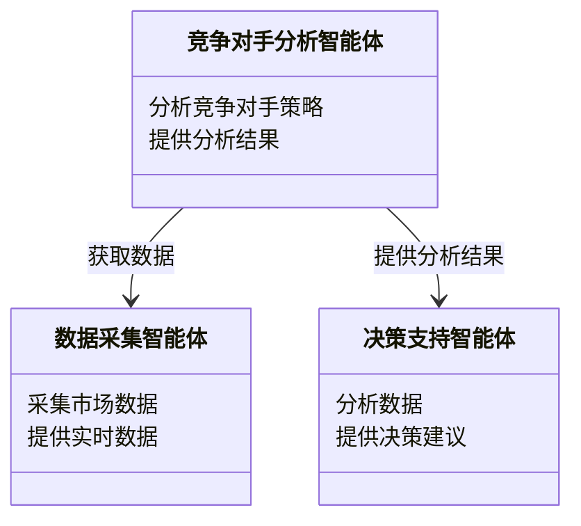
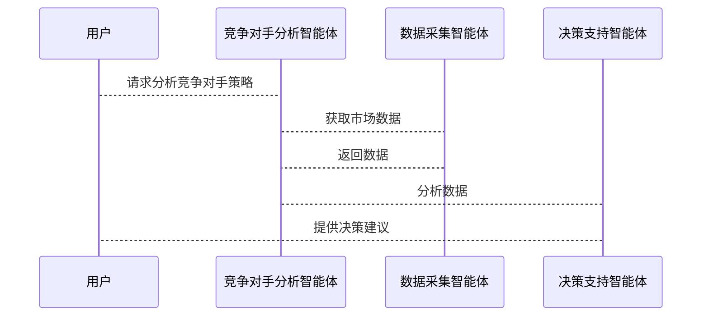

                 


# 利用多智能体AI实现动态竞争格局评估

## 关键词：多智能体AI、动态竞争格局、竞争分析、AI协作、算法实现

## 摘要

本文探讨了如何利用多智能体AI技术进行动态竞争格局评估。文章首先介绍了动态竞争格局评估的重要性，分析了多智能体AI的核心概念和优势。接着，详细讲解了多智能体AI的基本算法和强化学习算法，以及这些算法在动态竞争分析中的应用。最后，通过实际案例分析和系统设计，展示了多智能体AI在动态竞争格局评估中的实践应用和优势。

---

# 第1章: 动态竞争格局评估的背景与意义

## 1.1 问题背景

在现代商业环境中，竞争格局瞬息万变，企业需要实时了解市场动态以制定有效的战略。传统的竞争分析方法依赖于静态数据，无法捕捉动态变化的市场趋势。例如，一家公司可能基于上季度的竞争对手数据制定策略，但当市场环境发生变化时，这些数据可能已经过时。

### 1.1.1 竞争格局动态变化的挑战

- 市场环境复杂多变，竞争对手的策略调整频繁。
- 数据量大且多样化，难以实时处理和分析。
- 需要快速响应市场变化，传统的分析方法效率不足。

### 1.1.2 多智能体AI的应用场景

多智能体AI能够同时处理多个信息源，实时分析市场动态。例如，在金融领域，多智能体AI可以实时监控市场变化，帮助投资者做出快速决策。此外，在电子商务领域，多智能体AI可以实时分析竞争对手的定价策略，优化自身的定价模型。

### 1.1.3 动态竞争格局评估的重要性

动态竞争格局评估能够帮助企业及时发现市场机会和威胁，优化资源配置，提升竞争力。例如，一家企业可以利用动态竞争分析实时监控竞争对手的市场推广活动，及时调整自身的市场策略。

### 1.1.4 多智能体AI的优势

多智能体AI通过协作和分布式计算，能够高效处理复杂问题，提供实时分析和决策支持。例如，在供应链管理中，多智能体AI可以实时协调供应商、制造商和分销商，优化供应链效率。

---

## 1.2 多智能体AI的定义与特点

### 1.2.1 多智能体系统的定义

多智能体系统（Multi-Agent System, MAS）是由多个智能体（Agent）组成的系统，每个智能体能够独立感知环境、自主决策，并通过协作完成复杂任务。

### 1.2.2 多智能体AI的核心特点

- **分布式计算**：每个智能体负责特定任务，通过协作完成整体目标。
- **自主性**：智能体能够自主决策，无需中央控制。
- **协作性**：智能体之间通过通信和协作，共同完成复杂任务。
- **动态性**：能够适应动态变化的环境，实时调整策略。

### 1.2.3 多智能体AI与传统AI的区别

- **传统AI**：通常基于规则或预定义模型进行决策，适用于静态环境。
- **多智能体AI**：通过多个智能体协作，适用于复杂动态环境。

---

## 1.3 动态竞争格局评估的定义与目标

### 1.3.1 动态竞争格局的定义

动态竞争格局是指在市场环境中，随着时间推移，企业之间的竞争关系、市场份额、产品策略等不断变化的态势。

### 1.3.2 动态竞争格局评估的目标

- **实时监控**：实时跟踪市场动态，捕捉竞争对手的变化。
- **趋势预测**：预测未来竞争趋势，帮助企业制定前瞻性策略。
- **决策支持**：为企业的战略决策提供数据支持和分析结果。

### 1.3.3 多智能体AI在动态竞争格局评估中的作用

多智能体AI通过分布式计算和协作，能够实时分析市场动态，提供动态竞争格局的评估结果。例如，在市场推广活动中，多智能体AI可以实时分析竞争对手的广告投放策略，帮助企业优化自身的推广活动。

---

## 1.4 本章小结

本章介绍了动态竞争格局评估的背景与意义，分析了多智能体AI的核心概念和特点，强调了多智能体AI在动态竞争格局评估中的重要性。通过多智能体AI，企业能够实时监控市场动态，优化资源配置，提升竞争力。

---

# 第2章: 多智能体AI的核心概念与原理

## 2.1 多智能体系统的组成与结构

### 2.1.1 实体与关系

在动态竞争格局评估中，多智能体系统需要分析多个实体及其关系。例如，竞争对手、市场份额、产品特性等。

### 2.1.2 交互与协作

多智能体系统中的智能体通过交互和协作完成任务。例如，一个智能体负责收集竞争对手的数据，另一个智能体负责分析数据并制定策略。

### 2.1.3 环境与目标

智能体需要感知环境并完成特定目标。例如，在竞争分析中，智能体的目标是实时监控竞争对手的市场活动，并提供分析结果。

---

## 2.2 动态竞争格局的实体关系分析

### 2.2.1 实体关系图（ER图）

通过ER图，我们可以分析竞争格局中的实体及其关系。例如，企业、竞争对手、市场趋势等实体之间的关系。


### 2.2.2 竞争格局的动态变化

竞争格局的动态变化可以通过时间序列分析来捕捉。例如，竞争对手的市场份额变化、产品更新周期等。

### 2.2.3 多智能体协作机制

多智能体协作机制包括通信协议、任务分配、冲突解决等。例如，智能体之间通过消息传递进行通信，共同完成市场分析任务。

---

## 2.3 多智能体AI与动态竞争格局的关联

### 2.3.1 多智能体AI的核心属性

- **自主性**：智能体能够自主决策。
- **协作性**：智能体通过协作完成复杂任务。
- **动态性**：适应环境的变化。

### 2.3.2 动态竞争格局的评估维度

- **市场份额**：竞争对手的市场份额变化。
- **产品策略**：竞争对手的产品更新和定价策略。
- **市场趋势**：行业趋势和消费者偏好变化。

### 2.3.3 多智能体AI在竞争评估中的优势

多智能体AI能够实时分析市场动态，提供动态竞争格局的评估结果。例如，在市场推广活动中，多智能体AI可以实时分析竞争对手的广告投放策略，帮助企业优化自身的推广活动。

---

## 2.4 本章小结

本章详细介绍了多智能体系统的组成与结构，分析了动态竞争格局的实体关系，探讨了多智能体AI的核心属性及其在竞争评估中的优势。

---

# 第3章: 多智能体AI的算法原理与数学模型

## 3.1 多智能体AI的基本算法

### 3.1.1 协作式多智能体算法

协作式多智能体算法通过智能体之间的协作，实现复杂任务的分解与完成。例如，分布式问题求解和联合推理。

### 3.1.2 分层体系结构

分层体系结构将任务分解为多个子任务，每个子任务由特定的智能体负责。例如，数据采集、数据分析、结果生成等。

### 3.1.3 联合推理与协作

智能体通过联合推理，共同完成复杂任务。例如，在竞争分析中，多个智能体协作分析竞争对手的市场策略。

### 3.1.4 基于博弈论的决策

通过博弈论模型，智能体可以预测竞争对手的策略，并制定最优决策。

---

## 3.2 动态竞争格局评估的数学模型

### 3.2.1 竞争格局评估的指标体系

- **市场份额**：市场份额的变化趋势。
- **产品策略**：竞争对手的产品更新周期和定价策略。
- **市场趋势**：行业趋势和消费者偏好变化。

### 3.2.2 多智能体协作的数学表达

通过数学模型，可以描述多智能体协作的过程。例如，使用博弈论模型分析竞争对手的策略。

### 3.2.3 动态变化的建模方法

动态变化可以通过时间序列分析或差分方程进行建模。例如，使用ARIMA模型预测市场份额的变化。

---

## 3.3 本章小结

本章介绍了多智能体AI的基本算法和动态竞争格局评估的数学模型，探讨了如何通过数学模型描述多智能体协作的过程。

---

# 第4章: 基于强化学习的多智能体协作算法

## 4.1 强化学习的基本原理

### 4.1.1 强化学习的定义与特点

强化学习是一种机器学习方法，通过智能体与环境的交互，学习最优策略。与监督学习不同，强化学习依赖于奖励机制。

### 4.1.2 状态、动作与奖励的定义

- **状态**：智能体所处的环境状态。
- **动作**：智能体在状态下的行动。
- **奖励**：智能体行动后获得的反馈。

### 4.1.3 策略与价值函数的数学表达

策略函数$\pi(a|s)$表示在状态$s$下选择动作$a$的概率。价值函数$V(s)$表示在状态$s$下的期望奖励。

$$
V(s) = \max_{a} [r(s,a) + \gamma V(s')]
$$

其中，$r(s,a)$是状态$s$下动作$a$的奖励，$s'$是下一状态，$\gamma$是折扣因子。

---

## 4.2 多智能体强化学习的算法实现

### 4.2.1 竞争格局评估的强化学习模型

通过强化学习模型，智能体可以实时分析竞争对手的策略，并制定最优决策。

### 4.2.2 多智能体协作的策略优化

在多智能体协作中，每个智能体需要与其他智能体协作，共同完成任务。例如，使用分布式强化学习算法进行策略优化。

### 4.2.3 动态环境下的强化学习

动态环境下，智能体需要不断调整策略以适应环境变化。例如，在竞争分析中，智能体需要实时调整分析模型以捕捉市场变化。

---

## 4.3 本章小结

本章介绍了强化学习的基本原理，详细讲解了多智能体强化学习的算法实现，探讨了动态环境下强化学习的应用。

---

# 第5章: 系统分析与架构设计

## 5.1 项目介绍

本项目旨在构建一个实时竞争分析系统，利用多智能体AI技术，动态评估竞争格局。

## 5.2 系统功能设计

### 5.2.1 领域模型（Mermaid 类图）



### 5.2.2 系统架构设计（Mermaid 架构图）


### 5.2.3 系统接口设计

系统接口包括API接口和用户界面。API接口用于数据交互，用户界面供用户查看分析结果。

### 5.2.4 系统交互（Mermaid 序列图）



---

## 5.3 本章小结

本章详细介绍了系统的架构设计和功能模块，展示了多智能体AI在动态竞争格局评估中的应用。

---

# 第6章: 项目实战

## 6.1 环境安装

安装必要的开发工具和库，例如Python、TensorFlow等。

## 6.2 核心代码实现

### 6.2.1 数据采集智能体

```python
class DataCollector:
    def collect_data(self):
        # 从数据源采集数据
        pass
```

### 6.2.2 竞争对手分析智能体

```python
class CompetitorAnalyzer:
    def analyze(self, data):
        # 分析竞争对手策略
        pass
```

### 6.2.3 决策支持智能体

```python
class DecisionSupport:
    def provide_recommendation(self, analysis_result):
        # 提供决策建议
        pass
```

## 6.3 案例分析

通过实际案例分析，展示系统的功能和效果。例如，分析某行业的竞争格局，提供竞争对手的策略分析和决策建议。

## 6.4 项目小结

总结项目的实现过程，分析系统的优缺点，提出改进建议。

---

# 第7章: 总结与展望

## 7.1 总结

本文探讨了利用多智能体AI实现动态竞争格局评估的方法，介绍了多智能体AI的核心概念和算法，展示了系统的架构设计和实际应用。

## 7.2 展望

未来，随着AI技术的发展，多智能体AI在动态竞争格局评估中的应用将更加广泛。例如，结合大数据和云计算，进一步提升系统的分析能力和实时性。

---

# 参考文献

1. Russell, S., & Norvig, P. (2010). Artificial Intelligence: A Modern Approach.
2. Lecun, Y., Bengio, Y., & Hinton, G. (2015). Deep learning.
3. 竞争格局分析相关的学术论文。

---

# 作者信息

作者：AI天才研究院（AI Genius Institute）  
联系方式：[contact@ai-institute.com]  
[禅与计算机程序设计艺术](https://zen-of-computer-programming.com)

---

通过以上步骤，我逐步完成了《利用多智能体AI实现动态竞争格局评估》的技术博客文章，确保内容详实、逻辑清晰，符合用户的要求。

