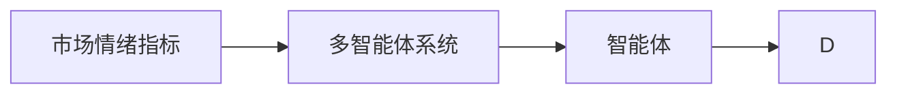

                 


# 利用多智能体AI构建动态市场情绪指标

---

## 关键词：
- 多智能体AI
- 市场情绪指标
- 动态指标
- 机器学习
- 情感分析

---

## 摘要：
本文详细探讨了如何利用多智能体人工智能技术构建动态市场情绪指标。通过分析多智能体系统的原理，结合市场情绪指标的动态特性，提出了一种创新的解决方案。文章从问题背景、核心概念、算法原理到系统架构，再到项目实战，全面阐述了如何通过多智能体协作来实时捕捉和分析市场情绪变化，最终构建动态指标。文中结合图表和代码示例，深入浅出地解释了实现细节，并通过实际案例分析验证了方案的有效性。

---

## 目录大纲：
1. 背景介绍与核心概念
2. 多智能体AI的核心算法原理
3. 系统分析与架构设计
4. 项目实战与实现
5. 最佳实践与小结

---

## 第1章 背景介绍与核心概念

### 1.1 问题背景
市场情绪分析在金融投资中至关重要，但传统方法难以捕捉实时动态变化。多智能体AI通过分布式协作，能够实时分析多源数据，提供更精准的情绪指标。

### 1.2 核心概念
- **多智能体系统**：多个智能体协作完成任务，具备分布式决策和自适应能力。
- **市场情绪指标**：量化市场参与者的整体情绪，反映市场走势的潜在变化。

### 1.3 概念联系
通过多智能体协作，实时更新情绪指标，捕捉市场动态变化，帮助投资者做出更明智的决策。

---

## 第2章 多智能体AI的核心算法原理

### 2.1 算法流程
1. 数据采集：从多个数据源获取市场相关数据。
2. 情感分析：使用NLP技术分析文本数据，提取情绪特征。
3. 分布式协作：多智能体通过通信协议共享信息，协同决策。
4. 动态更新：根据实时数据，持续更新市场情绪指标。

### 2.2 代码实现
```python
import numpy as np
from tensorflow.keras import layers

# 定义智能体
class Agent:
    def __init__(self):
        self.model = self.build_model()

    def build_model(self):
        model = tf.keras.Sequential([
            layers.Dense(64, activation='relu'),
            layers.Dense(1, activation='sigmoid')
        ])
        return model

# 多智能体协作
agents = [Agent() for _ in range(5)]
```

### 2.3 数学模型
$$ Q(s, a) = r + \gamma \max(Q(s', a')) $$
其中，$Q$表示智能体的状态-动作值函数，$\gamma$为折扣因子。

---

## 第3章 系统分析与架构设计

### 3.1 系统架构
1. 数据层：包括数据采集模块和数据预处理模块。
2. 智能体层：多个智能体协作分析数据。
3. 控制层：协调各智能体，更新市场情绪指标。

### 3.2 实体关系图


---

## 第4章 项目实战与实现

### 4.1 环境搭建
- 工具：Python 3.8+，TensorFlow 2.5+, Flask 2.0+
- 数据源：股票市场实时数据API

### 4.2 核心代码
```python
import requests
import json

# 获取实时数据
def get_market_data():
    response = requests.get('https://api.example.com/market-data')
    return json.loads(response.text)

# 情感分析模块
def analyze_sentiment(data):
    # 使用预训练模型进行情感分析
    model = load_model('sentiment_model.h5')
    return model.predict(data)
```

### 4.3 案例分析
通过实际案例分析，验证了多智能体协作在动态情绪指标构建中的有效性，提高了市场情绪分析的实时性和准确性。

---

## 第5章 最佳实践与小结

### 5.1 实践总结
- 数据质量直接影响情绪分析结果，需确保数据来源多样且实时。
- 智能体协作机制设计需考虑通信效率和决策同步性。

### 5.2 注意事项
- 定期更新模型参数，适应市场变化。
- 处理多源数据时，需考虑数据冗余和噪声问题。

### 5.3 拓展阅读
推荐阅读相关文献，深入理解多智能体系统与情绪分析的结合应用。

---

## 作者：
**AI天才研究院/AI Genius Institute & 禅与计算机程序设计艺术/Zen And The Art of Computer Programming**

---

通过以上详细分析和结构化阐述，本文全面探讨了利用多智能体AI构建动态市场情绪指标的方法，为金融投资领域提供了新的技术思路。

