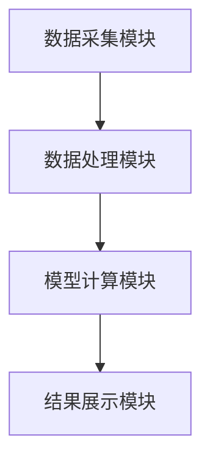
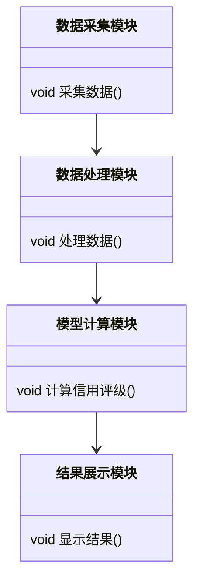

                 

# 利用多智能体系统构建动态的公司信用评级模型

## 关键词：
多智能体系统、动态信用评级模型、人工智能、公司信用评级、金融风险管理

## 摘要：
随着金融市场的快速发展，传统的信用评级模型已难以满足实时性和动态性的要求。本文通过引入多智能体系统，提出了一种新的动态公司信用评级模型构建方法。该方法结合了多智能体系统的协作与分布式计算能力，能够实时更新和优化信用评级结果。文章详细探讨了多智能体系统在信用评级中的应用原理、算法实现、系统架构设计以及实际案例分析，为金融风险管理提供了新的思路和解决方案。

---

## 第1章: 多智能体系统概述

### 1.1 多智能体系统的定义与特点
#### 1.1.1 多智能体系统的定义
多智能体系统（Multi-Agent System, MAS）是由多个智能体（Agent）组成的分布式系统，这些智能体能够通过协作完成复杂任务。每个智能体都是一个独立的实体，具有自主性、反应性、社会性和目标导向性。

#### 1.1.2 多智能体系统的核心特点
- **自主性**：智能体能够独立决策和行动，无需外部干预。
- **反应性**：智能体能够感知环境并实时响应。
- **协作性**：多个智能体通过通信和协作完成共同目标。
- **分布式性**：智能体分布在不同的空间或计算节点上，具有去中心化的特性。

#### 1.1.3 多智能体系统与传统单智能体系统的区别
传统的单智能体系统依赖中心化的决策机制，而多智能体系统通过去中心化的协作实现目标。多智能体系统在复杂任务中表现出更高的灵活性和适应性，尤其是在需要实时动态调整的场景中。

### 1.2 信用评级模型的定义与作用
#### 1.2.1 信用评级模型的定义
信用评级模型是用于评估企业或个人信用状况的数学模型。它通过分析财务数据、市场信息和历史记录，预测企业和个人的信用风险。

#### 1.2.2 信用评级模型的作用与意义
信用评级模型在金融领域具有重要作用，它可以帮助银行、投资者等评估风险，做出信贷决策。准确的信用评级能够降低金融系统的风险，提高市场效率。

#### 1.2.3 信用评级模型的分类
信用评级模型主要分为静态模型和动态模型。静态模型基于历史数据，定期更新；动态模型能够实时调整，反映市场变化。

### 1.3 多智能体系统在信用评级中的应用前景
#### 1.3.1 多智能体系统在金融领域的应用
多智能体系统在金融领域有广泛的应用，包括股票交易、风险管理、信用评估等。其分布式计算能力和实时协作能力使其成为金融创新的重要工具。

#### 1.3.2 多智能体系统在信用评级中的潜在优势
多智能体系统能够通过分布式计算和实时协作，快速整合多源数据，提供更准确的信用评级结果。此外，多智能体系统能够适应市场的动态变化，及时更新信用评级模型。

#### 1.3.3 多智能体系统在信用评级中的挑战与机遇
挑战主要体现在多智能体系统的复杂性和通信开销。机遇则在于多智能体系统的灵活性和适应性，能够为信用评级模型带来新的突破。

---

## 第2章: 多智能体系统与信用评级模型的结合

### 2.1 多智能体系统在信用评级中的核心作用
#### 2.1.1 多智能体系统如何影响信用评级
多智能体系统通过分布式数据采集、实时分析和协作决策，显著提高了信用评级的准确性和实时性。

#### 2.1.2 多智能体系统在信用评级中的优势
- **实时性**：多智能体系统能够快速响应市场变化，提供实时信用评级结果。
- **分布式计算**：多智能体系统能够并行处理大规模数据，提高计算效率。
- **协作性**：多个智能体协同工作，能够从多个角度分析信用风险。

#### 2.1.3 多智能体系统在信用评级中的应用场景
多智能体系统在信用评级中的应用场景包括实时信用监控、风险预警、信用评分优化等。

### 2.2 多智能体系统与信用评级模型的联系
#### 2.2.1 多智能体系统如何构建信用评级模型
多智能体系统通过分布式数据处理和协作学习，构建动态信用评级模型。每个智能体负责处理特定的数据或任务，最终通过协作生成信用评级结果。

#### 2.2.2 多智能体系统与信用评级模型的关系
多智能体系统为信用评级模型提供了分布式计算和实时协作的框架，信用评级模型则是多智能体系统的核心应用之一。

#### 2.2.3 多智能体系统在信用评级模型中的角色
多智能体系统在信用评级模型中扮演数据采集者、计算节点和协作决策者的角色，通过分布式计算和协作学习，优化信用评级模型的性能。

---

## 第3章: 多智能体系统构建动态信用评级模型的核心概念

### 3.1 多智能体系统构建信用评级模型的原理
#### 3.1.1 多智能体系统的协作机制
多智能体系统通过通信协议和协作协议实现智能体之间的协作。协作机制包括任务分配、信息共享和结果汇总。

#### 3.1.2 多智能体系统如何处理信用评级数据
多智能体系统通过分布式数据采集和并行计算，处理大规模信用评级数据。每个智能体负责处理特定的数据或任务，最终通过协作生成信用评级结果。

#### 3.1.3 多智能体系统如何更新信用评级模型
多智能体系统通过实时数据更新和模型优化，动态调整信用评级模型。每个智能体根据最新的数据和反馈，更新自身的模型参数，并通过协作优化整体模型。

### 3.2 动态信用评级模型的特点
#### 3.2.1 动态信用评级模型的定义
动态信用评级模型是一种能够实时更新和优化的信用评级模型。它通过动态调整模型参数和数据来源，反映市场的实时变化。

#### 3.2.2 动态信用评级模型的核心要素
动态信用评级模型的核心要素包括实时数据流、分布式计算能力、动态调整机制和协作学习能力。

#### 3.2.3 动态信用评级模型的动态更新机制
动态信用评级模型通过实时数据流和协作学习，不断优化模型参数。每个智能体根据最新的数据和反馈，更新自身的模型参数，并通过协作优化整体模型。

### 3.3 多智能体系统与动态信用评级模型的关系
#### 3.3.1 多智能体系统如何支持动态信用评级模型
多智能体系统为动态信用评级模型提供了分布式计算和实时协作的框架，通过协作学习和动态调整，优化信用评级模型的性能。

#### 3.3.2 多智能体系统与动态信用评级模型的相互作用
多智能体系统通过实时协作和分布式计算，支持动态信用评级模型的更新和优化。动态信用评级模型通过提供实时反馈，指导多智能体系统的协作和调整。

#### 3.3.3 多智能体系统在动态信用评级模型中的角色
多智能体系统在动态信用评级模型中扮演数据处理者、计算节点和协作优化者的角色，通过协作和优化，提升信用评级模型的准确性和实时性。

---

## 第4章: 多智能体系统构建动态信用评级模型的算法原理

### 4.1 多智能体协作算法
#### 4.1.1 多智能体协作算法的定义
多智能体协作算法是一种通过智能体之间的协作完成特定任务的算法。它包括任务分配、信息共享和结果汇总等步骤。

#### 4.1.2 多智能体协作算法的实现步骤
1. **任务分配**：根据智能体的能力和当前负载，分配任务。
2. **信息共享**：智能体之间通过通信协议共享数据和信息。
3. **协作计算**：智能体协同完成计算任务，并将结果汇总。
4. **结果优化**：通过协作优化算法，进一步优化结果。

#### 4.1.3 多智能体协作算法的优缺点
优点：提高了计算效率和任务完成能力；缺点：增加了通信开销和协作复杂性。

### 4.2 动态信用评级模型的算法实现
#### 4.2.1 动态信用评级模型的数学模型
动态信用评级模型的数学模型可以表示为：
$$ R(t) = \alpha \cdot R(t-1) + \beta \cdot X(t) $$
其中，$R(t)$ 表示当前信用评级结果，$R(t-1)$ 表示上一时刻的信用评级结果，$X(t)$ 表示当前时刻的输入数据，$\alpha$ 和 $\beta$ 是权重参数。

#### 4.2.2 动态信用评级模型的优化算法
动态信用评级模型的优化算法包括梯度下降、遗传算法和粒子群优化等。通过优化算法，可以动态调整模型参数，提高信用评级的准确性。

#### 4.2.3 动态信用评级模型的实现步骤
1. **数据采集**：实时采集公司财务数据和市场信息。
2. **数据预处理**：对数据进行清洗和标准化处理。
3. **模型计算**：通过多智能体协作算法，计算信用评级结果。
4. **模型优化**：通过优化算法，动态调整模型参数。

---

## 第5章: 多智能体系统构建动态信用评级模型的系统架构设计

### 5.1 系统架构设计
#### 5.1.1 系统功能模块
系统功能模块包括数据采集模块、数据处理模块、模型计算模块和结果展示模块。

#### 5.1.2 系统架构图
使用 mermaid 绘制系统架构图：

#### 5.1.3 系统接口设计
系统接口包括数据接口、计算接口和结果接口。数据接口用于数据的输入和输出，计算接口用于模型计算，结果接口用于结果的展示。

#### 5.1.4 系统交互流程
系统交互流程包括数据采集、数据处理、模型计算和结果展示四个步骤。

### 5.2 系统功能设计
#### 5.2.1 系统功能模块
系统功能模块包括数据采集模块、数据处理模块、模型计算模块和结果展示模块。

#### 5.2.2 系统功能设计的详细说明
数据采集模块负责实时采集公司财务数据和市场信息；数据处理模块对数据进行清洗和标准化处理；模型计算模块通过多智能体协作算法计算信用评级结果；结果展示模块将信用评级结果以可视化的方式展示出来。

### 5.3 系统架构图
使用 mermaid 绘制系统架构图：

---

## 第6章: 多智能体系统构建动态信用评级模型的项目实战

### 6.1 项目环境安装
#### 6.1.1 系统环境要求
系统环境要求包括操作系统、Python版本和相关依赖库的安装。

#### 6.1.2 Python依赖库安装
安装必要的Python依赖库，例如 NumPy、Pandas、Scikit-learn 和 Multi-Agent 等。

### 6.2 项目核心代码实现
#### 6.2.1 数据采集模块的实现
数据采集模块负责实时采集公司财务数据和市场信息。可以通过API接口或其他数据源获取数据。

#### 6.2.2 数据处理模块的实现
数据处理模块对采集到的数据进行清洗和标准化处理，确保数据的质量和一致性。

#### 6.2.3 模型计算模块的实现
模型计算模块通过多智能体协作算法，计算信用评级结果。每个智能体负责处理特定的数据或任务，最终通过协作生成信用评级结果。

#### 6.2.4 结果展示模块的实现
结果展示模块将信用评级结果以可视化的方式展示出来，例如生成图表或报告。

### 6.3 项目实战案例分析
#### 6.3.1 案例背景介绍
选择一个具体的公司作为案例，介绍其财务状况和市场环境。

#### 6.3.2 案例分析过程
通过多智能体系统构建动态信用评级模型，分析该公司的信用评级结果。

#### 6.3.3 案例结果解读
解读分析结果，评估模型的准确性和实时性。

### 6.4 项目小结
通过项目实战，验证了多智能体系统构建动态信用评级模型的有效性和可行性。同时，总结了项目实施中的经验和教训，为后续优化提供了参考。

---

## 第7章: 总结与展望

### 7.1 总结
通过本文的探讨，我们了解了多智能体系统在信用评级中的应用价值。多智能体系统通过分布式计算和实时协作，显著提高了信用评级的准确性和实时性。本文详细分析了多智能体系统构建动态信用评级模型的原理、算法、系统架构和项目实战，为金融风险管理提供了新的思路和解决方案。

### 7.2 展望
未来，随着人工智能和分布式计算技术的不断发展，多智能体系统在信用评级中的应用将更加广泛和深入。我们可以期待更多创新的多智能体系统架构和算法，进一步提升信用评级模型的性能和准确性。

---

## 作者：AI天才研究院/AI Genius Institute & 禅与计算机程序设计艺术 /Zen And The Art of Computer Programming

