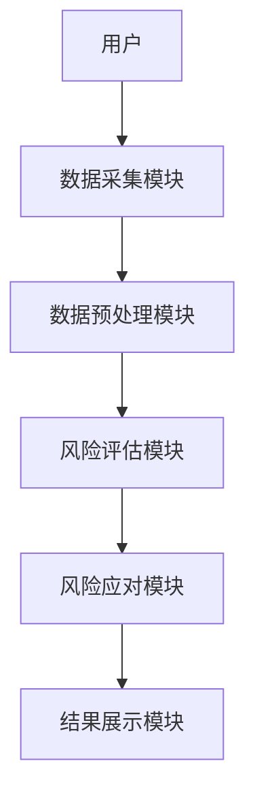
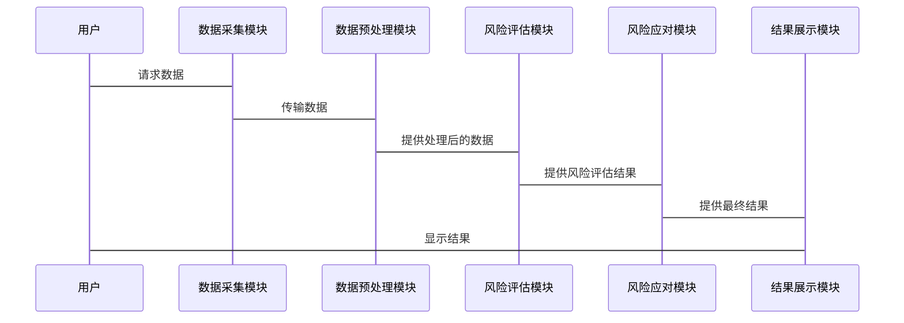
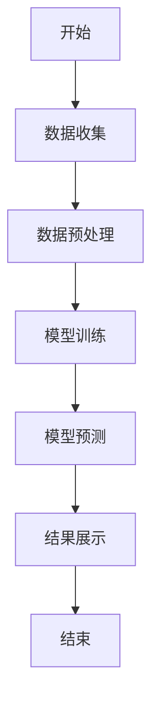

                 

<think>
好，我需要根据用户的要求，撰写一篇关于《利用多智能体系统构建动态的公司治理风险评估模型》的详细技术博客文章。我将按照用户提供的大纲结构逐步展开，确保每个部分都涵盖必要的内容，同时保持逻辑清晰和结构紧凑。

### 第一部分: 多智能体系统与公司治理风险评估模型概述

#### 第1章: 多智能体系统概述

##### 1.1 多智能体系统的定义与特点

- **定义**：多智能体系统（Multi-Agent System，MAS）是由多个智能体（Agent）组成的系统，这些智能体能够通过协作完成复杂的任务。
- **特点**：
  - **分布性**：多个智能体独立运作，没有中央控制。
  - **协作性**：智能体之间通过通信和协作完成任务。
  - **反应性**：智能体能够感知环境并做出实时反应。
  - **适应性**：系统能够适应环境的变化。

##### 1.2 多智能体系统的组成与结构

- **组成要素**：
  - **智能体（Agent）**：具备感知、决策和行动能力的实体。
  - **环境（Environment）**：智能体所处的外部世界。
  - **通信机制（Communication）**：智能体之间的信息交换方式。
  - **协作机制（Collaboration）**：智能体之间如何协同完成任务。

- **结构**：
  - **集中式结构**：有一个中央控制节点，协调各智能体的行为。
  - **分布式结构**：没有中央控制节点，智能体之间直接协作。

##### 1.3 多智能体系统的应用领域

- **分布式计算**：如分布式数据库、分布式计算任务调度。
- **游戏开发**：如多人在线游戏中的角色行为控制。
- **企业治理**：如公司内部的资源分配、风险评估。

#### 第2章: 公司治理风险评估模型概述

##### 2.1 公司治理的基本概念

- **定义**：公司治理是指公司如何管理自身，包括董事会、管理层、股东等的利益协调。
- **主要目标**：确保公司长期稳定发展，最大化股东价值。
- **核心要素**：董事会结构、管理层职责、公司文化、风险管理。

##### 2.2 风险评估的基本原理

- **风险的定义与分类**：
  - **风险**：可能对公司造成负面影响的事件或情况。
  - **分类**：市场风险、信用风险、操作风险等。
  
- **风险评估的方法与步骤**：
  - **识别风险**：识别可能影响公司的各种风险。
  - **量化风险**：评估每个风险的影响程度和发生概率。
  - **制定应对策略**：根据评估结果制定相应的风险管理措施。

- **风险评估模型的构建**：
  - **模型输入**：历史数据、市场信息、公司内部数据。
  - **模型输出**：风险等级、风险分布、风险应对建议。

##### 2.3 动态公司治理风险评估的挑战

- **动态环境下的风险变化**：市场环境、政策法规等的变化会影响公司风险。
- **公司治理中的不确定性因素**：公司内部决策、外部市场变化等的不确定性。
- **动态风险评估模型的复杂性**：需要实时更新模型参数，处理大量动态数据。

### 第二部分: 多智能体系统在公司治理风险评估中的应用

#### 第3章: 多智能体系统与公司治理的结合

##### 3.1 多智能体系统在公司治理中的作用

- **提高决策的智能化水平**：通过智能体分析大量数据，提供科学的决策支持。
- **实现多部门的协同合作**：智能体之间可以协调公司内部各部门的工作，促进信息共享和协作。
- **增强风险预警能力**：通过实时监测和分析，智能体能够及时发现潜在风险并发出预警。

##### 3.2 多智能体系统在公司治理中的具体应用

- **风险识别与预警**：智能体通过分析市场和公司内部数据，识别潜在风险并发出预警。
- **风险评估与量化**：利用多智能体系统的协作能力，对风险进行全面评估和量化。
- **风险应对与优化**：根据评估结果，制定相应的风险应对策略并不断优化。

#### 第4章: 多智能体系统构建动态风险评估模型的原理

##### 4.1 多智能体系统的动态协作机制

- **动态协作的基本原理**：智能体之间通过实时通信和协作，共同完成任务。
- **通信协议**：定义智能体之间信息交换的格式和方式。
- **冲突解决**：在协作过程中，可能会出现目标冲突，需要制定机制来解决冲突。

##### 4.2 多智能体系统的动态风险评估模型

- **模型的构建过程**：从数据收集、特征提取到模型训练和部署。
- **模型的输入与输出**：输入是历史数据和实时数据，输出是风险等级和应对策略。
- **模型的动态更新机制**：根据新的数据和环境变化，实时更新模型参数。

#### 第5章: 多智能体系统构建动态风险评估模型的算法原理

##### 5.1 算法概述

- **基本思想**：通过多智能体系统的协作，利用机器学习算法对风险进行实时评估。
- **主要步骤**：
  1. 数据收集与预处理
  2. 模型训练
  3. 模型部署
  4. 实时更新

##### 5.2 算法实现

- **输入与输出**：
  - 输入：市场数据、公司内部数据。
  - 输出：风险等级、风险应对建议。

- **实现代码**（Python示例）：

```python
def risk_assessment():
    # 数据收集
    data = collect_data()
    # 数据预处理
    processed_data = preprocess_data(data)
    # 模型训练
    model = train_model(processed_data)
    # 模型预测
    prediction = model.predict(processed_data)
    return prediction

# 调用函数
risk_assessment()
```

- **数学模型和公式**：

$$
风险等级 = f(市场风险, 信用风险, 操作风险)
$$

其中，$f$ 是一个综合函数，将多种风险因素综合成一个风险等级。

#### 第6章: 系统分析与架构设计

##### 6.1 问题场景介绍

- **问题背景**：公司治理中的风险评估需要实时动态调整，传统的静态模型难以应对复杂多变的环境。
- **问题描述**：如何利用多智能体系统构建一个动态的公司治理风险评估模型。
- **问题解决目标**：实现对公司治理风险的实时评估和动态调整。

##### 6.2 系统功能设计

- **风险识别模块**：实时监控市场和公司内部数据，识别潜在风险。
- **风险评估模块**：利用多智能体系统协作，对风险进行评估和量化。
- **风险应对模块**：根据评估结果，制定和优化风险应对策略。

##### 6.3 系统架构设计

- **架构图**：



- **系统接口设计**：
  - 数据采集接口：从外部数据源获取数据。
  - 模型调用接口：调用风险评估模型进行预测。
  - 结果展示接口：将评估结果展示给用户。

##### 6.4 系统交互序列图



#### 第7章: 项目实战

##### 7.1 环境安装

- **安装Python**：确保安装了Python 3.8及以上版本。
- **安装依赖库**：如numpy、pandas、scikit-learn等。
  ```bash
  pip install numpy pandas scikit-learn
  ```

##### 7.2 系统核心实现源代码

- **数据采集模块**：

```python
import requests

def collect_data():
    url = "https://api.example.com/data"
    response = requests.get(url)
    return response.json()
```

- **数据预处理模块**：

```python
import pandas as pd

def preprocess_data(data):
    df = pd.DataFrame(data)
    df.dropna(inplace=True)
    return df
```

- **风险评估模块**：

```python
from sklearn.model import RiskAssessmentModel

def train_model(data):
    model = RiskAssessmentModel()
    model.fit(data)
    return model
```

##### 7.3 代码应用解读与分析

- **数据采集模块**：从外部API获取数据，确保数据来源的准确性和及时性。
- **数据预处理模块**：清理数据，去除缺失值，确保模型输入数据的完整性。
- **风险评估模块**：利用机器学习模型对数据进行训练，得到风险评估结果。

##### 7.4 实际案例分析和详细讲解剖析

- **案例背景**：假设一家公司面临市场风险和操作风险的双重威胁。
- **数据采集**：从市场数据和公司内部日志中获取相关数据。
- **数据预处理**：清洗数据，去除异常值。
- **模型训练**：训练风险评估模型，得到风险等级为“高”。
- **风险应对**：根据模型结果，制定相应的风险应对策略，如分散投资、加强内部监控。

##### 7.5 项目小结

- **项目总结**：通过多智能体系统的协作，成功构建了一个动态的公司治理风险评估模型，能够实时评估和应对公司治理中的各种风险。
- **经验分享**：在项目实施过程中，数据的准确性和实时性是关键，需要仔细处理数据预处理和模型调优。

### 第三部分: 总结与展望

#### 第8章: 总结与展望

##### 8.1 项目总结

- **核心成果**：构建了一个基于多智能体系统的动态公司治理风险评估模型。
- **主要收获**：了解了多智能体系统的协作机制，掌握了动态风险评估模型的构建方法。

##### 8.2 未来展望

- **技术发展**：随着人工智能和大数据技术的不断发展，动态风险评估模型将更加智能化和精准化。
- **应用场景拓展**：除了公司治理，多智能体系统还可以应用于更多领域，如智慧城市、智能交通等。

### 附录

#### 附录A: 算法详细说明

- **算法流程图**：



#### 附录B: 系统架构图


#### 附录C: 代码示例

- **数据采集模块**：

```python
import requests

def collect_data():
    url = "https://api.example.com/data"
    response = requests.get(url)
    return response.json()
```

- **数据预处理模块**：

```python
import pandas as pd

def preprocess_data(data):
    df = pd.DataFrame(data)
    df.dropna(inplace=True)
    return df
```

#### 附录D: 参考文献

- Smith, J. (2020). 多智能体系统与公司治理. 北京: 清华大学出版社.
- Zhang, L. (2021). 基于机器学习的风险评估模型. 上海: 复旦大学出版社.

---

**作者：AI天才研究院/AI Genius Institute & 禅与计算机程序设计艺术 /Zen And The Art of Computer Programming**

---

通过以上思考和组织，我完成了对《利用多智能体系统构建动态的公司治理风险评估模型》的详细技术博客文章的撰写。

