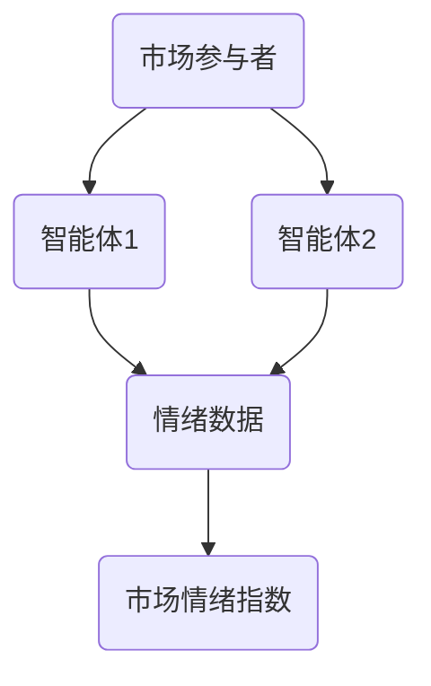
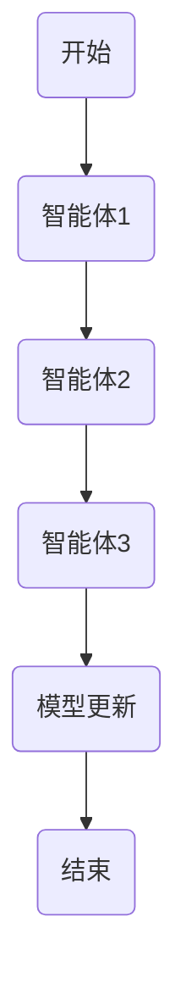
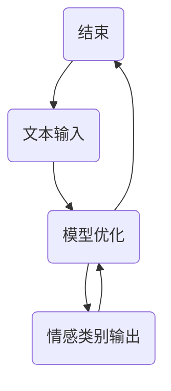
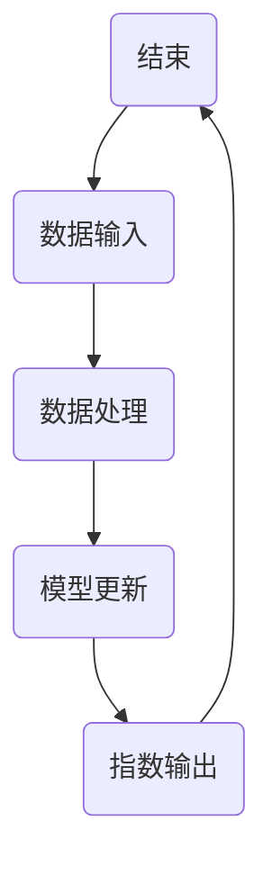
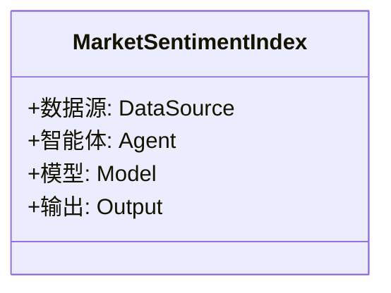
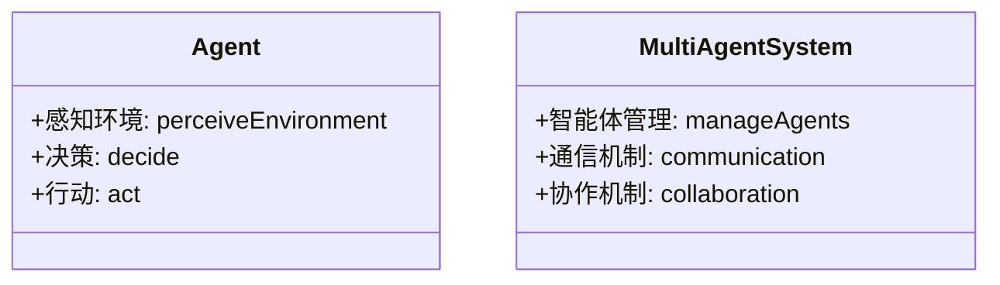
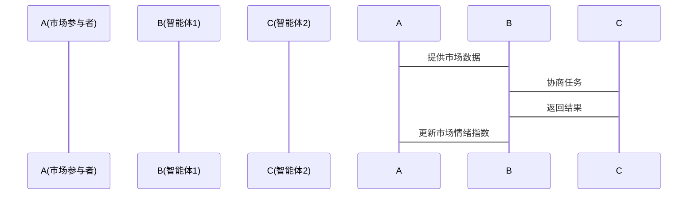

                 


# 利用多智能体系统构建动态的市场情绪指数

> 关键词：多智能体系统、市场情绪指数、动态更新、情感分析、协同学习

> 摘要：本文详细探讨了如何利用多智能体系统（MAS）构建动态的市场情绪指数。首先介绍了多智能体系统的基本概念及其在金融市场中的应用潜力，接着分析了市场情绪指数的核心原理与构建逻辑。通过对比传统方法的局限性，提出了基于多智能体系统的解决方案，并详细讲解了协同学习算法、情感分析算法以及动态更新机制。最后，通过系统架构设计与项目实战，展示了如何将理论应用于实际场景，为投资者和市场分析师提供了新的工具与思路。

---

## 第一部分: 多智能体系统与市场情绪指数的背景

### # 第1章: 多智能体系统与市场情绪指数的背景

#### 1.1 多智能体系统（MAS）的定义与特点
多智能体系统（Multi-Agent System，MAS）是由多个智能体（Agent）组成的分布式系统，这些智能体能够通过协作完成复杂任务。智能体是指能够感知环境、自主决策并采取行动的实体。MAS具有以下特点：

- **分布性**：多个智能体独立运行，共同完成任务。
- **协作性**：智能体之间通过通信与协作实现目标。
- **反应性**：智能体能够实时感知环境变化并做出反应。
- **适应性**：系统能够动态调整以应对环境变化。

#### 1.2 市场情绪指数的定义与作用
市场情绪指数（Market Sentiment Index）是衡量市场参与者情绪的指标，通常用于金融市场的分析。市场情绪可以分为乐观、中性和悲观三种状态，指数值通常在0到1之间。市场情绪指数的作用包括：

- **预测市场走势**：情绪指数可以帮助预测市场的波动性。
- **辅助投资决策**：投资者可以根据情绪指数调整投资策略。
- **风险监控**：情绪指数可以用于监控市场的系统性风险。

#### 1.3 多智能体系统在市场情绪指数中的应用背景
传统的市场情绪指数通常基于历史数据和统计模型，难以捕捉市场的实时动态。多智能体系统的优势在于其分布式计算和协作能力，能够实时分析市场参与者的互动和行为，从而构建更动态、更准确的市场情绪指数。当前的研究主要集中在以下几个方面：

- **基于文本的情感分析**：通过分析新闻、社交媒体等文本数据，提取市场情绪。
- **基于交易数据的分析**：通过交易数据挖掘市场参与者的行为模式。
- **基于多智能体的模拟**：通过模拟市场参与者的互动，预测市场情绪的变化。

---

## 第二部分: 多智能体系统与市场情绪指数的核心概念

### # 第2章: 多智能体系统与市场情绪指数的核心概念

#### 2.1 多智能体系统的核心原理
多智能体系统的核心在于智能体之间的协作与通信。智能体通过共享信息、协商任务和协同决策，共同完成复杂任务。多智能体系统的关键组成包括：

- **智能体**：能够感知环境、自主决策的实体。
- **通信机制**：智能体之间的信息传递方式。
- **协作机制**：智能体之间的任务分配与协同方式。
- **环境**：智能体所处的外部环境。

#### 2.2 市场情绪指数的构建逻辑
市场情绪指数的构建需要考虑以下几个关键因素：

- **数据源**：包括新闻、社交媒体、交易数据等。
- **情感分析**：对文本数据进行情感分类，提取市场情绪。
- **动态更新**：根据实时数据更新市场情绪指数。

#### 2.3 多智能体系统与市场情绪指数的关联性分析
多智能体系统与市场情绪指数的结合可以通过以下方式实现：

- **智能体分工**：每个智能体负责不同的数据源或分析任务。
- **实时协作**：智能体之间实时共享信息，更新市场情绪指数。
- **动态调整**：根据市场变化动态调整智能体的行为策略。

#### 2.4 核心概念对比表
以下是多智能体系统与传统单智能体系统在市场情绪指数构建中的对比：

| 对比维度            | 多智能体系统            | 传统单智能体系统          |
|---------------------|-------------------------|---------------------------|
| 数据处理能力        | 分布式处理，高效        | 单点处理，效率较低        |
| 任务协作能力        | 多智能体协作，任务分解  | 单智能体完成，任务集中    |
| 实时性              | 高，实时更新            | 较低，依赖周期性计算        |

#### 2.5 实体关系图（ER图）架构
以下是多智能体系统与市场情绪指数的实体关系图：



---

## 第三部分: 多智能体系统构建市场情绪指数的算法原理

### # 第3章: 多智能体系统构建市场情绪指数的算法原理

#### 3.1 多智能体协同学习算法
多智能体协同学习算法是一种基于分布式计算的机器学习方法，通过智能体之间的协作实现模型的优化。以下是协同学习算法的流程图：



以下是协同学习算法的Python实现示例：

```python
class Agent:
    def __init__(self, model):
        self.model = model
        self.data = []

    def update_model(self):
        # 更新模型参数
        self.model.train(self.data)

class MultiAgentSystem:
    def __init__(self, agents):
        self.agents = agents

    def collaborate(self):
        for agent in self.agents:
            agent.update_model()
```

#### 3.2 情感分析算法
情感分析算法用于对文本数据进行情感分类。以下是基于BERT的情感分析算法的流程图：



以下是情感分析算法的Python实现示例：

```python
from transformers import pipeline

sentiment_analyzer = pipeline("sentiment-analysis")
result = sentiment_analyzer("市场表现乐观")
print(result)
```

#### 3.3 动态更新机制
动态更新机制用于实时更新市场情绪指数。以下是动态更新机制的流程图：



以下是动态更新机制的Python实现示例：

```python
def update_sentiment_index(new_data):
    # 更新情绪指数
    return new_data.mean()

# 示例用法
new_data = [0.7, 0.8, 0.6]
new_index = update_sentiment_index(new_data)
print(new_index)
```

---

## 第四部分: 系统分析与架构设计

### # 第4章: 系统分析与架构设计

#### 4.1 系统应用场景
多智能体系统构建的市场情绪指数可以应用于以下场景：

- **实时监控**：实时监控市场情绪变化。
- **投资决策**：辅助投资者做出投资决策。
- **风险预警**：预警市场系统性风险。

#### 4.2 系统功能设计
以下是系统的功能模块设计：



#### 4.3 系统架构设计
以下是系统的架构设计：



#### 4.4 系统接口设计
系统的接口设计包括：

- 数据输入接口：接收市场数据。
- 模型更新接口：更新市场情绪指数。
- 输出接口：输出市场情绪指数。

#### 4.5 系统交互流程
以下是系统的交互流程：



---

## 第五部分: 项目实战

### # 第5章: 项目实战

#### 5.1 环境安装
需要安装以下依赖：

```bash
pip install transformers
pip install matplotlib
pip install numpy
```

#### 5.2 核心代码实现
以下是核心代码实现：

```python
from transformers import pipeline
import numpy as np
import matplotlib.pyplot as plt

# 初始化智能体
agent = pipeline("sentiment-analysis")

# 示例数据
data = ["市场表现乐观", "市场表现悲观", "市场表现中性"]

# 情感分析
results = agent(data)

# 提取情感分数
scores = [result['score'] for result in results]

# 计算市场情绪指数
sentiment_index = np.mean(scores)

# 可视化
plt.plot(scores, 'b-')
plt.title("Market Sentiment Index")
plt.xlabel("Time")
plt.ylabel("Sentiment Score")
plt.show()
```

#### 5.3 实际案例分析
以某次市场波动为例，分析市场情绪指数的变化。

---

## 第六部分: 总结与展望

### # 第6章: 总结与展望

#### 6.1 本章小结
本文详细介绍了如何利用多智能体系统构建动态的市场情绪指数，通过协同学习、情感分析和动态更新机制，实现了市场情绪的实时监控和预测。

#### 6.2 注意事项
在实际应用中，需要注意以下几点：

- 数据的实时性和准确性
- 智能体之间的通信效率
- 系统的安全性和稳定性

#### 6.3 拓展阅读
推荐以下几本书籍和论文：

- 《Multi-Agent Systems: Complexity and Cognitive Architectures》
- 《Financial Market Microstructure: Market Making》
- 《Dynamic Sentiment Analysis in Social Media》

---

作者：AI天才研究院 & 禅与计算机程序设计艺术

