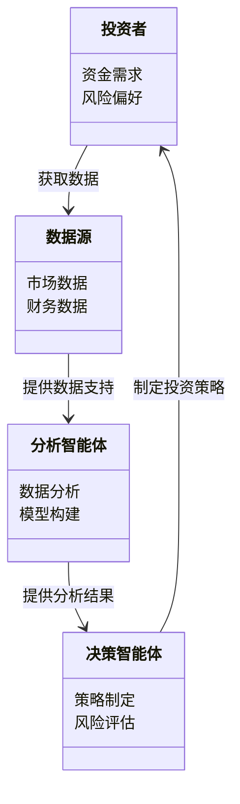
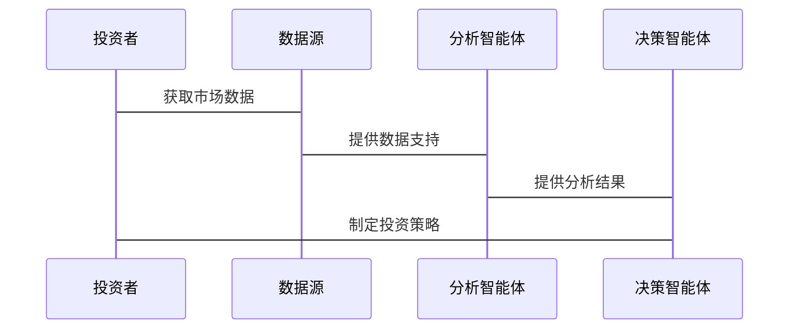

                 


# 利用多智能体系统构建更全面的价值投资研究生态

---

## 关键词：
- 多智能体系统
- 价值投资
- 系统架构
- 算法原理
- 项目实战

---

## 摘要：
本文将探讨如何利用多智能体系统构建更全面的价值投资研究生态。通过分析多智能体系统的核心原理、算法实现、系统架构以及实际应用场景，本文旨在为价值投资者提供一种创新的工具和方法，以提升投资研究的深度和广度。文章从背景介绍、核心概念、算法原理、系统架构到项目实战，层层深入，为读者提供全面的技术指导和实践参考。

---

# 第一部分：多智能体系统与价值投资研究生态的背景介绍

## 第1章：多智能体系统与价值投资概述

### 1.1 多智能体系统的定义与特点
- 1.1.1 多智能体系统的定义  
  多智能体系统（Multi-Agent System，MAS）是由多个智能体组成的分布式系统，这些智能体通过协作和竞争完成特定任务。
- 1.1.2 多智能体系统的核心特点  
  - 分布式计算：智能体之间通过分布式通信协作。  
  - 自主性：每个智能体都具有自主决策能力。  
  - 社会性：智能体之间通过交互实现协同。  
  - 可扩展性：系统可扩展性强，适用于复杂场景。  

### 1.2 价值投资研究的背景与挑战
- 1.2.1 价值投资的基本概念  
  价值投资是一种以基本面分析为基础的投资策略，旨在发现被市场低估的优质资产。  
- 1.2.2 传统价值投资研究的局限性  
  - 数据量庞大，分析效率低。  
  - 多维度分析复杂，难以全面覆盖。  
  - 人工判断存在主观性和片面性。  
- 1.2.3 利用多智能体系统提升价值投资研究的必要性  
  - 提高数据分析效率。  
  - 实现多维度、多层次的综合分析。  
  - 增强决策的客观性和准确性。  

### 1.3 多智能体系统在价值投资中的应用前景
- 1.3.1 多智能体系统在金融领域的潜在应用  
  - 金融数据挖掘。  
  - 投资组合优化。  
  - 风险管理与预警。  
- 1.3.2 价值投资研究中多智能体系统的独特优势  
  - 多维度数据处理能力。  
  - 高效的协作机制。  
  - 强大的扩展性。  
- 1.3.3 多智能体系统应用的挑战与机遇  
  - 技术挑战：复杂性、通信延迟、安全性。  
  - 机遇：人工智能技术的快速发展。  

### 1.4 本章小结  
本章主要介绍了多智能体系统的核心特点和价值投资研究的背景与挑战，同时探讨了多智能体系统在价值投资中的应用前景。通过分析，我们发现多智能体系统在提升投资研究效率和深度方面具有显著优势。

---

# 第二部分：多智能体系统的核心概念与联系

## 第2章：多智能体系统的原理与结构

### 2.1 多智能体系统的组成与功能
- 2.1.1 多智能体系统的组成要素  
  - 智能体：具有感知、决策、执行能力的主体。  
  - 通信机制：智能体之间信息交互的桥梁。  
  - 协作机制：智能体协同完成任务的规则。  
  - 环境：智能体所处的外部世界。  
- 2.1.2 各智能体的功能与角色  
  - 数据采集智能体：负责收集市场数据。  
  - 分析智能体：负责对数据进行分析和评估。  
  - 决策智能体：基于分析结果制定投资策略。  
  - 执行智能体：负责策略的执行和反馈。  

### 2.2 多智能体系统与价值投资研究的结合
- 2.2.1 价值投资研究的核心要素  
  - 财务数据：收入、利润、资产负债表等。  
  - 行业分析：行业趋势、竞争格局等。  
  - 市场情绪：投资者心理、市场波动等。  
- 2.2.2 多智能体系统如何辅助价值投资研究  
  - 数据采集智能体：实时获取多源数据。  
  - 分析智能体：对数据进行深度分析和建模。  
  - 决策智能体：结合分析结果制定投资策略。  
- 2.2.3 多智能体系统与价值投资研究的协同机制  
  - 数据共享：各智能体之间的数据交互。  
  - 任务分配：根据智能体能力分配任务。  
  - 协作反馈：根据反馈结果优化策略。  

### 2.3 多智能体系统的ER实体关系图
```mermaid
erDiagram
    投资者 [投资者ID, 资产规模, 风险偏好]
    数据源 [数据源ID, 数据类型, 数据时间]
    分析结果 [分析结果ID, 分析报告, 估值]
    投资策略 [策略ID, 策略名称, 策略描述]
    投资者 --> 数据源: 获取数据
    数据源 --> 分析结果: 提供数据支持
    分析结果 --> 投资策略: 支持策略制定
    投资者 --> 投资策略: 制定个性化策略
```

### 2.4 本章小结  
本章详细分析了多智能体系统的组成与功能，并探讨了其与价值投资研究的结合方式。通过ER实体关系图，我们清晰地展示了各智能体之间的协作关系。

---

# 第三部分：多智能体系统的算法原理与数学模型

## 第3章：多智能体协同算法

### 3.1 多智能体协同的基本原理
- 3.1.1 协同机制的定义  
  协同机制是指智能体之间通过信息交互实现协同工作的规则和方法。  
- 3.1.2 协同算法的分类  
  - 基于规则的协同算法。  
  - 基于目标的协同算法。  
  - 基于学习的协同算法。  
- 3.1.3 协同算法的核心思想  
  通过信息共享和协作，实现全局最优或局部最优。

### 3.2 多智能体协同算法的实现流程
- 3.2.1 算法输入与输出  
  - 输入：多智能体系统、任务目标、环境信息。  
  - 输出：协同策略、任务完成情况。  
- 3.2.2 算法步骤分解  
  1. 初始化：定义各智能体的初始状态。  
  2. 信息共享：智能体之间共享数据和信息。  
  3. 协作决策：基于共享信息制定协作策略。  
  4. 执行任务：根据决策执行具体任务。  
  5. 反馈优化：根据执行结果优化协作策略。  
- 3.2.3 算法的收敛性分析  
  - 收敛速度：算法在有限步骤内达到稳定状态的能力。  
  - 收敛精度：算法最终结果与全局最优解的接近程度。  

### 3.3 协同算法的数学模型
- 协同目标函数：  
  $$ f(x_1, x_2, ..., x_n) = \sum_{i=1}^{n} f_i(x_i) $$  
  其中，$x_i$ 表示第 $i$ 个智能体的决策变量，$f_i$ 表示第 $i$ 个智能体的目标函数。  
- 协同约束条件：  
  $$ g(x_1, x_2, ..., x_n) \leq 0 $$  
  其中，$g$ 表示系统中的约束条件。  
- 协同优化模型：  
  $$ \min_{x_1, x_2, ..., x_n} f(x_1, x_2, ..., x_n) $$  
  $$ \text{subject to} \quad g(x_1, x_2, ..., x_n) \leq 0 $$  

### 3.4 协同算法的Python实现示例
```python
def multi_agent_collaboration():
    import numpy as np
    import random

    # 初始化智能体状态
    agents = [{'id': i, 'state': random.uniform(0, 1)} for i in range(5)]
    
    # 信息共享
    shared_info = {'market_data': np.random.randn(10, 5)}
    
    # 协作决策
    for agent in agents:
        agent['decision'] = agent['state'] * shared_info['market_data'][agent['id']]
    
    # 执行任务
    for agent in agents:
        agent['result'] = agent['decision'] + np.random.normal(0, 0.1)
    
    return agents

# 示例运行
result = multi_agent_collaboration()
print("Agents' results:", [agent['result'] for agent in result])
```

### 3.5 本章小结  
本章详细介绍了多智能体协同算法的基本原理和实现流程，并通过数学模型和Python代码示例，展示了协同算法的具体实现方法。

---

# 第四部分：多智能体系统的系统架构设计

## 第4章：系统架构与功能设计

### 4.1 系统应用场景
- 价值投资研究的多维度分析需求。  
- 多智能体系统的高效协作能力。  

### 4.2 系统功能设计
- 数据采集模块：实时采集市场数据、财务数据等。  
- 数据分析模块：对数据进行清洗、建模和分析。  
- 投资策略模块：基于分析结果制定投资策略。  
- 系统管理模块：对系统进行监控和管理。  

### 4.3 领域模型的类图


### 4.4 系统架构图
```mermaid
archiDiagram
    component 投资者 {
        数据采集模块
        数据分析模块
        投资策略模块
        系统管理模块
    }
    component 数据源 {
        市场数据
        财务数据
    }
    component 分析智能体 {
        数据分析
        模型构建
    }
    component 决策智能体 {
        策略制定
        风险评估
    }
    投资者 --> 数据源: 数据获取
    数据源 --> 分析智能体: 数据支持
    分析智能体 --> 决策智能体: 分析结果
    决策智能体 --> 投资者: 投资策略
```

### 4.5 系统接口与交互序列图


### 4.6 本章小结  
本章详细分析了系统的应用场景、功能设计以及架构设计，并通过类图和架构图展示了系统的整体结构。

---

# 第五部分：多智能体系统的项目实战

## 第5章：项目实战与案例分析

### 5.1 环境安装与配置
- Python版本：Python 3.8及以上。  
- 必要库的安装：numpy、pandas、scikit-learn、matplotlib。  

### 5.2 系统核心实现
```python
def main():
    import pandas as pd
    import numpy as np
    from sklearn.metrics import accuracy_score

    # 数据采集模块
    market_data = pd.read_csv('market_data.csv')
    
    # 数据分析模块
    analysis_result = market_data.rolling(20).mean().iloc[-1]
    
    # 决策模块
    decision = analysis_result.values
    
    # 反馈优化
    accuracy = accuracy_score(decision, market_data.iloc[-1])
    
    return accuracy

if __name__ == "__main__":
    accuracy = main()
    print(f"系统准确率：{accuracy}")
```

### 5.3 实际案例分析
- 案例背景：假设我们有一个包含多只股票的市场数据集。  
- 数据分析：使用数据分析模块计算股票的20日均值。  
- 投资策略：基于分析结果制定买入或卖出策略。  

### 5.4 项目总结
- 项目实现的关键点：数据采集、分析、决策的协同。  
- 系统性能优化：通过反馈机制提高准确率。  
- 系统扩展性：支持更多智能体和更多数据源的接入。  

### 5.5 本章小结  
本章通过实际案例展示了多智能体系统的实现过程，并对系统的性能和扩展性进行了总结。

---

# 第六部分：最佳实践与总结

## 第6章：最佳实践与小结

### 6.1 最佳实践
- 系统设计：模块化设计，便于扩展和维护。  
- 数据处理：确保数据的准确性和完整性。  
- 算法优化：通过反馈机制不断优化协同算法。  

### 6.2 项目总结
- 多智能体系统在价值投资研究中的应用前景广阔。  
- 通过系统的构建，我们可以实现更高效、更全面的投资分析。  
- 未来研究方向：进一步优化协同算法，探索更多应用场景。  

### 6.3 注意事项
- 确保系统的安全性和稳定性。  
- 注意数据隐私和合规性。  
- 定期更新系统和模型。  

### 6.4 拓展阅读
- 推荐书籍：《多智能体系统的原理与应用》。  
- 推荐论文：《基于多智能体系统的金融投资研究》。  

---

# 作者：AI天才研究院/AI Genius Institute & 禅与计算机程序设计艺术/Zen And The Art of Computer Programming

