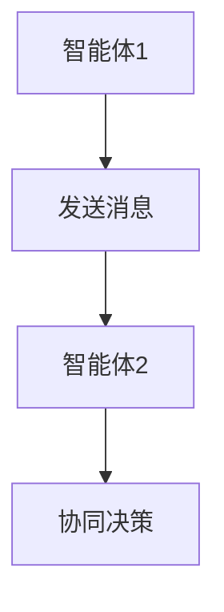
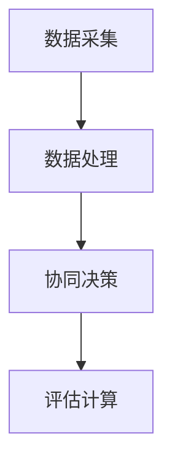
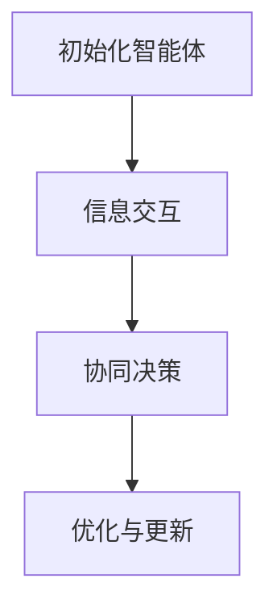
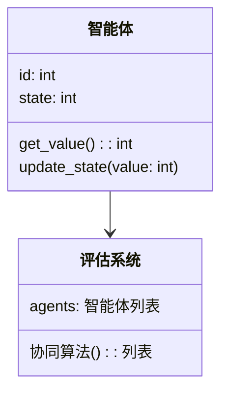
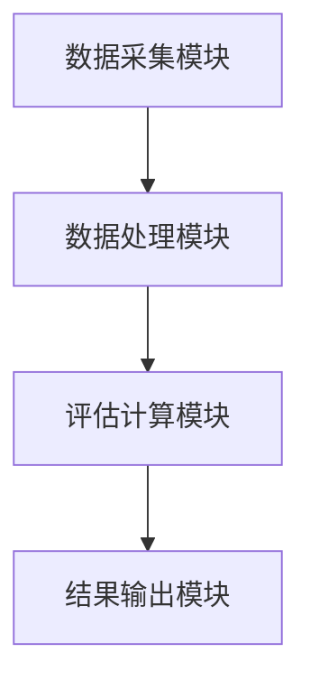
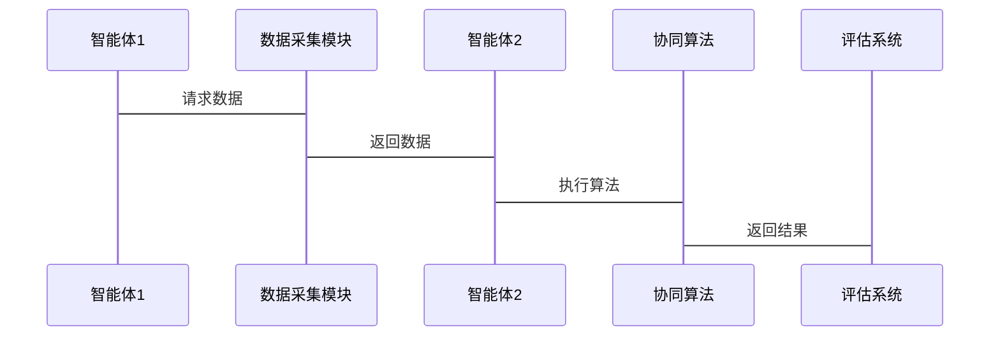

                 


# 利用多智能体系统评估公司的无形资产价值

## 关键词：多智能体系统，无形资产，资产评估，协同算法，系统架构

## 摘要：本文详细探讨了利用多智能体系统评估公司无形资产价值的方法，分析了多智能体系统的原理与架构，提出了协同算法及其数学模型，并通过实际案例展示了系统的实现与应用。文章最后总结了多智能体系统在无形资产评估中的优势及未来发展方向。

---

# 第1章: 多智能体系统与无形资产评估概述

## 1.1 问题背景与描述
### 1.1.1 无形资产的传统评估方法及其局限性
传统的无形资产评估方法主要包括收益法、市场法和成本法。然而，这些方法在应对复杂、动态的商业环境时存在以下局限性：
- **复杂性**：无形资产（如品牌价值、专利技术等）的价值往往难以量化。
- **动态性**：市场环境和企业内部因素的变化会影响无形资产的价值，传统的静态评估方法难以捕捉这些变化。
- **主观性**：评估过程中可能存在较大的主观判断，导致结果不够准确。

### 1.1.2 多智能体系统在无形资产评估中的应用前景
多智能体系统（Multi-Agent System, MAS）通过多个智能体的协同工作，能够更好地应对复杂系统的评估问题。其优势包括：
- **分布式计算**：多个智能体可以同时处理不同类型的信息，提高评估效率。
- **协作能力**：智能体之间的协同能够捕捉复杂的交互关系，提供更准确的评估结果。
- **适应性**：系统能够根据环境变化动态调整评估策略。

### 1.1.3 问题解决思路与目标
本文的目标是通过构建一个多智能体系统，实现对无形资产的动态、准确评估。具体思路包括：
1. 设计智能体的通信与协作机制。
2. 构建评估模型，量化各个智能体的贡献。
3. 通过协同算法优化评估结果。

---

## 1.2 多智能体系统的核心概念与特点
### 1.2.1 多智能体系统的定义与基本特征
多智能体系统是指由多个智能体组成的分布式系统，这些智能体能够通过通信和协作完成复杂任务。其基本特征包括：
- **自主性**：每个智能体能够独立决策。
- **反应性**：智能体能够根据环境变化调整行为。
- **协作性**：智能体之间能够通过通信实现协同。

### 1.2.2 多智能体系统与传统评估方法的对比
| 对比维度 | 多智能体系统 | 传统评估方法 |
|----------|--------------|----------------|
| 评估效率 | 高            | 中              |
| 适应性   | 强            | 弱              |
| 精准度   | 高            | 一般            |

### 1.2.3 无形资产评估的核心要素与边界
无形资产评估的核心要素包括：
1. **资产特性**：如专利的技术复杂度、品牌知名度等。
2. **市场环境**：如行业竞争状况、市场需求等。
3. **企业内部因素**：如研发能力、管理效率等。

---

## 1.3 本章小结
本章介绍了无形资产评估的传统方法及其局限性，探讨了多智能体系统在无形资产评估中的应用前景，并总结了多智能体系统的核心概念与特点。

---

# 第2章: 多智能体系统的原理与架构

## 2.1 多智能体系统的基本原理
### 2.1.1 多智能体系统的协同机制
协同机制是多智能体系统的核心，主要包括以下步骤：
1. **任务分配**：智能体根据自身能力和环境信息接受任务。
2. **信息共享**：智能体之间通过通信共享相关信息。
3. **协同决策**：基于共享信息，智能体共同制定最优策略。
4. **动态调整**：根据环境变化，实时调整协同策略。

### 2.1.2 智能体之间的通信与协作
智能体之间的通信可以通过多种方式实现，如消息传递、数据共享等。协作过程可以表示为以下流程：


### 2.1.3 多智能体系统的动态性与适应性
多智能体系统的适应性主要体现在以下两个方面：
- **自适应性**：智能体能够根据环境变化调整自身行为。
- **协同适应性**：系统整体能够根据环境变化优化协同策略。

---

## 2.2 无形资产评估模型的构建
### 2.2.1 评估模型的基本框架
评估模型的基本框架包括以下几个模块：
1. **数据采集**：收集与无形资产相关的数据。
2. **数据处理**：对数据进行清洗和预处理。
3. **评估计算**：基于协同算法计算资产价值。
4. **结果输出**：输出评估结果并提供优化建议。

### 2.2.2 智能体之间的信息交互与决策
信息交互与决策过程可以表示为以下流程：


### 2.2.3 模型的可扩展性与灵活性
多智能体系统的评估模型具有以下特点：
- **可扩展性**：可以根据需要增加或减少智能体数量。
- **灵活性**：可以根据具体需求调整模型结构。

---

## 2.3 本章小结
本章详细讲解了多智能体系统的原理与架构，并提出了无形资产评估模型的构建方法。

---

# 第3章: 多智能体协同算法

## 3.1 协同算法的基本原理
### 3.1.1 协同算法的数学模型
协同算法的数学模型可以表示为：
$$ V = \sum_{i=1}^{n} v_i $$
其中，$v_i$ 表示第 $i$ 个智能体的贡献值。

### 3.1.2 协同算法的实现步骤
协同算法的实现步骤如下：
1. **初始化**：设置智能体的初始状态。
2. **信息共享**：智能体之间共享相关信息。
3. **协同决策**：基于共享信息制定协同策略。
4. **优化与更新**：根据协同结果优化算法参数。

### 3.1.3 协同算法的流程图


---

## 3.2 协同算法的实现代码
以下是协同算法的Python实现代码：
```python
class Agent:
    def __init__(self, id):
        self.id = id
        self.state = 0

    def get_value(self):
        return self.state

    def update_state(self, value):
        self.state = value

def协同算法(agents):
    for agent in agents:
        agent.update_state(agent.get_value() + 1)
    return [agent.get_value() for agent in agents]

# 示例
agent1 = Agent(1)
agent2 = Agent(2)
agents = [agent1, agent2]
print(协同算法(agents))
```

---

## 3.3 本章小结
本章详细讲解了协同算法的基本原理，并通过代码示例展示了算法的实现过程。

---

# 第4章: 问题场景与系统功能设计

## 4.1 问题场景描述
### 4.1.1 无形资产的多样性与动态性
无形资产的多样性体现在其类型多样（如品牌、专利、技术等），动态性体现在其价值会受到市场环境和企业内部因素的影响。

### 4.1.2 评估过程中的不确定性
评估过程中的不确定性主要来源于：
- 市场环境的不确定性
- 企业内部因素的不确定性
- 数据的不完整性

### 4.1.3 系统需求分析
系统需求包括：
1. **数据采集**：能够采集与无形资产相关的多源数据。
2. **数据处理**：能够对数据进行清洗和预处理。
3. **评估计算**：能够基于协同算法计算资产价值。
4. **结果输出**：能够输出评估结果并提供优化建议。

---

## 4.2 系统功能设计
### 4.2.1 领域模型设计（Mermaid 类图）


### 4.2.2 系统架构设计（Mermaid 架构图）


### 4.2.3 系统交互设计（Mermaid 序列图）


---

## 4.3 本章小结
本章通过问题场景分析和系统功能设计，展示了多智能体系统在无形资产评估中的应用。

---

# 第5章: 项目实战

## 5.1 环境安装
为了运行本文的代码，读者需要安装以下环境：
- Python 3.8+
- Mermaid 插件（用于生成图表）

## 5.2 核心代码实现
以下是协同算法的Python实现代码：
```python
class Agent:
    def __init__(self, id):
        self.id = id
        self.state = 0

    def get_value(self):
        return self.state

    def update_state(self, value):
        self.state = value

def协同算法(agents):
    for agent in agents:
        agent.update_state(agent.get_value() + 1)
    return [agent.get_value() for agent in agents]

# 示例
agent1 = Agent(1)
agent2 = Agent(2)
agents = [agent1, agent2]
print(协同算法(agents))
```

## 5.3 实际案例分析
以某公司品牌价值评估为例，假设我们有两个智能体，分别负责市场环境和企业内部因素的评估。通过协同算法，我们可以得到更准确的品牌价值评估结果。

---

## 5.4 本章小结
本章通过实际案例展示了多智能体系统在无形资产评估中的应用，并提供了代码实现。

---

# 第6章: 最佳实践与总结

## 6.1 小结
本文详细探讨了利用多智能体系统评估公司无形资产价值的方法，分析了多智能体系统的原理与架构，并提出了协同算法及其数学模型。

## 6.2 注意事项
在实际应用中，需要注意以下几点：
1. **数据质量**：确保数据的准确性和完整性。
2. **算法优化**：根据实际需求优化协同算法。
3. **系统维护**：定期更新系统以适应环境变化。

## 6.3 拓展阅读
1. 多智能体系统的相关研究
2. 协同算法的优化方法
3. 无形资产评估的其他应用领域

---

# 作者：AI天才研究院 & 禅与计算机程序设计艺术

---

以上是《利用多智能体系统评估公司的无形资产价值》的技术博客文章的目录大纲和部分内容，希望对您有所帮助！

