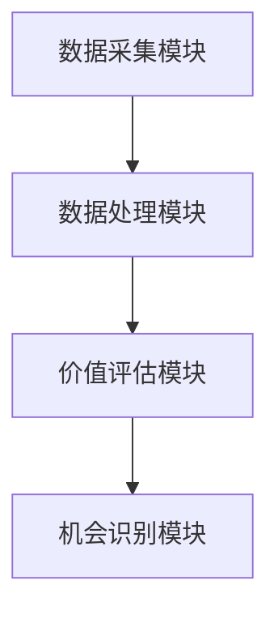
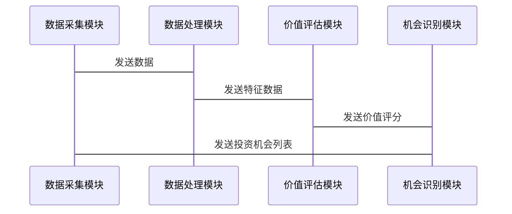

                 


# 利用多智能体系统进行全球市场价值机会扫描

---

## 关键词：
多智能体系统, 全球市场扫描, 价值机会识别, 分布式计算, 机器学习, 市场分析

---

## 摘要：
本文深入探讨了利用多智能体系统进行全球市场价值机会扫描的方法与技术。通过分析多智能体系统的定义、特点及其在市场扫描中的应用前景，结合算法原理和系统架构设计，详细阐述了如何利用多智能体系统实现高效、精准的市场价值机会识别。文章还通过实际案例分析和代码实现，展示了多智能体系统在全球市场扫描中的实际应用价值，并提出了相应的最佳实践建议。

---

# 第一部分: 多智能体系统与全球市场价值机会扫描概述

## 第1章: 多智能体系统与全球市场扫描的背景介绍

### 1.1 多智能体系统的定义与特点

#### 1.1.1 多智能体系统的定义
多智能体系统（Multi-Agent System, MAS）是由多个智能体（Agent）组成的分布式系统，这些智能体能够通过协作完成复杂的任务。智能体是指具有感知环境、自主决策和行动能力的实体，可以是软件程序、机器人或其他智能设备。

#### 1.1.2 多智能体系统的核心特点
- **自主性**：智能体能够自主决策，无需外部干预。
- **反应性**：智能体能够实时感知环境并做出反应。
- **协作性**：多个智能体通过通信和协作完成共同目标。
- **分布性**：智能体分布在不同的位置，通过网络进行通信和协作。

#### 1.1.3 多智能体系统与传统单智能体系统的区别
传统的单智能体系统通常依赖中心化的决策机制，而多智能体系统通过分布式协作实现目标。多智能体系统具有更高的灵活性和容错性，但实现起来也更具挑战性。

### 1.2 全球市场价值机会扫描的定义与特点

#### 1.2.1 全球市场价值机会扫描的定义
全球市场价值机会扫描是指通过分析全球市场的数据，识别具有潜在价值的投资机会。这些机会可能涉及股票、债券、商品等多种金融资产。

#### 1.2.2 全球市场价值机会扫描的核心要素
- **数据采集**：获取全球市场的实时数据，包括价格、成交量、市场情绪等。
- **数据分析**：通过算法对数据进行处理，识别潜在的价值机会。
- **机会识别**：基于分析结果，确定具有投资价值的资产或市场。

#### 1.2.3 全球市场价值机会扫描的挑战与机遇
- **挑战**：全球市场数据量庞大，且具有高度的不确定性和波动性。
- **机遇**：利用多智能体系统可以实现高效的数据处理和协作，提高机会识别的准确性和效率。

### 1.3 多智能体系统在市场扫描中的应用前景

#### 1.3.1 多智能体系统在市场扫描中的优势
- **分布式计算**：多智能体系统能够并行处理大量数据，提高计算效率。
- **协作能力**：智能体之间可以协同工作，实现更复杂的分析任务。
- **灵活性**：多智能体系统可以根据市场变化动态调整策略。

#### 1.3.2 多智能体系统在市场扫描中的潜在应用场景
- **实时数据分析**：通过多智能体系统实时监控市场数据，快速识别机会。
- **风险管理**：利用多智能体系统进行风险评估和预警。
- **投资决策支持**：基于多智能体系统的分析结果，为投资决策提供支持。

#### 1.3.3 多智能体系统在市场扫描中的未来发展趋势
随着人工智能和大数据技术的不断发展，多智能体系统在市场扫描中的应用将更加广泛和深入。未来，可能会出现更加智能化和自动化的多智能体系统，进一步提升市场分析的精度和效率。

### 1.4 本章小结
本章介绍了多智能体系统的定义、特点及其在市场扫描中的应用前景。通过分析多智能体系统的优势和潜在应用场景，为后续章节的深入探讨奠定了基础。

---

## 第2章: 多智能体系统与全球市场扫描的核心概念

### 2.1 多智能体系统的组成与结构

#### 2.1.1 多智能体系统的组成要素
- **智能体**：具有感知、决策和行动能力的实体。
- **通信机制**：智能体之间进行信息交换的渠道。
- **任务分配**：智能体根据任务分工协同工作。

#### 2.1.2 多智能体系统的层次结构
- **物理层**：智能体的物理实现，如计算机、传感器等。
- **逻辑层**：智能体的逻辑结构，包括感知、决策和行动模块。
- **应用层**：多智能体系统的具体应用，如市场扫描。

#### 2.1.3 多智能体系统的通信机制
- **消息传递**：智能体之间通过消息传递信息。
- **协议**：通信过程中遵循的规则和标准。

### 2.2 全球市场价值机会扫描的实现机制

#### 2.2.1 数据采集与处理
- **数据来源**：股票交易所、新闻媒体、社交媒体等。
- **数据清洗**：去除噪声数据，确保数据质量。
- **特征提取**：从数据中提取有助于价值评估的特征。

#### 2.2.2 数据分析与价值评估
- **统计分析**：使用统计方法对数据进行分析。
- **机器学习**：利用机器学习算法进行预测和分类。
- **价值评分**：基于分析结果对资产进行价值评分。

#### 2.2.3 机会识别与决策
- **机会筛选**：根据价值评分筛选出具有投资价值的资产。
- **风险评估**：评估潜在投资机会的风险。
- **决策制定**：基于分析结果制定投资决策。

### 2.3 多智能体系统与全球市场扫描的协同关系

#### 2.3.1 多智能体系统在市场扫描中的角色分配
- **数据采集智能体**：负责采集市场数据。
- **分析智能体**：负责对数据进行分析和处理。
- **决策智能体**：负责制定投资策略。

#### 2.3.2 多智能体系统与市场扫描目标的协同
- **目标一致性**：所有智能体都致力于实现市场扫描的目标。
- **任务分配**：根据智能体的能力分配任务。
- **结果整合**：将各个智能体的分析结果整合起来，形成最终的市场扫描报告。

#### 2.3.3 多智能体系统与市场扫描过程的互动
- **实时反馈**：智能体之间实时交换信息，确保分析结果的准确性。
- **动态调整**：根据市场变化动态调整任务分配和策略。

### 2.4 本章小结
本章详细介绍了多智能体系统的组成与结构，以及其在全球市场价值机会扫描中的实现机制。通过分析多智能体系统与市场扫描目标的协同关系，为后续章节的算法原理和系统设计提供了理论基础。

---

## 第3章: 多智能体系统与全球市场扫描的算法原理

### 3.1 多智能体系统的算法基础

#### 3.1.1 分布式计算与多智能体协作
- **分布式计算**：任务分解成多个部分，由不同的智能体分别处理。
- **多智能体协作**：智能体之间通过协作完成复杂的任务。

#### 3.1.2 多智能体系统的通信协议
- **消息格式**：定义消息的结构和内容。
- **通信频率**：智能体之间通信的频率和时机。

#### 3.1.3 多智能体系统的任务分配算法
- **负载均衡**：根据智能体的负载情况动态分配任务。
- **任务优先级**：根据任务的重要性和紧急性进行优先级排序。

### 3.2 全球市场价值机会扫描的算法实现

#### 3.2.1 数据预处理与特征提取
- **数据清洗**：去除无效数据，填充缺失值。
- **特征选择**：选择对价值评估最有影响力的特征。

#### 3.2.2 价值评估模型的构建
- **机器学习模型**：如支持向量机（SVM）、随机森林（Random Forest）等。
- **模型训练**：利用历史数据训练模型，得到价值评估的函数。

#### 3.2.3 机会识别算法的设计
- **阈值设定**：根据历史数据确定价值评分的阈值。
- **规则引擎**：根据预设的规则筛选出符合投资条件的资产。

### 3.3 算法原理的数学模型与公式

#### 3.3.1 分布式计算的数学模型
$$ \text{任务分配} = \arg \min_{i} \sum_{j=1}^{n} c_{ij} $$
其中，$c_{ij}$ 表示智能体 $i$ 处理任务 $j$ 的成本。

#### 3.3.2 价值评估模型的数学公式
$$ \text{价值评分} = \sum_{k=1}^{m} w_{k} \cdot f_{k}(x) $$
其中，$w_{k}$ 是特征 $k$ 的权重，$f_{k}(x)$ 是特征 $k$ 的函数。

### 3.4 本章小结
本章详细介绍了多智能体系统的算法基础，以及其在全球市场价值机会扫描中的实现原理。通过数学模型和公式，进一步明确了算法的设计和优化方向。

---

## 第4章: 多智能体系统与全球市场扫描的系统架构设计

### 4.1 系统功能模块设计

#### 4.1.1 数据采集模块
- **功能**：实时采集全球市场的数据，包括价格、成交量、市场情绪等。
- **输入**：金融市场数据接口。
- **输出**：清洗后的数据。

#### 4.1.2 数据处理模块
- **功能**：对采集到的数据进行预处理和特征提取。
- **输入**：清洗后的数据。
- **输出**：可供分析模块使用的特征数据。

#### 4.1.3 价值评估模块
- **功能**：利用机器学习模型对数据进行分析，生成价值评分。
- **输入**：特征数据。
- **输出**：价值评分。

#### 4.1.4 机会识别模块
- **功能**：根据价值评分筛选出具有投资价值的资产。
- **输入**：价值评分。
- **输出**：投资机会列表。

### 4.2 系统架构设计

#### 4.2.1 系统功能模块的交互关系
- **数据流**：数据从采集模块流向处理模块，再流向价值评估模块，最后流向机会识别模块。
- **控制流**：各模块之间通过消息传递进行通信和协作。

#### 4.2.2 系统架构的Mermaid图


### 4.3 系统接口设计

#### 4.3.1 接口定义
- **数据接口**：定义数据的格式和传输方式。
- **通信接口**：定义智能体之间通信的协议和接口。

#### 4.3.2 接口实现
- **数据接口实现**：使用JSON格式进行数据传输。
- **通信接口实现**：使用WebSocket进行实时通信。

### 4.4 系统交互设计

#### 4.4.1 系统交互的Mermaid序列图


### 4.5 本章小结
本章详细介绍了系统的功能模块设计、架构设计和接口设计。通过Mermaid图和序列图，进一步明确了系统各部分的交互关系和协作流程。

---

## 第5章: 多智能体系统与全球市场扫描的项目实战

### 5.1 项目环境安装

#### 5.1.1 系统需求
- **操作系统**：Linux/Windows/MacOS
- **编程语言**：Python 3.8+
- **依赖库**：numpy, pandas, scikit-learn, websockets

#### 5.1.2 安装步骤
1. 安装Python
2. 安装依赖库：
   ```bash
   pip install numpy pandas scikit-learn websockets
   ```

### 5.2 系统核心实现源代码

#### 5.2.1 数据采集模块代码
```python
import websockets
import asyncio

async def data_collector():
    async with websockets.connect('ws://market_data_server:8080') as websocket:
        while True:
            data = await websocket.recv()
            print(f"收到数据: {data}")
            # 处理数据并发送到数据处理模块
            await websocket.send("ACK")
```

#### 5.2.2 数据处理模块代码
```python
import pandas as pd

def preprocess_data(raw_data):
    # 数据清洗和特征提取
    df = pd.DataFrame(raw_data)
    # 假设特征提取的代码
    features = df[['price', 'volume', 'sentiment']]
    return features
```

#### 5.2.3 价值评估模块代码
```python
from sklearn.svm import SVC

def value_assessor(features):
    # 训练机器学习模型
    model = SVC()
    model.fit(features, labels)
    # 预测价值评分
    predictions = model.predict(new_features)
    return predictions
```

#### 5.2.4 机会识别模块代码
```python
def opportunity_identifier(value_scores):
    # 根据价值评分筛选机会
    opportunities = [asset for asset in assets if value_scores[asset] > threshold]
    return opportunities
```

### 5.3 代码应用解读与分析

#### 5.3.1 数据采集模块
- **功能**：实时采集市场数据。
- **实现**：使用WebSocket协议与数据服务器通信。

#### 5.3.2 数据处理模块
- **功能**：对数据进行清洗和特征提取。
- **实现**：使用Pandas库进行数据处理。

#### 5.3.3 价值评估模块
- **功能**：利用机器学习模型对数据进行分析。
- **实现**：使用Scikit-learn库训练和支持向量机（SVM）进行预测。

#### 5.3.4 机会识别模块
- **功能**：根据价值评分筛选出具有投资价值的资产。
- **实现**：基于预设的阈值进行筛选。

### 5.4 实际案例分析与详细讲解剖析

#### 5.4.1 案例背景
假设我们希望利用多智能体系统对全球股票市场进行价值机会扫描，寻找具有投资价值的股票。

#### 5.4.2 数据采集与处理
- 数据采集模块从股票交易所和新闻媒体获取实时数据。
- 数据处理模块对数据进行清洗和特征提取，生成可供分析的特征数据。

#### 5.4.3 价值评估与机会识别
- 价值评估模块利用机器学习模型对特征数据进行分析，生成价值评分。
- 机会识别模块根据价值评分筛选出具有投资价值的股票。

### 5.5 项目小结
本章通过实际案例分析和代码实现，展示了多智能体系统在全球市场价值机会扫描中的实际应用。通过具体的代码实现和案例分析，帮助读者更好地理解和应用所介绍的技术。

---

## 第6章: 多智能体系统与全球市场扫描的最佳实践

### 6.1 最佳实践 tips

#### 6.1.1 系统设计
- **模块化设计**：确保系统模块化，便于维护和扩展。
- **容错设计**：设计容错机制，确保系统健壮性。

#### 6.1.2 数据处理
- **数据清洗**：确保数据质量，去除噪声数据。
- **特征选择**：选择对价值评估最有影响力的特征。

#### 6.1.3 模型优化
- **模型调参**：通过交叉验证优化模型参数。
- **模型评估**：利用验证集评估模型性能。

#### 6.1.4 系统部署
- **环境配置**：确保环境配置正确，避免运行时错误。
- **日志记录**：记录系统运行日志，便于调试和优化。

### 6.2 小结
通过本文的介绍，读者可以了解到多智能体系统在全球市场价值机会扫描中的应用价值和实现方法。希望本文能够为相关领域的研究和实践提供有价值的参考。

### 6.3 注意事项
- **数据隐私**：注意数据隐私问题，确保符合相关法律法规。
- **系统安全**：加强系统安全防护，防止数据泄露和攻击。

### 6.4 拓展阅读
- **推荐书籍**：《Multi-Agent Systems: Algorithmic Foundations》
- **推荐论文**：《A Survey on Multi-Agent Systems for Financial Market Analysis》

---

## 作者：AI天才研究院/AI Genius Institute & 禅与计算机程序设计艺术/Zen And The Art of Computer Programming

---

通过以上内容，本文详细介绍了利用多智能体系统进行全球市场价值机会扫描的方法与技术。从背景介绍、核心概念、算法原理、系统架构到项目实战和最佳实践，为读者提供了一个全面而深入的视角。希望本文能够为相关领域的研究和实践提供有价值的参考和指导。

