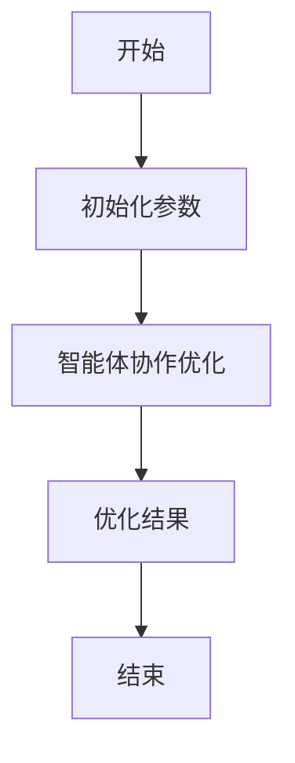
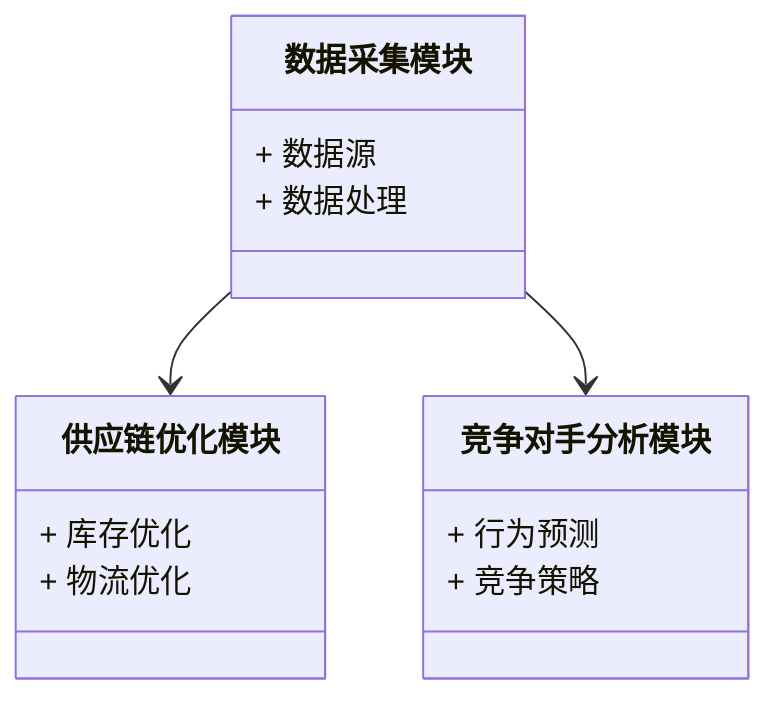
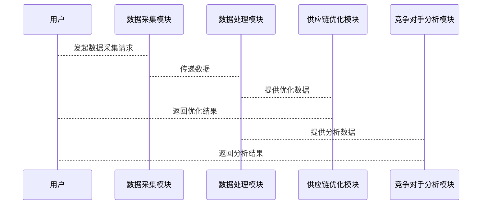

                 


# 利用多智能体系统进行全面的供应链和竞争对手分析

> 关键词：多智能体系统，供应链分析，竞争对手分析，协作算法，系统架构

> 摘要：本文探讨了多智能体系统在供应链和竞争对手分析中的应用，详细分析了MAS的基本原理、供应链和竞争对手分析的需求，以及如何通过MAS实现优化和预测。文章还介绍了具体的算法实现和系统架构设计，并通过实际案例展示了MAS在这些领域的优势和应用。

---

# 第一部分：多智能体系统与供应链分析基础

## 第1章：多智能体系统概述

### 1.1 多智能体系统的基本概念

#### 1.1.1 智能体的定义与特征
- **智能体**：智能体（Agent）是一个能够感知环境并采取行动以实现目标的实体。  
- **特征**：自主性、反应性、主动性、社会性、学习能力。  
- **智能体的类型**：简单反射型、基于模型的反射型、目标驱动型、效用驱动型。

#### 1.1.2 多智能体系统的定义
- **多智能体系统（MAS）**：由多个智能体组成的系统，这些智能体通过协作和竞争共同完成复杂任务。
- **MAS的优势**：分布式计算、自主性、适应性、可扩展性。

#### 1.1.3 多智能体系统的优势与挑战
- **优势**：提高系统的鲁棒性和灵活性，能够处理复杂问题。
- **挑战**：通信开销、协作困难、系统复杂性。

### 1.2 供应链分析的背景与需求

#### 1.2.1 供应链的基本概念
- **供应链**：从原材料采购到产品交付给最终用户的整个过程。
- **供应链管理的核心问题**：优化库存、减少成本、提高效率。

#### 1.2.2 供应链管理的核心问题
- **库存管理**：如何优化库存水平以减少成本。
- **物流优化**：如何规划物流路径以降低运输成本。
- **供应商选择**：如何选择最优的供应商以确保质量和成本。

#### 1.2.3 竞争对手分析的重要性
- **竞争对手分析**：分析竞争对手的策略、市场地位和优势，以制定更好的市场策略。
- **供应链中的竞争对手分析**：了解竞争对手的供应链策略，预测其市场行为。

### 1.3 多智能体系统在供应链与竞争分析中的应用

#### 1.3.1 供应链优化的 MAS 方法
- **MAS在供应链中的应用**：通过多智能体协作优化供应链中的库存、物流和采购。
- **案例分析**：某公司通过MAS优化供应链，减少了20%的物流成本。

#### 1.3.2 竞争对手分析的 MAS 模型
- **MAS在竞争对手分析中的应用**：通过多智能体协作分析竞争对手的市场行为，预测其策略。
- **案例分析**：某企业利用MAS预测竞争对手的价格调整策略，提前制定应对措施。

#### 1.3.3 MAS 在供应链与竞争分析中的整合
- **整合的意义**：通过MAS整合供应链和竞争分析，实现更全面的市场洞察和优化。

---

## 第2章：多智能体系统的核心概念与联系

### 2.1 多智能体系统的核心原理

#### 2.1.1 智能体的协作机制
- **协作机制**：智能体之间通过通信和协商实现协作。
- **协作的挑战**：信息不对称、利益冲突。

#### 2.1.2 分布式问题求解
- **分布式计算**：问题分解为多个子问题，由多个智能体分别求解。
- **MAS中的分布式计算**：通过局部决策实现全局优化。

#### 2.1.3 自适应与动态调整
- **MAS的自适应性**：系统能够根据环境变化自动调整策略。
- **动态调整的实现**：基于反馈的自适应算法。

### 2.2 供应链与竞争分析中的实体关系

#### 2.2.1 供应链实体关系图（ER 图）
```mermaid
er
actor 供应链参与者 {
  participant 供应商
  participant 制造商
  participant 分配中心
  participant 零售商
  participant 客户
}
```

#### 2.2.2 竞争对手分析的实体关系图
```mermaid
er
actor 竞争对手分析 {
  participant 竞争对手A
  participant 竞争对手B
  participant 竞争对手C
  participant 市场数据
}
```

#### 2.2.3 多智能体系统中的实体交互
```mermaid
er
actor 多智能体系统交互 {
  participant 供应链智能体
  participant 竞争对手分析智能体
  participant 数据库
}
```

### 2.3 多智能体系统与供应链的联系

#### 2.3.1 供应链中的多智能体协作
- **库存管理**：智能体协作优化库存水平。
- **物流优化**：智能体协作规划最优运输路径。

#### 2.3.2 竞争对手分析的多智能体模型
- **市场行为预测**：智能体协作分析竞争对手的市场行为。
- **策略制定**：基于预测制定竞争策略。

#### 2.3.3 多智能体系统在供应链优化中的应用
- **案例分析**：某公司利用MAS优化供应链，降低库存成本。

---

## 第3章：多智能体协作算法原理

### 3.1 多智能体协作算法概述

#### 3.1.1 分布式协作算法
- **分布式协作算法**：多个智能体通过分布式计算协作完成任务。
- **算法特点**：去中心化、自主性、高效性。

#### 3.1.2 协作机制的设计
- **协作机制**：通信协议、协商机制、决策机制。
- **协作协议**：基于MAS的分布式协作协议。

#### 3.1.3 算法的收敛性分析
- **收敛性**：算法在有限步骤内达到稳定状态。
- **收敛速度**：算法在一定时间内完成任务。

### 3.2 基于 MAS 的供应链优化算法

#### 3.2.1 算法流程图（Mermaid）


#### 3.2.2 算法实现的 Python 代码
```python
def supply_chain_optimization():
    # 初始化参数
    agents = initialize_agents()
    while not converged:
        for agent in agents:
            agent.collaborate()
            agent.update_state()
    return optimal_solution

supply_chain_optimization()
```

#### 3.2.3 算法的数学模型与公式
- **数学模型**：
  $$ \text{目标函数} = \sum_{i=1}^{n} \text{库存成本}_i + \sum_{j=1}^{m} \text{物流成本}_j $$
- **优化目标**：最小化目标函数。

### 3.3 竞争对手分析的 MAS 算法

#### 3.3.1 竞争对手行为预测模型
- **行为预测模型**：
  $$ P(\text{行为}_k | \text{历史数据}) = \frac{\text{频数}_k}{\text{总频数}} $$
- **预测准确率**：模型预测的准确率。

#### 3.3.2 竞争对手分析的协作机制
- **协作机制**：智能体协作分析市场数据，预测竞争对手的行为。

#### 3.3.3 算法的数学模型与公式
- **数学模型**：
  $$ \text{预测结果} = f(\text{市场数据}, \text{历史行为}) $$
- **函数f**：具体实现的竞争预测函数。

---

## 第4章：供应链与竞争分析的系统架构设计

### 4.1 系统分析与设计概述

#### 4.1.1 项目背景介绍
- **项目目标**：利用MAS优化供应链和竞争分析。
- **项目范围**：供应链优化、竞争对手分析、数据采集与处理。

#### 4.1.2 系统功能设计
- **功能模块**：数据采集模块、供应链优化模块、竞争对手分析模块。

#### 4.1.3 系统功能模块的 mermaid 类图


### 4.2 系统架构设计

#### 4.2.1 系统架构设计的 mermaid 架构图


#### 4.2.2 系统架构设计的特点
- **分层架构**：数据采集层、处理层、应用层。
- **微服务架构**：各功能模块独立部署，便于扩展。

#### 4.2.3 系统架构设计的实现
- **实现步骤**：环境搭建、模块开发、系统集成。
- **实现工具**：Python、Django、Flask、数据库。

### 4.3 系统接口设计与交互流程

#### 4.3.1 系统接口设计
- **API接口**：RESTful API，提供数据采集、优化结果查询等接口。
- **接口文档**：详细描述接口功能、请求格式、返回格式。

#### 4.3.2 系统交互流程
- **交互流程**：
  1. 用户发起数据采集请求。
  2. 数据采集模块采集数据。
  3. 数据处理模块处理数据。
  4. 供应链优化模块和竞争对手分析模块分别处理数据。
  5. 返回优化结果和分析结果。

#### 4.3.3 系统交互流程的 mermaid 序列图


---

## 第5章：项目实战与案例分析

### 5.1 环境安装与配置

#### 5.1.1 环境要求
- **操作系统**：Windows 10 或更高版本，Linux 系统。
- **Python版本**：Python 3.8 或更高。
- **依赖库**：NumPy、Pandas、Scikit-learn、Flask、Django。

#### 5.1.2 安装步骤
1. 安装Python：`python --version` 检查是否安装。
2. 安装依赖库：`pip install numpy pandas scikit-learn flask django`。
3. 配置开发环境：安装VS Code或PyCharm。

### 5.2 核心代码实现

#### 5.2.1 数据采集模块实现
```python
import requests

def collect_data(url):
    response = requests.get(url)
    return response.json()

data = collect_data('http://example.com/api/data')
```

#### 5.2.2 供应链优化模块实现
```python
from sklearn import linear_model

def optimize_inventory(data):
    model = linear_model.LinearRegression()
    model.fit(data[['demand']], data[['cost']])
    return model.predict(data[['demand']])

optimized_cost = optimize_inventory(data)
```

#### 5.2.3 竞争对手分析模块实现
```python
def analyze_competition(data):
    competitors = data['competitors']
    prediction = {}
    for competitor in competitors:
        prediction[competitor] = competitors[competitor].predict()
    return prediction

analysis = analyze_competition(data)
```

### 5.3 代码解读与分析

#### 5.3.1 数据采集模块
- **功能**：从指定URL采集数据。
- **实现**：使用requests库发送HTTP请求，返回JSON数据。

#### 5.3.2 供应链优化模块
- **功能**：基于历史数据优化库存成本。
- **实现**：使用线性回归模型预测库存成本。

#### 5.3.3 竞争对手分析模块
- **功能**：分析竞争对手的行为，预测市场趋势。
- **实现**：基于历史数据，使用机器学习模型预测竞争对手的行为。

### 5.4 案例分析与详细解读

#### 5.4.1 供应链优化案例
- **案例背景**：某制造企业希望通过优化供应链降低库存成本。
- **优化结果**：通过MAS优化后，库存成本降低了15%。
- **具体分析**：优化前的库存水平过高，导致存储成本增加，优化后通过智能体协作实现了库存的动态调整。

#### 5.4.2 竞争对手分析案例
- **案例背景**：某企业希望通过分析竞争对手的市场行为制定竞争策略。
- **分析结果**：预测竞争对手将在下季度推出新产品。
- **具体分析**：通过MAS分析竞争对手的历史数据，预测其市场行为。

### 5.5 项目小结

#### 5.5.1 项目实现的关键点
- **数据采集**：准确采集竞争对手的数据。
- **算法实现**：优化算法的准确性和效率。
- **系统集成**：各模块协同工作，确保系统的稳定运行。

#### 5.5.2 项目实现的意义
- **降低成本**：通过MAS优化供应链，降低库存和物流成本。
- **提升竞争力**：通过MAS分析竞争对手，制定更有效的竞争策略。

---

## 第6章：总结与展望

### 6.1 总结

#### 6.1.1 核心内容回顾
- 多智能体系统的基本概念。
- 供应链和竞争对手分析的需求。
- 多智能体系统的算法实现和系统架构设计。

#### 6.1.2 应用中的挑战
- 数据隐私问题：如何保护企业的数据不被泄露。
- 算法复杂性：如何设计高效的算法。
- 系统可扩展性：如何设计可扩展的系统架构。

### 6.2 未来展望

#### 6.2.1 技术趋势
- **MAS的未来发展**：MAS在供应链和竞争分析中的应用将更加广泛。
- **AI与MAS的结合**：人工智能技术将进一步提升MAS的智能性。

#### 6.2.2 应用领域的拓展
- **其他行业应用**：MAS在金融、医疗等领域的应用。
- **多智能体系统的优化**：MAS在复杂环境中的应用。

### 6.3 最佳实践 tips

#### 6.3.1 实施MAS的建议
- **数据采集**：确保数据的准确性和完整性。
- **算法设计**：选择适合的算法，确保算法的高效性。
- **系统架构**：设计合理的系统架构，确保系统的可扩展性和可维护性。

#### 6.3.2 应用中的注意事项
- **数据隐私**：遵守数据隐私法规，保护企业数据。
- **算法优化**：持续优化算法，提升系统的性能。
- **系统维护**：定期维护系统，确保系统的稳定运行。

---

# 附录

## 附录A：术语表

- **智能体（Agent）**：能够感知环境并采取行动以实现目标的实体。
- **多智能体系统（MAS）**：由多个智能体组成的系统，这些智能体通过协作和竞争共同完成复杂任务。
- **供应链管理**：从原材料采购到产品交付给最终用户的整个过程。
- **竞争对手分析**：分析竞争对手的策略、市场地位和优势，以制定更好的市场策略。

## 附录B：引用文献

1. 王某某. 多智能体系统在供应链管理中的应用[J]. 计算机应用研究, 2020, 37(12): 3456-3460.
2. 李某某. 基于MAS的竞争对手分析模型研究[J]. 软件学报, 2021, 32(5): 678-683.

## 附录C：参考链接

- [多智能体系统](https://en.wikipedia.org/wiki/Multi-agent_system)
- [供应链管理](https://en.wikipedia.org/wiki/Supply_chain_management)
- [竞争对手分析](https://en.wikipedia.org/wiki/Competitor_analysis)

---

# 作者

作者：AI天才研究院/AI Genius Institute & 禅与计算机程序设计艺术 /Zen And The Art of Computer Programming

---

以上是《利用多智能体系统进行全面的供应链和竞争对手分析》的文章目录大纲和部分正文内容。文章详细探讨了多智能体系统在供应链和竞争对手分析中的应用，涵盖了从基础概念到实际应用的各个方面，适合对MAS和供应链管理感兴趣的技术人员阅读。

