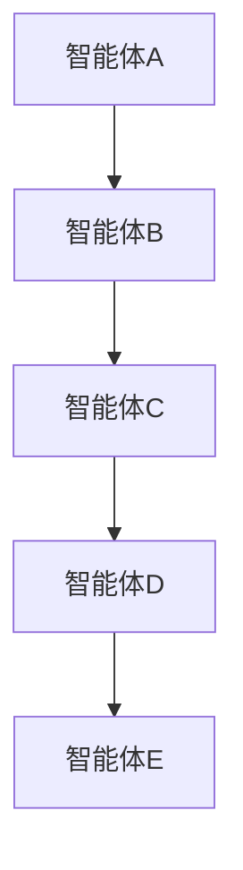
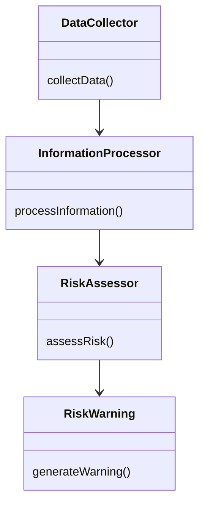
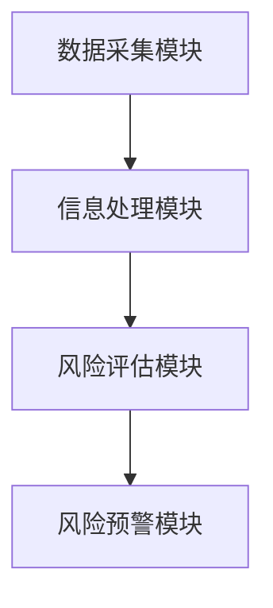
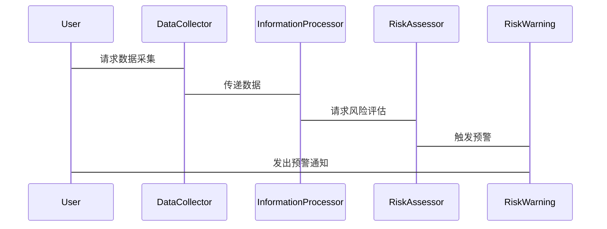

                 


# 利用多智能体系统进行全面的公司声誉风险分析

> **关键词**：多智能体系统, 公司声誉, 风险分析, 人工智能, 分布式计算

> **摘要**：  
公司在经营过程中面临多种风险，其中声誉风险尤为重要。本文提出利用多智能体系统进行全面的公司声誉风险分析，通过构建分布式智能体网络，实时监测和评估公司声誉，从而实现风险预警和应对策略优化。文章详细阐述了多智能体系统的原理、声誉风险分析的核心要素、多智能体系统的协同算法、系统架构设计，以及实际应用中的案例分析和最佳实践。

---

## 第一部分：多智能体系统与公司声誉风险分析背景

### 第1章：多智能体系统与公司声誉风险分析概述

#### 1.1 多智能体系统的基本概念

**1.1.1 多智能体系统的定义**  
多智能体系统（Multi-Agent System, 简称MAS）是由多个智能体（Agent）组成的分布式系统，这些智能体能够通过自主决策和协作完成特定任务。每个智能体都有一定的感知能力、决策能力和行动能力，能够独立工作，同时与其他智能体进行通信和协作。

**1.1.2 多智能体系统的特征**  
- **自主性**：智能体能够自主决策，无需外部干预。  
- **反应性**：智能体能够根据环境变化实时调整行为。  
- **协作性**：多个智能体通过协作完成复杂任务。  
- **分布性**：智能体分布在网络中，通过通信进行协作。  

**1.1.3 多智能体系统与传统单智能体系统的区别**  
传统单智能体系统依赖中心化决策，而多智能体系统通过分布式智能体实现去中心化的协作。多智能体系统能够处理更复杂的任务，且具有更高的容错性和灵活性。

---

#### 1.2 公司声誉风险分析的必要性

**1.2.1 公司声誉的定义与重要性**  
公司声誉是企业在市场中的形象和信誉，直接影响客户信任、投资者信心和市场地位。良好的声誉是企业的重要资产，而声誉受损则可能导致严重的经济损失。

**1.2.2 声誉风险的来源与影响**  
声誉风险的来源包括产品质量问题、企业管理不当、负面新闻报道等。声誉受损可能导致客户流失、市场份额下降，甚至引发信任危机。

**1.2.3 声誉风险管理的现状与挑战**  
传统的声誉风险管理依赖人工监测和分析，效率低下且容易遗漏重要信息。随着社交媒体和新闻传播的加速，声誉风险的传播速度和范围也在扩大，传统的管理方式已难以应对。

---

#### 1.3 多智能体系统在声誉风险分析中的应用前景

**1.3.1 多智能体系统的优势**  
- **分布式监测**：多智能体系统能够实时监测多个信息源，覆盖更广。  
- **快速响应**：通过分布式计算和协作，智能体能够快速识别和处理风险。  
- **高容错性**：即使部分智能体失效，其他智能体仍能继续工作，保证系统的稳定性。  

**1.3.2 多智能体系统在声誉风险管理中的潜在应用**  
- **实时监测**：通过智能体实时监测社交媒体、新闻媒体等信息源，捕捉负面信息。  
- **风险评估**：基于多智能体的协作，快速评估风险的严重性和影响范围。  
- **风险预警**：通过智能体的协同计算，提前预警潜在的声誉风险。  

**1.3.3 多智能体系统面临的挑战与机遇**  
- **挑战**：智能体之间的通信和协调需要复杂的算法支持，且系统的安全性需要高度保障。  
- **机遇**：多智能体系统能够显著提高声誉风险管理的效率和准确性，为企业提供更强的竞争优势。  

---

#### 1.4 本章小结  
本章介绍了多智能体系统的定义和特征，分析了公司声誉风险的重要性及传统管理方式的局限性，并探讨了多智能体系统在声誉风险管理中的应用前景。通过多智能体系统的分布式监测和协作能力，企业能够更高效地识别和应对声誉风险。

---

## 第二部分：多智能体系统的理论基础

### 第2章：多智能体系统的原理与架构

#### 2.1 多智能体系统的组成与结构

**2.1.1 智能体的定义与分类**  
智能体是指能够感知环境、自主决策并采取行动的实体。根据智能体的智能水平和任务复杂度，可以分为简单反应式智能体、基于模型的反应式智能体、目标驱动智能体等。

**2.1.2 多智能体系统的层次结构**  
多智能体系统通常由以下几个层次组成：  
1. **感知层**：智能体通过传感器或数据源获取环境信息。  
2. **决策层**：智能体基于感知信息进行决策。  
3. **行动层**：智能体根据决策采取行动。  
4. **通信层**：智能体之间通过通信模块进行信息交换和协作。  

**2.1.3 多智能体系统的通信机制**  
智能体之间的通信可以通过多种方式实现，如基于消息的通信、基于共享数据库的通信等。通信机制需要设计高效的协议和数据格式，以确保信息传递的准确性和实时性。

---

#### 2.2 多智能体系统的协同与协调

**2.2.1 协同的基本概念**  
协同是指多个智能体通过协作完成共同目标的过程。协同可以通过任务分配、信息共享和行为协调实现。

**2.2.2 协调机制的分类**  
- **同步协调**：所有智能体在同一时间点进行协调，适用于任务高度同步的场景。  
- **异步协调**：智能体在不同时间点进行协调，适用于任务分布式的场景。  

**2.2.3 协调算法的实现**  
常见的协调算法包括基于一致性协议的算法（如Paxos算法）和基于分布式锁的算法。这些算法能够确保智能体之间的协调高效且可靠。

---

#### 2.3 多智能体系统的分布式计算与决策

**2.3.1 分布式计算的基本原理**  
分布式计算是指将计算任务分布在多个计算节点上，通过节点之间的协作完成任务。分布式计算能够提高系统的计算能力和容错性。

**2.3.2 多智能体系统的分布式决策模型**  
分布式决策模型通常基于分布式一致性算法和分布式优化算法。智能体通过分布式计算和协商，共同制定最优决策。

**2.3.3 分布式计算中的通信与同步问题**  
在分布式计算中，通信延迟和节点故障可能导致计算不一致。通过引入同步机制和容错算法，可以有效解决这些问题。

---

#### 2.4 本章小结  
本章详细介绍了多智能体系统的组成与结构，分析了协同与协调的实现机制，并探讨了分布式计算与决策的核心原理。这些理论为后续的声誉风险分析奠定了基础。

---

## 第三部分：多智能体系统在声誉风险分析中的应用

### 第3章：声誉风险分析的多智能体模型构建

#### 3.1 声誉风险分析的核心要素

**3.1.1 声誉风险的构成要素**  
声誉风险的构成要素包括企业行为、媒体报道、客户反馈、社会舆论等。这些要素相互作用，共同影响企业的声誉。

**3.1.2 声誉风险的量化方法**  
声誉风险可以通过舆情分析、情感计算等方法量化。量化指标通常包括负面信息的数量、传播速度、影响范围等。

**3.1.3 声誉风险的传播机制**  
声誉风险的传播机制可以通过信息传播网络模型描述。负面信息通过社交媒体、新闻媒体等渠道快速传播，可能导致声誉的迅速恶化。

---

#### 3.2 多智能体系统的声誉风险模型设计

**3.2.1 模型的设计目标**  
声誉风险模型的设计目标包括实时监测、快速响应、精准评估和风险预警。

**3.2.2 模型的构建步骤**  
1. **数据采集**：通过智能体采集社交媒体、新闻媒体等信息源的数据。  
2. **信息处理**：对采集的数据进行清洗、分类和情感分析。  
3. **风险评估**：基于智能体的协同计算，评估声誉风险的严重性和影响范围。  
4. **风险预警**：根据评估结果，触发预警机制，通知相关决策者。  

**3.2.3 模型的验证与评估**  
模型的验证需要通过实际案例测试，评估模型的准确性和效率。可以通过对比实际结果与模型预测结果，优化模型参数和算法。

---

#### 3.3 基于多智能体系统的声誉风险传播模拟

**3.3.1 声誉风险传播的基本模型**  
声誉风险传播的基本模型包括信息传播网络模型和风险传播动力学模型。信息传播网络模型描述信息的传播路径，风险传播动力学模型描述风险的传播速度和范围。

**3.3.2 多智能体系统的声誉风险传播模拟**  
通过多智能体系统的协同计算，模拟声誉风险的传播过程。每个智能体负责监测特定的信息源，并与其他智能体协作，共同评估风险的传播路径和影响范围。

**3.3.3 模拟结果的分析与应用**  
模拟结果可以用于制定风险应对策略。例如，根据模拟结果，提前制定公关计划，控制风险的传播范围和影响。

---

#### 3.4 本章小结  
本章详细介绍了声誉风险分析的核心要素，构建了基于多智能体系统的声誉风险模型，并通过模拟分析验证了模型的有效性。这些成果为后续的实际应用奠定了基础。

---

## 第四部分：多智能体系统的算法与实现

### 第4章：多智能体系统的协同算法

#### 4.1 协同的基本原理

**4.1.1 协同的目标与约束**  
协同的目标是通过智能体的协作，完成特定任务。协同需要考虑任务分配、资源分配和时间约束等。

**4.1.2 协调机制的实现**  
通过一致性算法（如Paxos算法）和分布式锁机制，确保智能体之间的协调高效且可靠。

---

#### 4.2 多智能体系统的分布式计算与协调算法

**4.2.1 分布式一致性算法**  
Paxos算法是一种经典的分布式一致性算法，用于在分布式系统中达成一致性共识。

**4.2.2 分布式锁机制**  
分布式锁机制用于在分布式系统中实现对共享资源的互斥访问。

---

#### 4.3 多智能体系统的协同算法实现

**4.3.1 算法流程图**  
以下是基于Paxos算法的多智能体协同算法流程图：



**4.3.2 Python代码实现**  
以下是Paxos算法的Python实现示例：

```python
class PaxosAlgorithm:
    def __init__(self, num_agents):
        self.num_agents = num_agents
        self.leader = None
        self.proposal_number = 0

    def propose(self, value):
        self.proposal_number += 1
        for agent in range(self.num_agents):
            if agent != self.leader:
                self.leader = agent
                break
        return self.leader

    def accept(self, leader, value):
        pass

    def decide(self):
        pass
```

---

#### 4.4 本章小结  
本章介绍了多智能体系统的协同算法，包括一致性算法和分布式锁机制，并通过流程图和Python代码展示了算法的实现过程。这些算法为声誉风险分析的多智能体模型提供了理论支持。

---

## 第五部分：系统分析与架构设计

### 第5章：声誉风险分析系统的架构设计

#### 5.1 问题场景介绍

**5.1.1 问题描述**  
声誉风险分析系统需要实时监测和评估企业的声誉风险，及时发现潜在风险并采取应对措施。

**5.1.2 项目介绍**  
本项目旨在开发一个基于多智能体系统的声誉风险分析平台，实现对企业声誉的实时监测和风险预警。

---

#### 5.2 系统功能设计

**5.2.1 功能模块划分**  
声誉风险分析系统主要包括数据采集模块、信息处理模块、风险评估模块和风险预警模块。

**5.2.2 领域模型类图**  
以下是系统的领域模型类图：



---

#### 5.3 系统架构设计

**5.3.1 系统架构图**  
以下是系统的架构图：



**5.3.2 系统接口设计**  
系统需要提供以下接口：  
1. 数据采集接口：用于采集社交媒体和新闻媒体的数据。  
2. 信息处理接口：用于对数据进行清洗和分类。  
3. 风险评估接口：用于评估声誉风险的严重性和影响范围。  
4. 风险预警接口：用于触发预警机制，通知相关决策者。  

**5.3.3 系统交互设计**  
以下是系统的交互设计：



---

#### 5.4 本章小结  
本章详细介绍了声誉风险分析系统的架构设计，包括功能模块划分、系统架构图和系统交互设计。这些设计为系统的实现提供了清晰的指导。

---

## 第六部分：项目实战

### 第6章：声誉风险分析系统的实现

#### 6.1 环境安装

**6.1.1 Python环境安装**  
需要安装Python 3.x及以上版本，并安装必要的库，如`pandas`、`numpy`、`requests`等。

**6.1.2 开发工具安装**  
推荐使用PyCharm或Jupyter Notebook作为开发工具。

---

#### 6.2 系统核心实现源代码

**6.2.1 数据采集模块代码**  
以下是数据采集模块的Python代码：

```python
import requests
import json

class DataCollector:
    def __init__(self, api_key):
        self.api_key = api_key

    def collect_data(self, query):
        url = f"https://api.example.com/search?query={query}&api_key={self.api_key}"
        response = requests.get(url)
        return json.loads(response.text)
```

**6.2.2 信息处理模块代码**  
以下是信息处理模块的Python代码：

```python
import pandas as pd
from textblob import TextBlob

class InformationProcessor:
    def __init__(self):
        pass

    def process_information(self, data):
        df = pd.DataFrame(data)
        df['sentiment'] = df['text'].apply(lambda x: TextBlob(x).sentiment.polarity)
        return df
```

---

#### 6.3 代码应用解读与分析

**6.3.1 数据采集模块解读**  
数据采集模块通过API接口获取社交媒体和新闻媒体的数据，返回结构化的数据格式。

**6.3.2 信息处理模块解读**  
信息处理模块对采集的数据进行清洗、分类和情感分析，生成情感极性得分，用于后续的风险评估。

---

#### 6.4 实际案例分析

**6.4.1 案例背景**  
假设某企业面临负面新闻报道，需要通过系统快速评估声誉风险。

**6.4.2 案例分析步骤**  
1. 数据采集模块采集相关新闻报道和社交媒体评论。  
2. 信息处理模块对数据进行清洗和情感分析。  
3. 风险评估模块评估声誉风险的严重性和影响范围。  
4. 风险预警模块触发预警机制，通知相关决策者。  

---

#### 6.5 本章小结  
本章通过实际案例分析，展示了声誉风险分析系统的实现过程和应用价值。系统的实现能够显著提高声誉风险管理的效率和准确性。

---

## 第七部分：总结与展望

### 第7章：总结与展望

#### 7.1 本章小结  
本文详细介绍了利用多智能体系统进行全面的公司声誉风险分析的方法和实现。通过构建分布式智能体网络，实时监测和评估公司声誉，实现风险预警和应对策略优化。系统的实现能够显著提高声誉风险管理的效率和准确性。

---

#### 7.2 最佳实践 tips

**7.2.1 小结**  
- 多智能体系统的分布式监测和协作能力是实现声誉风险分析的核心优势。  
- 在实际应用中，需要结合企业的具体需求，灵活调整系统的功能模块和架构设计。  

**7.2.2 注意事项**  
- 系统的安全性和稳定性需要高度保障，防止智能体之间的通信被恶意攻击。  
- 数据的准确性和实时性是声誉风险分析的关键，需要采用高效的数据采集和处理方法。  

**7.2.3 拓展阅读**  
- 推荐阅读《Multi-Agent Systems: Complexity and Cognitive Models of Computing》一书，深入理解多智能体系统的原理和应用。  
- 关注最新的分布式计算和人工智能技术，探索其在声誉风险管理中的潜在应用。  

---

## 作者：AI天才研究院/AI Genius Institute & 禅与计算机程序设计艺术/Zen And The Art of Computer Programming

---

**全文完**

