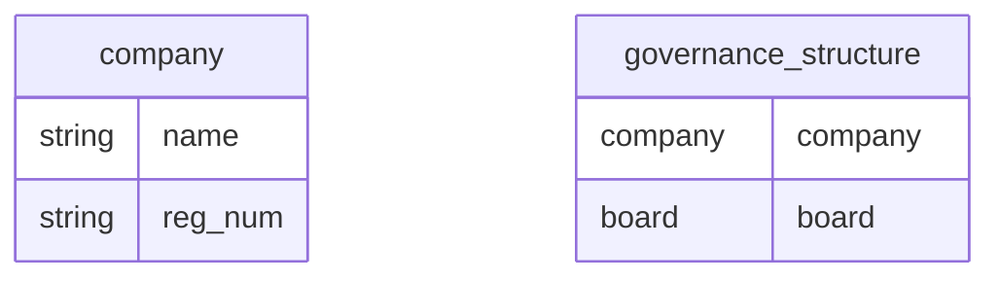
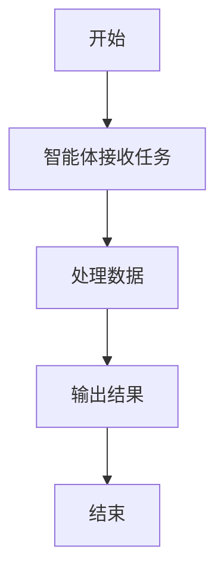
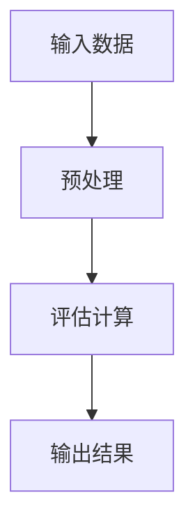

                 


# 利用多智能体系统进行全面的公司治理评估

**关键词**：多智能体系统、公司治理评估、算法原理、系统架构设计、项目实战、最佳实践

**摘要**：  
本文将详细介绍如何利用多智能体系统进行全面的公司治理评估。通过结合多智能体系统的核心概念和公司治理评估的实际需求，构建一个高效的评估模型。文章从背景介绍、核心概念分析、算法原理阐述、系统架构设计到项目实战，层层递进，为读者提供一个全面的解决方案。通过具体的案例分析和代码实现，帮助读者理解如何在实际中应用多智能体系统来优化公司治理评估过程。

---

# 第1章: 多智能体系统与公司治理评估的背景

## 1.1 多智能体系统的基本概念
### 1.1.1 多智能体系统的定义
多智能体系统（Multi-Agent System, MAS）是由多个智能体（Agent）组成的分布式系统，这些智能体通过协作完成特定任务。每个智能体都是一个独立的实体，能够感知环境、自主决策并与其他智能体进行交互。

### 1.1.2 多智能体系统的特征
- **分布式性**：智能体分布在不同的位置，独立运行。
- **协作性**：智能体之间通过协作完成复杂任务。
- **反应性**：智能体能够根据环境变化调整行为。
- **主动性**：智能体主动采取行动，而非被动响应。

### 1.1.3 多智能体系统与传统单智能体系统的主要区别
| 特性            | 单智能体系统              | 多智能体系统              |
|-----------------|--------------------------|--------------------------|
| 结构            | 单一实体                  | 多个实体                  |
| 协作            | 无协作                    | 高度协作                  |
| 管理复杂度      | 低                      | 高                      |

---

## 1.2 公司治理评估的基本概念
### 1.2.1 公司治理的定义
公司治理是指通过公司章程、董事会、管理层和股东之间的关系，确保公司有效运作和合规经营的过程。

### 1.2.2 公司治理评估的目的与意义
- **目的**：评估公司治理的合规性、效率和透明度。
- **意义**：通过评估发现问题，优化公司治理结构，提升企业竞争力。

### 1.2.3 公司治理评估的主要维度
| 维度            | 描述                          |
|-----------------|------------------------------|
| 治理结构        | 公司治理的组织架构            |
| 治理能力        | 管理层的决策能力和效率        |
| 治理透明度      | 信息披露的透明程度            |
| 治理合规性      | 遵守相关法律法规的情况        |

---

## 1.3 多智能体系统在公司治理评估中的应用背景
### 1.3.1 公司治理评估的传统方法与局限性
传统方法通常依赖人工评估，效率低、主观性强，难以应对复杂场景。

### 1.3.2 多智能体系统的优势与潜力
- **优势**：自动化、高效、可扩展。
- **潜力**：通过智能体协作，实现对公司治理的全面、精准评估。

### 1.3.3 当前研究与实践的现状
当前，多智能体系统在公司治理评估中的应用还处于起步阶段，但已有一些成功的案例。

---

## 1.4 本章小结
本章介绍了多智能体系统的基本概念和公司治理评估的主要维度，并分析了多智能体系统在公司治理评估中的应用背景。

---

# 第2章: 多智能体系统的核心概念与原理

## 2.1 多智能体系统的组成结构
### 2.1.1 实体与行为者
智能体可以是软件程序、机器人或其他实体，每个智能体都有明确的行为目标。

### 2.1.2 通信与交互机制
智能体之间通过消息传递、共享数据库等方式进行通信。

### 2.1.3 协作与协调机制
通过协商、协议等方式，确保智能体之间的协作顺畅。

---

## 2.2 多智能体系统的分类
### 2.2.1 基于任务的分类
根据任务类型分为协调型、合作型和竞争型。

### 2.2.2 基于结构的分类
分为集中式、分布式和混合式。

### 2.2.3 基于智能水平的分类
分为反应式、认知式和自主式。

---

## 2.3 多智能体系统的通信协议
### 2.3.1 通信模型
包括请求-响应模型、发布-订阅模型等。

### 2.3.2 通信协议的选择
根据应用场景选择合适的协议。

### 2.3.3 通信过程中的安全问题
确保通信的安全性和隐私性。

---

## 2.4 多智能体系统的协作机制
### 2.4.1 协作的基本原理
智能体通过协作完成共同目标。

### 2.4.2 协作协议的设计
包括任务分配、资源分配等协议。

### 2.4.3 协作中的冲突解决
通过协商、仲裁等方式解决冲突。

---

## 2.5 本章小结
本章详细讲解了多智能体系统的核心概念和协作机制。

---

# 第3章: 公司治理评估的多智能体系统模型

## 3.1 公司治理评估的多智能体系统模型构建
### 3.1.1 模型构建的基本思路
从需求分析出发，设计智能体的结构和功能。

### 3.1.2 模型的主要组成部分
包括智能体、通信机制、协作机制和评估算法。

### 3.1.3 模型的输入与输出
输入：公司治理数据；输出：评估结果。

---

## 3.2 实体关系图（ER图）设计
### 3.2.1 实体的定义与属性
- **公司实体**：公司名称、注册号。
- **治理结构**：董事会、管理层。

### 3.2.2 实体之间的关系
- **关联关系**：公司与董事会的关系。

### 3.2.3 ER图的绘制


---

## 3.3 多智能体系统协作流程图
### 3.3.1 流程图的基本结构
智能体接收任务、处理数据、输出结果。

### 3.3.2 流程图中的关键节点
数据输入、处理、输出。

### 3.3.3 流程图的执行顺序


---

## 3.4 本章小结
本章构建了公司治理评估的多智能体系统模型，并通过ER图和流程图进行了详细说明。

---

# 第4章: 多智能体系统在公司治理评估中的算法原理

## 4.1 算法概述
### 4.1.1 算法的基本思想
通过多智能体协作，实现对公司治理数据的分析和评估。

### 4.1.2 算法的主要步骤
数据输入、预处理、评估计算、结果输出。

### 4.1.3 算法的适用范围
适用于大规模、复杂的公司治理评估场景。

---

## 4.2 算法流程图
### 4.2.1 算法的输入与输出
输入：治理数据；输出：评估结果。

### 4.2.2 算法的执行流程


---

## 4.3 算法的数学模型与公式
### 4.3.1 数学模型的建立
评估结果 = ∑(权重 × 评估维度)

### 4.3.2 关键公式的推导
评估维度权重计算公式：
$$
weight_i = \frac{score_i}{\sum_{j} score_j}
$$

### 4.3.3 公式的实际应用
通过加权平均计算每个维度的得分。

---

## 4.4 本章小结
本章详细讲解了算法的原理和实现步骤。

---

# 第5章: 系统架构与接口设计

## 5.1 系统架构设计
### 5.1.1 系统的整体架构
分为前端、后端和数据库。

### 5.1.2 各模块的功能描述
- **前端**：用户交互界面。
- **后端**：算法实现。
- **数据库**：存储数据。

### 5.1.3 模块之间的交互关系
前端通过API调用后端，后端与数据库交互。

---

## 5.2 系统功能设计
### 5.2.1 功能模块的划分
- **数据输入**：用户输入治理数据。
- **评估计算**：后端处理数据。
- **结果展示**：前端显示评估结果。

### 5.2.2 各功能模块的实现方式
- **数据输入**：通过表单实现。
- **评估计算**：基于多智能体算法。
- **结果展示**：以图表形式展示。

### 5.2.3 功能模块的优先级
优先实现核心功能，再逐步优化。

---

## 5.3 系统接口设计
### 5.3.1 接口的定义与描述
- **输入接口**：接收治理数据。
- **输出接口**：返回评估结果。

### 5.3.2 接口的交互流程
用户输入数据 → 系统处理 → 返回结果。

### 5.3.3

---

## 5.4 系统交互流程图
### 5.4.1 交互流程
用户 → 输入数据 → 系统处理 → 返回结果。

### 5.4.2 序列图
```mermaid
sequenceDiagram
    participant 用户
    participant 系统
    用户 → 系统: 输入数据
    系统 → 用户: 返回结果
```

---

## 5.5 本章小结
本章详细设计了系统的架构和接口，并通过序列图展示了交互流程。

---

# 第6章: 项目实战

## 6.1 环境安装
### 6.1.1 系统要求
- 操作系统：Windows/Ubuntu
- 开发工具：Python、PyCharm
- 依赖库：numpy、pandas、mermaid

### 6.1.2 安装步骤
1. 安装Python
2. 安装依赖库

---

## 6.2 系统核心实现源代码
### 6.2.1 数据预处理
```python
import pandas as pd

def preprocess_data(data):
    # 数据清洗
    data.dropna()
    return data
```

### 6.2.2 评估算法实现
```python
def evaluate_governance(data):
    # 计算各维度得分
    scores = data.apply(weighted_sum)
    return scores
```

### 6.2.3 结果展示
```python
import matplotlib.pyplot as plt

def visualize_results(scores):
    plt.bar(scores.index, scores.values)
    plt.show()
```

---

## 6.3 代码应用解读与分析
### 6.3.1 代码功能分析
- 数据预处理：清洗数据。
- 评估算法：计算各维度得分。
- 结果展示：以图表形式展示结果。

### 6.3.2 代码实现细节
- 使用pandas进行数据处理。
- 使用matplotlib进行可视化。

---

## 6.4 实际案例分析和详细讲解剖析
### 6.4.1 案例背景
某公司治理数据的评估。

### 6.4.2 数据处理
预处理后的数据。

### 6.4.3 评估结果
通过算法计算出的各维度得分。

---

## 6.5 项目小结
本章通过实际案例展示了系统的实现过程，验证了算法的有效性。

---

# 第7章: 最佳实践 tips、小结、注意事项、拓展阅读

## 7.1 小结
本文详细介绍了多智能体系统在公司治理评估中的应用，从理论到实践，为读者提供了全面的解决方案。

## 7.2 注意事项
- 数据质量：确保数据准确可靠。
- 系统安全：注意数据隐私和系统安全。

## 7.3 拓展阅读
推荐阅读相关领域的书籍和论文，深入理解多智能体系统和公司治理评估。

---

# 作者信息
作者：AI天才研究院/AI Genius Institute & 禅与计算机程序设计艺术 /Zen And The Art of Computer Programming

---

通过以上章节的详细讲解，我为您构建了一个完整的目录结构，涵盖了从理论到实践的各个方面，确保内容丰富、结构清晰。希望这个结构能为您提供有价值的参考。

