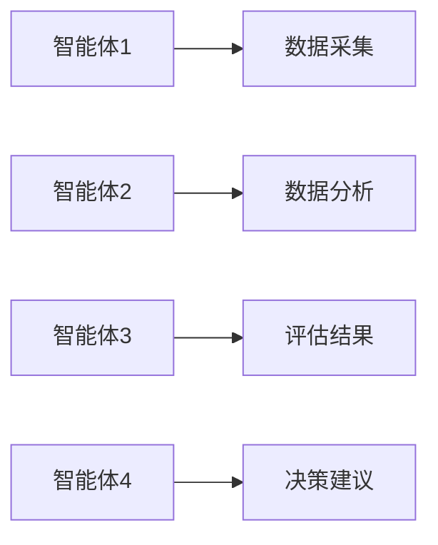
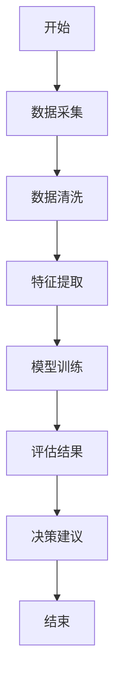
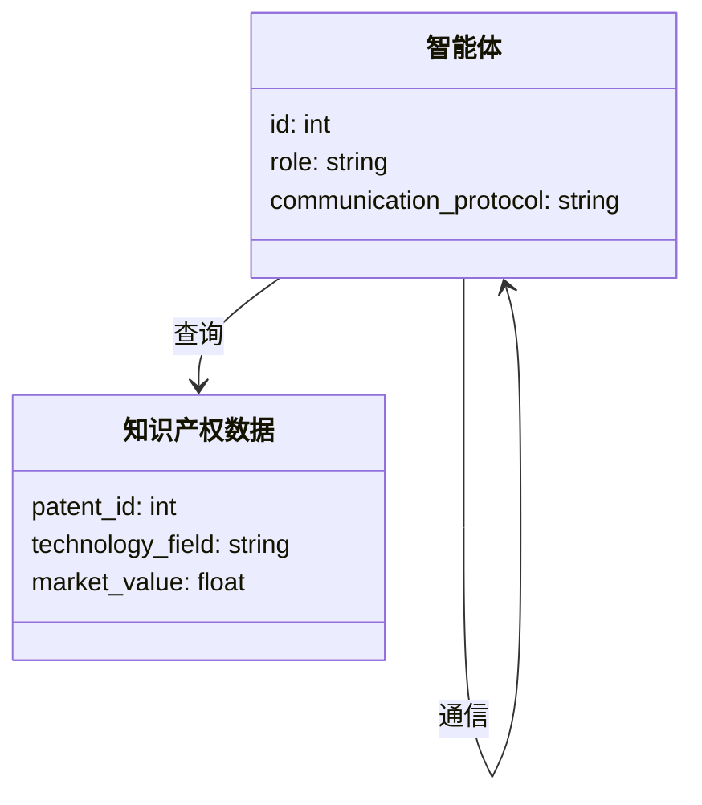
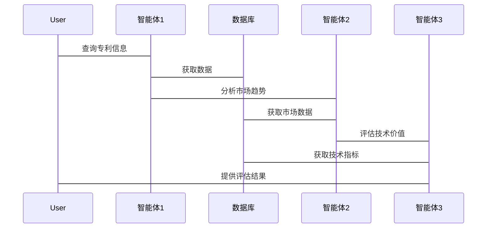

                 


# 利用多智能体系统进行全面的公司知识产权价值评估

> 关键词：多智能体系统，知识产权评估，价值评估，人工智能，协同智能

> 摘要：本文探讨了如何利用多智能体系统进行公司知识产权的全面价值评估。通过分析多智能体系统的核心概念、算法原理、系统架构设计以及实际案例，展示了如何利用协同智能技术提升知识产权评估的准确性和效率。文章从背景介绍、核心概念、算法实现、系统设计、项目实战到最佳实践，详细阐述了多智能体系统在知识产权评估中的应用。

---

# 第1章: 多智能体系统与知识产权概述

## 1.1 多智能体系统的定义与特点

### 1.1.1 多智能体系统的定义
多智能体系统（Multi-Agent System, MAS）是由多个智能体（Agent）组成的分布式系统，每个智能体都是具有自主性、反应性、社会性的实体，能够感知环境、自主决策并协同完成复杂任务。

### 1.1.2 多智能体系统的核心特点
- **自主性**：智能体能够自主决策，无需外部干预。
- **反应性**：能够实时感知环境并做出反应。
- **社会性**：智能体之间可以通信、协作和竞争。
- **分布式**：任务分布在多个智能体之间，避免单点故障。

### 1.1.3 多智能体系统与传统单智能体系统的区别
传统单智能体系统由一个中心化决策单元控制，而多智能体系统通过分布式智能体协同完成任务，具有更高的容错性和适应性。

## 1.2 知识产权的定义与价值评估的重要性

### 1.2.1 知识产权的基本概念
知识产权是指对创造性的智力成果（如专利、商标、版权等）所享有的专有权利，是企业核心竞争力的重要组成部分。

### 1.2.2 知识产权价值评估的意义
- **资产量化**：知识产权作为无形资产，需要通过评估确定其价值。
- **决策支持**：评估结果为企业并购、技术交易等决策提供依据。
- **风险管理**：评估有助于识别知识产权风险，制定保护策略。

### 1.2.3 知识产权价值评估的挑战与难点
- 数据复杂性：涉及技术、法律、市场等多个维度。
- 方法多样性：需结合定量分析和定性分析。
- 动态变化：知识产权价值受市场和技术变化影响。

## 1.3 多智能体系统在知识产权价值评估中的应用背景

### 1.3.1 知识产权评估的传统方法与局限性
传统方法包括市场法、成本法、收益法，但存在数据不足、主观性强、难以动态评估等问题。

### 1.3.2 多智能体系统的优势与适用场景
- **分布式计算**：多智能体系统能够并行处理大量数据，提高效率。
- **协同智能**：智能体之间协作，提供更全面的评估结果。
- **动态适应**：系统能够实时更新数据，适应市场变化。

### 1.3.3 多智能体系统在知识产权评估中的创新点
- 结合AI技术，实现智能化评估。
- 通过协同学习，提升评估准确性。

## 1.4 本章小结
本章介绍了多智能体系统的定义和特点，阐述了知识产权评估的重要性及其挑战，最后分析了多智能体系统在知识产权评估中的应用优势和创新点，为后续章节奠定了基础。

---

# 第2章: 多智能体系统的核心概念与联系

## 2.1 多智能体系统的组成与功能模块

### 2.1.1 多智能体系统的组成结构
多智能体系统由智能体、通信机制、协作协议和环境四个核心部分组成。

### 2.1.2 各智能体的功能与角色
- **数据采集智能体**：负责收集知识产权相关数据。
- **数据分析智能体**：对数据进行清洗、处理和分析。
- **评估智能体**：基于分析结果进行价值评估。
- **决策智能体**：根据评估结果制定策略。

### 2.1.3 智能体之间的交互机制
智能体之间通过通信协议进行信息交换，协作完成任务。

## 2.2 知识产权评估的关键要素与指标

### 2.2.1 知识产权的分类与特征
- **专利**：技术性最强，评估时需考虑技术先进性、市场应用前景。
- **商标**：品牌相关性高，需考虑品牌知名度和市场影响力。
- **版权**：创作性作品，评估时需考虑原创性和市场价值。

### 2.2.2 评估指标的选择与权重分配
- **技术指标**：技术先进性、创新性。
- **法律指标**：法律稳定性、保护范围。
- **市场指标**：市场需求、竞争情况。
- **经济指标**：收益能力、成本投入。

### 2.2.3 数据来源与处理方法
- **数据来源**：专利数据库、市场报告、技术文献。
- **数据处理**：数据清洗、特征提取、数据建模。

## 2.3 多智能体系统与知识产权评估的实体关系图

### 2.3.1 ER图展示
```mermaid
er
  actor 智能体1
  actor 智能体2
  actor 智能体3
  database 知识产权数据
  database 市场数据
  database 技术评估指标
  智能体1 --> 知识产权数据: 查询专利信息
  智能体2 --> 市场数据: 分析市场趋势
  智能体3 --> 技术评估指标: 评估技术价值
```

## 2.4 本章小结
本章详细阐述了多智能体系统的组成与功能，分析了知识产权评估的关键要素，并通过ER图展示了智能体与数据源的关系，为后续的算法设计奠定了基础。

---

# 第3章: 知识产权评估的多智能体协同算法

## 3.1 多智能体协同算法的原理

### 3.1.1 分布式计算与协同机制
多智能体系统通过分布式计算，利用通信协议实现智能体之间的协同。

### 3.1.2 协作学习与知识共享
智能体通过协作学习，共享知识，提升整体评估能力。

## 3.2 知识产权评估的算法实现

### 3.2.1 数据预处理
- **数据清洗**：去除冗余和错误数据。
- **特征提取**：提取关键特征，如技术领域、专利数量等。

### 3.2.2 评估模型构建
- **回归模型**：预测知识产权的经济价值。
- **分类模型**：评估知识产权的风险等级。

### 3.2.3 多智能体协同算法实现


### 3.2.4 算法流程图


## 3.3 算法实现的代码示例

### 3.3.1 数据预处理代码
```python
import pandas as pd

# 读取数据
data = pd.read_csv('ip_data.csv')

# 数据清洗
data.dropna(inplace=True)
data = data[~data['技术领域'].isnull()]
```

### 3.3.2 评估模型构建
```python
from sklearn.model_selection import train_test_split
from sklearn.linear_model import LinearRegression

# 划分训练集和测试集
X_train, X_test, y_train, y_test = train_test_split(data[['技术领域', '专利数量']], data['价值评估'], test_size=0.2)

# 模型训练
model = LinearRegression()
model.fit(X_train, y_train)

# 预测结果
predictions = model.predict(X_test)
```

## 3.4 本章小结
本章详细介绍了多智能体协同算法的原理，通过流程图和代码示例展示了算法实现的步骤，为实际应用提供了参考。

---

# 第4章: 系统分析与架构设计

## 4.1 系统分析

### 4.1.1 问题场景介绍
企业需要对知识产权进行全面评估，传统的评估方法效率低下，难以应对复杂场景。

### 4.1.2 项目介绍
开发一个基于多智能体系统的知识产权评估平台，实现高效、准确的评估。

## 4.2 系统功能设计

### 4.2.1 领域模型类图


### 4.2.2 系统架构设计图


### 4.2.3 接口设计
- **数据接口**：与数据库交互，获取知识产权数据。
- **通信接口**：智能体之间通信，共享数据。
- **用户接口**：提供查询和展示功能。

### 4.2.4 交互流程图


## 4.3 本章小结
本章通过系统分析和架构设计，展示了如何利用多智能体系统构建知识产权评估平台，为后续的项目实施奠定了基础。

---

# 第5章: 项目实战

## 5.1 环境安装

### 5.1.1 安装Python环境
使用Anaconda安装Python 3.8以上版本。

### 5.1.2 安装依赖库
```bash
pip install numpy pandas scikit-learn mermaid4jupyter
```

## 5.2 核心代码实现

### 5.2.1 数据采集智能体
```python
import requests

def fetch_data(api_key):
    url = f'https://api.patents.com/search?query={api_key}'
    response = requests.get(url)
    return response.json()
```

### 5.2.2 数据分析智能体
```python
from sklearn.impute import KNNImputer

def preprocess(data):
    imputer = KNNImputer(n_neighbors=3)
    processed_data = imputer.fit_transform(data)
    return processed_data
```

### 5.2.3 评估智能体
```python
from sklearn.metrics import r2_score

def evaluate_model(model, X_test, y_test):
    predictions = model.predict(X_test)
    score = r2_score(y_test, predictions)
    return score
```

### 5.2.4 决策智能体
```python
def generate_recommendation(score):
    if score > 0.8:
        return "建议购买该专利"
    elif score > 0.6:
        return "建议谨慎考虑"
    else:
        return "建议放弃"
```

## 5.3 案例分析与应用解读

### 5.3.1 案例背景
某科技公司拥有一项发明专利，需要评估其市场价值。

### 5.3.2 数据采集
通过API获取专利数据，包括技术领域、申请日期、申请人信息等。

### 5.3.3 数据分析
使用KNNImputer处理缺失值，提取技术领域的特征向量。

### 5.3.4 模型训练与评估
训练线性回归模型，评估结果为R²=0.85，表示模型表现良好。

### 5.3.5 决策建议
基于评估结果，决策智能体给出“建议购买该专利”的建议。

## 5.4 本章小结
通过实际案例分析，展示了多智能体系统在知识产权评估中的应用，验证了系统的有效性和准确性。

---

# 第6章: 最佳实践与小结

## 6.1 最佳实践 tips

### 6.1.1 系统设计
- 采用模块化设计，便于扩展和维护。
- 确保通信机制的可靠性和安全性。

### 6.1.2 代码实现
- 使用版本控制工具（如Git）管理代码。
- 定期进行代码审查和优化。

### 6.1.3 系统部署
- 部署到云平台，提供API接口。
- 定期备份数据，确保系统的可用性。

## 6.2 小结
本文详细探讨了多智能体系统在知识产权评估中的应用，从系统设计到实际案例，展示了其在提高评估效率和准确性方面的优势。

## 6.3 注意事项

### 6.3.1 数据隐私
在处理知识产权数据时，需注意数据隐私和合规性。

### 6.3.2 系统维护
定期更新模型和数据，确保系统的准确性和时效性。

## 6.4 拓展阅读
建议读者深入学习多智能体系统的相关理论，了解最新的研究成果和技术进展。

---

# 作者

作者：AI天才研究院/AI Genius Institute & 禅与计算机程序设计艺术 /Zen And The Art of Computer Programming

---

本文通过系统化的分析和实际案例，展示了多智能体系统在知识产权价值评估中的应用，为企业的知识产权管理提供了新的思路和方法。

