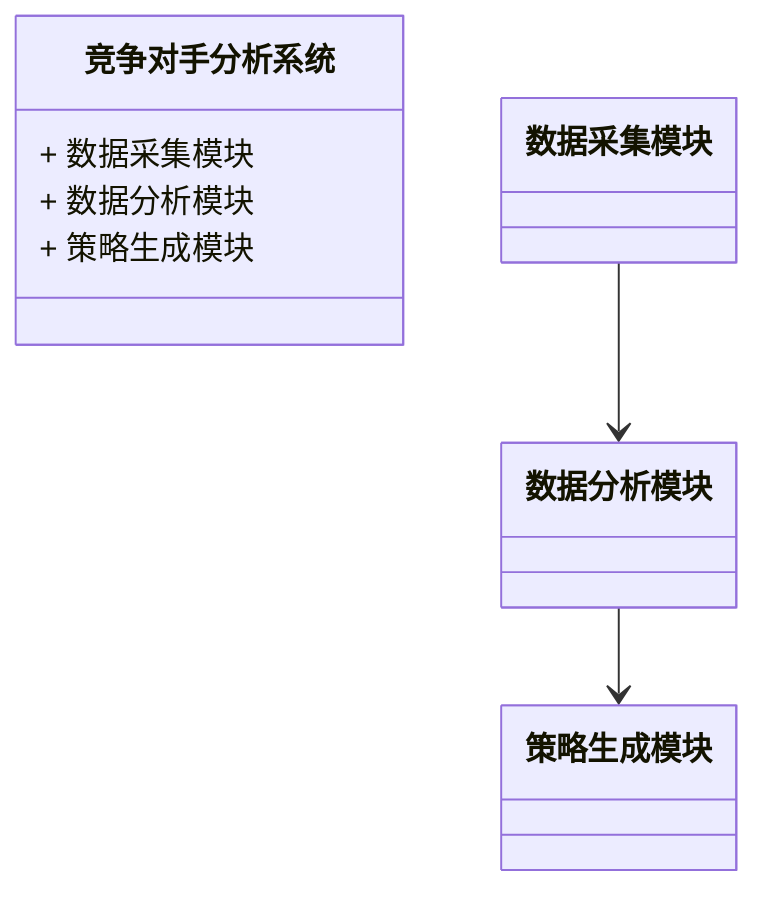
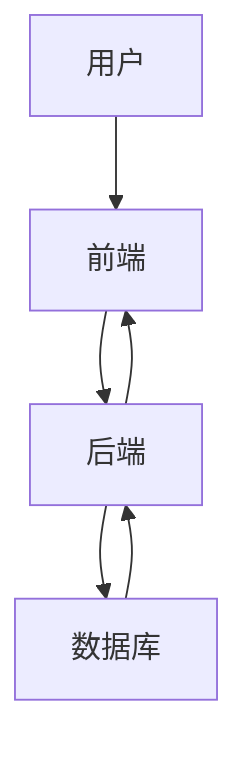
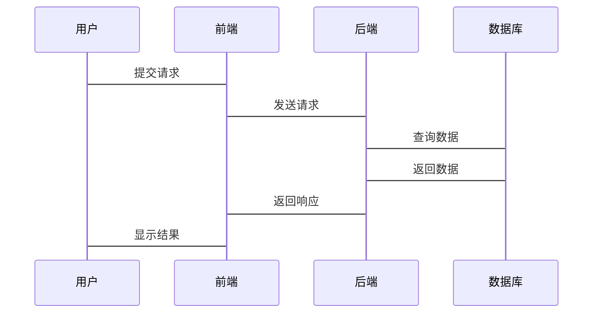

                 


# 利用多智能体系统进行全面的竞争对手分析

---

## 关键词：
多智能体系统、竞争对手分析、分布式计算、博弈论、人工智能、数据挖掘

---

## 摘要：
本文将深入探讨如何利用多智能体系统（Multi-Agent System, MAS）进行全面的竞争对手分析。文章首先介绍多智能体系统的基本概念和特点，然后分析竞争对手分析的背景与挑战。接着，详细阐述多智能体系统在竞争对手分析中的优势，包括分布式计算、协作能力和自适应能力。随后，文章从算法原理、系统架构设计、项目实战等多维度展开，结合具体的实现案例和数学模型，展示多智能体系统在实际应用中的强大能力。最后，本文总结了多智能体系统在竞争对手分析中的最佳实践和未来发展趋势。

---

## 正文

### 第一部分: 多智能体系统与竞争对手分析基础

---

#### 第1章: 多智能体系统概述

##### 1.1 多智能体系统的定义与特点

###### 1.1.1 多智能体系统的定义
多智能体系统（Multi-Agent System, MAS）是由多个智能体（Agent）组成的复杂系统，这些智能体通过协作和通信完成特定任务。智能体是具有感知、决策和行动能力的实体，可以是软件程序或物理设备。

###### 1.1.2 多智能体系统的核心特点
- **分布式性**：多个智能体协同工作，不存在中心化控制。
- **自主性**：每个智能体具有自主决策的能力。
- **协作性**：智能体之间通过通信和协作完成复杂任务。
- **动态性**：系统能够适应环境的变化。

###### 1.1.3 多智能体系统与传统单智能体系统的区别
| 特性 | 多智能体系统 | 单智能体系统 |
|------|--------------|---------------|
| 结构 | 分布式       | 集中式       |
| 智能体数量 | 多个        | 单个          |
| 协作性 | 高           | 无             |
| 应用场景 | 复杂任务     | 简单任务       |

##### 1.2 多智能体系统的组成部分

###### 1.2.1 智能体的定义与分类
- **定义**：智能体是能够感知环境、做出决策并采取行动的实体。
- **分类**：
  - **反应式智能体**：基于当前感知做出决策。
  - **认知式智能体**：具有目标、信念和意图。

###### 1.2.2 环境的定义与类型
- **定义**：环境是智能体所处的外部世界，可以是物理环境或虚拟环境。
- **类型**：
  - **静态环境**：环境在智能体决策期间不发生变化。
  - **动态环境**：环境在智能体决策期间发生变化。

###### 1.2.3 智能体之间的通信机制
- **通信方式**：
  - **直接通信**：智能体之间直接交换信息。
  - **间接通信**：通过中间媒介交换信息。
- **通信协议**：定义智能体之间通信的规则和格式。

##### 1.3 多智能体系统的应用领域

###### 1.3.1 多智能体系统在商业中的应用
- **市场分析**：通过智能体分析市场趋势和竞争对手行为。
- **供应链管理**：优化供应链中的资源分配和协调。

###### 1.3.2 多智能体系统在军事与游戏中的应用
- **军事模拟**：模拟战场环境，优化作战策略。
- **游戏AI**：在游戏中实现智能NPC的行为。

###### 1.3.3 多智能体系统的未来发展趋势
- **智能化**：智能体的自主性和协作能力将不断增强。
- **分布式计算**：多智能体系统将更加依赖分布式计算技术。

---

#### 第2章: 竞争对手分析的背景与挑战

##### 2.1 竞争对手分析的定义与重要性

###### 2.1.1 竞争对手分析的定义
竞争对手分析是通过分析竞争对手的行为、策略和市场表现，为企业制定有效的竞争策略提供支持。

###### 2.1.2 竞争对手分析的重要性
- **市场定位**：帮助企业明确自身在市场中的位置。
- **竞争优势**：帮助企业识别和利用竞争优势。
- **风险预警**：帮助企业预测和应对竞争风险。

###### 2.1.3 竞争对手分析的常见方法
- **SWOT分析**：分析竞争对手的优势、劣势、机会和威胁。
- **波特五力分析**：分析行业竞争结构。

##### 2.2 竞争对手分析的挑战

###### 2.2.1 数据获取的困难性
- **数据来源**：竞争对手数据通常难以获取。
- **数据质量**：数据可能存在不完整或不准确的问题。

###### 2.2.2 分析方法的局限性
- **传统方法**：基于经验的分析方法可能存在主观性。
- **动态变化**：市场竞争环境不断变化，分析方法需要动态调整。

###### 2.2.3 竞争环境的动态变化
- **市场波动**：市场需求和竞争格局不断变化。
- **技术进步**：技术进步可能导致竞争优势快速变化。

---

#### 第3章: 多智能体系统在竞争对手分析中的优势

##### 3.1 多智能体系统的分布式计算能力

###### 3.1.1 分布式计算的基本原理
分布式计算将任务分解为多个子任务，分别在不同的计算节点上执行，最后将结果汇总。

###### 3.1.2 分布式计算在竞争对手分析中的应用
- **数据处理**：通过分布式计算快速处理大量数据。
- **任务分配**：将分析任务分配给多个智能体，提高效率。

##### 3.2 多智能体系统的协作能力

###### 3.2.1 协作的基本原理
协作是指多个智能体通过通信和协调共同完成任务。

###### 3.2.2 协作在竞争对手分析中的优势
- **信息共享**：智能体之间共享信息，提高分析的全面性。
- **任务分工**：智能体根据自身能力分工合作。

##### 3.3 多智能体系统的自适应能力

###### 3.3.1 自适应的基本原理
自适应是指系统能够根据环境变化自动调整自身的行为。

###### 3.3.2 自适应在竞争对手分析中的应用
- **实时响应**：系统能够实时响应环境变化。
- **动态调整**：根据竞争环境的变化动态调整分析策略。

---

### 第二部分: 多智能体系统的核心算法与数学模型

---

#### 第4章: 多智能体系统的核心算法

##### 4.1 分布式计算算法

###### 4.1.1 分布式计算的基本原理
分布式计算将任务分解为多个子任务，分别在不同的节点上执行，最后汇总结果。

###### 4.1.2 分布式计算在多智能体系统中的应用
- **数据处理**：通过分布式计算快速处理大量数据。
- **任务分配**：将任务分配给多个智能体，提高效率。

##### 4.2 协作算法

###### 4.2.1 协作的基本原理
协作算法通过智能体之间的通信和协调完成任务。

###### 4.2.2 协作算法的实现步骤
1. 智能体感知环境。
2. 智能体之间通信。
3. 协作完成任务。

##### 4.3 自适应算法

###### 4.3.1 自适应的基本原理
自适应算法能够根据环境变化自动调整行为。

###### 4.3.2 自适应算法的实现步骤
1. 感知环境变化。
2. 调整行为策略。
3. 执行新的策略。

---

#### 第5章: 多智能体系统的数学模型

##### 5.1 博弈论模型

###### 5.1.1 纳什均衡
纳什均衡是指在博弈中，每个参与者在给定其他参与者策略的情况下，选择最优策略的状态。

数学表达式：
$$
\text{纳什均衡} = (x^*, y^*) \quad \text{其中} \quad x^* \text{和} y^* \text{是双方的最优策略}
$$

###### 5.1.2 博弈论在竞争对手分析中的应用
- **策略分析**：通过博弈论分析竞争对手的策略选择。
- **均衡预测**：预测市场中的均衡状态。

##### 5.2 分布式计算模型

###### 5.2.1 分布式计算模型的定义
分布式计算模型描述了任务分解和计算节点之间的关系。

###### 5.2.2 分布式计算模型的实现
- **任务分解**：将任务分解为多个子任务。
- **任务分配**：将子任务分配给不同的计算节点。
- **结果汇总**：将子任务的结果汇总为最终结果。

---

### 第三部分: 系统分析与架构设计

---

#### 第6章: 竞争对手分析系统的架构设计

##### 6.1 问题场景介绍
竞争对手分析系统需要实时监控市场动态，分析竞争对手的行为，并为企业提供竞争策略建议。

##### 6.2 系统功能设计

###### 6.2.1 系统功能模块
- **数据采集模块**：采集竞争对手的数据。
- **数据分析模块**：分析数据，生成分析报告。
- **策略生成模块**：根据分析结果生成竞争策略。

###### 6.2.2 系统功能设计的类图


##### 6.3 系统架构设计

###### 6.3.1 系统架构的组成
- **前端**：用户界面，展示分析结果。
- **后端**：服务器，处理数据和分析任务。
- **数据库**：存储竞争对手数据。

###### 6.3.2 系统架构设计的流程图


##### 6.4 系统接口设计
- **数据接口**：与数据源对接，获取竞争对手数据。
- **用户接口**：与用户交互，展示分析结果。

##### 6.5 系统交互设计

###### 6.5.1 系统交互的序列图


---

### 第四部分: 项目实战

---

#### 第7章: 竞争对手分析系统的实现

##### 7.1 环境安装
- **Python**：安装Python 3.8及以上版本。
- **库**：安装numpy、pandas、scikit-learn等库。

##### 7.2 系统核心实现源代码

###### 7.2.1 数据采集模块
```python
import requests
from bs4 import BeautifulSoup

def get_competitor_data(url):
    response = requests.get(url)
    soup = BeautifulSoup(response.text, 'html.parser')
    # 提取数据
    return data
```

###### 7.2.2 数据分析模块
```python
import pandas as pd
from sklearn import cluster

def analyze_data(data):
    df = pd.DataFrame(data)
    # 数据分析逻辑
    return result
```

###### 7.2.3 策略生成模块
```python
def generate_strategy(result):
    # 策略生成逻辑
    return strategy
```

##### 7.3 代码应用解读与分析
- **数据采集模块**：通过网络爬虫获取竞争对手数据。
- **数据分析模块**：使用数据分析工具对数据进行处理和分析。
- **策略生成模块**：根据分析结果生成竞争策略。

##### 7.4 实际案例分析
- **案例背景**：假设我们分析某行业的竞争对手。
- **案例分析**：通过多智能体系统分析竞争对手的市场策略和产品特点。
- **案例结果**：生成竞争策略建议。

##### 7.5 项目小结
- **项目总结**：总结项目的实现过程和成果。
- **经验教训**：总结项目中遇到的问题和解决方法。

---

### 第五部分: 最佳实践、小结与展望

---

#### 第8章: 最佳实践与小结

##### 8.1 最佳实践
- **数据隐私保护**：在采集和分析数据时，注意保护数据隐私。
- **系统可扩展性**：设计系统时考虑可扩展性，方便未来的功能扩展。
- **团队协作**：多智能体系统的开发需要团队协作，明确分工和职责。

##### 8.2 项目小结
- **项目目标**：通过多智能体系统实现竞争对手分析。
- **项目成果**：成功开发了一个竞争对手分析系统。
- **项目意义**：展示了多智能体系统在商业分析中的应用价值。

##### 8.3 未来展望
- **技术进步**：随着人工智能技术的进步，多智能体系统将更加智能化。
- **应用拓展**：多智能体系统将在更多领域得到应用，如金融、医疗等。

---

## 作者：AI天才研究院/AI Genius Institute & 禅与计算机程序设计艺术 /Zen And The Art of Computer Programming

---

通过以上思考过程，我们可以看到，多智能体系统在竞争对手分析中的应用具有巨大的潜力。通过分布式计算、协作能力和自适应能力，多智能体系统能够帮助企业更高效、更准确地分析竞争对手，制定有效的竞争策略。未来，随着人工智能技术的不断发展，多智能体系统在竞争对手分析中的应用将更加广泛和深入。

