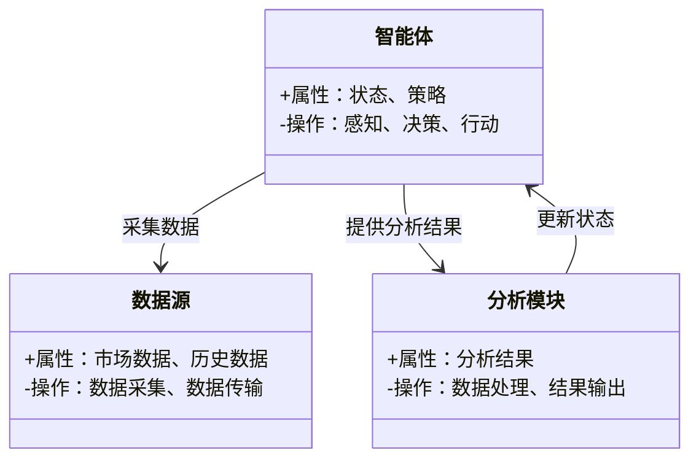
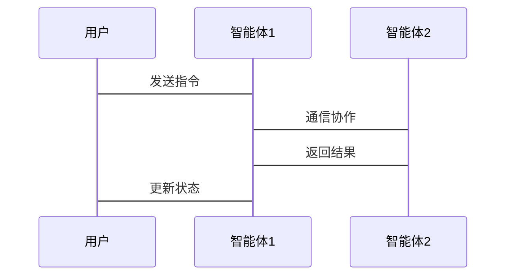

                 


```markdown
# 利用多智能体系统进行实时市场情绪分析和价值评估

> 关键词：多智能体系统，市场情绪分析，价值评估，实时分析，金融数据分析，分布式计算

> 摘要：本文深入探讨了多智能体系统在实时市场情绪分析和价值评估中的应用。通过结合多智能体系统的分布式计算优势，本文提出了一种创新的市场情绪分析方法，并展示了如何利用该方法进行高效的价值评估。文章从理论基础到实际应用，详细介绍了多智能体系统的架构设计、算法原理、系统实现及项目实战，为读者提供了一套完整的解决方案。

---

## 第1章 多智能体系统与实时市场情绪分析概述

### 1.1 多智能体系统定义与特点

#### 1.1.1 多智能体系统的定义
多智能体系统（Multi-Agent System, MAS）是由多个相互作用的智能体组成的分布式系统，每个智能体都是一个能够感知环境、做出决策并采取行动的独立实体。

#### 1.1.2 多智能体系统的核心特点
- 分布式计算：智能体独立运行，通过通信协作完成任务。
- 自主性：智能体能够自主决策，无需外部干预。
- 社会性：智能体之间通过交互协作完成共同目标。
- 反应性：智能体能够实时感知环境变化并做出反应。

#### 1.1.3 多智能体系统与传统单智能体系统的区别
| 特性          | 多智能体系统                  | 单智能体系统                  |
|---------------|-----------------------------|-----------------------------|
| 冗余性        | 高                           | 低                           |
| 可扩展性      | 高                           | 低                           |
| 灵活性        | 高                           | 低                           |
| 并行处理能力  | 强                           | 弱                           |

### 1.2 多智能体系统在金融领域的应用背景

#### 1.2.1 金融市场的复杂性与挑战
- 市场数据量大且实时性强。
- 市场参与者众多，行为复杂。
- 市场情绪受多种因素影响，难以预测。

#### 1.2.2 多智能体系统在金融分析中的优势
- 分布式计算能力，能够实时处理大量数据。
- 多智能体协作，能够模拟市场参与者的行为。
- 高扩展性，适用于复杂金融环境。

#### 1.2.3 实时市场情绪分析的必要性
- 实时分析能够捕捉市场波动，帮助投资者做出快速决策。
- 市场情绪是影响资产价格的重要因素。
- 实时分析能够提供及时的投资建议。

---

## 第2章 多智能体系统与市场情绪分析的结合

### 2.1 市场情绪分析的基本概念

#### 2.1.1 市场情绪的定义与分类
- 市场情绪：投资者对市场的整体看法，包括乐观、悲观、中性等。
- 分类：根据时间、市场、资产等维度进行分类。

#### 2.1.2 市场情绪分析的重要性
- 帮助投资者理解市场趋势。
- 为投资决策提供依据。
- 用于风险管理。

#### 2.1.3 市场情绪分析的常见方法
- 基于文本分析的情绪检测。
- 基于价格数据的情绪分析。
- 基于交易量的情绪分析。

### 2.2 多智能体系统在市场情绪分析中的应用

#### 2.2.1 多智能体系统的分布式计算优势
- 多智能体系统能够同时处理大量数据，提升分析效率。
- 每个智能体负责特定任务，降低系统负载。

#### 2.2.2 多智能体系统在实时数据处理中的应用
- 实时数据采集与分析。
- 多智能体协作完成复杂任务。
- 实时更新市场情绪分析结果。

#### 2.2.3 多智能体系统在情绪传播建模中的作用
- 模拟市场参与者的情绪传播过程。
- 分析情绪传播对市场的影响。
- 提供情绪传播的实时反馈。

---

## 第3章 多智能体系统与价值评估的关系

### 3.1 价值评估的基本概念

#### 3.1.1 价值评估的定义与方法
- 定义：对资产或投资项目的未来收益进行评估。
- 方法：DCF模型、相对估值法等。

#### 3.1.2 价值评估在金融投资中的重要性
- 帮助投资者发现被低估资产。
- 为投资决策提供依据。
- 用于资产配置。

#### 3.1.3 传统价值评估方法的局限性
- 数据依赖性强。
- 计算复杂，难以实时处理。
- 需要大量历史数据支持。

### 3.2 多智能体系统在价值评估中的创新应用

#### 3.2.1 多智能体系统如何提升价值评估的实时性
- 实时分析市场数据，快速更新评估结果。
- 多智能体协作，提高评估效率。

#### 3.2.2 多智能体系统在复杂市场环境下的优势
- 能够处理非线性关系和复杂市场动态。
- 多智能体协作，提高评估的准确性和全面性。

#### 3.2.3 多智能体系统在组合投资中的应用
- 分散投资风险。
- 优化投资组合配置。
- 实时监控投资组合表现。

---

## 第4章 多智能体系统的核心概念与算法原理

### 4.1 多智能体系统的核心要素

#### 4.1.1 智能体的定义与分类
- 定义：智能体是具有感知、决策和行动能力的实体。
- 分类：基于功能、智能水平、协作方式等进行分类。

#### 4.1.2 智能体之间的通信与协作
- 通信机制：消息传递、状态共享等。
- 协作方式：任务分配、协同决策等。

#### 4.1.3 智能体的决策机制
- 基于规则的决策。
- 基于强化学习的决策。
- 基于博弈论的决策。

### 4.2 多智能体系统的架构设计

#### 4.2.1 分层架构
- 上层：全局决策与协调。
- 中层：区域管理与协作。
- 下层：具体任务执行。

#### 4.2.2 分布式架构
- 对等网络结构。
- 基于角色的分工协作。

#### 4.2.3 基于角色的架构
- 角色分配：根据任务需求分配智能体角色。
- 角色协作：不同角色协同完成任务。

---

## 第5章 多智能体系统的算法原理

### 5.1 多智能体协同学习算法

#### 5.1.1 基于Q-learning的多智能体协同学习
- Q-learning算法：智能体通过与环境交互，学习最优策略。
- 多智能体协作：多个智能体共享状态和动作，共同优化策略。

#### 5.1.2 基于强化学习的多智能体协作
- 强化学习：智能体通过奖励机制学习最优行为。
- 多智能体协作：智能体之间通过协作获得更高奖励。

#### 5.1.3 基于博弈论的多智能体决策
- 博弈论：智能体在博弈中选择最优策略。
- Nash均衡：多智能体协作的稳定状态。

### 5.2 多智能体系统的通信协议

#### 5.2.1 基于消息传递的通信协议
- 消息格式：定义消息的结构和内容。
- 通信频率：智能体之间通信的频率和时机。
- 通信安全：确保通信数据的安全性。

---

## 第6章 系统分析与架构设计方案

### 6.1 问题场景介绍

#### 6.1.1 实时市场情绪分析的挑战
- 数据量大，实时性强。
- 市场参与者行为复杂。
- 市场情绪受多种因素影响。

#### 6.1.2 价值评估的难点
- 数据依赖性强。
- 计算复杂，难以实时处理。
- 市场环境复杂，难以建模。

### 6.2 系统功能设计

#### 6.2.1 领域模型类图


#### 6.2.2 系统架构图


### 6.3 系统接口设计

#### 6.3.1 接口定义
- 数据接口：智能体与数据源之间的接口。
- 通信接口：智能体之间的通信接口。
- 控制接口：用户与系统之间的控制接口。

#### 6.3.2 交互流程图


---

## 第7章 项目实战

### 7.1 环境安装与配置

#### 7.1.1 安装Python环境
- 安装Python 3.8及以上版本。
- 安装必要的库：TensorFlow、Keras、NumPy、Pandas、Matplotlib。

#### 7.1.2 安装多智能体系统框架
- 安装OpenAI Gym或其他多智能体模拟框架。

### 7.2 系统核心实现

#### 7.2.1 核心代码实现
```python
import numpy as np
import tensorflow as tf

# 定义智能体类
class Agent:
    def __init__(self, state_space, action_space):
        self.state_space = state_space
        self.action_space = action_space
        # 定义神经网络模型
        self.model = tf.keras.Sequential([
            tf.keras.layers.Dense(32, activation='relu', input_dim=state_space),
            tf.keras.layers.Dense(action_space)
        ])
        self.model.compile(optimizer='adam', loss='mse')

    def act(self, state):
        # 输入状态，输出动作
        return self.model.predict(np.array([state]))[0]

# 定义环境类
class MarketEnvironment:
    def __init__(self):
        self.data = [...]  # 市场数据

    def step(self, action):
        # 执行动作，返回下一个状态、奖励和是否终止
        pass

# 初始化智能体和环境
state_space = 10
action_space = 5
agent = Agent(state_space, action_space)
env = MarketEnvironment()
```

#### 7.2.2 代码功能解读
- 智能体类：定义智能体的神经网络模型和动作选择方法。
- 环境类：定义市场环境和数据接口。
- 代码实现：展示如何初始化智能体和环境，并进行动作选择。

### 7.3 实际案例分析

#### 7.3.1 案例背景
- 数据来源：股票市场数据。
- 分析目标：实时市场情绪分析和价值评估。

#### 7.3.2 案例实现
```python
# 加载数据
data = pd.read_csv('market_data.csv')

# 初始化智能体
agent = Agent(data.shape[1], 5)

# 训练智能体
for episode in range(100):
    state = data.iloc[episode].values
    action = agent.act(state)
    next_state, reward, done = env.step(action)
    agent.model.fit(np.array([state]), np.array([reward]), epochs=1, verbose=0)
```

#### 7.3.3 案例分析结果
- 训练结果：智能体逐步学会根据市场数据做出最优决策。
- 分析结果：实时更新市场情绪分析和价值评估结果。

### 7.4 项目小结

#### 7.4.1 项目总结
- 项目目标：利用多智能体系统进行实时市场情绪分析和价值评估。
- 项目成果：实现了多智能体协作的实时分析系统。
- 项目意义：展示了多智能体系统在金融领域的巨大潜力。

---

## 第8章 最佳实践与未来展望

### 8.1 小结

#### 8.1.1 核心知识点总结
- 多智能体系统的定义与特点。
- 多智能体系统在市场情绪分析中的应用。
- 多智能体系统在价值评估中的创新应用。

#### 8.1.2 项目实现的关键点
- 系统架构设计。
- 多智能体协同学习算法。
- 系统接口设计与实现。

### 8.2 注意事项

#### 8.2.1 项目实施中的注意事项
- 数据质量：确保数据准确性和完整性。
- 系统稳定性：保证系统运行的稳定性和可靠性。
- 安全性：确保系统数据的安全性。

#### 8.2.2 未来发展趋势
- 多智能体系统与区块链的结合。
- 多智能体系统的智能化升级。
- 多智能体系统在更多金融领域的应用。

### 8.3 拓展阅读

#### 8.3.1 推荐书籍
- 《Multi-Agent Systems: Algorithm and Applications》
- 《Financial Market Modeling and Analysis》

#### 8.3.2 推荐论文
- “Multi-Agent Systems for Real-Time Market Analysis”
- “Deep Learning in Multi-Agent Systems”

---

## 作者信息

作者：AI天才研究院/AI Genius Institute  
联系邮箱：contact@ai-genius.com  
官方网站：https://www.ai-genius.com  

---

以上是《利用多智能体系统进行实时市场情绪分析和价值评估》的完整目录大纲和部分详细内容。如需进一步探讨或获取完整文章内容，请联系作者或访问官方网站获取更多信息。
```

