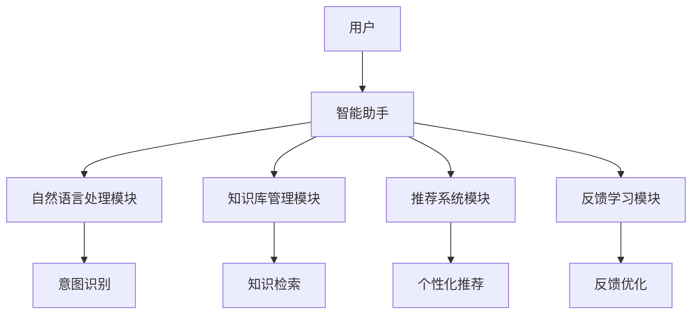
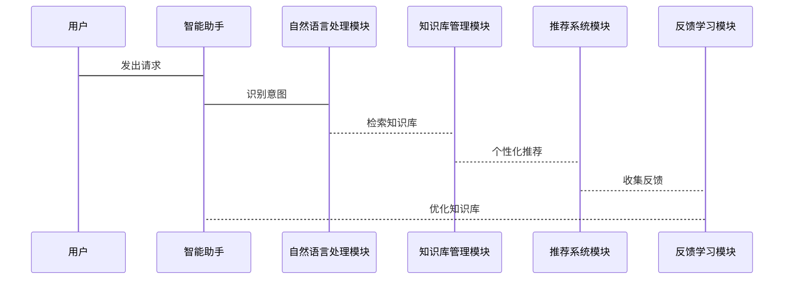

                 

# 利用智能助手提升客户忠诚度的策略

> 关键词：智能助手、客户忠诚度、自然语言处理、推荐系统、客户关系管理、人工智能、用户体验优化

> 摘要：随着人工智能技术的快速发展，智能助手在提升客户忠诚度方面发挥着越来越重要的作用。本文从智能助手的核心功能、客户忠诚度的多维度分析、智能助手的技术实现、算法与模型优化、实际案例分析以及系统架构设计等方面，详细探讨了如何利用智能助手提升客户忠诚度的策略。通过本文的分析，读者可以深入了解智能助手在客户关系管理中的应用，掌握提升客户忠诚度的具体方法和技术实现。

---

## 第一部分: 智能助手与客户忠诚度的背景与概念

### 第1章: 智能助手与客户忠诚度的背景与概念

#### 1.1 智能助手的定义与核心功能

##### 1.1.1 智能助手的基本概念
智能助手是一种基于人工智能技术的交互工具，能够通过自然语言处理（NLP）技术理解用户的需求，并通过预设的知识库或实时学习提供相应的反馈与服务。智能助手的核心目标是通过高效的交互和个性化的服务，提升用户体验和客户满意度。

##### 1.1.2 智能助手的核心功能与应用场景
智能助手的核心功能包括：
1. **自然语言理解**：通过NLP技术理解用户的输入，识别意图和情感。
2. **知识库管理**：基于结构化知识库提供准确的信息检索和回答。
3. **个性化推荐**：根据用户行为和偏好提供定制化的服务或推荐。
4. **反馈学习**：通过用户反馈不断优化自身的知识库和交互策略。

智能助手的应用场景包括客服支持、销售辅助、用户教育、个性化推荐等。

##### 1.1.3 智能助手在客户关系管理中的作用
智能助手通过自动化、个性化的服务，能够显著提升客户体验，增强客户对品牌的忠诚度。它可以帮助企业实现24/7的客户支持，快速响应客户需求，同时通过数据分析优化客户关系管理策略。

#### 1.2 客户忠诚度的定义与影响因素

##### 1.2.1 客户忠诚度的定义与衡量标准
客户忠诚度是指客户对某一品牌或产品持续购买或使用的行为倾向。衡量客户忠诚度的标准包括：
1. **重复购买率**：客户在一定时间内重复购买同一品牌或产品的频率。
2. **品牌推荐率**：客户向他人推荐该品牌或产品的意愿。
3. **客户生命周期价值**：客户在生命周期内为企业带来的总收入。

##### 1.2.2 影响客户忠诚度的关键因素
影响客户忠诚度的关键因素包括：
1. **产品质量与服务**：产品的质量和服务的满意度直接影响客户忠诚度。
2. **客户体验**：客户在与企业交互过程中的体验是决定忠诚度的重要因素。
3. **品牌信任**：客户对品牌的信任程度是忠诚度的基础。
4. **竞争环境**：市场竞争的激烈程度也会影响客户的忠诚度。

##### 1.2.3 客户忠诚度与企业长期发展的关系
客户忠诚度是企业长期发展的关键因素之一。高忠诚度的客户不仅会持续购买企业产品，还会为企业带来口碑传播和额外的收入来源。通过提升客户忠诚度，企业可以降低客户获取成本，提高客户生命周期价值，从而实现可持续发展。

#### 1.3 智能助手提升客户忠诚度的背景与意义

##### 1.3.1 当前客户关系管理面临的挑战
随着市场竞争的加剧，企业面临的客户关系管理挑战包括：
1. **客户期望的提升**：客户对服务的期望越来越高，传统客服模式难以满足需求。
2. **个性化需求的增加**：客户希望得到个性化的服务和推荐。
3. **服务成本的控制**：企业需要在提升服务质量的同时控制成本。

##### 1.3.2 智能助手在客户关系管理中的独特优势
智能助手通过自动化、智能化的服务模式，能够有效解决传统客户关系管理的痛点：
1. **24/7全天候服务**：智能助手可以随时为客户提供服务，无需额外成本。
2. **个性化服务**：基于客户数据和行为分析，智能助手可以提供个性化的推荐和建议。
3. **高效问题解决**：智能助手通过预设的知识库和自然语言理解技术，能够快速响应客户需求。

##### 1.3.3 提升客户忠诚度对企业竞争力的提升作用
通过智能助手提升客户忠诚度，企业可以实现以下目标：
1. **提高客户满意度**：通过高效的交互和个性化的服务，提升客户的整体满意度。
2. **增强客户粘性**：通过持续的个性化服务和情感互动，增强客户对品牌的粘性。
3. **降低客户流失率**：通过及时的问题解决和客户关怀，降低客户的流失率。

---

## 第二部分: 客户忠诚度的多维度分析

### 第2章: 客户忠诚度的多维度分析

#### 2.1 客户忠诚度的情感维度

##### 2.1.1 客户情感忠诚的定义与特征
客户情感忠诚是指客户对某一品牌或产品的情感依赖和信任。其特征包括：
1. **情感依赖**：客户对品牌或产品产生强烈的情感依赖，即使在面对竞争产品时也愿意选择该品牌。
2. **信任感**：客户对品牌或产品的信任是情感忠诚的核心要素。

##### 2.1.2 情感忠诚与客户行为忠诚的关系
情感忠诚是客户行为忠诚的基础。客户对品牌的情感依赖越强，行为忠诚度越高。然而，行为忠诚并不一定等同于情感忠诚，客户可能因为利益驱动而选择某个品牌，但并不具备情感依赖。

##### 2.1.3 情感忠诚在智能助手中的应用策略
智能助手可以通过以下方式提升客户的情感忠诚度：
1. **个性化交互**：通过自然语言处理技术实现个性化的对话，增强客户的情感连接。
2. **情感分析与反馈**：通过情感分析技术了解客户的情感状态，并根据反馈不断优化服务策略。
3. **持续关怀**：通过定期的客户关怀和互动，增强客户对品牌的情感依赖。

#### 2.2 客户忠诚度的体验维度

##### 2.2.1 客户体验的核心要素
客户体验的核心要素包括：
1. **服务响应速度**：客户对问题的响应速度越快，体验越好。
2. **服务质量**：服务的准确性和专业性直接影响客户体验。
3. **个性化服务**：客户感受到的个性化服务越强，体验越好。

##### 2.2.2 智能助手如何优化客户体验
智能助手通过以下方式优化客户体验：
1. **快速响应**：通过智能算法实现快速的问题理解和响应。
2. **个性化推荐**：基于客户行为数据提供个性化的服务和推荐。
3. **多渠道支持**：支持多种交互渠道（如语音、文本、图形界面等），满足不同客户的需求。

##### 2.2.3 体验忠诚度的衡量与提升方法
体验忠诚度的衡量方法包括：
1. **客户满意度调查**：通过问卷调查了解客户对服务的满意度。
2. **客户净推荐值（NPS）**：通过NPS指标衡量客户的忠诚度。
3. **客户留存率**：通过客户留存率评估客户体验对忠诚度的影响。

#### 2.3 客户忠诚度的行为维度

##### 2.3.1 行为忠诚的定义与特征
行为忠诚是指客户在实际行为上表现出对某一品牌或产品的支持。其特征包括：
1. **重复购买**：客户持续购买同一品牌或产品的行为。
2. **品牌推荐**：客户主动向他人推荐该品牌或产品。

##### 2.3.2 智能助手如何影响客户行为忠诚
智能助手通过以下方式影响客户行为忠诚：
1. **个性化推荐**：通过分析客户行为数据，提供个性化的推荐，增强客户的购买意愿。
2. **优惠与奖励机制**：通过智能助手提供的优惠券、积分奖励等机制，激励客户持续购买。
3. **信任建立**：通过高效的服务和问题解决，建立客户对品牌的信任，从而增强行为忠诚。

##### 2.3.3 行为忠诚度的长期维护策略
维护客户行为忠诚的策略包括：
1. **持续优化服务**：通过客户反馈不断优化服务策略，提升客户满意度。
2. **建立客户忠诚计划**：通过会员制度、积分奖励等方式，增强客户的行为忠诚。
3. **加强品牌互动**：通过定期的互动活动和情感关怀，增强客户对品牌的粘性。

#### 2.4 本章小结
通过分析客户忠诚度的情感、体验和行为三个维度，我们可以看到，智能助手在每个维度上都发挥着重要的作用。通过情感忠诚的建立、体验的优化和行为的引导，智能助手能够有效提升客户的忠诚度，从而为企业带来长期的竞争力。

---

## 第三部分: 智能助手的核心功能与技术实现

### 第3章: 智能助手的核心功能与技术实现

#### 3.1 自然语言处理（NLP）技术

##### 3.1.1 NLP技术的基本原理
自然语言处理（NLP）技术是智能助手实现自然语言交互的核心技术。其基本原理包括：
1. **文本分词**：将输入的文本分割成词语或短语。
2. **语法分析**：分析文本的语法结构，识别句子的主语、谓语等成分。
3. **语义理解**：通过上下文理解文本的含义，识别用户的意图。

##### 3.1.2 智能助手中的NLP应用
智能助手中的NLP应用包括：
1. **意图识别**：通过NLP技术识别用户的意图，例如“查询产品信息”、“投诉问题”等。
2. **情感分析**：通过NLP技术分析用户的情感倾向，例如“满意”、“不满”等。
3. **实体识别**：从文本中提取关键实体信息，例如人名、地名、时间等。

##### 3.1.3 常见的NLP算法与模型
常见的NLP算法与模型包括：
1. **词袋模型（Bag of Words）**：将文本表示为词语的集合，忽略词语顺序。
2. **TF-IDF（Term Frequency-Inverse Document Frequency）**：衡量词语在文本中的重要性。
3. **神经网络模型（如RNN、LSTM、BERT等）**：通过深度学习模型实现更复杂的语义理解。

##### 3.1.4 NLP在智能助手中的应用案例
例如，智能助手可以通过NLP技术识别用户的意图，并根据意图调用相应的服务模块。例如，当用户输入“我需要查询产品信息”时，智能助手会调用产品信息查询模块，返回相关的产品信息。

#### 3.2 智能助手的知识库构建

##### 3.2.1 知识库的设计与管理
知识库的设计与管理包括：
1. **知识抽取**：从海量数据中抽取有用的信息，构建结构化的知识库。
2. **知识组织**：将抽取的信息进行分类和组织，便于快速检索。
3. **知识更新**：根据新数据不断更新知识库，保持知识的准确性。

##### 3.2.2 知识库与智能助手的交互逻辑
知识库与智能助手的交互逻辑包括：
1. **意图识别**：智能助手通过NLP技术识别用户的意图。
2. **知识检索**：根据意图从知识库中检索相关的信息。
3. **结果返回**：将检索到的信息以自然语言的形式返回给用户。

##### 3.2.3 知识库的更新与优化
知识库的更新与优化包括：
1. **持续学习**：通过用户反馈不断优化知识库的内容。
2. **数据清洗**：定期清理无效或过时的数据，保持知识库的准确性。
3. **知识扩展**：根据新的需求不断扩展知识库的内容。

#### 3.3 智能助手的反馈与学习机制

##### 3.3.1 反馈机制的核心作用
反馈机制的核心作用包括：
1. **用户满意度反馈**：通过用户的反馈了解服务的效果。
2. **问题解决反馈**：通过反馈了解问题是否得到有效解决。
3. **知识库优化**：通过反馈优化知识库的内容和结构。

##### 3.3.2 智能助手的学习算法
智能助手的学习算法包括：
1. **监督学习**：通过标注数据进行训练，优化意图识别和实体抽取的准确性。
2. **无监督学习**：通过聚类算法发现数据中的潜在模式。
3. **强化学习**：通过奖励机制优化智能助手的决策策略。

##### 3.3.3 反馈机制对客户忠诚度的提升作用
反馈机制对客户忠诚度的提升作用包括：
1. **提升服务质量**：通过用户的反馈不断优化服务策略，提升客户满意度。
2. **增强客户信任**：通过反馈机制让用户感受到企业的重视，增强客户信任。
3. **个性化服务**：通过反馈数据提供更加个性化的服务，增强客户的忠诚度。

#### 3.4 本章小结
智能助手的核心功能包括自然语言处理、知识库构建和反馈与学习机制。通过这些功能的实现，智能助手能够高效地理解用户需求，提供个性化的服务，从而提升客户的忠诚度。

---

## 第四部分: 智能助手提升客户忠诚度的算法与模型

### 第4章: 智能助手提升客户忠诚度的算法与模型

#### 4.1 客户忠诚度预测模型

##### 4.1.1 模型的构建与训练
客户忠诚度预测模型的构建与训练包括：
1. **数据收集**：收集客户的购买记录、互动数据、反馈数据等。
2. **数据预处理**：对数据进行清洗、归一化和特征提取。
3. **模型选择**：选择适合的模型（如决策树、随机森林、神经网络等）。
4. **模型训练**：通过训练数据训练模型，优化模型参数。
5. **模型评估**：通过测试数据评估模型的准确性和稳定性。

##### 4.1.2 基于机器学习的忠诚度预测
基于机器学习的忠诚度预测包括：
1. **特征工程**：提取影响客户忠诚度的关键特征，例如购买频率、购买金额、投诉次数等。
2. **模型训练**：通过机器学习算法（如逻辑回归、SVM、XGBoost等）训练忠诚度预测模型。
3. **模型评估**：通过AUC、精确率、召回率等指标评估模型的性能。

##### 4.1.3 模型的评估与优化
模型的评估与优化包括：
1. **交叉验证**：通过交叉验证评估模型的泛化能力。
2. **超参数调优**：通过网格搜索等方法优化模型的超参数。
3. **模型集成**：通过集成学习（如投票、堆叠）提升模型的性能。

#### 4.2 智能助手的推荐系统

##### 4.2.1 推荐系统的原理与算法
推荐系统的原理与算法包括：
1. **协同过滤**：基于用户相似性或物品相似性推荐相关内容。
2. **基于内容的推荐**：基于物品的属性推荐相关内容。
3. **混合推荐**：结合协同过滤和内容推荐的混合模型。

##### 4.2.2 基于协同过滤的推荐算法
基于协同过滤的推荐算法包括：
1. **用户协同过滤**：基于用户行为相似性推荐相关内容。
2. **物品协同过滤**：基于物品的属性相似性推荐相关内容。
3. **混合协同过滤**：结合用户和物品的协同过滤。

##### 4.2.3 基于内容的推荐算法
基于内容的推荐算法包括：
1. **文本挖掘**：通过文本挖掘技术提取物品的特征。
2. **特征匹配**：根据用户的偏好匹配相关的物品特征。
3. **推荐生成**：基于特征匹配生成推荐列表。

#### 4.3 情感分析与客户忠诚度的关系

##### 4.3.1 情感分析的基本原理
情感分析的基本原理包括：
1. **情感词典**：通过预定义的情感词典对文本进行情感分类。
2. **情感特征提取**：通过特征提取技术（如TF-IDF、Word2Vec）提取情感特征。
3. **情感分类**：通过机器学习或深度学习模型对文本进行情感分类。

##### 4.3.2 情感分析在智能助手中的应用
情感分析在智能助手中的应用包括：
1. **客户情感识别**：通过情感分析识别客户的情感倾向。
2. **情感反馈优化**：根据客户情感反馈优化智能助手的服务策略。
3. **情感驱动推荐**：根据客户情感状态推荐相关内容。

##### 4.3.3 情感分析对客户忠诚度的提升作用
情感分析对客户忠诚度的提升作用包括：
1. **增强客户信任**：通过情感分析了解客户需求，提供更有针对性的服务。
2. **提升客户满意度**：通过情感分析优化服务流程，提升客户满意度。
3. **增强客户粘性**：通过情感分析建立与客户的深层次连接，增强客户粘性。

#### 4.4 本章小结
通过客户忠诚度预测模型和推荐系统的优化，智能助手能够更加精准地预测客户忠诚度，并通过个性化推荐和情感分析进一步提升客户忠诚度。

---

## 第五部分: 智能助手提升客户忠诚度的实际案例分析

### 第5章: 智能助手提升客户忠诚度的实际案例分析

#### 5.1 智能助手在零售行业的应用案例

##### 5.1.1 案例背景
零售行业竞争激烈，客户忠诚度的提升对企业至关重要。通过智能助手，企业可以实现24/7的客户支持，快速响应客户需求，并通过个性化推荐提升客户购买意愿。

##### 5.1.2 智能助手的具体应用
智能助手在零售行业的具体应用包括：
1. **产品信息查询**：客户可以通过智能助手查询产品的详细信息。
2. **个性化推荐**：智能助手根据客户的购买历史和偏好推荐相关产品。
3. **客户投诉处理**：智能助手通过自然语言理解快速识别客户投诉内容，并转交给人工客服处理。

##### 5.1.3 案例效果
通过智能助手的应用，该零售企业实现了以下效果：
1. **客户满意度提升**：客户对服务的响应速度和准确性显著提高。
2. **销售增长**：通过个性化推荐，客户的购买意愿显著增强。
3. **客户流失率降低**：通过快速的问题解决和客户关怀，客户流失率显著降低。

#### 5.2 智能助手在金融行业的应用案例

##### 5.2.1 案例背景
金融行业对客户忠诚度的要求较高，客户对服务的准确性和安全性要求较高。通过智能助手，金融机构可以实现高效的客户支持，提升客户体验。

##### 5.2.2 智能助手的具体应用
智能助手在金融行业的具体应用包括：
1. **账户查询**：客户可以通过智能助手查询账户余额、交易记录等信息。
2. **金融产品推荐**：智能助手根据客户的投资偏好推荐相关金融产品。
3. **客户投诉处理**：智能助手通过自然语言理解快速识别客户投诉内容，并转交给人工客服处理。

##### 5.2.3 案例效果
通过智能助手的应用，该金融机构实现了以下效果：
1. **客户满意度提升**：客户对服务的响应速度和准确性显著提高。
2. **客户留存率提高**：通过个性化的金融服务，客户对品牌的忠诚度显著增强。
3. **服务成本降低**：通过智能助手的自动化服务，降低了人工客服的负担。

#### 5.3 智能助手在医疗行业的应用案例

##### 5.3.1 案例背景
医疗行业对客户忠诚度的要求较高，客户对医疗服务的准确性和安全性要求较高。通过智能助手，医疗机构可以实现高效的客户支持，提升客户体验。

##### 5.3.2 智能助手的具体应用
智能助手在医疗行业的具体应用包括：
1. **预约挂号**：客户可以通过智能助手预约医生和时间。
2. **医疗信息查询**：客户可以通过智能助手查询疾病症状、药物信息等。
3. **客户投诉处理**：智能助手通过自然语言理解快速识别客户投诉内容，并转交给人工客服处理。

##### 5.3.3 案例效果
通过智能助手的应用，该医疗机构实现了以下效果：
1. **客户满意度提升**：客户对服务的响应速度和准确性显著提高。
2. **医疗服务效率提升**：通过智能助手的自动化服务，提高了医疗服务的效率。
3. **客户忠诚度增强**：通过高效的客户支持和个性化服务，客户对品牌的忠诚度显著增强。

#### 5.4 本章小结
通过实际案例分析，我们可以看到智能助手在不同行业的应用中都能够有效提升客户忠诚度。通过个性化的服务和高效的客户支持，智能助手帮助企业实现了客户满意度和忠诚度的双重提升。

---

## 第六部分: 智能助手提升客户忠诚度的系统架构设计

### 第6章: 智能助手提升客户忠诚度的系统架构设计

#### 6.1 系统功能设计

##### 6.1.1 功能模块划分
智能助手提升客户忠诚度的系统功能设计包括以下模块：
1. **自然语言处理模块**：实现意图识别和情感分析。
2. **知识库管理模块**：实现知识抽取、组织和更新。
3. **推荐系统模块**：实现基于用户行为的个性化推荐。
4. **反馈学习模块**：实现用户反馈的收集和知识库的优化。

##### 6.1.2 功能模块的交互逻辑
功能模块的交互逻辑包括：
1. **用户输入**：用户通过智能助手输入需求。
2. **意图识别**：自然语言处理模块识别用户的意图。
3. **知识检索**：知识库管理模块根据意图检索相关信息。
4. **个性化推荐**：推荐系统模块根据用户行为推荐相关内容。
5. **反馈收集**：反馈学习模块收集用户的反馈并优化知识库。

#### 6.2 系统架构设计

##### 6.2.1 系统架构图
以下是智能助手提升客户忠诚度的系统架构图：

##### 6.2.2 系统架构的核心要素
系统架构的核心要素包括：
1. **用户交互层**：用户与智能助手的交互界面。
2. **业务逻辑层**：实现智能助手的核心功能，包括意图识别、知识检索、个性化推荐等。
3. **数据存储层**：存储用户数据、知识库数据等。
4. **算法层**：实现自然语言处理、推荐算法等核心算法。

#### 6.3 系统接口设计

##### 6.3.1 系统接口描述
系统接口描述包括：
1. **用户输入接口**：接收用户的输入数据。
2. **意图识别接口**：返回用户的意图信息。
3. **知识检索接口**：返回相关知识库信息。
4. **个性化推荐接口**：返回个性化推荐结果。
5. **反馈收集接口**：收集用户的反馈数据。

##### 6.3.2 接口设计的注意事项
接口设计的注意事项包括：
1. **标准化接口**：确保接口的标准化，便于不同模块之间的交互。
2. **安全性设计**：确保接口的安全性，防止数据泄露和攻击。
3. **可扩展性设计**：确保接口的可扩展性，便于未来功能的扩展。

#### 6.4 系统交互设计

##### 6.4.1 系统交互流程
以下是智能助手提升客户忠诚度的系统交互流程：

##### 6.4.2 交互设计的优化建议
交互设计的优化建议包括：
1. **简化交互流程**：通过优化交互流程，减少不必要的步骤，提高效率。
2. **提升响应速度**：通过优化算法和数据结构，提升系统的响应速度。
3. **增强用户体验**：通过优化交互界面和反馈机制，增强用户体验。

#### 6.5 本章小结
通过系统架构设计，我们可以清晰地看到智能助手提升客户忠诚度的核心模块和交互逻辑。通过合理的系统架构设计和优化，智能助手能够更加高效地提升客户的忠诚度。

---

## 第七部分: 智能助手提升客户忠诚度的最佳实践与总结

### 第7章: 智能助手提升客户忠诚度的最佳实践与总结

#### 7.1 最佳实践 tips

##### 7.1.1 智能助手的设计原则
智能助手的设计原则包括：
1. **以用户为中心**：设计智能助手时，始终以用户的需求和体验为中心。
2. **简洁高效**：通过简洁的设计和高效的算法，提升智能助手的响应速度和准确性。
3. **持续优化**：通过用户反馈和数据分析，不断优化智能助手的功能和服务。

##### 7.1.2 智能助手的实施策略
智能助手的实施策略包括：
1. **分阶段实施**：根据企业的实际需求，分阶段实施智能助手的功能。
2. **数据驱动**：通过数据分析和挖掘，优化智能助手的服务策略。
3. **持续学习**：通过持续学习和优化，不断提升智能助手的性能和效果。

#### 7.2 项目小结

##### 7.2.1 项目总结
通过本项目的实施，我们成功地将智能助手应用于提升客户忠诚度的实践中。通过智能助手的自动化服务和个性化推荐，客户的满意度和忠诚度显著提高，企业的竞争力也得到了显著增强。

##### 7.2.2 项目经验与教训
在项目实施过程中，我们积累了以下经验：
1. **数据的重要性**：高质量的数据是智能助手的核心，数据的准确性和完整性直接影响智能助手的性能。
2. **算法的选择**：选择合适的算法和模型是项目成功的关键，需要根据实际需求和数据特点进行选择和优化。
3. **用户体验的优化**：用户体验是智能助手成功的核心，需要通过持续优化交互界面和反馈机制，提升用户体验。

#### 7.3 注意事项

##### 7.3.1 项目实施中的注意事项
在项目实施过程中，需要注意以下事项：
1. **数据安全**：确保数据的安全性，防止数据泄露和攻击。
2. **算法的可解释性**：选择具有可解释性的算法，便于后续的优化和调整。
3. **用户体验的持续优化**：通过持续的用户反馈和数据分析，优化智能助手的用户体验。

#### 7.4 拓展阅读

##### 7.4.1 相关技术与工具
相关技术与工具包括：
1. **自然语言处理工具**：如spaCy、NLTK、HanLP等。
2. **推荐系统工具**：如协同过滤算法、基于内容的推荐算法等。
3. **机器学习框架**：如Scikit-learn、TensorFlow、PyTorch等。

##### 7.4.2 行业应用案例
行业应用案例包括：
1. **零售行业**：智能助手在零售行业的应用案例。
2. **金融行业**：智能助手在金融行业的应用案例。
3. **医疗行业**：智能助手在医疗行业的应用案例。

#### 7.5 本章小结
通过总结项目经验和提出最佳实践建议，我们可以更好地指导未来智能助手的实施和优化。通过持续的学习和优化，智能助手能够为企业带来更大的价值，实现客户忠诚度的全面提升。

---

## 第八部分: 附录

### 附录A: 智能助手提升客户忠诚度的数学模型与公式

#### A.1 客户忠诚度预测模型的数学模型
以下是客户忠诚度预测模型的数学模型：

$$ P(\text{忠诚}) = \beta_0 + \beta_1 x_1 + \beta_2 x_2 + \cdots + \beta_n x_n + \epsilon $$

其中：
- $P(\text{忠诚})$ 表示客户忠诚度的概率。
- $x_1, x_2, \cdots, x_n$ 表示影响客户忠诚度的特征变量。
- $\beta_0, \beta_1, \cdots, \beta_n$ 表示模型参数。
- $\epsilon$ 表示误差项。

#### A.2 基于协同过滤的推荐算法公式
以下是基于协同过滤的推荐算法公式：

$$ \text{相似度} = \frac{\sum_{i=1}^{n} (x_i - \mu_u)(x_i - \mu_v)}{\sqrt{\sum_{i=1}^{n} (x_i - \mu_u)^2} \cdot \sqrt{\sum_{i=1}^{n} (x_i - \mu_v)^2}} $$

其中：
- $x_i$ 表示用户u和用户v在第i个特征上的评分。
- $\mu_u$ 表示用户u的平均评分。
- $\mu_v$ 表示用户v的平均评分。

#### A.3 情感分析的数学模型
以下是情感分析的数学模型：

$$ P(\text{情感}|w) = \frac{P(w|\text{情感}) \cdot P(\text{情感})}{P(w)} $$

其中：
- $P(\text{情感}|w)$ 表示在词语w的情况下，情感为正面的概率。
- $P(w|\text{情感})$ 表示情感为正面的情况下，词语w出现的概率。
- $P(\text{情感})$ 表示情感为正面的先验概率。
- $P(w)$ 表示词语w的总概率。

---

## 第九部分: 作者信息

**作者：AI天才研究院/AI Genius Institute & 禅与计算机程序设计艺术 /Zen And The Art of Computer Programming**

---

以上是《利用智能助手提升客户忠诚度的策略》的完整目录和文章内容。希望这篇文章能够为您提供有价值的技术洞察和实践指导。如果需要进一步的探讨或案例分析，欢迎随时交流。

