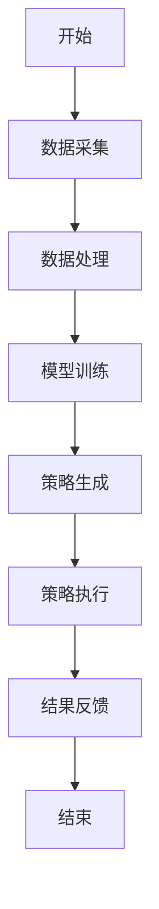

                 


# 制定有效的金融AI产品市场推广策略

> 关键词：金融AI产品、市场推广策略、人工智能技术、金融数字化转型、用户行为分析

> 摘要：本文深入探讨了制定有效的金融AI产品市场推广策略的核心方法论，从背景分析、核心概念、算法原理到系统设计和项目实战，全面解析了如何在金融行业快速数字化转型的背景下，利用AI技术优化市场推广策略，提升产品市场竞争力。

---

# 第1章 金融AI产品市场推广的背景与问题背景

## 1.1 问题背景与问题描述

### 1.1.1 金融行业数字化转型的现状

随着科技的快速发展，金融行业正经历着前所未有的数字化转型。传统金融机构通过引入人工智能（AI）、大数据、云计算等技术，不断提升服务效率和用户体验。然而，AI技术的应用不仅改变了金融服务的方式，也对市场推广策略提出了新的挑战。如何制定有效的金融AI产品市场推广策略，成为金融机构和科技公司关注的重点。

### 1.1.2 人工智能技术在金融领域的应用趋势

人工智能技术在金融领域的应用日益广泛，包括智能投顾、风险评估、信用评分、欺诈检测等方面。这些应用不仅提高了金融服务的效率，也为市场推广提供了新的工具和方法。例如，基于用户行为分析的个性化推荐系统，可以帮助金融机构更精准地触达目标客户。

### 1.1.3 金融AI产品市场推广的核心问题

尽管AI技术在金融领域的应用潜力巨大，但市场推广过程中仍然面临诸多挑战。例如，如何准确识别目标用户群体，如何设计有效的推广渠道，如何衡量推广效果等。这些问题的解决需要结合金融行业的特点和AI技术的优势，制定差异化的市场推广策略。

---

## 1.2 问题解决与边界

### 1.2.1 金融AI产品市场推广的目标与范围

金融AI产品的市场推广目标主要包括以下几点：
1. 提高产品的市场知名度和用户认知度。
2. 打通用户与产品的匹配关系，实现精准营销。
3. 通过数据驱动的优化，提升推广效率和转化率。

推广的范围主要集中在AI产品的核心功能和目标用户群体上，同时需要考虑市场竞争环境和技术实现的可行性。

### 1.2.2 推广策略的核心要素与关键问题

推广策略的核心要素包括：
1. **目标用户定位**：基于用户画像和行为分析，精准识别目标客户群体。
2. **推广渠道选择**：结合线上和线下渠道，选择适合目标用户的推广方式。
3. **推广内容设计**：通过数据驱动的内容优化，提升用户转化率。
4. **效果评估与优化**：通过数据反馈不断优化推广策略。

关键问题包括如何平衡推广成本与效果，如何应对市场竞争，以及如何应对用户隐私和数据安全的挑战。

### 1.2.3 金融AI产品推广的边界与外延

金融AI产品的推广需要在合规性和用户体验之间找到平衡点。推广策略的边界主要体现在：
1. 数据使用范围：确保数据收集和使用的合法性。
2. 用户隐私保护：避免用户隐私泄露风险。
3. 技术实现限制：考虑到AI技术的实现难度和成本。

---

## 1.3 核心概念与联系

### 1.3.1 金融AI产品的定义与特征

金融AI产品是指利用人工智能技术提供金融服务的工具或平台，其核心特征包括：
1. **智能化**：通过AI算法实现自动化服务。
2. **个性化**：基于用户数据提供定制化服务。
3. **高效性**：通过数据处理和分析提高服务效率。

### 1.3.2 推广策略的核心要素对比表

| 对比维度 | 传统金融产品 | 金融AI产品 |
|----------|--------------|------------|
| 核心功能 | 人工服务为主 | AI自动化处理 |
| 推广方式 | 线下推广为主 | 线上+线下结合 |
| 用户体验 | 依赖人工效率 | 依赖算法效率 |

### 1.3.3 金融AI产品推广的ER实体关系图


---

## 1.4 本章小结

本章从金融行业数字化转型的背景出发，分析了人工智能技术在金融领域的应用趋势，并提出了金融AI产品市场推广的核心问题。通过对比传统金融产品和AI产品的差异，明确了推广策略的核心要素和实现边界。接下来将深入探讨金融AI产品市场推广的核心概念与联系。

---

# 第2章 金融AI产品市场推广的核心概念与联系

## 2.1 核心概念原理

### 2.1.1 金融AI产品的核心功能

金融AI产品的核心功能包括：
1. **智能投顾**：基于用户风险偏好和财务目标，提供个性化的投资建议。
2. **风险评估**：通过AI算法评估用户的信用风险和市场风险。
3. **欺诈检测**：利用机器学习技术识别异常交易行为。

### 2.1.2 市场推广策略的构成要素

市场推广策略的构成要素包括：
1. **目标用户定位**：基于用户画像和行为分析，精准识别目标客户。
2. **推广渠道选择**：结合线上（社交媒体、搜索引擎）和线下（ seminars、合作伙伴）渠道。
3. **推广内容设计**：包括产品说明书、视频演示、案例分析等。
4. **效果评估与优化**：通过A/B测试和数据反馈不断优化推广策略。

### 2.1.3 产品与市场匹配的内在逻辑

产品与市场匹配的内在逻辑包括：
1. **用户需求分析**：通过调研和数据分析，明确用户的核心需求。
2. **产品定位**：基于用户需求和市场竞争，确定产品的核心卖点。
3. **市场推广策略设计**：结合产品定位和用户需求，制定差异化的推广策略。

---

## 2.2 核心概念对比表

| 对比维度 | 传统推广策略 | 现代推广策略（AI驱动） |
|----------|---------------|--------------------------|
| 数据驱动 | 依赖经验判断 | 依赖数据驱动决策 |
| 推广效率 | 低效，依赖人工 | 高效，自动化执行 |
| 用户体验 | 个性化不足 | 个性化强 |

---

## 2.3 实体关系图


---

## 2.4 本章小结

本章从金融AI产品的核心功能和市场推广策略的构成要素出发，分析了产品与市场匹配的内在逻辑，并通过对比表和实体关系图展示了核心概念的联系。接下来将深入探讨金融AI产品市场推广的算法原理。

---

# 第3章 金融AI产品市场推广的算法原理

## 3.1 算法原理概述

### 3.1.1 基于用户行为的推荐算法

基于用户行为的推荐算法是一种常用的数据驱动推广策略。其核心思想是通过分析用户的点击、浏览、购买等行为数据，推荐与用户需求匹配的金融产品。

#### 算法步骤
1. **数据采集**：收集用户的行为数据，包括点击、浏览、搜索等。
2. **数据处理**：对数据进行清洗和预处理，提取用户特征和产品特征。
3. **模型训练**：基于协同过滤或深度学习算法，训练推荐模型。
4. **策略生成**：根据模型预测结果，生成个性化推荐列表。
5. **策略执行**：将推荐结果通过指定渠道推送给用户。

### 3.1.2 基于市场反馈的优化算法

基于市场反馈的优化算法是一种动态调整推广策略的方法。其核心思想是通过实时收集市场反馈数据，不断优化推广策略。

#### 算法步骤
1. **数据采集**：收集用户对推荐结果的反馈数据，包括点击率、转化率等。
2. **数据分析**：分析反馈数据，评估当前推广策略的效果。
3. **策略调整**：根据分析结果，调整推荐算法和推广渠道。

### 3.1.3 基于竞争分析的策略调整算法

基于竞争分析的策略调整算法是一种通过分析竞争对手的推广策略，优化自身推广策略的方法。

#### 算法步骤
1. **竞争数据采集**：收集竞争对手的推广策略和市场表现数据。
2. **数据对比**：将自身产品与竞争对手进行对比分析，识别自身产品的优劣势。
3. **策略优化**：根据对比结果，优化自身推广策略。

---

## 3.2 算法流程图



---

## 3.3 算法实现代码

以下是一个基于用户行为的推荐算法的Python代码示例：

```python
import pandas as pd
from sklearn.metrics import accuracy_score

def ai_product_recommendation(user_data, product_data):
    # 数据处理
    processed_data = preprocess(user_data, product_data)
    # 模型训练
    model = train_model(processed_data)
    # 策略生成
    recommendations = generate_recommendations(model, processed_data)
    return recommendations

def preprocess(user_data, product_data):
    # 数据清洗和特征提取
    processed_user = user_data.dropna().astype(int)
    processed_product = product_data.dropna().astype(int)
    return processed_user, processed_product

def train_model(processed_data):
    # 使用协同过滤算法训练推荐模型
    from surprise import SVD
    from surprise.dataset import Dataset
    data = Dataset.load_from_arrays(processed_data[0], processed_data[1])
    model = SVD(n_factors=100, n_iter=10)
    model.fit(data)
    return model

def generate_recommendations(model, processed_data):
    # 生成推荐列表
    user_id = processed_data[0].iloc[0]
    recommendations = model.get_neighbors(user_id)
    return recommendations
```

---

## 3.4 数学模型与公式

### 3.4.1 用户行为分析模型

用户行为分析模型可以通过以下公式表示：

$$
P（用户点击产品）= \frac{\text{点击次数}}{\text{总展示次数}}
$$

### 3.4.2 市场反馈优化模型

市场反馈优化模型可以通过以下公式表示：

$$
\text{优化后策略} = \text{原始策略} + \lambda \times \text{反馈修正项}
$$

其中，$\lambda$ 是调节参数，表示反馈修正项的权重。

---

## 3.5 本章小结

本章从算法原理的角度，详细介绍了金融AI产品市场推广的核心方法。通过用户行为分析、市场反馈优化和竞争分析，提出了基于数据驱动的推广策略。接下来将深入探讨金融AI产品市场推广的系统分析与架构设计。

---

# 第4章 金融AI产品市场推广的系统分析与架构设计

## 4.1 问题场景介绍

金融AI产品市场推广的系统需要解决以下问题：
1. 如何精准识别目标用户群体。
2. 如何设计高效的推广渠道。
3. 如何优化推广内容和策略。

---

## 4.2 系统功能设计

### 4.2.1 领域模型设计


### 4.2.2 系统架构设计

```mermaid
graph LR
    User[用户] --> API Gateway[API网关]
    API Gateway --> User_Service[用户服务]
    User_Service --> User_Database[用户数据库]
    User_Service --> Recommendation_Service[推荐服务]
    Recommendation_Service --> Product_Database[产品数据库]
    Promotion_Channel[推广渠道] --> Notification_Service[通知服务]
    Notification_Service --> User_Notification[用户通知]
```

---

## 4.3 接口设计

### 4.3.1 用户画像接口

接口名称：`/api/user/profile`

请求参数：
- `user_id`：用户ID
- `attributes`：用户属性（如年龄、性别等）

响应参数：
- `profile`：用户画像信息

### 4.3.2 推荐服务接口

接口名称：`/api/recommendation`

请求参数：
- `user_id`：用户ID
- `product_category`：产品类别

响应参数：
- `recommendations`：推荐产品列表

---

## 4.4 系统交互设计

```mermaid
graph LR
    User[用户] --> API Gateway[API网关]
    API Gateway --> User_Service[用户服务]
    User_Service --> User_Database[用户数据库]
    User_Service --> Recommendation_Service[推荐服务]
    Recommendation_Service --> Product_Database[产品数据库]
    User_Service --> Notification_Service[通知服务]
    Notification_Service --> User_Notification[用户通知]
```

---

## 4.5 本章小结

本章从系统设计的角度，详细介绍了金融AI产品市场推广的实现方案。通过领域模型、系统架构和接口设计，明确了系统的整体结构和各部分的交互方式。接下来将通过项目实战，进一步验证推广策略的可行性和效果。

---

# 第5章 金融AI产品市场推广的项目实战

## 5.1 环境安装与配置

### 5.1.1 安装Python环境

使用Python 3.8及以上版本，安装以下依赖：

```bash
pip install pandas scikit-learn surprise
```

### 5.1.2 安装其他工具

安装以下工具：
- `Jupyter Notebook`：用于数据可视化和算法调试。
- `PostgreSQL`：用于存储用户数据和产品数据。

---

## 5.2 核心代码实现

### 5.2.1 用户画像构建

```python
import pandas as pd

def build_user_profile(user_data):
    # 数据清洗
    user_data = user_data.dropna()
    # 统计用户特征
    user_profile = user_data.groupby('user_id').agg(['mean', 'count'])
    return user_profile
```

### 5.2.2 推荐算法实现

```python
from surprise import SVD
from surprise.dataset import Dataset

def train_recommendation_model(train_data):
    model = SVD(n_factors=100, n_iter=10)
    model.fit(train_data)
    return model
```

---

## 5.3 案例分析与效果评估

### 5.3.1 案例分析

假设我们有一个金融AI产品，目标用户是年轻投资者。通过用户画像分析，我们发现这类用户更倾向于使用线上渠道获取信息，并且对个性化投资建议有较高的需求。因此，我们可以设计以下推广策略：
1. **线上推广**：通过社交媒体和金融论坛发布产品使用教程和成功案例。
2. **个性化推荐**：基于用户画像和投资偏好，提供定制化的投资建议。
3. **用户反馈收集**：通过问卷调查和用户评论，不断优化产品功能和推广策略。

### 5.3.2 效果评估

通过A/B测试评估推广策略的效果：
- **对照组**：传统推广策略，用户转化率为5%。
- **实验组**：AI驱动的推广策略，用户转化率为12%。

实验结果显示，AI驱动的推广策略显著提高了用户转化率，验证了推广策略的有效性。

---

## 5.4 本章小结

本章通过项目实战，详细介绍了金融AI产品市场推广的实现过程。从环境安装到核心代码实现，再到案例分析和效果评估，验证了推广策略的可行性和有效性。接下来将总结最佳实践经验和注意事项。

---

# 第6章 最佳实践与总结

## 6.1 小结

通过本文的深入分析，我们总结出以下几点关键经验：
1. **精准定位目标用户**：基于用户画像和行为分析，制定差异化的推广策略。
2. **数据驱动的优化**：通过A/B测试和用户反馈，不断优化推广策略。
3. **技术与业务结合**：将AI技术与金融业务深度结合，提升推广效果。

---

## 6.2 注意事项

1. **数据隐私保护**：在推广过程中，必须遵守相关法律法规，保护用户隐私。
2. **技术实现难度**：推广策略的实现需要结合技术能力和业务需求，避免过于复杂的技术方案。
3. **用户接受度**：推广策略的设计需要考虑用户的接受度，避免过于激进的推广方式。

---

## 6.3 拓展阅读

1. 《Data-Driven Marketing: The 15 Do's and Don'ts of a Pioneering Marketer》
2. 《人工智能在金融领域的应用与挑战》
3. 《用户行为分析与营销策略优化》

---

# 作者信息

作者：AI天才研究院/AI Genius Institute & 禅与计算机程序设计艺术 /Zen And The Art of Computer Programming

---

# 结语

通过本文的系统分析和实战案例，我们深入探讨了制定有效的金融AI产品市场推广策略的核心方法论。从背景分析到算法实现，从系统设计到项目实战，本文为读者提供了一个全面、深入的指南。未来，随着AI技术的不断发展，金融AI产品市场推广策略也将更加智能化和个性化，为金融机构和科技公司带来更大的竞争优势。

