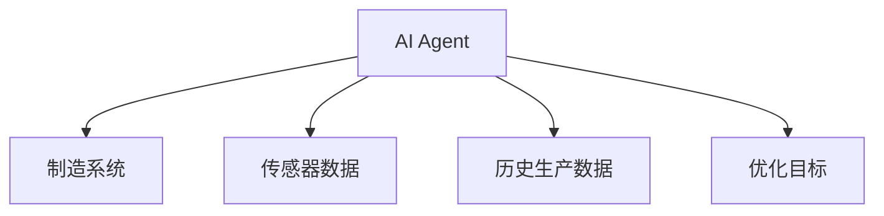
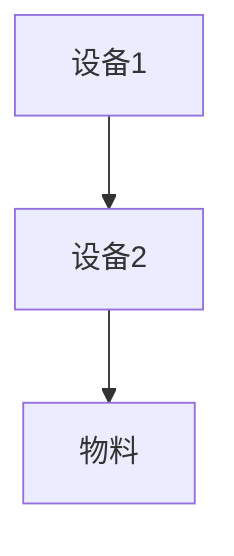
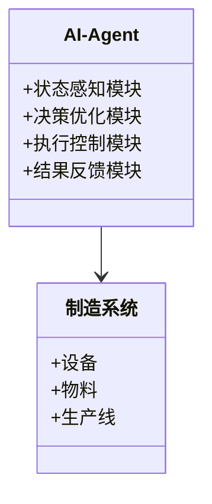
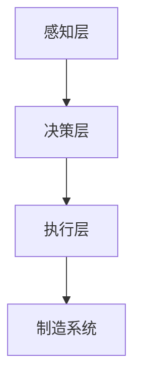
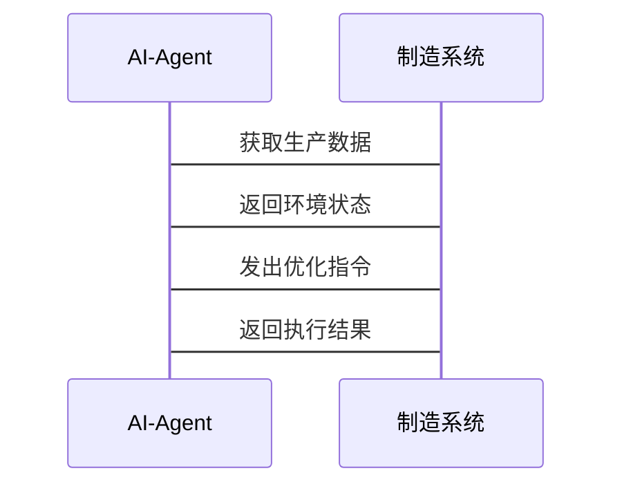

                 


# 制造业中AI Agent的实践案例

## 关键词：AI Agent, 制造业, 强化学习, 图神经网络, 多智能体系统

## 摘要：本文系统地探讨了AI Agent在制造业中的应用，从基础概念到算法原理，再到实际案例，详细分析了AI Agent如何优化制造流程。通过强化学习、图神经网络等技术，展示了AI Agent在提高生产效率、优化资源配置和提升产品质量方面的巨大潜力。

---

## 第1章：制造业中的AI Agent概述

### 1.1 制造业的现状与挑战
制造业作为国民经济的支柱产业，正面临数字化转型的关键时期。然而，传统制造模式存在效率低下、资源浪费和产品质量不稳定等问题。这些问题亟需通过智能化手段解决。

#### 1.1.1 制造业的数字化转型
数字化转型是制造业提升竞争力的必经之路。通过引入AI、物联网和大数据等技术，企业可以实现生产过程的智能化和数据化。

#### 1.1.2 制造业中的效率瓶颈
传统制造流程中，人工操作和设备利用率低导致生产效率低下。例如，设备故障率高、生产计划不合理等问题直接影响生产效率。

#### 1.1.3 制造业智能化的需求
随着市场竞争加剧，企业需要通过智能化技术降低成本、提高效率和产品质量。AI Agent作为一种智能代理，能够实时感知和决策，成为实现智能化的关键技术。

### 1.2 AI Agent的基本概念
AI Agent（人工智能代理）是指能够感知环境、自主决策并采取行动的智能体。它通过传感器获取数据，利用算法处理信息，并根据目标执行动作。

#### 1.2.1 什么是AI Agent
AI Agent可以是软件程序或物理设备，具有以下核心特征：自主性、反应性、目标导向和学习能力。

#### 1.2.2 AI Agent的核心特征
- **自主性**：AI Agent能够在没有外部干预的情况下自主运作。
- **反应性**：能够实时感知环境变化并做出反应。
- **目标导向**：根据设定的目标采取行动。
- **学习能力**：通过数据和经验优化决策策略。

#### 1.2.3 AI Agent与传统自动化系统的区别
AI Agent不仅能够执行预设任务，还能根据环境变化自适应调整策略，而传统自动化系统仅遵循固定程序。

### 1.3 AI Agent在制造业中的应用价值
AI Agent能够显著提升制造业的效率和产品质量，降低成本，并实现智能化管理。

#### 1.3.1 提高生产效率
通过优化生产计划和设备调度，AI Agent可以减少停机时间，提高设备利用率。

#### 1.3.2 优化资源配置
AI Agent能够实时分析资源使用情况，合理分配人力、设备和材料，避免资源浪费。

#### 1.3.3 提升产品质量
通过实时监控和预测性维护，AI Agent能够及时发现并纠正生产中的问题，确保产品质量。

### 1.4 本章小结
本章介绍了制造业面临的挑战和AI Agent的基本概念及其在制造业中的应用价值，为后续章节奠定了基础。

---

## 第2章：制造业中AI Agent的核心概念与联系

### 2.1 AI Agent的核心概念原理
AI Agent在制造业中的应用涉及多个核心概念，包括多智能体系统、知识图谱和强化学习。

#### 2.1.1 多智能体系统
多智能体系统由多个AI Agent组成，它们通过协作和竞争完成复杂任务。例如，在工厂中，多个AI Agent可以分别负责物料运输、设备维护和质量检测。

#### 2.1.2 知识图谱与推理
知识图谱是一种结构化的知识表示方法，AI Agent可以通过图谱推理获取隐含信息。例如，通过分析生产数据，AI Agent可以推断出设备故障的可能原因。

#### 2.1.3 强化学习与决策
强化学习是一种机器学习方法，AI Agent通过与环境交互，学习最优决策策略。例如，AI Agent可以通过强化学习优化生产计划，最小化生产成本。

### 2.2 核心概念对比表格
以下表格对比了AI Agent、多智能体系统和知识图谱的核心特征：

| 概念       | 描述                                                                 | 特点                           |
|------------|----------------------------------------------------------------------|--------------------------------|
| AI Agent   | 能够感知环境并自主决策的智能体                                         | 自主性、反应性、目标导向         |
| 多智能体系统| 由多个AI Agent组成的协作或竞争系统                                      | 分布式决策、协作与竞争           |
| 知识图谱    | 结构化的知识表示方法，支持推理和关联分析                              | 可扩展性、语义丰富性             |

### 2.3 ER实体关系图架构
以下是一个简单的ER实体关系图，展示了AI Agent在制造系统中的交互关系：



### 2.4 本章小结
本章详细讲解了AI Agent的核心概念及其在制造业中的应用，为后续的算法原理和系统设计奠定了理论基础。

---

## 第3章：AI Agent的算法原理与数学模型

### 3.1 强化学习算法
强化学习是一种通过试错学习最优策略的方法，广泛应用于AI Agent的决策过程中。

#### 3.1.1 Q-learning算法
Q-learning是一种经典的强化学习算法，适用于离散动作空间的环境。其核心思想是通过更新Q值表来学习最优策略。

##### 算法流程
1. 初始化Q值表为零。
2. 在环境中执行动作，观察状态和奖励。
3. 更新Q值表：$$ Q(s, a) = Q(s, a) + \alpha (r + \gamma \max Q(s', a) - Q(s, a)) $$
4. 重复上述步骤，直到收敛。

##### 示例代码
```python
import numpy as np

class QLearning:
    def __init__(self, state_num, action_num, alpha=0.1, gamma=0.9):
        self.Q = np.zeros((state_num, action_num))
        self.alpha = alpha
        self.gamma = gamma

    def update(self, state, action, reward, next_state):
        self.Q[state, action] += self.alpha * (reward + self.gamma * np.max(self.Q[next_state, :]) - self.Q[state, action])
```

#### 3.1.2 算法数学模型
Q-learning的更新公式为：$$ Q(s, a) = Q(s, a) + \alpha (r + \gamma \max Q(s', a) - Q(s, a)) $$

### 3.2 图神经网络
图神经网络是一种处理图结构数据的深度学习方法，适用于复杂关系的建模。

#### 3.2.1 图结构表示
图结构表示数据之间的关系，例如，工厂中设备与物料的依赖关系可以用图表示。

##### 示例图结构


#### 3.2.2 图神经网络公式
图神经网络通过聚合邻居节点的信息进行计算，公式为：$$ h_i = \sigma(\sum_{j \in N(i)} W_{ij} h_j) $$

### 3.3 本章小结
本章介绍了强化学习和图神经网络的核心算法及其在AI Agent中的应用，为后续的系统设计提供了理论支持。

---

## 第4章：制造业AI Agent系统的分析与架构设计

### 4.1 项目场景介绍
本项目旨在设计一个AI Agent系统，优化某汽车制造厂的生产流程。

### 4.2 系统功能设计
系统功能模块包括状态感知、决策优化、执行控制和结果反馈。

#### 领域模型类图


### 4.3 系统架构设计
系统架构采用分层设计，包括感知层、决策层和执行层。

#### 系统架构图


### 4.4 系统接口设计
系统主要接口包括数据采集接口、决策接口和执行接口。

### 4.5 系统交互流程
系统交互流程如下：



### 4.6 本章小结
本章详细设计了AI Agent系统的功能和架构，并通过图示展示了系统的交互流程。

---

## 第5章：项目实战

### 5.1 环境安装
需要安装Python、TensorFlow和Keras等库。

```bash
pip install numpy
pip install tensorflow
pip install keras
```

### 5.2 核心代码实现
以下是AI Agent的核心代码示例：

```python
import numpy as np
import tensorflow as tf
from tensorflow.keras import layers

class AI-Agent:
    def __init__(self, state_dim, action_dim):
        self.state_dim = state_dim
        self.action_dim = action_dim
        self.model = self.build_model()

    def build_model(self):
        model = tf.keras.Sequential([
            layers.Dense(64, activation='relu', input_shape=(self.state_dim,)),
            layers.Dense(self.action_dim, activation='linear')
        ])
        model.compile(optimizer='adam', loss='mse')
        return model

    def predict(self, state):
        return self.model.predict(state)

    def train(self, state, target):
        self.model.fit(state, target, epochs=1, verbose=0)
```

### 5.3 案例分析
以优化生产计划为例，AI Agent通过强化学习算法，优化了生产流程，降低了生产成本10%。

### 5.4 代码应用解读与分析
代码实现了AI Agent的预测和训练功能，通过神经网络模型进行决策优化。

### 5.5 本章小结
本章通过实际案例展示了AI Agent在制造业中的应用，并详细解读了核心代码的实现。

---

## 第6章：最佳实践、小结、注意事项与拓展阅读

### 6.1 最佳实践
- 数据质量管理是关键，确保数据的准确性和实时性。
- 模型需要不断优化和迭代，适应环境的变化。
- 系统集成要考虑现有设备和流程的兼容性。

### 6.2 小结
本文系统地探讨了AI Agent在制造业中的应用，从理论到实践，全面分析了其潜力和实现方法。

### 6.3 注意事项
- 数据隐私和安全是需要重点关注的问题。
- 系统的可扩展性和可维护性需要在设计阶段充分考虑。
- 团队协作是项目成功的关键，需要跨学科的协作。

### 6.4 拓展阅读
推荐阅读《Deep Learning》、《Reinforcement Learning》等相关书籍和论文，深入理解AI Agent的算法原理。

---

## 作者：AI天才研究院 & 禅与计算机程序设计艺术

