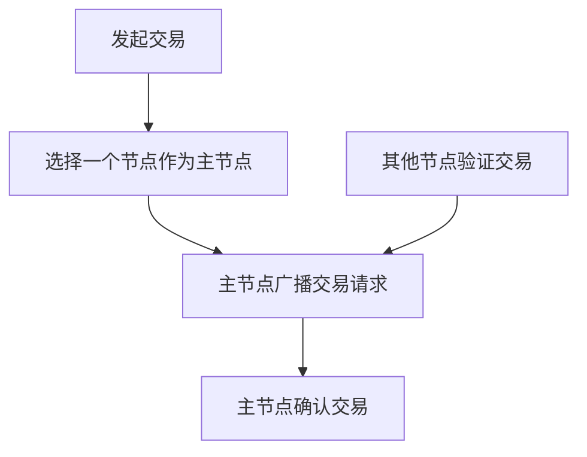
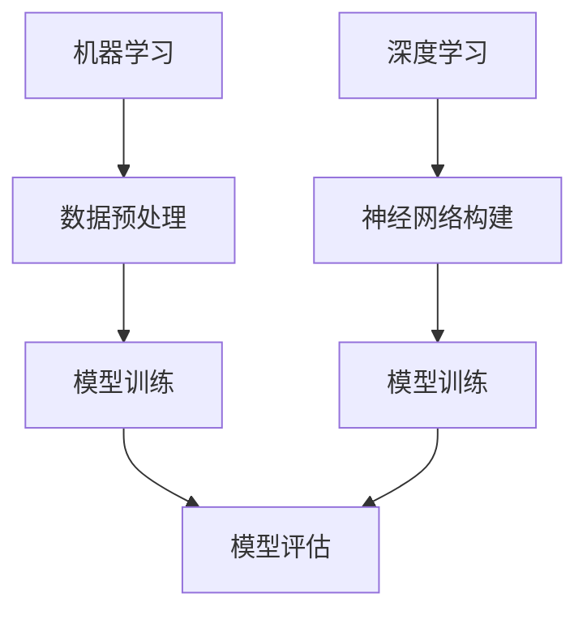
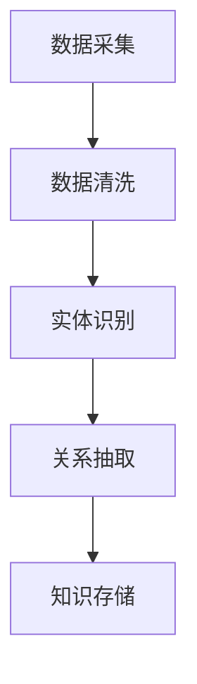
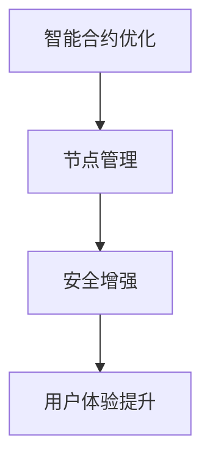
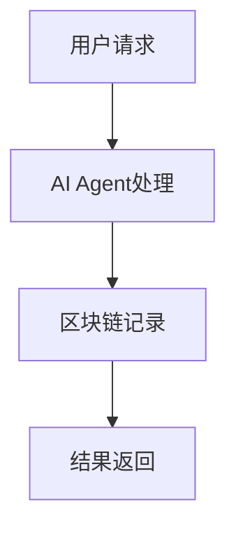
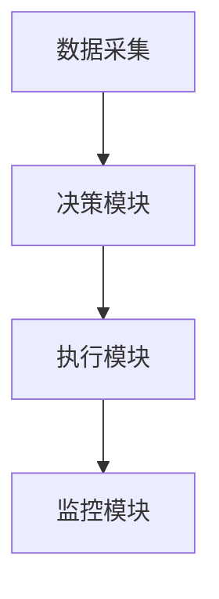
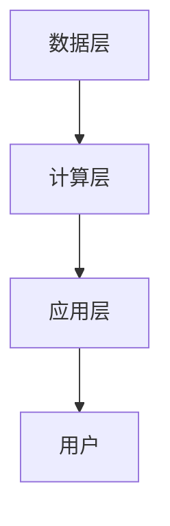
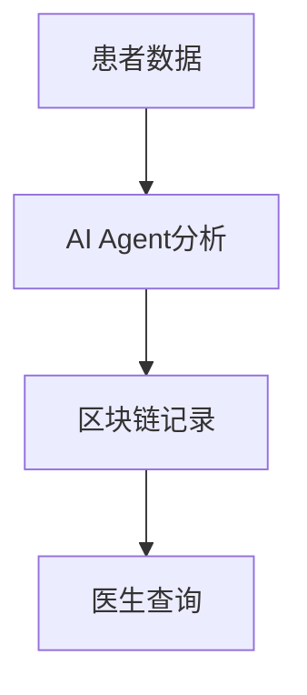

                 


# 区块链+AI：去中心化的可信AI Agent系统

> 关键词：区块链，人工智能，AI Agent，去中心化，可信系统

> 摘要：本文探讨了区块链与人工智能的结合，特别是去中心化的可信AI Agent系统的构建。文章从区块链和AI的基础概念出发，分析了它们的协同效应，详细讲解了可信AI Agent的设计原则和技术实现，并通过实际案例展示了如何将这些技术应用于现实场景。

---

## 第一部分：区块链与AI基础

### 第1章：区块链基础

#### 1.1 区块链的基本概念

区块链是一种分布式账本技术，通过去中心化、不可篡改和透明性等特点，解决了传统系统中的信任问题。其核心概念包括：

- **去中心化**：数据分布在多个节点上，无单点故障。
- **共识机制**：通过算法确保所有节点达成一致。
- **区块与链式结构**：数据以区块形式存储，每个区块包含交易信息和哈希指针。

**区块链分类对比表**：

| 类型         | 特点                     | 代表算法       |
|--------------|--------------------------|----------------|
| 公有链       | 开放、匿名               | Bitcoin        |
| 私有链       | 仅限内部使用             | 股权分配系统   |
| 联盟链       | 机构间合作               | 智能合约平台   |

#### 1.2 区块链的共识机制

共识机制是区块链的核心，确保所有节点达成一致。常见的共识机制包括：

- **PoW（工作量证明）**：通过计算哈希找到符合条件的区块，确保网络安全。
- **PoS（权益证明）**：根据节点持有的代币数量分配记账权，节省能源。
- **BFT（拜占庭容错）**：适用于小网络，快速达成共识。

**共识机制数学模型**：

$$ \text{节点数} = n, \text{故障节点数} = f $$

$$ \text{BFT要求}：2f +1 < n $$

**共识机制流程图**（使用Mermaid）：



#### 1.3 区块链的智能合约

智能合约是区块链上的自动执行程序，用于定义和约束参与方的义务。其特点包括：

- **自动执行**：无需人工干预。
- **不可篡改**：存储在区块链上，确保数据安全。
- **透明性**：所有参与者都能查看合约代码。

**智能合约应用场景对比表**：

| 场景         | 智能合约优势             | 示例                   |
|--------------|--------------------------|------------------------|
| 股权分配     | 自动化处理分配           | 企业股权管理系统       |
| 版权保护     | 确保创作者权益           | 数字版权保护平台       |

### 第2章：AI基础

#### 2.1 人工智能的基本概念

人工智能（AI）是模拟人类智能的计算机系统，涵盖机器学习、自然语言处理等领域。其核心概念包括：

- **机器学习**：通过数据训练模型，使其能够进行预测或分类。
- **深度学习**：使用多层神经网络，提取数据特征。
- **强化学习**：通过试错机制优化决策策略。

**机器学习与深度学习对比图**（使用Mermaid）：



#### 2.2 大型语言模型（LLM）

大型语言模型是基于大量数据训练的AI模型，能够进行自然语言理解与生成。其特点包括：

- **参数量大**：通常超过 billions。
- **预训练**：通过无监督学习捕获数据中的特征。
- **微调**：针对特定任务进行优化。

**LLM与传统NLP对比表**：

| 技术         | LLM优势             | 传统NLP             |
|--------------|----------------------|----------------------|
| 参数量       | 大                   | 小                   |
| 训练方式     | 预训练+微调          | 任务特定训练         |

#### 2.3 知识图谱与AI

知识图谱是结构化的数据表示，用于表示实体及其关系。其在AI中的应用包括：

- **语义理解**：帮助模型更好地理解上下文。
- **推理与问答**：基于知识图谱进行推理和回答问题。

**知识图谱构建流程图**（使用Mermaid）：



## 第二部分：区块链+AI的结合

### 第3章：区块链与AI的协同效应

#### 3.1 区块链如何增强AI系统的可信性

区块链通过去中心化和不可篡改性，确保AI系统的数据安全和透明性。其优势包括：

- **数据共享**：通过区块链实现数据的可信共享。
- **模型可信度**：确保AI模型的训练数据未被篡改。
- **结果验证**：通过区块链记录AI系统的决策过程。

**区块链在AI中的应用场景对比表**：

| 场景         | 区块链优势             | 示例                   |
|--------------|--------------------------|------------------------|
| 数据共享     | 确保数据可信            | 医疗数据共享平台       |
| 模型验证     | 防止模型被篡改          | 金融风控系统           |

#### 3.2 AI如何提升区块链系统的智能化

AI技术可以优化区块链的性能和用户体验。其应用包括：

- **智能合约优化**：通过AI分析合约执行情况，优化效率。
- **节点管理**：利用AI预测网络负载，动态调整节点分配。
- **安全增强**：通过AI实时监控网络，发现异常行为。

**AI在区块链中的应用流程图**（使用Mermaid）：



### 第4章：可信AI Agent系统

#### 4.1 可信AI Agent的定义

可信AI Agent是一种能够在去中心化环境中自主决策的智能体，其核心特征包括：

- **自主性**：无需外部干预，自主完成任务。
- **反应性**：能够实时感知环境并做出反应。
- **可信性**：确保决策过程的透明性和可追溯性。

**可信AI Agent与传统AI Agent对比表**：

| 特性         | 可信AI Agent             | 传统AI Agent           |
|--------------|--------------------------|------------------------|
| 自主性       | 高                       | 中                       |
| 可信性       | 强                       | 弱                       |
| 去中心化     | 是                      | 否                      |

#### 4.2 可信AI Agent的设计原则

设计可信AI Agent需要考虑以下原则：

- **数据安全**：确保数据在传输和存储过程中的安全性。
- **决策透明**：提供可解释的决策过程，便于审计和追溯。
- **容错性**：能够在部分节点故障的情况下继续运行。

**可信AI Agent系统架构图**（使用Mermaid）：



## 第三部分：技术实现与实战

### 第5章：系统架构与设计

#### 5.1 系统功能设计

可信AI Agent系统的功能模块包括：

- **数据采集模块**：负责收集环境中的数据。
- **决策模块**：基于区块链和AI算法做出决策。
- **执行模块**：将决策转化为具体行动。
- **监控模块**：实时监控系统运行状态。

**系统功能模块图**（使用Mermaid）：



#### 5.2 系统架构设计

系统架构采用分层设计，包括数据层、计算层和应用层。各层之间的交互通过API完成。

**系统架构图**（使用Mermaid）：



### 第6章：项目实战

#### 6.1 环境配置

项目需要以下环境：

- **区块链平台**：以太坊、Hyperledger等。
- **AI框架**：TensorFlow、PyTorch等。
- **开发工具**：IDE（如VS Code）、命令行工具。

#### 6.2 核心代码实现

以下是AI Agent与区块链结合的核心代码示例：

```python
import json
from web3 import Web3

# 初始化区块链连接
web3 = Web3(Web3.HTTPProvider("http://localhost:8545"))

# 定义智能合约地址和ABI
contract_address = "0x..."
contract_abi = json.loads('...')

# 创建合约对象
contract = web3.eth.contract(address=contract_address, abi=contract_abi)

# AI Agent决策函数
def ai_decision():
    # 收集数据
    data = collect_data()
    # 分析数据
    analysis = analyze_data(data)
    # 返回决策结果
    return analysis

# 区块链交互函数
def blockchain_interaction(action):
    if action == 'submit':
        result = contract.functions.submitData(data).transact()
        return result
    elif action == 'query':
        result = contract.functions.queryData().call()
        return result

# 主函数
def main():
    decision = ai_decision()
    if decision:
        blockchain_interaction('submit')
    else:
        blockchain_interaction('query')

if __name__ == "__main__":
    main()
```

#### 6.3 实际案例分析

以医疗数据共享平台为例，AI Agent可以利用区块链确保数据的可信性和隐私性。通过AI分析，医生可以快速获取患者的完整病历，提高诊断效率。

**案例分析流程图**（使用Mermaid）：



## 第四部分：总结与展望

### 第7章：总结

区块链与AI的结合为去中心化的可信AI Agent系统提供了新的可能性。通过区块链的去中心化和不可篡改性，AI系统的可信性和安全性得到了显著提升。可信AI Agent的设计原则和实现技术为未来的智能化系统奠定了基础。

### 第8章：未来展望

随着技术的发展，区块链和AI的结合将更加紧密。未来的可信AI Agent系统将具备更强的自主性和智能化，能够在更多领域发挥重要作用。此外，如何进一步优化区块链的性能，降低AI系统的能耗，也将是研究的重点。

### 第9章：注意事项与最佳实践

- **数据隐私**：在设计系统时，必须考虑数据的隐私保护。
- **性能优化**：区块链和AI的结合可能带来性能挑战，需进行优化。
- **法律法规**：确保系统符合相关法律法规，特别是在数据使用方面。

### 第10章：小结

区块链与AI的结合不仅提升了系统的可信性，还为去中心化应用提供了新的可能性。通过本文的详细讲解，读者可以全面了解可信AI Agent系统的构建过程，并能够将其应用于实际场景中。

---

作者：AI天才研究院 & 禅与计算机程序设计艺术

