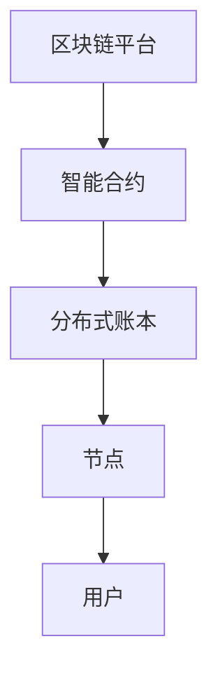

                 


```markdown
# 区块链在供应链金融中的应用与挑战

> 关键词：区块链，供应链金融，分布式账本，智能合约，共识机制

> 摘要：本文深入探讨了区块链技术在供应链金融中的应用，分析了其核心原理、应用场景、挑战及解决方案。通过实际案例和技术细节，展示了区块链如何优化供应链金融流程，解决传统模式中的痛点，同时探讨了技术实现中的关键问题和未来发展方向。

---

# 第一部分: 区块链与供应链金融概述

## 第1章: 区块链与供应链金融的概述

### 1.1 区块链的基本概念
#### 1.1.1 区块链的定义与特点
区块链是一种去中心化的分布式账本技术，通过密码学和共识机制确保数据的安全性和不可篡改性。其特点包括去中心化、透明性、不可篡改性和可追溯性。

#### 1.1.2 区块链的核心技术原理
区块链由多个区块组成，每个区块包含交易数据和链式结构，通过哈希指针链接。每个区块还包含一个 Merkle 根哈希，确保数据完整性和一致性。

#### 1.1.3 区块链在金融领域的应用潜力
区块链在金融领域的应用包括跨境支付、智能合约、供应链金融等，能够提高效率、降低成本并增强信任。

### 1.2 供应链金融的定义与特点
#### 1.2.1 供应链金融的定义
供应链金融是指通过整合供应链上的企业，提供融资、支付和风险管理等服务，以支持企业运营。

#### 1.2.2 供应链金融的主要参与方
供应链金融的主要参与方包括核心企业、供应商、分销商、银行和第三方支付平台。

#### 1.2.3 供应链金融的传统模式与痛点
传统供应链金融模式存在信息不对称、融资效率低、成本高等问题，导致企业融资困难。

### 1.3 区块链与供应链金融的结合
#### 1.3.1 区块链技术如何解决供应链金融的痛点
区块链通过去中心化和透明性，解决信息不对称问题，提高融资效率并降低成本。

#### 1.3.2 区块链在供应链金融中的应用场景
区块链在供应链金融中的应用场景包括应收账款融资、电子发票、供应链透明化等。

#### 1.3.3 区块链技术对供应链金融的潜在影响
区块链能够提高供应链金融的透明度和效率，降低风险，促进供应链的整体优化。

---

## 第2章: 区块链的核心技术原理

### 2.1 分布式账本技术
#### 2.1.1 分布式账本的定义
分布式账本是一种去中心化的数据存储方式，多个节点共同维护同一份账本，确保数据一致性和可靠性。

#### 2.1.2 分布式账本的特点
- 分布式账本具有去中心化、透明性、不可篡改性和可追溯性等特点。
- 通过分布式账本，供应链金融中的数据可以实时更新并同步，减少信息不对称。

#### 2.1.3 分布式账本在供应链金融中的应用
分布式账本在供应链金融中的应用包括实时跟踪物流信息、验证交易数据的真实性等。

### 2.2 共识机制
#### 2.2.1 共识机制的定义
共识机制是一种在分布式系统中达成一致的方法，确保所有节点对同一事务达成一致。

#### 2.2.2 常见的共识机制
- **POW（工作量证明）**：比特币采用的共识机制，通过计算哈希值来验证交易。
- **POS（权益证明）**：以太坊采用的共识机制，通过持有代币的权益来验证交易。
- **BFT（拜占庭容错）**：一种适用于联盟链的共识机制，通过投票方式达成一致。

#### 2.2.3 共识机制在供应链金融中的应用
共识机制在供应链金融中的应用包括验证交易的真实性、确保账本的准确性和一致性。

### 2.3 智能合约
#### 2.3.1 智能合约的定义
智能合约是一种基于区块链的自动执行合约，能够根据预设条件自动执行交易。

#### 2.3.2 智能合约的工作原理
智能合约通过区块链平台部署在区块链上，当触发预设条件时，自动执行相应的操作。

#### 2.3.3 智能合约在供应链金融中的应用
智能合约在供应链金融中的应用包括自动执行支付、自动处理融资申请等。

### 2.4 加密技术
#### 2.4.1 加密技术的定义
加密技术是一种通过数学算法对数据进行加密和解密的技术，确保数据的安全性。

#### 2.4.2 常见的加密算法
- **哈希函数**：如 SHA-256，用于生成数据的唯一哈希值。
- **数字签名**：通过公钥和私钥对数据进行签名，确保数据的完整性和真实性。

#### 2.4.3 加密技术在供应链金融中的应用
加密技术在供应链金融中的应用包括保护交易数据的安全性、验证交易的合法性等。

---

## 第3章: 供应链金融的业务流程与痛点

### 3.1 供应链金融的传统业务流程
#### 3.1.1 供应商融资流程
供应商需要向银行提供大量纸质文件，审批流程繁琐，融资周期长。

#### 3.1.2 分销商融资流程
分销商需要提供供应链中的交易数据，融资难度大，成本高。

#### 3.1.3 企业应收账款融资流程
企业需要提供应收账款的相关证明，融资流程复杂，审批时间长。

### 3.2 供应链金融的传统模式痛点
#### 3.2.1 信息不对称问题
传统供应链金融模式中，信息传递不畅，导致融资难。

#### 3.2.2 资金流转效率低
传统模式中，资金流转需要多个中间环节，效率低，成本高。

#### 3.2.3 融资成本高
由于信息不对称和风险高，传统供应链金融融资成本较高。

### 3.3 区块链如何解决供应链金融的痛点
#### 3.3.1 解决信息不对称问题
区块链通过分布式账本和透明性，实现信息共享，减少信息不对称。

#### 3.3.2 提高资金流转效率
区块链通过智能合约和自动化流程，提高资金流转效率，降低成本。

#### 3.3.3 降低融资成本
区块链通过减少中间环节和提高信任度，降低融资成本。

---

## 第4章: 区块链在供应链金融中的应用场景

### 4.1 应收账款融资
#### 4.1.1 应收账款融资的定义
应收账款融资是指企业通过应收账款作为质押，向银行或其他金融机构申请融资。

#### 4.1.2 应收账款融资的区块链实现
通过区块链技术，实现应收账款的数字化和透明化，确保数据真实性和可追溯性。

#### 4.1.3 应收账款融资的案例分析
以某制造企业为例，通过区块链技术实现应收账款融资，提高融资效率并降低成本。

### 4.2 电子发票
#### 4.2.1 电子发票的定义
电子发票是指通过电子方式开具的发票，具有高效、便捷和环保的特点。

#### 4.2.2 电子发票的区块链实现
通过区块链技术，实现电子发票的防伪和可追溯，确保发票的真实性。

#### 4.2.3 电子发票的案例分析
以某电商平台为例，通过区块链技术实现电子发票的管理，提高发票管理效率。

### 4.3 供应链透明化
#### 4.3.1 供应链透明化的定义
供应链透明化是指通过技术手段实现供应链各环节的透明和可追溯。

#### 4.3.2 供应链透明化的区块链实现
通过区块链技术，实现供应链各环节的数据共享和实时更新，确保数据的透明和可追溯。

#### 4.3.3 供应链透明化的案例分析
以某跨国企业为例，通过区块链技术实现供应链透明化，提高供应链整体效率和信任度。

---

## 第5章: 区块链在供应链金融中的挑战与解决方案

### 5.1 技术挑战
#### 5.1.1 技术难题
- 区块链的性能问题，如交易吞吐量和响应时间。
- 区块链的可扩展性问题，如何支持大规模应用。

#### 5.1.2 技术解决方案
- 采用侧链或二层区块链技术，提高交易吞吐量。
- 优化共识机制，提高交易响应时间。

### 5.2 监管与合规挑战
#### 5.2.1 监管难题
- 区块链的去中心化特性与监管要求的冲突。
- 如何确保区块链应用符合金融监管要求。

#### 5.2.2 监管解决方案
- 与监管机构合作，制定区块链应用的监管框架。
- 采用许可链，确保区块链应用符合监管要求。

### 5.3 隐私与安全挑战
#### 5.3.1 隐私难题
- 供应链金融中的数据隐私保护问题。
- 如何在共享数据的同时保护隐私。

#### 5.3.2 隐私解决方案
- 采用零知识证明技术，保护数据隐私。
- 通过访问控制机制，限制数据访问权限。

---

## 第6章: 区块链在供应链金融中的解决方案

### 6.1 技术优化方案
#### 6.1.1 区块链技术优化
- 采用轻量级区块链协议，降低资源消耗。
- 优化智能合约代码，提高执行效率。

#### 6.1.2 系统架构优化
- 采用分片技术，提高区块链网络的吞吐量。
- 优化网络拓扑结构，提高数据传输效率。

### 6.2 制度与创新方案
#### 6.2.1 制度创新
- 推动区块链技术的标准化和规范化。
- 建立区块链技术应用的行业标准和规范。

#### 6.2.2 创新融资模式
- 推动供应链金融的数字化转型，采用区块链技术实现融资创新。

---

## 第7章: 区块链在供应链金融中的系统设计

### 7.1 系统需求分析
#### 7.1.1 业务需求
- 实现供应链金融的数字化和自动化。
- 提供高效的融资服务和风险管理。

#### 7.1.2 技术需求
- 高可用性和高性能的区块链平台。
- 支持智能合约和分布式账本的实现。

### 7.2 系统架构设计
#### 7.2.1 系统架构图


#### 7.2.2 模块划分
- **区块链平台**：负责区块链网络的搭建和管理。
- **智能合约**：实现供应链金融中的自动化交易。
- **分布式账本**：存储供应链金融的相关数据。
- **节点**：区块链网络中的各个节点，负责数据的传播和验证。

### 7.3 系统功能设计
#### 7.3.1 核心功能
- 数据录入与验证
- 智能合约执行
- 交易记账与确认

#### 7.3.2 功能实现
- 提供用户友好的界面，方便数据录入和查询。
- 实现智能合约的自动执行，确保交易的自动化和高效性。

### 7.4 系统接口设计
#### 7.4.1 接口定义
- 提供API接口，方便与其他系统的集成。
- 支持多种数据格式，如JSON和XML。

#### 7.4.2 接口实现
- 采用RESTful API，实现系统的可扩展性和灵活性。
- 提供详细的接口文档，方便开发者使用。

### 7.5 系统交互设计
#### 7.5.1 交互流程
- 用户发起交易请求，系统验证交易合法性。
- 验证通过后，智能合约自动执行交易。
- 交易结果记录在区块链上，确保数据的不可篡改性。

#### 7.5.2 交互案例
- 用户提交应收账款融资申请，系统通过智能合约自动审核并放款。

---

## 第8章: 总结与展望

### 8.1 总结
本文详细探讨了区块链技术在供应链金融中的应用，分析了其核心原理、应用场景、挑战及解决方案。通过实际案例和技术细节，展示了区块链如何优化供应链金融流程，解决传统模式中的痛点。

### 8.2 未来展望
随着区块链技术的不断发展和创新，供应链金融将更加智能化和高效化。未来，区块链技术将在供应链金融中发挥更大的作用，推动供应链金融的数字化转型。

---

## 附录

### 附录A: 相关术语解释
- **区块链**：一种去中心化的分布式账本技术。
- **智能合约**：基于区块链的自动执行合约。
- **分布式账本**：多个节点共同维护的账本。

### 附录B: 参考文献
- [1] 王某某. 区块链技术与应用. 北京: 人民邮电出版社, 2020.
- [2] 李某某. 供应链金融的数字化转型. 北京: 经济管理出版社, 2021.

---

## 作者：AI天才研究院/AI Genius Institute & 禅与计算机程序设计艺术 /Zen And The Art of Computer Programming
```

