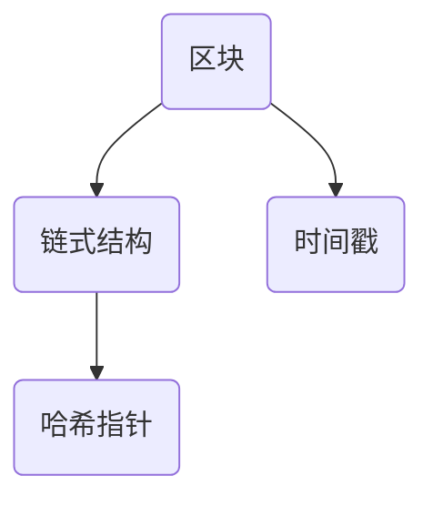
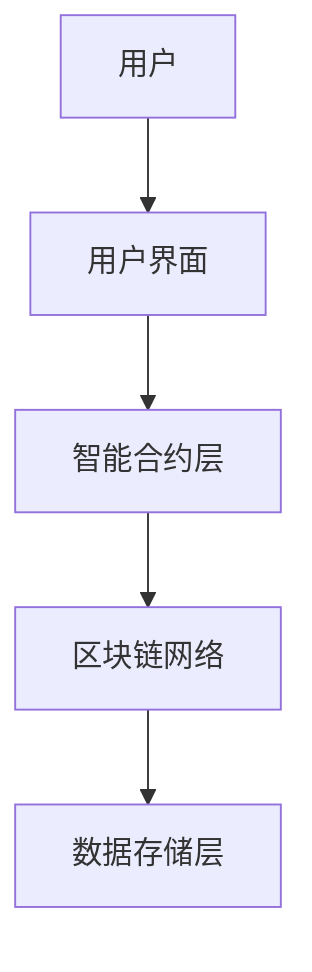

                 


```markdown
# 区块链在投资理财中的应用与挑战

> 关键词：区块链、投资理财、DeFi、智能合约、数字资产

> 摘要：区块链技术作为一种去中心化、不可篡改的分布式账本技术，正在逐步改变传统的投资理财方式。本文将从区块链的基本概念出发，详细探讨其在投资理财中的应用场景、技术原理、系统架构，并结合实际案例分析其在应用过程中面临的挑战与解决方案。通过本文的分析，读者将能够全面理解区块链技术如何为投资理财带来革新，并掌握其未来的发展趋势。

---

# 第一部分：区块链在投资理财中的背景与核心概念

## 第1章：区块链技术的基本概念与投资理财的背景

### 1.1 区块链的定义与核心原理

区块链是一种去中心化的分布式账本技术，通过密码学算法和共识机制确保数据的安全性和不可篡改性。其核心原理包括以下几个方面：

1. **区块结构**：区块由交易数据、哈希指针和时间戳组成，每个区块通过哈希指针链接形成一条链式结构。
2. **共识机制**：通过共识算法（如比特币的POW、以太坊的POS等）确保所有节点达成一致，验证交易的有效性。
3. **去中心化**：通过分布式节点网络实现数据的分布式存储和验证，避免单点故障和数据篡改。



### 1.2 投资理财的数字化转型

在数字经济快速发展的今天，投资理财方式也在发生深刻变化。传统的投资理财存在以下痛点：

1. **信息不对称**：投资者难以获取透明的资产信息和交易记录。
2. **信任缺失**：中间机构的存在可能导致资产挪用或欺诈行为。
3. **效率低下**：传统金融体系中，资产过户、交易清算等流程耗时长、成本高。

区块链技术通过去中心化、透明性和不可篡改性，为解决上述问题提供了新的可能性。

### 1.3 区块链在投资理财中的核心要素

区块链在投资理财中的应用涉及多个核心要素，包括：

1. **数字资产**：区块链支持的数字货币（如比特币、以太坊）和代币（如ERC-20）。
2. **智能合约**：通过预设的智能合约自动执行投资协议，确保交易的透明性和可执行性。
3. **去中心化金融（DeFi）**：基于区块链的去中心化金融平台，提供借贷、交易、理财等多种金融服务。

---

## 第2章：区块链在投资理财中的应用场景

### 2.1 数字资产投资

区块链技术为数字资产的发行、交易和管理提供了技术支持。例如：

1. **数字股票**：通过区块链发行代表公司股份的代币，投资者可以通过智能合约进行股份转让和分红。
2. **数字债券**：发行基于区块链的债券代币，通过智能合约自动执行债券的还本付息。

### 2.2 智能合约在投资中的应用

智能合约是一种自动执行的数字协议，广泛应用于投资理财的多个场景：

1. **自动投资**：通过智能合约定期执行定投任务。
2. **自动分红**：当区块链上的代币达到一定收益时，智能合约自动分配收益。
3. **风险管理**：通过智能合约设定止损和止盈条件，自动执行交易指令。

### 2.3 去中心化金融（DeFi）的潜力

DeFi（Decentralized Finance）是基于区块链的去中心化金融服务，涵盖借贷、交易、理财等多个领域。其优势包括：

1. **无需信任**：所有交易基于智能合约自动执行，无需依赖中间机构。
2. **透明性**：所有交易记录在区块链上，公开透明可查。
3. **可扩展性**：通过区块链技术实现高频交易和大规模资产流转。

---

## 第3章：区块链在投资理财中的技术挑战与解决方案

### 3.1 技术挑战

1. **安全性问题**：区块链系统可能面临黑客攻击、漏洞利用等安全威胁。
2. **可扩展性问题**：区块链的交易吞吐量有限，难以满足大规模投资理财需求。
3. **监管问题**：区块链的去中心化特性与传统金融监管存在冲突。

### 3.2 解决方案

1. **安全性提升**：
   - **双重签名**：通过多重签名技术确保资金的安全性。
   - **零知识证明**：在不泄露交易细节的情况下验证交易的有效性。

2. **可扩展性优化**：
   - **侧链与桥接技术**：通过侧链提高主链的交易吞吐量。
   - **分片技术**：将区块链网络划分为多个部分，提升整体性能。

3. **监管合规**：
   - **KYC/AML**：通过实名认证和反洗钱机制满足监管要求。
   - **监管沙盒**：在受监管的环境中测试和部署区块链应用。

---

## 第4章：区块链在投资理财中的系统架构与设计

### 4.1 系统架构设计

区块链在投资理财中的系统架构通常包括以下几个部分：

1. **用户界面**：投资者通过网页或移动端进行资产管理和交易操作。
2. **智能合约层**：实现投资协议的自动执行。
3. **区块链网络**：支持智能合约运行的区块链平台（如以太坊、波卡等）。
4. **数据存储层**：存储投资记录、交易历史等数据。



### 4.2 系统功能设计

1. **资产发行**：通过智能合约发行代表资产的代币。
2. **资产交易**：投资者通过区块链网络进行资产的买入和卖出。
3. **资产质押**：将资产质押在DeFi平台，获得收益。

### 4.3 系统接口设计

1. **API接口**：用于智能合约与外部系统的交互。
2. **WebSocket接口**：实时推送市场行情和交易通知。

---

## 第5章：区块链在投资理财中的项目实战

### 5.1 项目背景与目标

以一个数字资产管理平台为例，项目目标是实现数字资产的安全存储、自动交易和收益分配。

### 5.2 项目实现

1. **环境搭建**：
   - 安装以太坊节点。
   - 部署Solidity智能合约。
2. **核心代码实现**：
   ```solidity
   // 投资协议智能合约
   contract Investment {
       address payable public owner;
       uint public amount;

       constructor() {
           owner = msg.sender;
       }

       function invest(uint _amount) public payable {
           require(msg.sender != owner, "Owner cannot invest");
           amount += _amount;
           emit Invested(msg.sender, _amount);
       }

       function withdraw(uint _amount) public {
           require(msg.sender == owner, "Only owner can withdraw");
           require(amount >= _amount, "Insufficient balance");
           amount -= _amount;
           emit Withdrawn(msg.sender, _amount);
       }

       event Invested(address indexed investor, uint amount);
       event Withdrawn(address indexed withdrawer, uint amount);
   }
   ```

3. **系统交互流程**：
   - 投资者通过UI发起投资请求。
   - 智能合约自动执行投资协议。
   - 交易记录上链存证。

### 5.3 项目总结与优化建议

1. **项目总结**：通过区块链技术实现了数字资产的安全存储和自动交易，提高了投资理财的效率和透明度。
2. **优化建议**：
   - 提升区块链网络的性能。
   - 加强智能合约的安全性审查。

---

## 第6章：区块链在投资理财中的未来展望与建议

### 6.1 未来展望

1. **技术融合**：区块链与人工智能、大数据等技术的深度融合，将进一步提升投资理财的智能化水平。
2. **应用拓展**：区块链技术在投资理财中的应用将从数字资产扩展到更多金融领域，如保险、借贷等。

### 6.2 投资者建议

1. **增强技术认知**：投资者需要了解区块链技术的基本原理和应用场景。
2. **选择优质平台**：投资时要选择技术成熟、监管合规的区块链平台。
3. **关注行业动态**：密切关注区块链技术的发展趋势和投资机会。

---

## 作者：AI天才研究院/AI Genius Institute & 禅与计算机程序设计艺术 /Zen And The Art of Computer Programming

---

通过本文的详细分析，我们可以看到区块链技术在投资理财中的巨大潜力，同时也需要关注其技术挑战和应用风险。未来，随着技术的不断进步和应用场景的拓展，区块链将成为投资理财领域的重要支柱。
```

