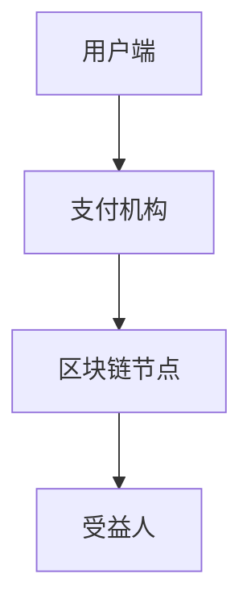
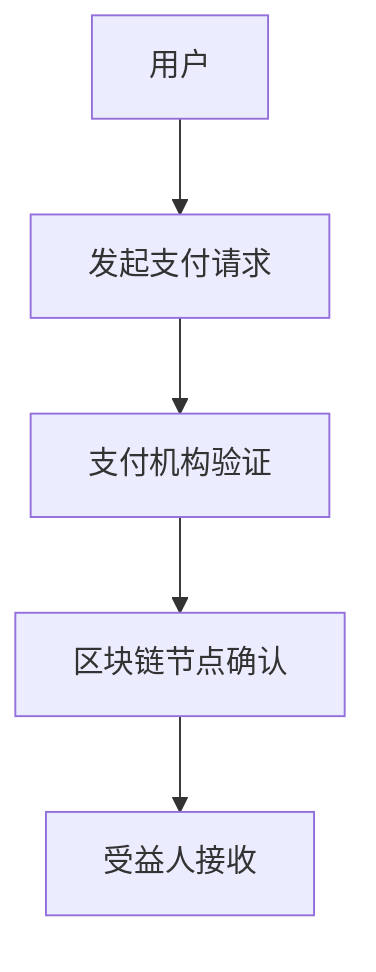
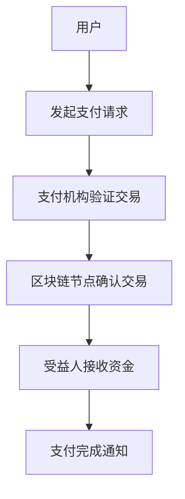

                 


# 区块链在跨境支付中的应用与挑战

## 关键词：区块链、跨境支付、分布式账本、共识机制、智能合约、加密技术

## 摘要：  
区块链技术作为一种去中心化的分布式账本技术，正在逐步改变传统的跨境支付方式。本文详细探讨了区块链在跨境支付中的应用价值、技术实现、系统架构设计以及面临的挑战。通过分析区块链的核心概念、算法原理和实际案例，本文旨在为读者提供全面的技术见解，帮助理解区块链如何优化跨境支付的效率、降低成本并提升安全性。

---

## 第一部分：区块链与跨境支付的背景介绍

### 第1章：区块链与跨境支付概述

#### 1.1 区块链的基本概念

##### 1.1.1 区块链的定义与特点
区块链是一种去中心化的分布式账本技术，通过密码学和分布式网络实现数据的安全存储和传输。其特点包括去中心化、不可篡改、透明性和去信任化。

##### 1.1.2 区块链的核心技术原理
区块链通过将数据组织成区块，每个区块包含交易信息、时间戳和哈希值，区块之间通过哈希值连接，形成一条不可篡改的链式结构。

##### 1.1.3 区块链的分类与应用场景
区块链主要分为公有链、联盟链和私有链。在跨境支付中，联盟链因其高效率和安全性而被广泛采用。

#### 1.2 跨境支付的现状与问题

##### 1.2.1 跨境支付的传统模式
传统跨境支付通常依赖于中心化的金融机构，存在效率低、成本高、透明度差等问题。

##### 1.2.2 跨境支付的主要问题
- 跨境支付的手续费高昂
- 支付流程复杂，时间较长
- 中心化机构的信任风险

##### 1.2.3 区块链技术如何解决这些问题
区块链通过去中心化、自动化和智能合约，能够显著降低支付成本，提高交易效率，并增强透明度。

#### 1.3 区块链在跨境支付中的优势

##### 1.3.1 提高支付效率
区块链去除了繁琐的中间环节，实现点对点直接交易，大幅缩短支付时间。

##### 1.3.2 降低成本
通过去除中间机构和自动化处理，区块链大幅降低了跨境支付的成本。

##### 1.3.3 增强安全性
区块链的不可篡改性和去信任化机制，有效降低了支付过程中的欺诈风险。

#### 1.4 本章小结
本章介绍了区块链的基本概念和跨境支付的现状及问题，并探讨了区块链如何通过去中心化和自动化解决这些问题，为后续的技术实现奠定了基础。

---

## 第二部分：区块链的核心概念与技术

### 第2章：区块链的核心技术原理

#### 2.1 分布式账本

##### 2.1.1 分布式账本的定义
分布式账本是指数据分布在多个节点上，每个节点都有一份完整的账本副本，通过共识机制保持账本的一致性。

##### 2.1.2 分布式账本的特点
- 数据冗余
- 去中心化
- 高可用性

##### 2.1.3 分布式账本在跨境支付中的应用
通过分布式账本，跨境支付可以在全球范围内实现实时到账，无需依赖中心化机构。

#### 2.2 共识机制

##### 2.2.1 共识机制的定义
共识机制是区块链中用于确保所有节点达成一致的算法，确保账本的准确性和一致性。

##### 2.2.2 常见的共识机制
- 工作量证明（PoW）
- 权益证明（PoS）
- 拜占庭容错（BFT）

##### 2.2.3 共识机制在跨境支付中的作用
共识机制确保了跨境支付交易的合法性和有效性，避免双重支付和欺诈行为。

#### 2.3 智能合约

##### 2.3.1 智能合约的定义
智能合约是区块链上的自动化程序，根据预设条件自动执行交易。

##### 2.3.2 智能合约的特点
- 自动化
- 去信任化
- 可编程性

##### 2.3.3 智能合约在跨境支付中的应用
智能合约可以自动执行支付流程，确保交易的透明和安全。

#### 2.4 加密技术

##### 2.4.1 加密技术的定义
加密技术通过数学算法对数据进行加密和解密，确保数据的安全性。

##### 2.4.2 常见加密算法
- RSA
- ECC
- SHA-256

##### 2.4.3 加密技术在跨境支付中的应用
加密技术用于保护用户隐私，确保支付数据的安全传输。

#### 2.5 本章小结
本章详细介绍了区块链的核心技术，包括分布式账本、共识机制、智能合约和加密技术，为后续的系统设计奠定了理论基础。

---

## 第三部分：区块链在跨境支付中的技术实现

### 第3章：区块链跨境支付的算法原理

#### 3.1 区块链共识机制的算法实现

##### 3.1.1 工作量证明（PoW）算法
工作量证明是一种通过计算哈希值来证明工作量的算法，常用于比特币网络。

##### 3.1.2 权益证明（PoS）算法
权益证明通过持有代币的数量来决定记账权，相比PoW更加高效和环保。

##### 3.1.3 PoW与PoS的对比
| 特性 | PoW | PoS |
|------|------|------|
| 能耗 | 高 | 低 |
| 安全性 | 依赖算力 | 依赖持有量 |
| 去中心化 | 高 | 较低 |

#### 3.2 智能合约的执行流程

##### 3.2.1 智能合约的编译与部署
智能合约需要通过编译器转化为区块链可执行的字节码。

##### 3.2.2 智能合约的调用与执行
用户发起交易，智能合约自动执行预设逻辑，完成支付流程。

##### 3.2.3 智能合约的示例
```solidity
// 智能合约代码示例：跨境支付
contract CrossPayment {
    function pay(uint amount) public {
        // 转账逻辑
        msg.sender.transfer(amount);
    }
}
```

#### 3.3 加密签名的数学模型

##### 3.3.1 哈希函数的数学模型
$$ H(x) = \text{hash}(x) $$

##### 3.3.2 数字签名的数学模型
$$ \text{Sign}(x) = x \times d \mod n $$

##### 3.3.3 数字签名的验证
$$ \text{Verify}(x, \text{Sign}(x)) = (x^d \mod n) == x $$

#### 3.4 本章小结
本章通过具体算法和数学模型，详细讲解了区块链在跨境支付中的技术实现，包括共识机制、智能合约和加密签名的原理和应用。

---

## 第四部分：区块链跨境支付的系统架构设计

### 第4章：区块链跨境支付系统的架构

#### 4.1 系统架构设计

##### 4.1.1 系统组成
- 用户端
- 支付机构
- 区块链节点
- 受益人

##### 4.1.2 系统架构图


#### 4.2 系统功能设计

##### 4.2.1 系统功能模块
- 用户发起支付请求
- 支付机构验证交易
- 区块链节点确认交易
- 受益人接收资金

##### 4.2.2 功能流程图


#### 4.3 系统接口设计

##### 4.3.1 接口定义
- `/api/pay/request`：发起支付请求
- `/api/pay/confirm`：确认支付交易
- `/api/pay/callback`：支付完成回调

#### 4.4 系统交互流程图



#### 4.5 本章小结
本章通过系统架构设计和流程图，详细展示了区块链跨境支付系统的实现方式，为后续的项目实战奠定了基础。

---

## 第五部分：区块链跨境支付的项目实战

### 第5章：项目实战与分析

#### 5.1 环境安装

##### 5.1.1 安装以太坊节点
```bash
# 使用docker安装以太坊节点
docker run -d --name eth-node --net=host -p 8545:8545 ethereum/go-ethereum:latest
```

##### 5.1.2 安装Solidity编译器
```bash
npm install -g solc
```

#### 5.2 核心代码实现

##### 5.2.1 智能合约实现
```solidity
// 智能合约代码：跨境支付
contract CrossPayment {
    function pay(address payable recipient, uint amount) public {
        recipient.transfer(amount);
    }
}
```

##### 5.2.2 后端实现
```python
# 后端代码示例：发起支付请求
def initiate_payment(amount, recipient_address):
    # 初始化交易
    transaction = {
        'to': recipient_address,
        'value': amount,
        'gas': 200000,
        'gasPrice': web3.eth.gas_price
    }
    # 发送交易
    tx_hash = web3.eth.send_transaction(transaction)
    return tx_hash
```

#### 5.3 代码解读与分析

##### 5.3.1 智能合约解读
智能合约定义了支付功能，包括发起支付和接收资金的逻辑。

##### 5.3.2 后端代码解读
后端代码通过调用智能合约接口，实现支付请求的发起和处理。

#### 5.4 实际案例分析

##### 5.4.1 案例背景
用户A向用户B发起一笔跨境支付，金额为100美元。

##### 5.4.2 案例流程
1. 用户A发起支付请求，金额100美元，接收方地址为用户B的地址。
2. 后端调用智能合约，生成交易请求。
3. 区块链节点确认交易，完成支付。
4. 用户B接收资金，支付完成。

##### 5.4.3 案例结果
支付完成，用户B收到100美元，交易记录可追溯。

#### 5.5 本章小结
本章通过实际项目的环境安装、代码实现和案例分析，展示了区块链技术在跨境支付中的具体应用，帮助读者理解技术实现的细节。

---

## 第六部分：最佳实践与总结

### 第6章：最佳实践与总结

#### 6.1 小结

- 区块链技术为跨境支付带来了去中心化、高效和安全的特点。
- 通过智能合约和分布式账本，实现了支付流程的自动化和透明化。

#### 6.2 注意事项

- 数据隐私和合规性是跨境支付中的重要问题。
- 需要注意区块链的性能优化和扩展性设计。

#### 6.3 拓展阅读

- 《加密货币：从比特币到以太坊》
- 《区块链技术与应用开发》

#### 6.4 本章小结
本章总结了区块链在跨境支付中的应用，并提出了实际应用中的注意事项和未来的研究方向。

---

## 结语

区块链技术正在逐步改变跨境支付的格局，通过去中心化和自动化实现了更高效、更安全的支付方式。然而，区块链技术的应用也面临诸多挑战，如性能优化、数据隐私和合规性等问题。未来，随着技术的不断发展和创新，区块链在跨境支付中的应用将会更加广泛和深入。

---

## 作者：AI天才研究院/AI Genius Institute & 禅与计算机程序设计艺术 /Zen And The Art of Computer Programming

感谢您的阅读！如需进一步了解，请联系：[作者邮箱] 或访问[作者网站]。

