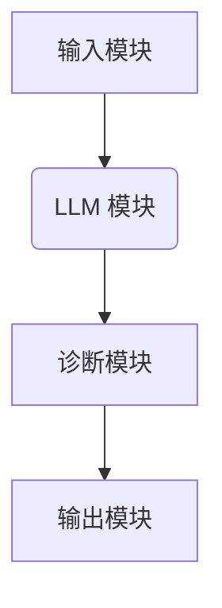

                 


# 医疗诊断 AI Agent：LLM 在临床决策支持中的角色

## 关键词：AI Agent, LLM, 医疗诊断, 临床决策支持, 人工智能

## 摘要：本文探讨了AI Agent在医疗诊断中的应用，特别是LLM（大语言模型）在临床决策支持中的角色。通过分析背景、核心概念、算法原理、系统架构和项目实战，本文详细阐述了LLM在医疗诊断中的潜力和挑战，并提供了具体的实现方案和案例分析。

---

# 第一部分：医疗诊断 AI Agent 的背景与概念

## 第1章：医疗诊断 AI Agent 的背景与问题背景

### 1.1 医疗诊断的现状与挑战

#### 1.1.1 传统医疗诊断的局限性
传统的医疗诊断依赖医生的经验和知识，但存在以下问题：
- **资源分配不均**：医疗资源在不同地区和医院之间分布不均，导致某些地区的患者无法获得高质量的诊断服务。
- **诊断效率低**：医生的工作量大，尤其是在繁忙的医院中，诊断效率可能受到影响。
- **准确性问题**：虽然医生的经验是宝贵的，但诊断的准确性可能受到疲劳、压力等因素的影响。

#### 1.1.2 医疗诊断中的问题背景
医疗诊断的复杂性主要体现在以下几个方面：
- **多症状关联**：患者的症状可能涉及多个系统，诊断需要综合分析。
- **数据多样性**：医疗数据包括文本、图像、实验室结果等多种类型。
- **伦理与隐私**：医疗数据的隐私保护和伦理问题需要严格处理。

#### 1.1.3 AI 在医疗诊断中的角色
AI在医疗诊断中的作用日益重要：
- **辅助诊断**：AI可以帮助医生快速分析数据，提供诊断建议。
- **提高效率**：通过自动化处理，减少医生的工作负担。
- **降低误诊率**：AI可以提供多种可能性，帮助医生避免误诊。

### 1.2 LLM 在医疗诊断中的独特价值

#### 1.2.1 LLM 的基本概念
大语言模型（LLM）是一种基于深度学习的自然语言处理模型，具有以下特点：
- **强大的语言理解能力**：能够处理复杂的医疗文本。
- **生成能力**：可以生成自然的医疗报告和建议。
- **自适应学习**：通过大量医疗数据进行微调，提高专业性。

#### 1.2.2 LLM 在医疗诊断中的优势
- **快速分析**：LLM可以快速处理大量的医疗文本，提供诊断建议。
- **多任务处理**：LLM可以同时处理多种任务，如症状分析、疾病预测等。
- **可扩展性**：LLM可以在不同医疗场景中应用，具有良好的扩展性。

#### 1.2.3 LLM 在医疗诊断中的应用场景
- **症状分析**：根据患者的症状，提供可能的疾病建议。
- **疾病预测**：基于历史数据，预测患者的疾病风险。
- **诊断报告生成**：生成结构化的诊断报告，帮助医生快速了解患者情况。

---

## 第2章：AI Agent 与 LLM 的核心概念

### 2.1 AI Agent 的核心概念

#### 2.1.1 AI Agent 的定义与分类
AI Agent 是一种智能体，能够感知环境并采取行动以实现目标。在医疗诊断中，AI Agent 可以分为以下几类：
- **基于规则的AI Agent**：通过预定义的规则进行诊断。
- **基于模型的AI Agent**：使用机器学习模型进行诊断。
- **混合型AI Agent**：结合规则和模型的AI Agent。

#### 2.1.2 AI Agent 的核心属性与特征
- **感知能力**：能够获取和理解医疗数据。
- **推理能力**：能够进行逻辑推理，得出诊断结论。
- **决策能力**：能够根据推理结果做出诊断决策。

#### 2.1.3 AI Agent 的实体关系图（ER 图）

```mermaid
er
    actor: 医生
    agent: AI Agent
    disease: 疾病
    symptom: 症状
    test_result: 检验结果
    doctor_diagnosis: 医生诊断
    agent_diagnosis: AI 诊断
    actor --> agent: 请求诊断
    agent --> disease: 分析疾病
    disease --> symptom: 关联症状
    symptom --> test_result: 关联检验结果
    agent --> doctor_diagnosis: 输出诊断建议
```

### 2.2 LLM 的核心概念

#### 2.2.1 LLM 的定义与特点
大语言模型（LLM）是一种基于 transformer 的自然语言处理模型，具有以下特点：
- **大规模训练数据**：通常使用海量医疗文本进行训练。
- **强大的上下文理解能力**：能够理解复杂的医疗场景。
- **生成能力强**：可以生成高质量的医疗文本。

#### 2.2.2 LLM 的训练过程与模型结构
- **训练过程**：包括数据预处理、模型初始化、反向传播优化等步骤。
- **模型结构**：主要由编码器和解码器组成，能够进行序列到序列的转换。

#### 2.2.3 LLM 的输入输出机制
- **输入**：医疗相关的文本数据，如病历、检验报告等。
- **输出**：诊断建议、疾病预测等。

### 2.3 AI Agent 与 LLM 的关系

#### 2.3.1 AI Agent 中的 LLM 集成
- **模块化集成**：将LLM作为AI Agent 的一个模块，用于处理自然语言任务。
- **协同工作**：AI Agent 负责整体诊断流程，LLM 负责具体的语言处理任务。

#### 2.3.2 LLM 作为 AI Agent 核心模块的作用
- **语言理解**：LLM 能够理解患者的症状描述。
- **生成诊断建议**：LLM 可以生成结构化的诊断报告。
- **实时交互**：LLM 可以与医生进行实时对话，提供诊断支持。

#### 2.3.3 AI Agent 与 LLM 的协同工作流程
1. **用户输入**：医生输入患者的症状和检验结果。
2. **LLM 分析**：LLM 分析输入的文本，生成可能的诊断建议。
3. **AI Agent 决策**：AI Agent 根据 LLM 的分析结果，结合其他数据，做出最终诊断。

---

## 第3章：LLM 在医疗诊断中的算法原理

### 3.1 LLM 的基本算法原理

#### 3.1.1 基于 transformer 的模型
- **编码器**：将输入的序列转换为上下文向量。
- **解码器**：根据编码器的输出生成目标序列。

#### 3.1.2 模型训练流程
1. **数据预处理**：清洗和标注医疗数据。
2. **模型初始化**：随机初始化模型参数。
3. **反向传播**：通过梯度下降优化模型参数。

#### 3.1.3 模型优化
- **学习率调整**：使用学习率衰减策略。
- **正则化**：使用Dropout防止过拟合。

### 3.2 LLM 的数学模型与公式

#### 3.2.1 编码器部分
- **输入表示**：将输入序列转换为向量表示。
- **自注意力机制**：
  $$
  \text{Attention}(Q, K, V) = \text{softmax}\left(\frac{QK^T}{\sqrt{d_k}}\right)V
  $$

#### 3.2.2 解码器部分
- **自注意力机制**：在解码器中，同样使用自注意力机制。
- **交叉注意力机制**：将编码器的输出与解码器的输入进行交互。

### 3.3 LLM 的实际应用案例

#### 3.3.1 症状分析
- **输入**：患者描述的症状。
- **输出**：可能的疾病列表。

#### 3.3.2 疾病预测
- **输入**：患者的检验结果和病史。
- **输出**：疾病的概率分布。

---

## 第4章：医疗诊断 AI Agent 的系统架构与设计

### 4.1 系统架构设计

#### 4.1.1 模块划分
- **输入模块**：接收患者的症状和检验结果。
- **LLM 模块**：进行语言处理和分析。
- **诊断模块**：生成诊断建议。
- **输出模块**：将诊断结果返回给医生。

#### 4.1.2 系统架构图



### 4.2 接口设计

#### 4.2.1 输入接口
- **输入格式**：结构化的医疗数据。
- **接口协议**：HTTP 或 RESTful API。

#### 4.2.2 输出接口
- **输出格式**：结构化的诊断报告。
- **接口协议**：HTTP 或 RESTful API。

---

## 第5章：医疗诊断 AI Agent 的项目实战

### 5.1 环境安装

#### 5.1.1 安装 Python
```
python --version
```

#### 5.1.2 安装必要的库
```
pip install transformers torch
```

### 5.2 核心代码实现

#### 5.2.1 LLM 模块实现
```python
from transformers import AutoTokenizer, AutoModelForCausalLM

tokenizer = AutoTokenizer.from_pretrained('gpt2')
model = AutoModelForCausalLM.from_pretrained('gpt2')
```

#### 5.2.2 系统交互流程
```python
def diagnose(symptoms, test_results):
    input_str = f"症状：{symptoms}\n检验结果：{test_results}"
    inputs = tokenizer.encode(input_str, return_tensors='pt')
    outputs = model.generate(inputs, max_length=100)
    diagnosis = tokenizer.decode(outputs[0])
    return diagnosis
```

### 5.3 案例分析

#### 5.3.1 案例1：症状为咳嗽和发热
- **输入**：咳嗽、发热
- **输出**：可能的疾病：感冒、肺炎。

#### 5.3.2 案例2：症状为胸痛和呼吸困难
- **输入**：胸痛、呼吸困难
- **输出**：可能的疾病：心绞痛、肺栓塞。

### 5.4 项目总结

---

## 第6章：医疗诊断 AI Agent 的最佳实践与未来展望

### 6.1 最佳实践 tips
- **数据质量**：确保训练数据的多样性和准确性。
- **模型调优**：根据实际需求调整模型参数。
- **隐私保护**：严格遵守医疗数据的隐私保护规定。

### 6.2 未来展望
- **多模态 AI Agent**：结合图像和文本进行诊断。
- **实时诊断**：实现更快速的诊断流程。
- **个性化医疗**：根据患者的个体差异提供定制化诊断。

---

## 作者：AI天才研究院 & 禅与计算机程序设计艺术

---

这篇文章通过详细分析医疗诊断 AI Agent 的背景、核心概念、算法原理和系统架构，为读者提供了全面的视角。通过实际项目实战，展示了如何利用 LLM 技术构建高效的医疗诊断系统。希望本文能为医疗 AI 的发展提供有价值的参考。

