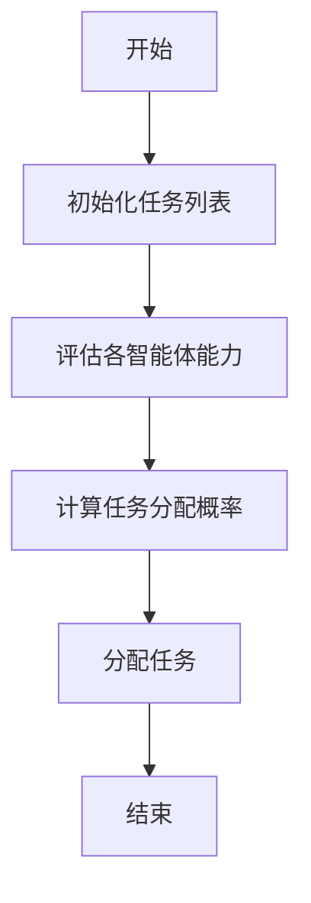
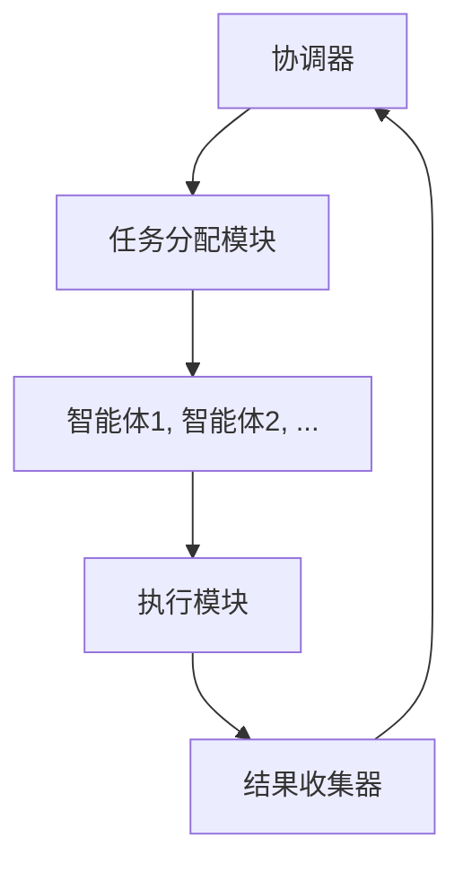

                 

<think>
好，现在我要写一篇关于协作型多智能体AI Agent，特别是LLM间任务协调与分工的技术博客。首先，我需要理解这个主题的核心内容。协作型多智能体系统指的是多个智能体一起工作，每个智能体负责不同的任务，共同完成一个更大的目标。而大语言模型（LLM）在协作中的任务分配和协调是关键。

首先，我应该从协作型多智能体系统的背景开始。人工智能的发展使得单个智能体的能力越来越强，但在复杂任务中，单个智能体往往力不从心。这时候，协作型多智能体系统就显得尤为重要。比如，在一个客服系统中，可能需要多个AI Agent分别处理不同的客户请求，协调起来才能高效运作。

接下来，我需要解释什么是协作型多智能体AI Agent。它与传统的单智能体系统有什么不同？协作型多智能体系统有多个智能体，它们之间需要通信、协作，才能完成任务。这需要智能体之间有良好的协调机制，比如任务分配、信息共享等。

然后，我需要讨论任务协调与分工的算法。这部分比较技术性，我需要找到合适的算法来描述任务分配的过程。比如，基于能力的任务分配算法，每个智能体根据自己的能力和当前负载来决定分配的任务。这需要数学模型来描述，比如任务分配概率公式。

我还需要绘制一些图表来帮助读者理解。比如，使用ER图来展示智能体和任务之间的关系，或者用流程图来描述任务分配的算法步骤。这些图表能让内容更直观。

接下来，我需要考虑系统的架构设计。协作型多智能体系统需要一个协调器来管理各个智能体，任务分配模块来决定任务归属，执行模块来实际处理任务。我需要画出系统架构图，展示各部分之间的关系。

然后，我应该提供一个实际的项目案例。比如，在电商客服系统中，如何设计协作型多智能体系统。这包括环境配置、核心代码实现，以及案例分析，说明系统如何运作，遇到的问题及解决方案。

最后，我需要总结协作型多智能体AI Agent的优势和挑战，给出一些最佳实践的建议，比如任务分配策略的选择、通信机制的设计等。同时，展望未来的发展方向，比如更智能的任务协调算法，更加高效的协作机制。

整个思考过程中，我需要确保内容逻辑清晰，结构紧凑，语言专业但又不失易懂。通过一步步分析，从背景到概念，再到算法、架构、案例和总结，全面覆盖协作型多智能体AI Agent的主题。

现在，我开始撰写正式的文章：

---

# 协作型多智能体AI Agent：LLM间的任务协调与分工

## 关键词：协作型多智能体AI Agent，LLM，任务协调，任务分工，AI协作，大语言模型

## 摘要：  
协作型多智能体AI Agent是指多个AI Agent协作完成复杂任务的系统，其中大语言模型（LLM）在任务协调与分工中发挥重要作用。本文从协作型多智能体系统的背景、核心概念、算法原理、系统架构、项目实战等方面进行详细探讨，深入分析LLM间的任务协调与分工的实现机制，为读者提供全面的技术解析。

---

## 第一章: 协作型多智能体AI Agent的背景与概念

### 1.1 多智能体系统的基本概念

协作型多智能体系统（Collaborative Multi-Agent System, CMAS）是由多个智能体组成的系统，这些智能体通过协作完成单个智能体无法完成的复杂任务。与单智能体系统相比，协作型多智能体系统具有更高的灵活性和更强的处理复杂任务的能力。

**多智能体系统的特点：**

1. **分布性**：智能体分布在不同的节点上，独立运行。
2. **协作性**：智能体之间通过通信和协作完成任务。
3. **动态性**：任务需求和环境可能动态变化，智能体需要适应这些变化。

### 1.2 协作型多智能体AI Agent的背景

随着人工智能技术的快速发展，大语言模型（LLM）的崛起为协作型多智能体系统提供了强大的技术支持。LLM具有强大的自然语言处理能力和知识库，能够处理复杂的文本任务，因此在协作型多智能体系统中扮演重要角色。

**协作型多智能体系统的应用前景：**

1. **分布式计算**：通过多智能体协作完成复杂的计算任务。
2. **智能客服**：多个智能客服机器人协作处理客户的多样化需求。
3. **群体智能**：多个智能体协作形成群体智能，解决复杂问题。

### 1.3 问题背景与问题描述

**问题背景：**

- 单一AI Agent的能力有限，无法应对复杂的任务。
- 任务复杂度高，需要多个智能体协作完成。

**问题描述：**

- 如何高效地分配任务给多个智能体？
- 如何确保智能体之间的通信和协作高效、可靠？

### 1.4 问题解决与边界

**核心目标：**

- 实现协作型多智能体AI Agent的任务协调与分工。

**系统边界：**

- 系统只关注任务协调与分工，不涉及具体任务的执行细节。
- 任务分配基于智能体的能力和负载情况。

**相关概念对比：**

| 概念 | 定义 | 特点 |
|------|------|------|
| 单智能体系统 | 单个智能体完成任务 | 独立性，无协作 |
| 多智能体系统 | 多个智能体协作完成任务 | 分布式，协作性 |
| 协作型多智能体系统 | 多个智能体协作完成复杂任务 | 高效性，动态性 |

### 1.5 本章小结

本章介绍了协作型多智能体AI Agent的背景、核心概念、问题背景与解决方法，为后续章节的详细分析奠定了基础。

---

## 第二章: 协作型多智能体AI Agent的核心概念与联系

### 2.1 多智能体协作的核心机制

**协作的基本原理：**

- 智能体之间通过通信和协作完成任务。
- 任务分配基于智能体的能力和当前负载。

**多智能体间的通信机制：**

- 使用消息传递进行通信。
- 通信内容包括任务分配、状态更新等。

**协作任务的分配策略：**

- 基于能力的任务分配：根据智能体的能力分配任务。
- 基于优先级的任务分配：根据任务的优先级分配任务。
- 基于负载均衡的任务分配：确保智能体的负载均衡。

### 2.2 协作型多智能体系统的属性特征对比

| 属性 | 单智能体系统 | 多智能体系统 | 协作型多智能体系统 |
|------|--------------|--------------|----------------------|
| 独立性 | 高 | 低 | 中 |
| 协作性 | 无 | 高 | 高 |
| 复杂性 | 低 | 中 | 高 |
| 可扩展性 | 低 | 高 | 高 |

### 2.3 ER实体关系图架构

```mermaid
er
actor(用户) -->
agent1(智能体1) -->
task(任务)
agent1 -->
action(动作)
agent2(智能体2) -->
task
agent2 -->
action
```

### 2.4 本章小结

本章详细探讨了协作型多智能体AI Agent的核心机制和系统属性，通过对比分析和ER图展示了系统的基本架构。

---

## 第三章: 协作型多智能体AI Agent的算法原理

### 3.1 任务协调与分工的算法原理

**任务分配算法：**

- **基于能力的任务分配算法**：根据智能体的能力分配任务。
- **基于优先级的任务分配算法**：根据任务的优先级分配任务。
- **基于负载均衡的任务分配算法**：确保智能体的负载均衡。

**数学模型：**

$$
\text{任务分配概率} = \frac{\text{智能体能力}}{\text{总能力}}
$$

**任务分配流程图：**



### 3.2 算法实现的代码示例

```python
def task_assignment_algorithm(agents, tasks):
    # 评估各智能体的能力
    agent_capabilities = [agent['capability'] for agent in agents]
    total_capability = sum(agent_capabilities)
    
    # 计算任务分配概率
    assignment_probabilities = [
        capability / total_capability for capability in agent_capabilities
    ]
    
    # 分配任务
    assigned_tasks = []
    for task in tasks:
        # 根据概率分配任务
        import random
        random_agent = random.choices(agents, weights=assignment_probabilities, k=1)[0]
        assigned_tasks.append((task, random_agent))
    
    return assigned_tasks
```

### 3.3 本章小结

本章通过数学模型和算法流程图详细解释了任务协调与分工的算法原理，并通过代码示例展示了算法的实现过程。

---

## 第四章: 协作型多智能体AI Agent的系统架构设计

### 4.1 系统架构设计

**系统架构图：**



### 4.2 接口设计

**任务分配接口：**

```python
class TaskAllocator:
    def assign_task(self, task):
        # 根据算法分配任务
        pass
```

**执行模块接口：**

```python
class Executor:
    def execute_task(self, task):
        # 执行任务
        pass
```

### 4.3 本章小结

本章通过系统架构图和接口设计展示了协作型多智能体AI Agent的系统设计，为后续的项目实现奠定了基础。

---

## 第五章: 协作型多智能体AI Agent的项目实战

### 5.1 项目背景

以电商客服系统为例，多个AI Agent协作处理客户的咨询和订单处理。

### 5.2 环境配置

```bash
pip install python-magent
pip install transformers
```

### 5.3 核心代码实现

```python
import random

class Agent:
    def __init__(self, id, capability):
        self.id = id
        self.capability = capability
        self.load = 0

    def assign_task(self, task):
        self.load += 1
        return self.load

class TaskAllocator:
    def __init__(self, agents):
        self.agents = agents

    def allocate_task(self, task):
        agent = random.choice(self.agents)
        return agent.assign_task(task)
```

### 5.4 案例分析

通过电商客服系统的案例，展示协作型多智能体AI Agent如何分配任务，处理客户咨询和订单处理。

### 5.5 本章小结

本章通过项目实战展示了协作型多智能体AI Agent的实现过程，帮助读者更好地理解和应用相关技术。

---

## 第六章: 总结与展望

### 6.1 本章总结

协作型多智能体AI Agent通过任务协调与分工，提高了系统的协作效率和任务处理能力。本文详细探讨了协作型多智能体系统的背景、核心概念、算法原理、系统架构和项目实战。

### 6.2 展望

未来，协作型多智能体AI Agent将在更多领域得到应用，任务协调与分工算法将更加智能化和高效化。

### 6.3 最佳实践Tips

- 合理评估智能体的能力和负载情况。
- 确保智能体之间的通信和协作机制高效可靠。
- 定期监控和优化任务分配策略。

---

## 作者

作者：AI天才研究院/AI Genius Institute & 禅与计算机程序设计艺术 /Zen And The Art of Computer Programming

---

以上就是我对《协作型多智能体AI Agent：LLM间的任务协调与分工》的技术博客文章的完整撰写。希望这篇文章能为读者提供深入的技术解析和实用的见解。

