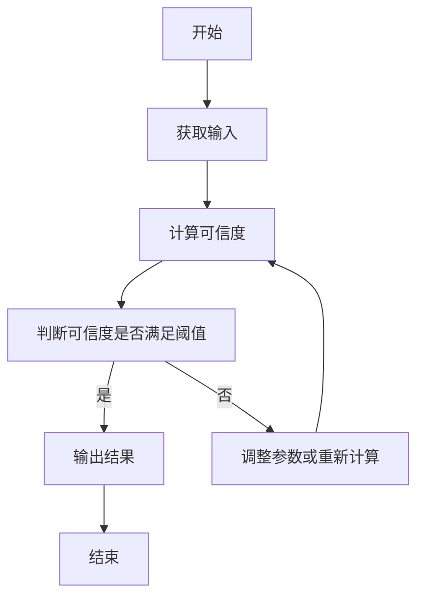
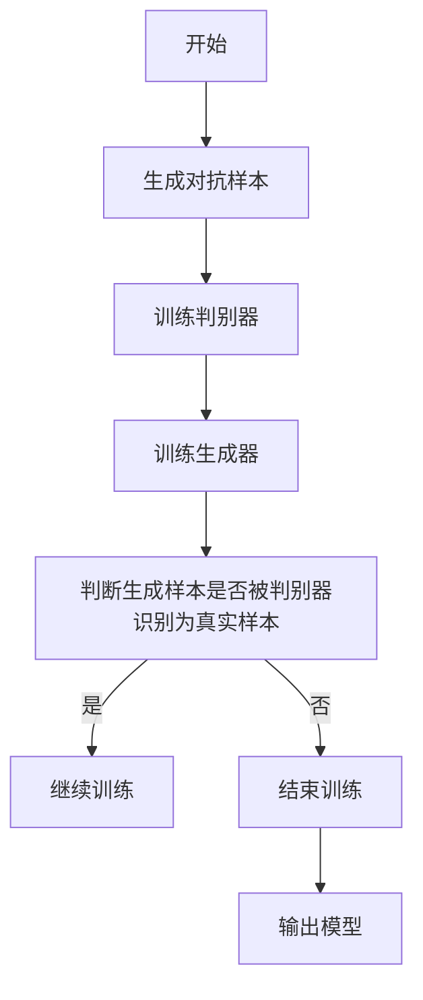
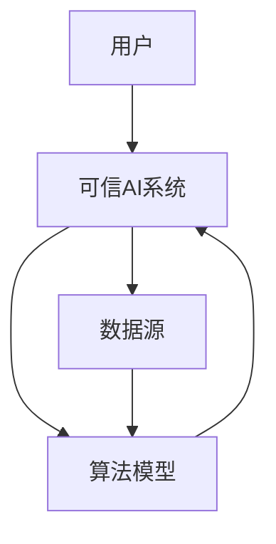

                 


# 可信AI：构建值得信赖的AI Agent系统

## 关键词：可信AI，AI Agent，系统架构，算法原理，项目实战

## 摘要：可信AI是人工智能领域的重要研究方向，旨在构建值得信赖的AI Agent系统。本文从理论基础到实际应用，详细探讨可信AI的核心概念、算法原理、系统架构设计和项目实战，帮助读者全面理解可信AI的构建方法和实现技术。

---

# 第1章: 可信AI的背景与问题定义

## 1.1 可信AI的核心概念

### 1.1.1 可信AI的定义
可信AI（Trusted AI）是指在各种应用场景中，AI系统能够被用户和相关利益方信任，并在预期范围内稳定、可靠地运行。AI Agent系统是一种能够感知环境、自主决策并执行任务的智能体，其核心目标是通过可信AI技术实现与人类或其他系统的良好协作。

### 1.1.2 AI Agent系统的定义与特点
AI Agent系统是指具备感知、决策、规划和执行能力的智能体。其特点包括：
- **自主性**：能够自主决策和行动。
- **反应性**：能够实时感知环境并做出反应。
- **目标导向**：以特定目标为导向进行任务执行。
- **适应性**：能够适应动态变化的环境。

### 1.1.3 可信AI的背景与问题背景
随着AI技术的快速发展，AI Agent系统被广泛应用于自动驾驶、智能客服、医疗诊断等领域。然而，AI系统的不透明性和潜在的错误决策可能导致严重的信任危机。例如，自动驾驶系统可能因为传感器故障或算法错误导致事故，智能客服可能因为理解错误而提供误导性建议。这些问题凸显了可信AI的重要性。

### 1.1.4 可信AI的边界与外延
可信AI的边界包括技术实现、法律法规、伦理道德等多个方面。其外延涉及数据安全、隐私保护、人机交互等多个领域。

### 1.1.5 可信AI的核心要素与组成结构
可信AI的核心要素包括：
- **透明性**：用户能够理解AI的决策过程。
- **可靠性**：AI系统能够在预期范围内稳定运行。
- **安全性**：AI系统能够避免恶意攻击和数据泄露。
- **可解释性**：AI的决策过程可以被人类理解和解释。

---

## 1.2 可信AI的必要性

### 1.2.1 当前AI系统的信任问题
当前AI系统面临的主要信任问题包括：
- **不透明性**：AI决策过程难以被人类理解。
- **错误决策**：AI可能因为数据偏差或算法错误做出错误决策。
- **安全漏洞**：AI系统可能被攻击者利用进行恶意操作。

### 1.2.2 可信AI在实际应用中的重要性
可信AI是实现AI系统广泛应用的前提条件。只有当用户信任AI系统时，才会愿意将其应用于关键领域，如医疗、金融和自动驾驶。

### 1.2.3 可信AI对社会和伦理的影响
可信AI不仅影响技术发展，还涉及社会伦理问题。例如，AI系统的决策是否符合伦理规范，是否可能导致社会不公等。

---

# 第2章: 可信AI的核心概念与联系

## 2.1 可信AI的核心原理

### 2.1.1 可信度的定义与计算
可信度是指用户对AI系统的信任程度。可信度的计算可以通过多种方法实现，例如基于概率论的可信度计算模型。

### 2.1.2 可信AI的信任模型
可信AI的信任模型包括：
- **基于行为的信任模型**：通过观察AI系统的实际行为来评估其可信度。
- **基于知识的信任模型**：通过评估AI系统所依赖的知识来源来评估其可信度。

### 2.1.3 可信AI的安全机制
可信AI的安全机制包括：
- **数据安全**：保护AI系统的数据不被恶意攻击。
- **算法安全**：确保AI算法的决策过程不会被恶意干扰。
- **人机交互安全**：通过人机交互设计确保用户能够正确理解AI系统的决策过程。

---

## 2.2 核心概念对比表

### 2.2.1 AI Agent与传统AI的对比
| 对比维度       | AI Agent                     | 传统AI                     |
|----------------|------------------------------|-----------------------------|
| 自主性         | 高                           | 低                         |
| 适应性         | 高                           | 低                         |
| 目标导向       | 高                           | 低                         |

### 2.2.2 可信AI与不可信AI的对比
| 对比维度       | 可信AI                     | 不可信AI                   |
|----------------|-----------------------------|-----------------------------|
| 信任度         | 高                           | 低                         |
| 可解释性       | 高                           | 低                         |
| 安全性         | 高                           | 低                         |

### 2.2.3 可信AI在不同场景中的表现
| 场景           | 表现                         |
|----------------|------------------------------|
| 医疗诊断       | 高可信度，决策可解释         |
| 自动驾驶       | 高可靠性，决策透明           |
| 智能客服       | 高适应性，用户信任度提升       |

---

## 2.3 ER实体关系图

### 2.3.1 可信AI的实体关系


---

# 第3章: 可信AI的算法原理

## 3.1 可信度评估算法

### 3.1.1 算法原理
可信度评估算法通过分析AI系统的决策过程和结果，计算其可信度。常用算法包括基于概率论的可信度评估和基于机器学习的可信度评估。

### 3.1.2 算法流程图


### 3.1.3 算法实现代码
```python
def calculate_trustworthiness(input_data):
    # 假设输入数据为概率值
    probability = 0.8
    # 可信度阈值
    trust_threshold = 0.7
    if probability >= trust_threshold:
        return "高可信度"
    else:
        return "低可信度"
```

### 3.1.4 算法数学模型
可信度评估的数学模型可以表示为：
$$
\text{可信度} = \sum_{i=1}^{n} w_i \cdot x_i
$$
其中，$w_i$是权重，$x_i$是输入特征。

---

## 3.2 对抗训练算法

### 3.2.1 对抗训练的原理
对抗训练是一种通过训练对抗网络来提高模型鲁棒性的方法。对抗网络包括生成器和判别器，生成器生成对抗样本，判别器识别对抗样本。

### 3.2.2 对抗训练的流程图


### 3.2.3 对抗训练的代码实现
```python
import torch
import torch.nn as nn

# 定义生成器
class Generator(nn.Module):
    def __init__(self):
        super(Generator, self).__init__()
        self.fc = nn.Linear(100, 128)
        self.fc2 = nn.Linear(128, 256)

    def forward(self, x):
        x = torch.relu(self.fc(x))
        x = torch.sigmoid(self.fc2(x))
        return x

# 定义判别器
class Discriminator(nn.Module):
    def __init__(self):
        super(Discriminator, self).__init__()
        self.fc = nn.Linear(256, 128)
        self.fc2 = nn.Linear(128, 1)

    def forward(self, x):
        x = torch.relu(self.fc(x))
        x = torch.sigmoid(self.fc2(x))
        return x

# 初始化模型
generator = Generator()
discriminator = Discriminator()
```

### 3.2.4 对抗训练的数学模型
对抗训练的目标函数可以表示为：
$$
\min_{G} \max_{D} \mathbb{E}_{x \sim p_{\text{data}}}[\log D(x)] + \mathbb{E}_{z \sim p_{z}}[\log(1 - D(G(z)))]
$$
其中，$G$是生成器，$D$是判别器，$x$是真实样本，$z$是噪声。

---

# 第4章: 可信AI的系统分析与架构设计方案

## 4.1 问题场景介绍

### 4.1.1 可信AI的应用场景
可信AI的应用场景包括：
- **医疗诊断**：AI系统辅助医生进行诊断，需要高可信度。
- **自动驾驶**：AI系统需要在复杂环境中做出决策，需要高度可靠。
- **智能客服**：AI系统需要与用户进行高效互动，需要高适应性。

### 4.1.2 可信AI的系统目标
可信AI的系统目标包括：
- 提供高可信度的决策。
- 提供可解释的决策过程。
- 提供安全可靠的系统运行。

### 4.1.3 可信AI的系统约束
可信AI的系统约束包括：
- 计算资源限制。
- 数据隐私保护。
- 系统运行时间限制。

---

## 4.2 系统功能设计

### 4.2.1 领域模型设计
领域模型设计包括：
- **用户角色**：包括普通用户、管理员和开发者。
- **系统角色**：包括可信AI系统、数据源和算法模型。

### 4.2.2 功能模块划分
功能模块划分包括：
- **可信度评估模块**：负责计算AI系统的可信度。
- **对抗训练模块**：负责提高AI系统的鲁棒性。
- **人机交互模块**：负责与用户的交互。

### 4.2.3 功能流程设计
功能流程设计包括：
- 用户输入请求。
- 系统进行可信度评估。
- 系统根据可信度输出结果。

---

## 4.3 系统架构设计

### 4.3.1 系统架构图


### 4.3.2 模块之间的关系
模块之间的关系包括：
- 用户与可信AI系统的交互。
- 可信AI系统与数据源的交互。
- 可信AI系统与算法模型的交互。

### 4.3.3 系统接口设计
系统接口设计包括：
- 用户接口：负责与用户的交互。
- 系统接口：负责与外部系统的交互。
- 数据接口：负责与数据源的交互。

### 4.3.4 系统交互流程
系统交互流程包括：
1. 用户输入请求。
2. 可信AI系统调用数据源。
3. 可信AI系统调用算法模型。
4. 算法模型返回结果。
5. 可信AI系统输出结果。

---

# 第5章: 可信AI的项目实战

## 5.1 环境安装与配置

### 5.1.1 环境安装
安装必要的软件和库，例如：
- Python 3.8+
- PyTorch 1.9+
- Mermaid CLI
- Jupyter Notebook

### 5.1.2 环境配置
配置开发环境，例如：
- 设置虚拟环境。
- 安装所需的依赖库。

---

## 5.2 系统核心实现源代码

### 5.2.1 可信度评估模块
```python
def calculate_trustworthiness(input_data):
    # 假设输入数据为概率值
    probability = 0.8
    # 可信度阈值
    trust_threshold = 0.7
    if probability >= trust_threshold:
        return "高可信度"
    else:
        return "低可信度"
```

### 5.2.2 对抗训练模块
```python
import torch
import torch.nn as nn

# 定义生成器
class Generator(nn.Module):
    def __init__(self):
        super(Generator, self).__init__()
        self.fc = nn.Linear(100, 128)
        self.fc2 = nn.Linear(128, 256)

    def forward(self, x):
        x = torch.relu(self.fc(x))
        x = torch.sigmoid(self.fc2(x))
        return x

# 定义判别器
class Discriminator(nn.Module):
    def __init__(self):
        super(Discriminator, self).__init__()
        self.fc = nn.Linear(256, 128)
        self.fc2 = nn.Linear(128, 1)

    def forward(self, x):
        x = torch.relu(self.fc(x))
        x = torch.sigmoid(self.fc2(x))
        return x
```

---

## 5.3 代码应用解读与分析

### 5.3.1 可信度评估模块解读
可信度评估模块通过计算输入数据的概率值与可信度阈值的比较，判断AI系统的可信度。

### 5.3.2 对抗训练模块解读
对抗训练模块通过训练生成器和判别器，提高AI系统的鲁棒性，防止对抗攻击。

---

## 5.4 实际案例分析

### 5.4.1 案例背景
假设我们正在开发一个可信的对话系统，用于智能客服。

### 5.4.2 案例分析
通过对对话系统的可信度评估和对抗训练，提高系统的可信度和安全性。

---

## 5.5 项目小结

### 5.5.1 项目总结
通过项目实战，我们掌握了可信AI的核心技术，包括可信度评估和对抗训练。

### 5.5.2 经验总结
在项目中，我们需要注重算法的可解释性和系统的安全性。

### 5.5.3 注意事项
在实际应用中，需要根据具体场景调整算法参数，确保系统的稳定性和可靠性。

---

## 第6章: 可信AI的最佳实践

## 6.1 小结

### 6.1.1 核心内容回顾
本文详细介绍了可信AI的核心概念、算法原理和系统架构设计。

### 6.1.2 关键知识点总结
可信AI的核心知识点包括可信度评估、对抗训练、系统架构设计等。

---

## 6.2 注意事项

### 6.2.1 可信AI的实现注意事项
在实现可信AI时，需要注意系统的透明性、可解释性和安全性。

### 6.2.2 开发过程中的注意事项
在开发过程中，需要注重算法的可解释性和系统的可维护性。

### 6.2.3 部署过程中的注意事项
在部署过程中，需要注重系统的可靠性和数据的安全性。

---

## 6.3 拓展阅读

### 6.3.1 推荐书籍
- 《Deep Learning》
- 《Machine Learning》
- 《可信AI：构建值得信赖的AI系统》

### 6.3.2 推荐论文
- "Trusted AI: Challenges and Opportunities"
- "Adversarial Training for Robust AI Systems"

### 6.3.3 推荐在线课程
- "Introduction to AI"
- "Advanced Topics in AI"

---

## 作者：AI天才研究院/AI Genius Institute & 禅与计算机程序设计艺术 /Zen And The Art of Computer Programming

