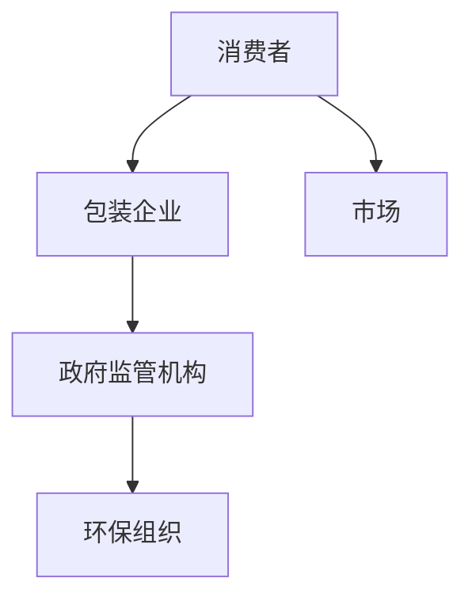

                 

# 可持续食品包装创新的市场接受度研究

> 关键词：可持续食品包装，市场接受度，消费者行为，技术创新，环保包装

> 摘要：本文旨在研究可持续食品包装创新的市场接受度，通过分析消费者行为和市场趋势，探讨如何平衡创新与市场接受度，提出可行的策略和建议。文章从背景、核心概念、消费者行为模型、数据采集与分析方法、案例分析、影响因素及提升策略等方面展开，结合结构方程模型和层次分析法，系统性地剖析了可持续食品包装创新的市场接受度问题，并提出了具体的解决方案。

---

## 第一章：可持续食品包装创新的背景与问题描述

### 1.1 可持续包装的背景与发展趋势

#### 1.1.1 环境问题与包装业的可持续发展需求
随着全球环境问题的加剧，包装行业面临巨大的压力。食品包装作为包装行业的重要组成部分，其材料选择、生产过程和废弃物处理对环境的影响备受关注。减少塑料污染、降低碳排放和推动循环经济已成为全球共识。

#### 1.1.2 食品包装行业的现状与挑战
传统食品包装材料以塑料为主，虽然成本低、性能好，但其不可降解性和对环境的破坏已成为行业痛点。消费者对环保包装的需求日益增长，推动企业探索可持续包装创新。

#### 1.1.3 可持续包装的定义与核心目标
可持续包装是指在全生命周期内对环境影响最小的包装，强调材料的可降解性、可回收性和对环境的友好性。其核心目标是减少资源消耗、降低污染和推动循环经济发展。

### 1.2 可持续食品包装创新的问题描述

#### 1.2.1 食品包装创新的必要性
随着消费者环保意识的增强，食品包装企业必须不断创新，以满足市场需求。然而，创新过程中面临技术、成本和消费者接受度的多重挑战。

#### 1.2.2 当前市场接受度的痛点
尽管消费者对环保包装有较高的认知度，但实际接受度较低。主要原因是成本高、性能不稳定、缺乏足够的信息透明度和品牌支持不足。

#### 1.2.3 创新与市场接受度的平衡点
企业需要在技术创新与市场接受度之间找到平衡点。过度追求技术创新可能导致成本过高，而忽视市场接受度则可能导致创新失败。

---

## 第二章：可持续食品包装创新的核心概念与联系

### 2.1 可持续包装的核心概念

#### 2.1.1 可持续包装的定义与属性
- **定义**：可持续包装是指在材料选择、生产过程、使用和废弃处理中，尽可能减少对环境的负面影响。
- **属性**：
  - 可降解性
  - 可回收性
  - 环保材料使用
  - 能源消耗低

#### 2.1.2 可持续包装与传统包装的对比
| 属性             | 可持续包装           | 传统包装             |
|------------------|----------------------|----------------------|
| 材料             | 生物基材料、可降解材料 | 石油基塑料           |
| 环境影响         | 低                   | 高                   |
| 成本             | 高                   | 低                   |
| 市场接受度       | 中低                 | 高                   |

#### 2.1.3 可持续食品包装创新的实体关系图（ER图）

### 2.2 可持续食品包装创新的系统架构

#### 2.2.1 创新系统的组成与功能
- **组成**：材料创新、设计创新、生产技术创新
- **功能**：满足环保需求、降低生产成本、提升市场竞争力

---

## 第三章：消费者行为与市场接受度的理论基础

### 3.1 消费者行为理论

#### 3.1.1 消费者决策过程模型
消费者在购买决策中通常会经历以下阶段：
1. **问题识别**：意识到需求
2. **信息搜索**：收集相关信息
3. **评估与选择**：比较选项并做出决策
4. **购买行为**：实际购买
5. **购后行为**：评估购买决策的满意度

#### 3.1.2 影响消费者接受度的关键因素
- **环保性能**：包装的可降解性和可回收性
- **成本**：包装材料的成本和价格
- **便利性**：包装的使用便利性和密封性
- **品牌信任度**：消费者对品牌的信任和认知

### 3.2 可持续包装接受度的理论模型

#### 3.2.1 结构方程模型（SEM）
结构方程模型是一种用于分析变量间关系的统计方法，适用于分析消费者行为和市场接受度之间的复杂关系。

- **模型公式**：
  $$ y = Xβ + ε $$
  其中，\( y \) 是因变量（市场接受度），\( X \) 是自变量（影响因素），\( β \) 是回归系数，\( ε \) 是误差项。

- **模型流程图**：

---

## 第四章：数据采集与分析方法

### 4.1 数据采集方法

#### 4.1.1 问卷设计与实施
- **问卷内容**：包括消费者基本信息、包装材料偏好、价格敏感度、品牌信任度等
- **实施方式**：线上调查、线下问卷发放

#### 4.1.2 数据收集工具
- **工具选择**：使用在线调查平台（如问卷星、Google Forms）进行数据收集

### 4.2 数据分析方法

#### 4.2.1 结构方程模型（SEM）的数学基础
- ** SEM 的基本假设**：
  - 数据符合正态分布
  - 样本量足够大（通常要求样本量大于 200）

- ** SEM 的实现步骤**：
  1. **模型构建**：根据理论模型构建路径图
  2. **模型拟合**：使用软件（如 AMOS、SPSS）进行模型拟合
  3. **假设检验**：验证模型中的路径系数和显著性

- ** SEM 的优势**：
  - 能够同时分析多个变量之间的关系
  - 能够处理潜变量（如消费者态度）和观测变量（如实际购买行为）

---

## 第五章：案例分析与策略制定

### 5.1 案例一：可降解材料包装

#### 5.1.1 案例背景与创新点
- **背景**：某食品企业推出一款由可降解材料制成的包装袋
- **创新点**：材料由淀粉基可降解塑料制成，生产过程中减少了碳排放

#### 5.1.2 市场接受度分析
- **消费者反馈**：大部分消费者对包装的环保性表示认可，但对其成本和性能（如密封性）提出质疑
- **数据支持**：通过 SEM 分析发现，环保性能对消费者态度的影响最大，其次是品牌信任度

---

## 第六章：影响市场接受度的关键因素与提升策略

### 6.1 影响市场接受度的关键因素

#### 6.1.1 环保性能
- **重要性**：环保性能是消费者接受度的首要影响因素
- **解决方案**：优先选择可降解和可回收材料，通过认证和宣传提升消费者信任度

#### 6.1.2 成本
- **重要性**：成本是影响市场接受度的次要因素
- **解决方案**：通过技术创新降低成本，或通过政府补贴和消费者教育减轻成本压力

### 6.2 提升市场接受度的策略

#### 6.2.1 产品设计策略
- **创新点**：开发兼具环保性和实用性的包装设计
- **实施方法**：通过用户调研和实验测试优化设计

#### 6.2.2 营销策略
- **创新点**：利用社交媒体和内容营销提升品牌信任度
- **实施方法**：发布环保理念宣传视频，与环保组织合作推出联合品牌

#### 6.2.3 政策与行业支持
- **创新点**：推动政府出台环保包装相关法规和补贴政策
- **实施方法**：游说政府制定环保包装税收优惠政策，推动行业标准制定

---

## 第七章：结论与展望

### 7.1 研究结论

- 可持续食品包装创新的市场接受度受到环保性能、成本、品牌信任度等多种因素的影响
- 结构方程模型是一种有效的分析工具，能够帮助企业和研究者更好地理解消费者行为

### 7.2 研究展望

- **未来研究方向**：
  - 探讨不同地区和文化背景下消费者的接受度差异
  - 研究技术进步对市场接受度的长期影响
- **实践建议**：
  - 企业应注重技术创新与市场教育的结合
  - 政府和行业组织应加强政策支持和行业协作

---

## 注意事项

- 在实际应用中，企业应结合自身特点和市场环境选择合适的策略
- 数据分析部分建议使用专业软件（如 AMOS、SPSS）进行操作
- 案例分析部分应结合实际数据和具体情境进行调整

## 拓展阅读

- 《绿色营销：可持续发展与商业创新》
- 《消费者行为学：理论与实践》
- 《结构方程模型：方法与应用》

---

## 作者信息

作者：AI天才研究院/AI Genius Institute & 禅与计算机程序设计艺术 /Zen And The Art of Computer Programming

