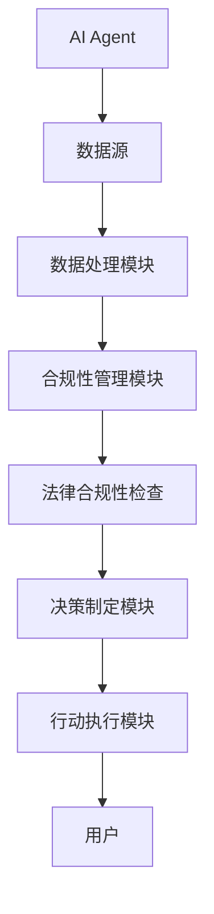
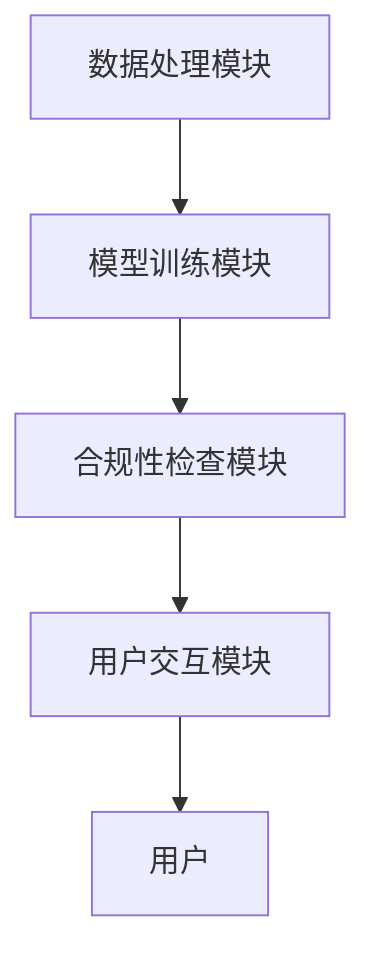
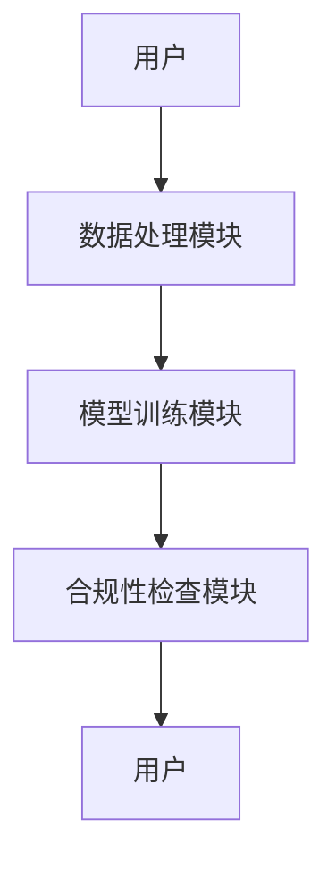

                 


# 合规性管理：确保AI Agent符合法规要求

> 关键词：合规性管理，AI Agent，数据隐私，可解释性，法律风险，系统架构

> 摘要：本文详细探讨了如何确保AI Agent在设计和运行过程中符合相关法律法规的要求。通过分析合规性管理的核心概念、AI Agent的工作原理以及两者之间的关系，本文为读者提供了从理论到实践的全面指导。文章内容包括合规性管理的背景介绍、核心概念、算法原理、系统架构设计、项目实战以及最佳实践等部分，旨在帮助读者理解和实现AI Agent的合规性管理。

---

## 第一部分: 合规性管理基础

### 第1章: 合规性管理概述

#### 1.1 合规性管理的定义与背景

合规性管理是指在组织或系统的运行过程中，确保其行为符合相关法律法规、行业标准和企业政策的管理活动。在AI Agent领域，合规性管理尤为重要，因为AI系统可能涉及大量用户数据的处理和决策的制定，这些过程需要符合数据隐私保护、透明性和责任承担等要求。

AI Agent是一种能够自主执行任务的智能体，它通过感知环境、处理信息并采取行动来实现预定目标。随着AI技术的广泛应用，AI Agent在金融、医疗、交通等领域的应用日益增多。然而，AI系统的决策过程往往缺乏透明性，且可能引发法律风险，因此合规性管理成为确保AI Agent安全可靠运行的关键。

#### 1.2 AI Agent的基本工作原理

AI Agent的核心功能包括数据收集、模型训练、决策制定和行动执行。以下是AI Agent的基本工作流程：

1. **数据收集**：AI Agent通过传感器、API或其他数据源获取相关信息。
2. **模型训练**：使用机器学习算法对数据进行训练，构建预测或分类模型。
3. **决策制定**：基于训练好的模型，AI Agent根据输入的数据生成决策。
4. **行动执行**：根据决策结果采取相应的行动。

#### 1.3 合规性管理的重要性

合规性管理在AI Agent中的作用主要体现在以下几个方面：

- **数据隐私保护**：确保AI Agent在数据收集和处理过程中遵守相关隐私法规，如GDPR。
- **透明性与可解释性**：使AI Agent的决策过程能够被用户理解和信任。
- **法律风险控制**：减少因AI决策错误引发的法律纠纷。

---

### 第2章: AI Agent与合规性管理的关系

#### 2.1 AI Agent的核心功能

AI Agent的功能模块包括：

- 数据处理模块：负责数据的采集、清洗和预处理。
- 模型训练模块：使用机器学习算法训练模型。
- 决策制定模块：基于模型输出生成决策。
- 行动执行模块：根据决策结果执行具体操作。

#### 2.2 合规性管理对AI Agent的影响

合规性管理贯穿于AI Agent的整个生命周期，从数据收集到模型训练，再到决策制定和行动执行，每个环节都需要符合相关法规要求。以下是合规性管理对AI Agent的影响：

- **数据使用合规性**：确保数据的收集、存储和使用符合隐私保护法规。
- **模型决策的法律风险**：评估AI决策可能带来的法律后果，并采取措施降低风险。
- **用户隐私保护**：通过技术手段确保用户数据的安全性和隐私性。

---

## 第二部分: 合规性管理的核心概念与联系

### 第3章: 合规性管理的原理与机制

#### 3.1 合规性管理的原理

合规性管理的原理包括：

- **数据流的合规性控制**：在数据流动的每个环节进行合规性检查。
- **模型输出的合规性检查**：对AI模型的输出结果进行合法性验证。
- **用户交互的合规性监控**：实时监控用户与AI Agent的交互过程，确保符合法规要求。

#### 3.2 AI Agent与合规性管理的实体关系图

以下是AI Agent与合规性管理的实体关系图：



---

### 第4章: AI Agent的合规性管理机制

#### 4.1 数据流的合规性控制

数据流的合规性控制包括以下几个步骤：

1. **数据收集**：确保数据来源合法，符合隐私保护法规。
2. **数据处理**：对数据进行清洗和预处理，确保数据的准确性和完整性。
3. **数据存储**：将数据存储在符合法规要求的安全环境中。
4. **数据使用**：在数据使用过程中，确保符合相关隐私法规。

#### 4.2 模型输出的合规性检查

模型输出的合规性检查包括：

1. **模型训练**：确保训练数据的合法性和合规性。
2. **模型评估**：对模型的输出结果进行评估，确保符合法律要求。
3. **模型优化**：根据评估结果优化模型，降低法律风险。

#### 4.3 用户交互的合规性监控

用户交互的合规性监控包括：

1. **用户身份验证**：确保用户身份的真实性。
2. **用户行为分析**：监控用户的操作行为，识别异常行为。
3. **用户隐私保护**：在用户交互过程中，保护用户的隐私信息。

---

## 第三部分: 合规性管理的系统架构设计

### 第5章: 系统功能设计

#### 5.1 系统功能模块

系统功能模块包括：

- 数据处理模块：负责数据的采集、清洗和预处理。
- 模型训练模块：使用机器学习算法训练模型。
- 合规性检查模块：对模型输出进行合规性检查。
- 用户交互模块：与用户进行交互，确保用户操作的合规性。

#### 5.2 系统架构设计

以下是系统架构设计图：



---

### 第6章: 系统接口设计

#### 6.1 系统接口描述

系统接口包括：

- 数据接口：用于数据的输入和输出。
- 模型接口：用于模型的训练和评估。
- 用户接口：用于用户与系统的交互。

#### 6.2 系统交互流程图

以下是系统交互流程图：



---

## 第四部分: 项目实战

### 第7章: 项目实战

#### 7.1 环境安装

项目实战需要以下环境：

- Python 3.8+
- TensorFlow 2.0+
- scikit-learn 0.20+

#### 7.2 核心代码实现

以下是核心代码实现：

```python
import pandas as pd
from sklearn.model_selection import train_test_split
from sklearn.linear_model import LogisticRegression

# 数据加载
data = pd.read_csv('data.csv')

# 数据分割
X_train, X_test, y_train, y_test = train_test_split(data.drop('label', axis=1), data['label'], test_size=0.2)

# 模型训练
model = LogisticRegression()
model.fit(X_train, y_train)

# 模型预测
y_pred = model.predict(X_test)

# 模型评估
print('Accuracy:', accuracy_score(y_test, y_pred))
```

#### 7.3 代码解读与分析

上述代码实现了基于逻辑回归的分类模型。数据加载后，使用train_test_split将数据集分割为训练集和测试集。模型训练完成后，使用测试集进行预测，并评估模型的准确率。

---

## 第五部分: 最佳实践

### 第8章: 最佳实践

#### 8.1 小结

本文详细探讨了如何确保AI Agent符合法规要求，从合规性管理的背景、核心概念到系统架构设计和项目实战，为读者提供了全面的指导。

#### 8.2 注意事项

- 在设计AI Agent时，应充分考虑数据隐私和用户隐私保护。
- 定期对模型进行合规性检查，确保符合相关法规要求。
- 提供透明的决策过程，增强用户的信任。

#### 8.3 拓展阅读

- 《人工智能法律与伦理》
- 《数据隐私保护与合规性管理》

---

# 结语

通过本文的介绍，读者可以全面了解合规性管理在AI Agent中的重要性，并掌握相关的技术和方法。未来，随着AI技术的不断发展，合规性管理将变得更加复杂和重要，需要我们持续关注和研究。

作者：AI天才研究院/AI Genius Institute & 禅与计算机程序设计艺术 /Zen And The Art of Computer Programming

