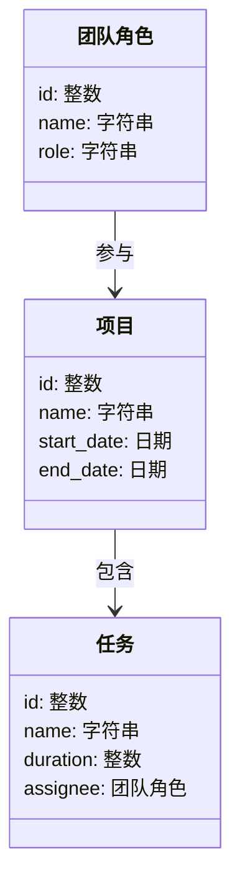

                 


# 团队组建与项目管理

> 关键词：团队组建、项目管理、项目生命周期、敏捷开发、Scrum、团队协作、项目交付

> 摘要：本文将从团队组建的核心要素和项目管理的基本原理出发，逐步分析如何构建高效团队并实现项目的顺利交付。通过深入探讨团队角色分配、项目进度算法、系统架构设计以及实际项目案例，本文为读者提供了从理论到实践的全面指导。

---

# 第一部分: 团队组建与项目管理基础

## 第1章: 团队组建的背景与意义

### 1.1 团队组建的背景
- **1.1.1 现代企业中的团队协作**：现代企业中，团队协作已成为项目成功的关键因素。通过团队合作，可以集中不同领域的 expertise，提高项目的成功率。
- **1.1.2 团队组建的重要性**：高效的团队能够更快地响应市场需求，提高产品交付速度，同时降低项目风险。
- **1.1.3 团队与项目的匹配性**：团队的组成和项目目标密切相关，合理的团队结构能够最大限度地发挥成员的优势。

### 1.2 项目管理的核心概念
- **1.2.1 项目管理的定义**：项目管理是指通过计划、执行、监控和收尾等活动，确保项目按时、按质、按预算完成的过程。
- **1.2.2 项目管理的生命周期**：项目的生命周期通常包括启动、计划、执行、监控和收尾五个阶段。
- **1.2.3 项目管理的目标**：确保项目目标的实现，包括按时交付、质量达标、成本控制和团队协作。

### 1.3 团队与项目管理的关系
- **1.3.1 团队在项目管理中的角色**：团队是项目管理的执行主体，团队成员的分工和协作直接影响项目的进展。
- **1.3.2 项目管理对团队的影响**：有效的项目管理能够激发团队潜力，提高团队效率，增强团队凝聚力。
- **1.3.3 团队协作在项目成功中的作用**：良好的团队协作能够减少沟通成本，提高项目执行效率，确保项目目标的实现。

### 1.4 小结
通过本章的学习，读者可以了解团队组建与项目管理的基本概念和核心要素，为后续章节的学习打下坚实的基础。

---

## 第2章: 团队角色与职责分配

### 2.1 团队角色的分类
- **2.1.1 开发人员**：负责项目的核心开发工作，确保代码的质量和项目的按时交付。
- **2.1.2 项目经理**：负责项目的整体规划和协调，确保项目目标的实现。
- **2.1.3 产品负责人**：负责产品需求的定义和优先级排序，确保产品符合市场需求。
- **2.1.4 测试人员**：负责项目的测试工作，确保产品质量和用户体验。
- **2.1.5 其他支持角色**：包括UI设计师、技术文档编写人员等，为项目提供支持。

### 2.2 团队角色的属性对比
- **2.2.1 责任分配矩阵**：通过表格形式明确每个角色的职责和权限。
- **2.2.2 角色间的关系与依赖**：展示角色之间的依赖关系，确保任务的顺利执行。
- **2.2.3 角色间的冲突与协调**：分析角色间可能存在的冲突，并提出解决方案。

### 2.3 团队角色的ER实体关系图
```mermaid
er
    actor: 团队角色
    project: 项目
    task: 任务
    actor -->> project: 参与
    actor -->> task: 执行
    project --> task: 包含
```

### 2.4 小结
通过本章的学习，读者可以清晰地了解团队角色的分类及其职责分配，为后续的项目管理奠定基础。

---

## 第3章: 项目管理的算法与数学模型

### 3.1 项目进度计算算法
- **3.1.1 关键路径算法**：用于确定项目中的关键路径，确保项目按时完成。
- **3.1.2 项目进度的数学公式**：通过公式计算项目总时间，确保任务的合理安排。

$$\text{项目总时间} = \max_{i} (\sum_{j=1}^{i} \text{任务时间})$$

### 3.2 任务分配的优化算法
- **3.2.1 线性规划模型**：通过数学模型优化任务分配，确保资源的合理利用。

$$\text{目标函数} = \min \sum_{i} c_i x_i$$
$$\text{约束条件} = \sum_{i} a_i x_i \geq b$$

### 3.3 项目风险管理模型
- **3.3.1 风险概率与影响矩阵**：通过矩阵分析风险的概率和影响程度。
- **3.3.2 风险评估的数学公式**：通过公式计算风险值，确保项目风险的可控性。

$$\text{风险值} = \text{概率} \times \text{影响程度}$$

### 3.4 小结
通过本章的学习，读者可以掌握项目管理中的算法和数学模型，为项目的顺利实施提供理论支持。

---

## 第4章: 项目管理的系统架构与设计

### 4.1 项目管理系统的功能设计
- **4.1.1 需求管理模块**：负责需求的收集、分析和优先级排序。
- **4.1.2 任务分配模块**：根据团队角色和任务需求，合理分配任务。
- **4.1.3 进度跟踪模块**：实时跟踪项目进度，确保项目按时完成。
- **4.1.4 风险管理模块**：识别和评估项目风险，制定应对策略。

### 4.2 项目管理系统的领域模型


### 4.3 小结
通过本章的学习，读者可以了解项目管理系统的功能设计和架构设计，为后续的项目实施提供参考。

---

## 第5章: 项目实战与案例分析

### 5.1 项目环境配置
- **5.1.1 开发环境的安装**：安装必要的开发工具和环境，确保项目顺利进行。
- **5.1.2 项目核心代码实现**：通过代码实现项目的核心功能，展示团队协作的实际应用。

### 5.2 代码实现与解读
```python
# 项目核心代码示例
class Team:
    def __init__(self, name, role):
        self.name = name
        self.role = role

class Project:
    def __init__(self, name, start_date, end_date):
        self.name = name
        self.start_date = start_date
        self.end_date = end_date
        self.tasks = []

    def add_task(self, task):
        self.tasks.append(task)

class Task:
    def __init__(self, name, duration, assignee):
        self.name = name
        self.duration = duration
        self.assignee = assignee

# 示例用法
team = Team("Alice", "Developer")
project = Project("Web App Development", "2023-01-01", "2023-06-30")
task = Task("Implement Login Page", 15, team)
project.add_task(task)
```

### 5.3 案例分析与详细解读
- **5.3.1 案例背景**：通过具体案例分析团队协作和项目管理的实际应用。
- **5.3.2 案例分析**：从需求分析、任务分配、进度跟踪等方面进行详细解读。

### 5.4 小结
通过本章的学习，读者可以掌握项目管理的实际应用技巧，为未来的项目管理提供参考。

---

## 第6章: 项目管理的最佳实践与小结

### 6.1 最佳实践
- **6.1.1 沟通与协作**：加强团队内部的沟通与协作，确保项目顺利进行。
- **6.1.2 风险管理**：定期评估项目风险，制定应对策略，降低项目失败的可能性。
- **6.1.3 持续改进**：通过项目复盘总结经验教训，持续优化项目管理流程。

### 6.2 小结
通过本文的学习，读者可以全面掌握团队组建与项目管理的核心内容，从理论到实践，为未来的项目管理提供系统的指导。

---

## 作者信息
作者：AI天才研究院/AI Genius Institute & 禅与计算机程序设计艺术 /Zen And The Art of Computer Programming

---

以上是《团队组建与项目管理》的完整目录大纲，涵盖了从理论到实践的各个方面，旨在为读者提供全面的指导和实用的建议。

