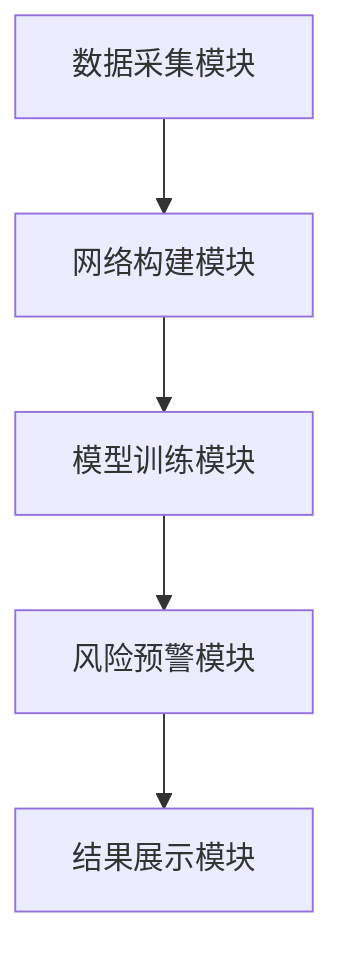

                 


```markdown
# 图卷积网络在金融关系网络分析中的应用

> 关键词：图卷积网络、金融关系网络、金融风险、网络分析、深度学习

> 摘要：本文详细探讨了图卷积网络（Graph Convolutional Networks, GCN）在金融关系网络分析中的应用。通过分析金融网络的复杂性，介绍了GCN的基本原理及其在金融风险评估、欺诈检测等领域的实际应用。文章还结合具体案例，详细讲解了GCN的算法实现、系统设计与优化方法，为读者提供了从理论到实践的全面指导。

---

# 第1章: 金融关系网络分析的背景与挑战

## 1.1 金融关系网络分析的背景

### 1.1.1 金融网络分析的定义与重要性

金融关系网络是指由金融机构、企业、个人等节点以及它们之间的关系边组成的网络。这些关系可能包括资金流动、交易行为、持股关系等。金融网络分析通过对这些网络结构和特征的分析，帮助识别系统性风险、欺诈行为、市场趋势等，对金融稳定和经济发展具有重要意义。

### 1.1.2 传统金融网络分析的局限性

传统金融网络分析主要依赖于统计方法和复杂网络理论，但在处理大规模、高维数据时存在以下问题：
- **计算复杂性**：传统方法在处理大规模网络时效率较低，难以应对现代金融市场的海量数据。
- **特征提取**：传统方法难以有效提取节点的高层次特征，导致模型表达能力有限。
- **动态性**：金融市场具有高度动态性，传统静态分析方法难以捕捉实时变化。

### 1.1.3 图卷积网络的引入与优势

图卷积网络（GCN）是一种基于深度学习的图数据处理方法，能够有效处理节点之间的关系信息，具有以下优势：
- **自动特征提取**：GCN能够自动学习节点的高层次特征，降低人工特征工程的复杂性。
- **全局信息捕捉**：GCN通过传播信息到整个图结构，能够捕捉到全局的网络特征。
- **高效计算**：GCN通过图卷积操作，能够在一定程度上并行计算，提高处理效率。

## 1.2 图卷积网络的核心概念

### 1.2.1 图论基础

图论是图数据处理的基础，图由节点（顶点）和边组成。在金融网络中，节点可以代表金融机构、企业或个人，边可以代表资金流动、交易行为等。

### 1.2.2 卷积神经网络基础

卷积神经网络（CNN）是一种常用的深度学习模型，主要用于处理图像数据。其核心思想是通过卷积操作提取局部特征，并通过池化操作降低计算复杂性。

### 1.2.3 图卷积网络的定义与特点

图卷积网络是将卷积神经网络的思想扩展到图数据的一种方法。其特点包括：
- **图结构适应性**：GCN能够处理任意图结构，包括有向图、无向图、加权图等。
- **信息传播**：通过图卷积操作，信息能够在节点之间传播，从而捕捉全局特征。
- **多任务学习**：GCN可以同时处理多种任务，如分类、回归等。

---

# 第2章: 图卷积网络的核心原理与算法

## 2.1 图卷积网络的数学模型

### 2.1.1 图的表示与邻接矩阵

图通常用邻接矩阵表示，其中$A$是一个$n \times n$的矩阵，$A_{i,j}=1$表示节点$i$和$j$之间有边相连，否则为0。在金融网络中，邻接矩阵可以表示资金流动或交易行为。

### 2.1.2 图卷积操作的定义

图卷积操作的定义如下：
$$ X_{new} = A X X_{old} $$
其中，$X_{new}$是新的特征矩阵，$X_{old}$是原始特征矩阵，$A$是邻接矩阵。

### 2.1.3 图卷积网络的数学公式

图卷积网络的数学公式可以表示为：
$$ H^{(l+1)} = \sigma(A H^{(l)} H^{(l)} ) $$
其中，$H^{(l)}$是第$l$层的特征矩阵，$\sigma$是非线性激活函数。

## 2.2 图卷积网络的算法流程

### 2.2.1 输入图数据的预处理

图数据预处理包括：
- **标准化**：对图的特征进行标准化处理，确保模型的稳定性。
- **构建邻接矩阵**：根据实际金融数据构建邻接矩阵。

### 2.2.2 图卷积层的计算

图卷积层的计算过程包括：
1. **信息传播**：通过邻接矩阵将信息传播到相邻节点。
2. **聚合**：将相邻节点的信息聚合到当前节点。
3. **激活**：通过激活函数进行非线性变换。

### 2.2.3 模型的训练与优化

模型训练包括：
- **损失函数定义**：常用交叉熵损失函数。
- **优化算法选择**：常用随机梯度下降（SGD）或Adam优化器。
- **模型调优**：调整学习率、批量大小等超参数。

## 2.3 图卷积网络与传统卷积网络的对比

### 2.3.1 传统卷积网络的局限性

传统卷积网络在处理图数据时存在以下问题：
- **难以处理异构图**：传统卷积网络难以处理不同类型的节点和边。
- **缺乏全局视角**：传统卷积网络难以捕捉全局网络特征。

### 2.3.2 图卷积网络的优势

图卷积网络的优势包括：
- **适应复杂图结构**：GCN能够处理任意图结构。
- **全局信息捕捉**：GCN通过信息传播捕捉全局特征。

---

# 第3章: 图卷积网络在金融关系网络中的应用

## 3.1 金融关系网络的构建

### 3.1.1 金融关系网络的构建方法

金融关系网络的构建方法包括：
- **数据收集**：收集金融机构、企业的交易数据。
- **关系提取**：通过数据挖掘技术提取节点之间的关系。

### 3.1.2 金融关系网络的特征提取

特征提取包括：
- **节点特征**：如机构规模、信用评分等。
- **边特征**：如交易金额、交易频率等。

## 3.2 图卷积网络在金融风险分析中的应用

### 3.2.1 金融风险的定义与分类

金融风险包括市场风险、信用风险、操作风险等。通过GCN可以有效识别系统性风险。

### 3.2.2 图卷积网络在风险传播中的应用

实例分析：银行间风险传播。通过GCN可以分析银行之间的风险传播路径，帮助制定风险管理策略。

## 3.3 图卷积网络在金融欺诈检测中的应用

### 3.3.1 金融欺诈的定义与挑战

金融欺诈包括信用卡欺诈、洗钱等。通过GCN可以发现欺诈行为的网络特征。

### 3.3.2 实例分析：信用卡欺诈检测

通过GCN分析信用卡交易网络，识别欺诈交易模式。

---

# 第4章: 图卷积网络的算法实现与优化

## 4.1 图卷积网络的实现框架

### 4.1.1 基于TensorFlow的图卷积网络实现

使用TensorFlow框架实现GCN，主要包括数据预处理、模型构建、训练与评估。

### 4.1.2 基于PyTorch的图卷积网络实现

使用PyTorch框架实现GCN，同样包括数据预处理、模型构建、训练与评估。

## 4.2 图卷积网络的优化方法

### 4.2.1 参数优化

通过调整模型参数，如节点嵌入维度、卷积层数等，优化模型性能。

### 4.2.2 模型压缩与加速

通过模型剪枝、知识蒸馏等技术，降低模型复杂度，提高计算效率。

### 4.2.3 图结构优化

通过优化图结构，如合并相似节点、简化边关系，提高模型计算效率。

## 4.3 图卷积网络的训练与调优

### 4.3.1 数据预处理与特征工程

数据预处理包括数据清洗、特征标准化等。

### 4.3.2 模型训练策略

包括批量大小、学习率、训练轮数等参数的设置。

### 4.3.3 模型评估与验证

通过准确率、召回率、F1分数等指标评估模型性能。

---

# 第5章: 图卷积网络的系统设计与实现

## 5.1 系统需求分析

### 5.1.1 系统目标

构建一个基于GCN的金融关系网络分析系统，用于金融风险预警和欺诈检测。

### 5.1.2 系统功能需求

包括数据采集、网络构建、模型训练、风险预警、结果展示等功能。

### 5.1.3 系统性能需求

要求系统能够处理大规模金融数据，提供实时或近实时的风险预警。

## 5.2 系统架构设计

### 5.2.1 系统模块划分

包括数据采集模块、网络构建模块、模型训练模块、风险预警模块、结果展示模块。

### 5.2.2 系统架构图



## 5.3 系统实现

### 5.3.1 数据库设计

数据库设计包括节点表、边表、特征表等。

### 5.3.2 系统接口设计

系统接口包括数据输入接口、模型训练接口、风险预警接口、结果展示接口。

### 5.3.3 系统实现代码

```python
import tensorflow as tf
from tensorflow.keras import layers

class GCN(tf.keras.Model):
    def __init__(self, input_dim, hidden_dim, output_dim):
        super(GCN, self).__init__()
        self.gcn_layer = layers.Convolution1D(filters=hidden_dim, kernel_size=2, strides=1, padding='valid')
        self.dense_layer = layers.Dense(output_dim, activation='relu')
        
    def call(self, inputs):
        x = self.gcn_layer(inputs)
        x = self.dense_layer(x)
        return x
```

---

# 总结与展望

## 6.1 总结

本文详细探讨了图卷积网络在金融关系网络分析中的应用，从理论到实践，全面介绍了GCN的核心原理、算法实现及优化方法。

## 6.2 展望

未来，随着人工智能技术的不断发展，GCN在金融领域的应用将更加广泛。可以通过引入多模态数据、优化模型结构等方式，进一步提升模型的性能和应用效果。

---

作者：AI天才研究院/AI Genius Institute & 禅与计算机程序设计艺术 /Zen And The Art of Computer Programming
```

