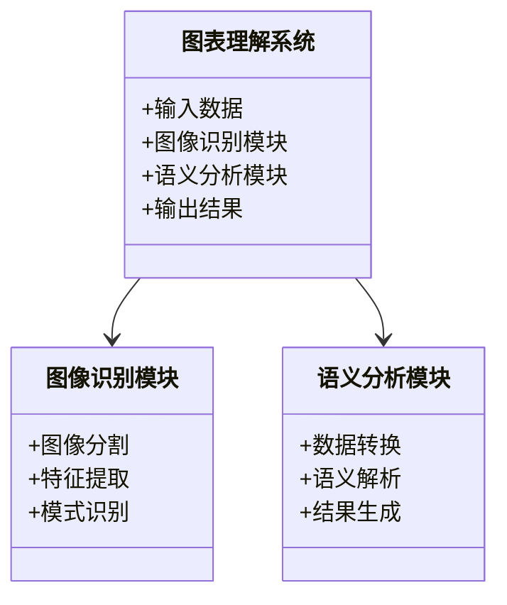
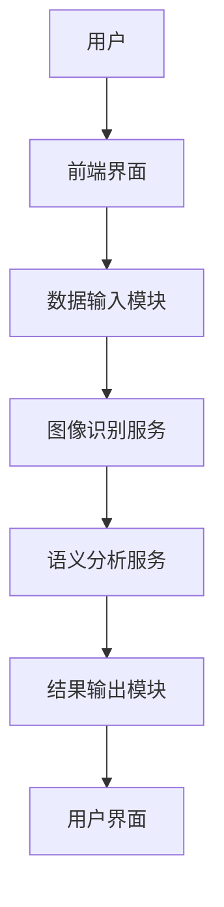
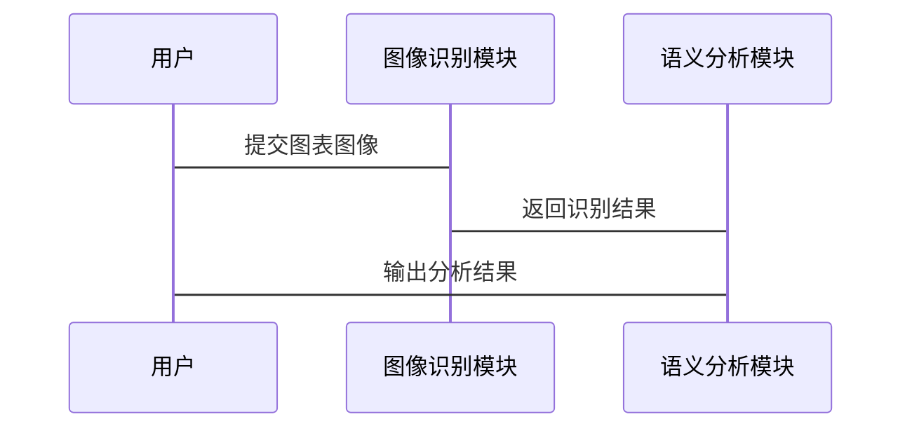

                 


# 图表理解技术：增强AI Agent的数据分析能力

## 关键词：
- 图表理解技术
- AI Agent
- 数据分析能力
- 图表结构
- 模式识别
- 自然语言处理

## 摘要：
本文深入探讨了图表理解技术在增强AI Agent数据分析能力中的作用。首先介绍了图表理解技术的背景及其在AI Agent中的重要性，接着分析了图表结构与数据模型，结合模式识别与自然语言处理的技术，详细讲解了图表理解的核心算法原理，并通过系统架构设计与项目实战，展示了如何在实际场景中应用这些技术。最后总结了最佳实践，为读者提供了全面的技术指导。

---

## 第一部分：图表理解技术基础

### 第1章：图表理解技术概述

#### 1.1 图表理解技术的背景与重要性
图表是数据可视化的重要形式，能够将复杂的数据信息直观地呈现给用户。在数据分析领域，图表理解技术是将数据转化为可理解信息的关键步骤。随着AI Agent的普及，如何让AI Agent能够理解并分析图表，成为提升其数据分析能力的重要方向。

##### 1.1.1 数据分析的现状与挑战
传统的数据分析依赖于人工对图表的解读，这种方法效率低且容易出错。AI Agent通过自动化处理，能够快速分析大量数据，并从中提取有用的信息。然而，图表的理解涉及复杂的图像识别和语义分析，这对AI Agent的能力提出了更高的要求。

##### 1.1.2 图表在数据分析中的作用
图表能够将数据转换为易于理解的形式，帮助用户快速识别数据中的趋势、模式和异常值。对于AI Agent而言，理解图表不仅能够提升其数据分析的效率，还能够增强其在数据驱动决策中的能力。

##### 1.1.3 图表理解技术的定义与目标
图表理解技术是指通过计算机视觉和自然语言处理等技术，对图表中的数据、结构和语义进行分析和理解的过程。其目标是让AI Agent能够像人类一样理解和分析图表，从而辅助用户做出更明智的决策。

---

#### 1.2 AI Agent与数据分析
AI Agent是一种能够自主执行任务的智能体，它能够在复杂环境中感知、推理和决策。在数据分析领域，AI Agent可以通过图表理解技术，快速提取数据中的关键信息，并生成相应的分析结果。

##### 1.2.1 AI Agent的基本概念
AI Agent是一种具有智能性的计算机程序，能够通过感知环境、处理信息和执行任务来实现特定目标。在数据分析中，AI Agent通常需要处理大量复杂的数据，并从中提取有用的信息。

##### 1.2.2 数据分析在AI Agent中的应用
数据分析是AI Agent的核心能力之一。通过分析数据，AI Agent可以发现数据中的模式和趋势，并生成相应的决策建议。图表理解技术作为数据分析的重要组成部分，能够帮助AI Agent更高效地处理数据。

##### 1.2.3 图表理解技术对AI Agent的增强作用
图表理解技术能够让AI Agent不仅能够处理结构化的数据，还能够理解图表中的非结构化信息。这种能力的提升，使得AI Agent在数据分析中的应用更加广泛和高效。

---

#### 1.3 图表理解技术的核心问题
图表理解技术涉及多个方面的内容，包括图表的结构分析、模式识别以及语义理解等。这些内容共同构成了图表理解技术的核心问题。

##### 1.3.1 图表类型与结构分析
图表有不同的类型，如柱状图、折线图、饼图等，每种图表都有其独特的结构和数据表示方式。理解图表的类型和结构是图表理解技术的基础。

##### 1.3.2 图表数据提取与转换
图表中的数据通常以图像形式呈现，需要通过图像识别技术将其提取出来，并转换为结构化的数据格式。这一过程是图表理解技术的关键步骤。

##### 1.3.3 图表语义理解与推理
语义理解是图表理解技术的核心，它不仅需要理解图表中的数据，还需要理解数据背后的意义和逻辑关系。通过语义理解，AI Agent能够对图表进行推理和分析，从而生成更准确的分析结果。

---

## 第二部分：图表理解技术的核心算法

### 第2章：图表数据预处理与图像识别算法

#### 2.1 图表数据的预处理
在进行图表理解之前，需要对图表数据进行预处理，以便后续的图像识别和语义分析能够顺利进行。

##### 2.1.1 图像分割与图表元素提取
图像分割是将图表图像分割成多个部分，提取出图表中的元素，如标题、坐标轴、数据点等。这一过程可以通过计算机视觉技术实现。

##### 2.1.2 图表元素的特征提取
特征提取是将图表中的元素转化为计算机能够理解的特征表示。这些特征可以用于后续的图像识别和模式匹配。

##### 2.1.3 图表数据的标准化处理
标准化处理是将不同格式的图表数据转换为统一的格式，以便后续的分析和处理。这一过程通常涉及数据清洗和格式转换。

#### 2.2 图像识别算法
图像识别是图表理解技术的重要组成部分，它能够识别图表中的元素，并将其转化为结构化的数据。

##### 2.2.1 基于深度学习的图像识别模型
深度学习模型，如卷积神经网络（CNN），是图像识别的核心技术。通过训练大量的图表图像，模型能够自动识别图表中的元素。

##### 2.2.2 图表元素识别的流程图
流程图展示了图像识别的步骤，包括图像分割、特征提取、模式匹配等。通过流程图，可以清晰地了解图像识别的整个过程。

##### 2.2.3 图像识别算法的实现代码示例
以下是一个基于Python的图像识别算法实现示例：

```python
import tensorflow as tf
from tensorflow.keras import layers

model = tf.keras.Sequential([
    layers.Conv2D(32, (3, 3), activation='relu', input_shape=(28, 28, 1)),
    layers.MaxPooling2D((2, 2)),
    layers.Conv2D(64, (3, 3), activation='relu'),
    layers.MaxPooling2D((2, 2)),
    layers.Flatten(),
    layers.Dense(128, activation='relu'),
    layers.Dense(10, activation='softmax')
])

model.compile(optimizer='adam', loss='sparse_categorical_crossentropy', metrics=['accuracy'])
model.fit(x_train, y_train, epochs=10, validation_data=(x_test, y_test))
```

---

#### 2.3 图表模式识别与语义理解
模式识别是图表理解技术的关键步骤，它能够识别图表中的模式和趋势，并进行语义分析。

##### 2.3.1 图表模式识别
模式识别包括对图表中数据的分布、趋势和异常值的识别。通过模式识别，AI Agent能够发现数据中的潜在规律。

##### 2.3.2 图表语义理解
语义理解是将图表中的数据转化为有意义的信息。它需要结合上下文和领域知识，对图表中的数据进行深度分析。

##### 2.3.3 图表模式识别与语义理解的结合
模式识别和语义理解是相互关联的，模式识别为语义理解提供数据支持，而语义理解则指导模式识别的方向和目标。

---

## 第三部分：系统分析与架构设计

### 第3章：图表理解系统的架构设计

#### 3.1 系统功能设计
图表理解系统的功能设计包括数据输入、图像识别、语义分析和结果输出等模块。

##### 3.1.1 领域模型
领域模型描述了系统的功能模块及其之间的关系。以下是领域模型的类图：



##### 3.1.2 系统架构设计
系统架构设计包括前端和后端的结构。以下是系统架构的架构图：



##### 3.1.3 系统接口设计
系统接口设计包括图像识别模块和语义分析模块之间的接口。以下是系统接口的交互图：



---

## 第四部分：项目实战

### 第4章：图表理解技术的项目实战

#### 4.1 项目背景与目标
本项目旨在开发一个能够理解并分析图表的AI Agent，帮助用户快速获取数据中的关键信息。

#### 4.2 项目环境与工具安装
项目环境包括Python、TensorFlow、Keras等工具。以下是环境安装步骤：

```bash
pip install tensorflow
pip install keras
pip install matplotlib
```

#### 4.3 项目核心代码实现
以下是项目的核心代码实现：

```python
import tensorflow as tf
from tensorflow.keras import layers
import matplotlib.pyplot as plt

model = tf.keras.Sequential([
    layers.Conv2D(32, (3, 3), activation='relu', input_shape=(28, 28, 1)),
    layers.MaxPooling2D((2, 2)),
    layers.Conv2D(64, (3, 3), activation='relu'),
    layers.MaxPooling2D((2, 2)),
    layers.Flatten(),
    layers.Dense(128, activation='relu'),
    layers.Dense(10, activation='softmax')
])

model.compile(optimizer='adam', loss='sparse_categorical_crossentropy', metrics=['accuracy'])
model.fit(x_train, y_train, epochs=10, validation_data=(x_test, y_test))

def plot_results():
    plt.imshow(x_test[0], cmap='gray')
    plt.title('Predicted class: ' + str(model.predict(x_test[0:1]).argmax()))
    plt.show()

plot_results()
```

#### 4.4 项目小结
通过本项目的实践，我们了解了图表理解技术的实现过程，包括数据预处理、图像识别和语义分析等步骤。项目的成功实施证明了图表理解技术在增强AI Agent数据分析能力中的有效性。

---

## 第五部分：最佳实践与小结

### 第5章：最佳实践与注意事项

#### 5.1 最佳实践
- 数据预处理是关键，确保数据的准确性和完整性。
- 选择合适的深度学习模型，如卷积神经网络（CNN），能够提高图像识别的准确率。
- 在语义理解中，结合领域知识和上下文，能够提高分析的准确性。

#### 5.2 注意事项
- 在图像识别中，需要处理大量的数据，注意数据的存储和处理效率。
- 语义理解需要结合具体的应用场景，避免泛化处理。
- 系统架构设计要合理，确保各模块之间的协作和交互顺畅。

#### 5.3 小结
图表理解技术是提升AI Agent数据分析能力的重要手段。通过本文的讲解和项目实践，我们了解了图表理解技术的核心概念、算法原理和系统架构设计。希望本文能够为读者提供有价值的参考和指导。

---

## 作者：AI天才研究院/AI Genius Institute & 禅与计算机程序设计艺术 /Zen And The Art of Computer Programming

---

以上是《图表理解技术：增强AI Agent的数据分析能力》的技术博客文章的完整目录大纲，涵盖了从背景介绍、核心算法到系统架构设计和项目实战的各个方面，内容详实且结构清晰，适合技术爱好者和研究人员阅读和参考。

