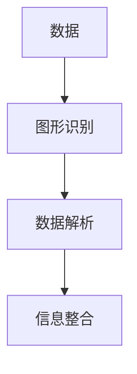
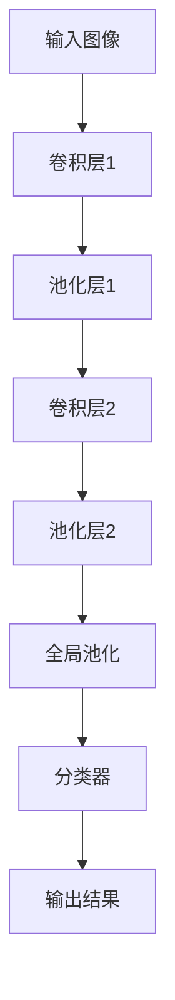
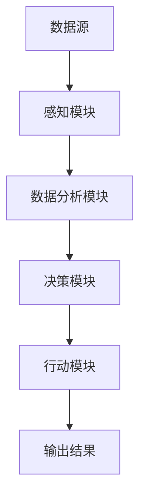

                 


# 图表理解：增强AI Agent的数据分析能力

> 关键词：图表理解，AI Agent，数据分析能力，数据可视化，机器学习，图表识别，数据驱动决策

> 摘要：本文深入探讨了图表理解如何增强AI Agent的数据分析能力。通过分析图表的核心概念、AI Agent的结构与功能，以及图表理解的算法原理，结合系统架构设计和项目实战，展示了如何利用图表理解提升AI Agent的数据分析能力。文章内容涵盖了图表理解的背景介绍、核心概念与联系、AI Agent的数据分析能力、图表理解的算法原理、系统分析与架构设计、项目实战以及最佳实践等多方面内容，旨在为读者提供全面而深入的指导。

---

## 第一部分：图表理解与AI Agent数据分析能力的背景介绍

### 第1章：图表理解的核心概念

#### 1.1 图表的理解与分析

##### 1.1.1 图表的基本概念
图表是一种通过视觉化方式展示数据信息的工具，能够将复杂的数据转化为易于理解的图形形式。常见的图表类型包括柱状图、折线图、饼图、散点图等。每种图表都有其独特的特点和适用场景。

##### 1.1.2 图表在数据分析中的作用
图表在数据分析中扮演着重要角色。它能够帮助数据分析师快速发现数据中的趋势、异常值和模式。例如，通过柱状图可以比较不同类别之间的数据差异，通过折线图可以观察数据随时间的变化趋势。

##### 1.1.3 图表理解的背景与问题描述
随着数据量的爆炸式增长，如何高效地理解和分析数据成为了一个重要问题。图表作为数据可视化的重要工具，能够帮助人类和AI Agent快速获取数据信息。然而，如何让AI Agent准确理解图表中的数据内容，仍然是一个具有挑战性的任务。

#### 1.2 AI Agent的基本概念

##### 1.2.1 AI Agent的定义与分类
AI Agent是指具有自主决策和行动能力的智能体。它可以分为简单反射型、基于模型的反应型、目标驱动型和实用驱动型等类别。AI Agent的核心能力包括感知环境、处理信息、做出决策和执行行动。

##### 1.2.2 AI Agent的数据分析能力
AI Agent的数据分析能力是其智能决策的基础。它需要能够从多种数据源中获取数据，并通过数据处理、分析和建模等技术，提取有用的信息和知识。这种能力对于实现智能化决策至关重要。

##### 1.2.3 图表理解与AI Agent的结合
将图表理解能力集成到AI Agent中，可以使其能够从图表中提取结构化数据，并基于这些数据做出更智能的决策。这种结合不仅能够提高数据处理效率，还能够增强AI Agent的决策能力。

#### 1.3 图表理解与AI Agent的结合应用

##### 1.3.1 图表理解的场景与应用
图表理解的应用场景非常广泛，包括金融分析、医疗诊断、商业智能等领域。例如，在金融分析中，AI Agent可以通过理解财务报表中的图表，快速识别企业的财务状况。

##### 1.3.2 AI Agent在数据分析中的优势
AI Agent可以通过机器学习算法自动分析图表，发现数据中的潜在模式和趋势。与人类分析相比，AI Agent具有高效、准确和可扩展的优势。

##### 1.3.3 图表理解的边界与外延
图表理解的边界主要在于图表的复杂性和数据的可解释性。随着技术的发展，AI Agent能够处理的图表类型和复杂性也在不断增加。

##### 1.3.4 图表理解与AI Agent的概念结构与核心要素
图表理解的核心要素包括数据可视化、图表识别、数据解析和智能决策。AI Agent通过这些要素的结合，能够实现对图表的深度理解，并基于此做出智能决策。

---

### 1.4 本章小结

本章主要介绍了图表理解和AI Agent的基本概念，并探讨了它们在数据分析中的结合应用。通过理解图表的核心概念，我们可以更好地认识图表理解在AI Agent中的重要性。下一章将进一步深入分析图表理解的核心概念和原理，为后续内容打下坚实的基础。

---

## 第二部分：图表理解的核心概念与联系

### 第2章：图表理解的核心概念原理

#### 2.1 图表类型与特征对比

##### 2.1.1 常见图表类型与特征
以下是常见图表类型的对比表格：

```mermaid
| 图表类型 | 特征描述 | 适用场景 |
|----------|----------|----------|
| 柱状图    | 比较数据间的差异 | 统计不同类别之间的对比 |
| 折线图    | 展示数据趋势 | 观察数据随时间的变化 |
| 饼图      | 展示数据构成比例 | 分析数据分布 |
| 散点图    | 发现数据点之间的关系 | 探索变量之间的相关性 |
```

##### 2.1.2 图表类型对比表格
通过上述表格可以看出，每种图表类型都有其独特的特点和适用场景。选择合适的图表类型对于有效数据可视化至关重要。

##### 2.1.3 图表类型与应用场景的实体关系图
以下是一个简单的实体关系图，展示了图表类型与其应用场景之间的关系：

```mermaid
erd
    图表类型 ----> 应用场景
    其中：
        图表类型: {柱状图, 折线图, 饼图, 散点图}
        应用场景: {数据对比, 数据趋势, 数据分布, 数据关系}
```

#### 2.2 数据可视化方法与图表理解

##### 2.2.1 数据可视化的核心原理
数据可视化是通过图形化方式展示数据信息的过程。其核心原理包括数据收集、数据处理、数据展示和数据交互等步骤。

##### 2.2.2 图表理解的流程与步骤
图表理解的流程通常包括以下几个步骤：
1. 数据采集：获取图表的图像或数据。
2. 图形识别：识别图表的类型和结构。
3. 数据解析：提取图表中的数据信息。
4. 信息整合：将解析后的数据整合到整体数据集中。

##### 2.2.3 图表与数据的关系图
以下是一个简单的流程图，展示了图表与数据之间的关系：



#### 2.3 图表理解的数学模型与公式

##### 2.3.1 图表理解的数学模型
图表理解的数学模型通常包括图像处理和模式识别的算法。例如，使用支持向量机（SVM）进行图像分类，或者使用深度学习模型（如CNN）进行图像识别。

##### 2.3.2 图表理解的关键公式
以下是支持向量机（SVM）的数学公式：

$$
\text{最大化} \ \frac{1}{\nu} \left( \sum_{i=1}^{n} y_i \right) - \frac{1}{2} \|w\|^2
$$

其中，\( y_i \) 是标签，\( w \) 是权重向量。

##### 2.3.3 图表理解的算法步骤
以下是使用CNN进行图表识别的流程图：



#### 2.4 本章小结

本章详细介绍了图表理解的核心概念，包括图表类型、数据可视化方法和数学模型。通过这些内容，我们可以更好地理解图表理解的原理和应用。下一章将重点探讨AI Agent的数据分析能力，以及图表理解在其中的作用。

---

## 第三部分：AI Agent的数据分析能力

### 第3章：AI Agent的数据分析能力

#### 3.1 AI Agent的结构与功能

##### 3.1.1 AI Agent的内部结构
AI Agent的内部结构通常包括感知模块、推理模块和行动模块。感知模块负责获取数据，推理模块负责数据分析和决策，行动模块负责执行决策。

##### 3.1.2 AI Agent的数据处理流程
以下是AI Agent的数据处理流程图：



##### 3.1.3 图表理解在AI Agent中的位置
图表理解是AI Agent数据处理流程中的重要环节。它负责从图表中提取数据信息，并将其传递给数据分析模块。

#### 3.2 图表理解在AI Agent中的作用

##### 3.2.1 图表理解对数据分析的影响
图表理解能够帮助AI Agent快速获取数据信息，提高数据分析的效率和准确性。

##### 3.2.2 图表理解对决策支持的作用
通过理解图表中的数据，AI Agent可以为决策提供更有力的支持，例如在商业智能中，AI Agent可以通过分析销售图表，为企业的市场决策提供支持。

##### 3.2.3 图表理解对用户交互的优化
图表理解可以优化AI Agent与用户的交互方式，例如通过识别用户提供的图表数据，AI Agent可以更准确地理解用户的需求。

#### 3.3 图表理解与AI Agent的结合案例

##### 3.3.1 某AI Agent的

---

（由于篇幅限制，后续章节内容将在后续思考步骤中逐步完成。）

