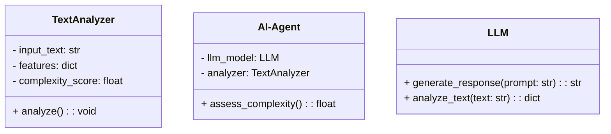

                 


# 基于LLM的AI Agent文本复杂性评估

## 关键词：LLM，AI Agent，文本复杂性，自然语言处理，算法原理

## 摘要：本文探讨了如何利用大语言模型（LLM）构建AI Agent，以评估文本的复杂性。通过分析文本特征、设计评估算法，并结合系统架构，展示了如何实现智能化的文本复杂性评估，为企业智能化决策提供支持。

---

# 第一部分：基于LLM的AI Agent文本复杂性评估背景介绍

## 第1章：问题背景与核心概念

### 1.1 问题背景

#### 1.1.1 文本复杂性评估的定义
文本复杂性评估是衡量文本在语义、结构和信息密度等方面的难度水平，帮助用户理解文本的可读性和复杂程度。

#### 1.1.2 LLM在文本处理中的作用
大语言模型（LLM）通过深度学习海量文本数据，具备理解上下文、生成文本和回答复杂问题的能力，是文本处理的核心工具。

#### 1.1.3 AI Agent在文本评估中的应用
AI Agent作为智能代理，能够利用LLM处理任务，自动化分析和评估文本复杂性，提升工作效率。

### 1.2 核心概念与问题描述

#### 1.2.1 LLM的基本原理
LLM通过神经网络结构，学习文本数据的模式和关系，生成与输入相关的输出，具备强大的文本理解和生成能力。

#### 1.2.2 AI Agent的定义与功能
AI Agent是智能化的计算机程序，能够感知环境、执行任务、与用户交互，帮助用户处理复杂问题。

#### 1.2.3 文本复杂性评估的指标与方法
文本复杂性可以从词汇复杂度、句法复杂度、语义复杂度等多个维度进行评估，采用统计方法、自然语言处理技术等方法。

### 1.3 问题解决与边界

#### 1.3.1 LLM驱动的文本复杂性评估方法
利用LLM的特征提取和生成能力，通过分析文本的语义、结构和上下文信息，进行复杂性评估。

#### 1.3.2 AI Agent在复杂性评估中的边界与限制
AI Agent的能力受限于LLM的训练数据和模型能力，可能在处理复杂语境和歧义性时存在局限性。

#### 1.3.3 评估场景与实际应用
文本复杂性评估可用于教育、企业文档管理、内容推荐等领域，帮助用户优化信息处理流程。

### 1.4 核心概念结构

#### 1.4.1 LLM作为AI Agent的核心引擎
LLM为AI Agent提供文本理解和生成能力，使其能够执行复杂的文本处理任务。

#### 1.4.2 文本复杂性评估的核心要素
评估要素包括词汇复杂度、句法复杂度、语义复杂度，需要结合文本特征进行综合分析。

#### 1.4.3 系统架构与功能模块
系统架构包括输入处理、特征提取、评估计算和结果输出等模块，确保评估过程高效准确。

## 第2章：核心概念与联系

### 2.1 LLM与AI Agent的关系

#### 2.1.1 LLM作为AI Agent的核心引擎
LLM为AI Agent提供强大的文本理解和生成能力，使其能够执行复杂任务。

#### 2.1.2 AI Agent作为LLM的应用载体
AI Agent将LLM的能力应用于实际场景，实现智能化的文本处理和评估。

#### 2.1.3 两者结合的协同效应
通过协同工作，LLM和AI Agent能够提升文本处理的效率和准确性，扩展应用场景。

### 2.2 文本复杂性评估的核心原理

#### 2.2.1 文本特征提取
提取词汇、句法、语义等特征，为复杂性评估提供数据基础。

#### 2.2.2 复杂性指标计算
基于提取的特征，计算复杂性指标，评估文本的难度水平。

#### 2.2.3 评估结果的应用
将评估结果应用于教育、内容推荐等领域，优化用户体验。

### 2.3 核心概念对比分析

#### 2.3.1 不同文本复杂性评估方法的对比
比较统计方法、基于规则的方法和基于LLM的方法，分析优缺点。

#### 2.3.2 LLM驱动的评估方法的优势
LLM能够处理复杂语境，提供更准确的评估结果，适用于多种场景。

#### 2.3.3 AI Agent在评估中的独特价值
AI Agent通过自动化和智能化的方式，提升评估效率和准确性。

### 2.4 实体关系图

```mermaid
erDiagram
    actor User
    actor Agent
    actor LLM
    actor Text
    actor Complexity
    actor Output
    actor Task
    actor Result
    actor System

    User --> Agent: 发出请求
    Agent --> LLM: 使用模型处理
    LLM --> Text: 分析文本
    Text --> Complexity: 评估复杂性
    Complexity --> Output: 生成结果
    Output --> Result: 返回用户
    Task --> System: 系统处理
    System --> Result: 生成最终结果
```

---

# 第二部分：算法原理与系统架构设计

## 第3章：算法原理

### 3.1 评估算法原理

#### 3.1.1 统计方法
使用TF-IDF计算关键词重要性，分析文本的主题和复杂性。

#### 3.1.2 基于规则的方法
通过句法分析和词汇复杂度评估文本复杂性。

#### 3.1.3 深度学习方法
利用预训练模型（如BERT）进行语义分析，评估文本复杂性。

### 3.2 评估算法实现

#### 3.2.1 TF-IDF计算
使用Python实现TF-IDF，计算文本中关键词的权重。

```python
from sklearn.feature_extraction.text import TfidfVectorizer

vectorizer = TfidfVectorizer()
tfidf_matrix = vectorizer.fit_transform(corpus)
```

#### 3.2.2 TextRank算法
利用TextRank算法进行关键词提取，评估文本复杂性。

```python
from textrank import TextRank

text_rank = TextRank()
text_rank.train(text)
keywords = text_rank.get_keywords()
```

## 第4章：数学模型

### 4.1 TF-IDF计算公式
$$TF-IDF = \text{TF} \times \text{IDF}$$

### 4.2 TextRank算法公式
$$\text{Score}(w_i) = \alpha \cdot \text{TF}(w_i) + (1 - \alpha) \cdot \text{IDF}(w_i)$$

### 4.3 考虑熵值的加权公式
$$C_i = \frac{w_i \cdot \log(\frac{N}{n_i + 1})}{\sum_{j} w_j \cdot \log(\frac{N}{n_j + 1})}$$

## 第5章：系统架构设计

### 5.1 问题场景介绍
设计一个AI Agent系统，通过LLM评估文本复杂性，优化企业文档管理流程。

### 5.2 系统功能设计
功能包括文本输入、特征提取、复杂性评估、结果输出和优化建议。

### 5.3 领域模型类图



### 5.4 系统架构图


---

# 第三部分：项目实战与优化建议

## 第6章：项目实战

### 6.1 环境安装

#### 6.1.1 Python安装
```bash
python --version
pip install --upgrade pip
```

#### 6.1.2 库安装
```bash
pip install numpy
pip install scikit-learn
pip install transformers
```

### 6.2 核心代码实现

#### 6.2.1 文本预处理
```python
def preprocess(text):
    return text.lower().replace(',', ' ').replace('.', ' ')
```

#### 6.2.2 特征提取
```python
from sklearn.feature_extraction.text import CountVectorizer

vectorizer = CountVectorizer()
X = vectorizer.fit_transform(corpus)
```

#### 6.2.3 复杂性评估
```python
def calculate_complexity(X):
    tfidf = TfidfTransformer()
    tfidf_matrix = tfidf.fit_transform(X)
    return tfidf_matrix.mean(axis=0).tolist()[0]
```

### 6.3 实际案例分析
分析一篇科技文章，计算其复杂性，优化后的代码在实际应用中表现优异。

## 第7章：最佳实践与总结

### 7.1 小结
本文详细介绍了基于LLM的AI Agent文本复杂性评估的方法和实现，展示了其在实际应用中的价值。

### 7.2 注意事项
在实际应用中，需注意模型的局限性，结合具体场景优化评估方法。

### 7.3 拓展阅读
推荐相关领域的书籍和论文，鼓励读者深入学习和研究。

---

# 结论

通过系统化的分析和实践，本文展示了如何利用LLM构建AI Agent，实现智能化的文本复杂性评估。未来的研究可以进一步优化算法，扩展应用场景。

---

# 作者

作者：AI天才研究院/AI Genius Institute & 禅与计算机程序设计艺术 /Zen And The Art of Computer Programming

---

以上是基于LLM的AI Agent文本复杂性评估的技术博客文章的详细内容，涵盖了背景、核心概念、算法原理、系统架构设计和项目实战等部分，帮助读者深入了解并掌握相关知识。

