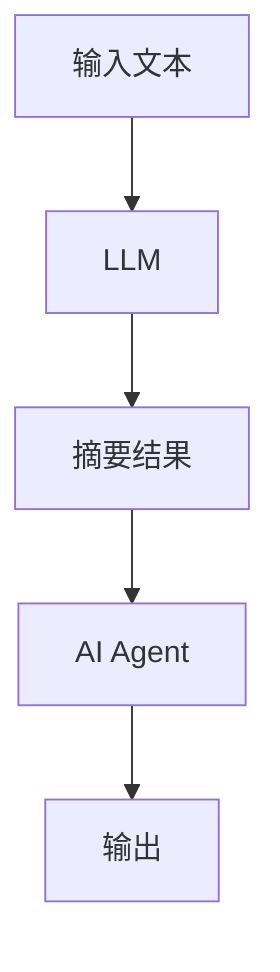
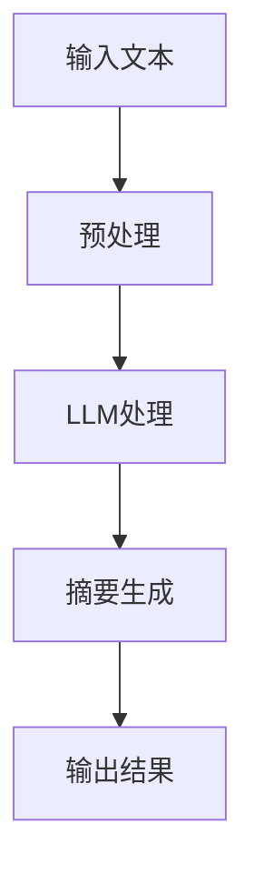
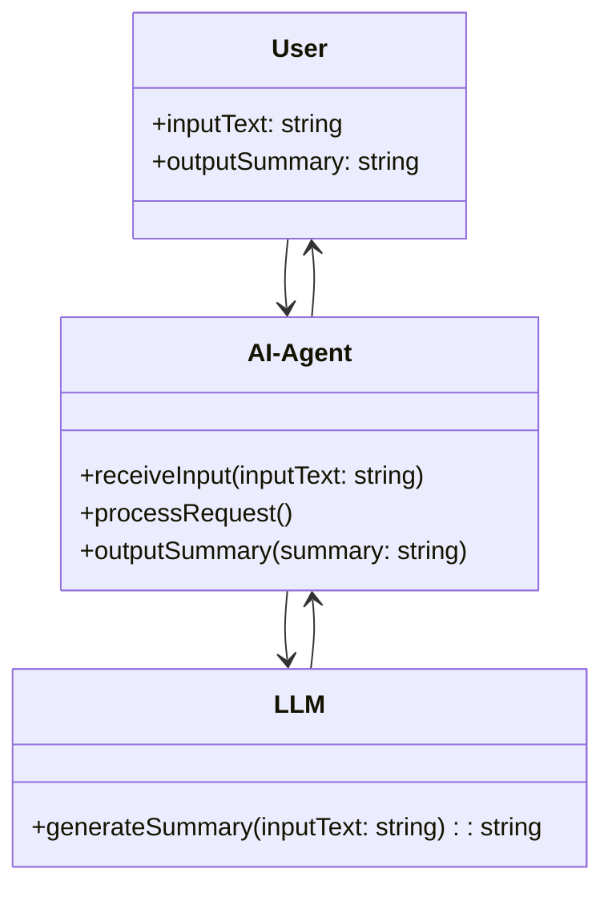
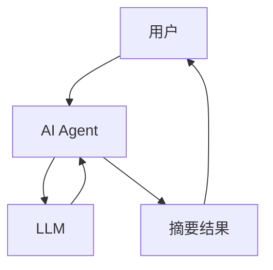
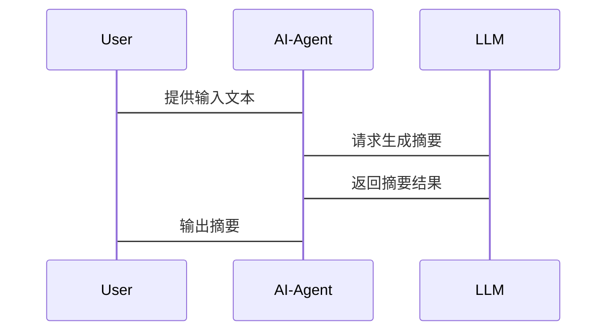

                 


# 基于LLM的AI Agent文本摘要生成

> 关键词：LLM, AI Agent, 文本摘要, 自然语言处理, 人工智能

> 摘要：本文详细探讨了基于大语言模型（LLM）的AI Agent在文本摘要生成中的应用。从背景介绍到核心概念，从算法原理到系统架构，再到项目实战，全面解析了如何利用LLM构建高效的AI Agent，实现自动化的文本摘要生成。

---

# 第一部分: 基于LLM的AI Agent文本摘要生成概述

## 第1章: 背景介绍与问题背景

### 1.1 问题背景
#### 1.1.1 大语言模型（LLM）的发展与应用
- LLM的崛起：从BERT到GPT系列，LLM的性能和应用范围不断提升。
- LLM在自然语言处理（NLP）中的应用：文本生成、机器翻译、问答系统等。

#### 1.1.2 AI Agent的概念与作用
- AI Agent的定义：智能体（Agent）是能够感知环境并采取行动以实现目标的实体。
- AI Agent的核心功能：自主决策、目标导向、与环境交互。
- AI Agent的应用场景：个人助手、智能客服、自动化系统等。

#### 1.1.3 文本摘要生成的必要性与应用场景
- 文本摘要的定义：从长文本中提取关键信息，生成简短的摘要。
- 文本摘要的应用场景：新闻阅读、学术研究、信息检索等。
- 文本摘要的挑战：信息抽取的准确性、摘要的简洁性与完整性。

### 1.2 问题描述
#### 1.2.1 文本摘要生成的核心目标
- 提供准确、简洁的摘要。
- 保留原文的主要信息和核心观点。

#### 1.2.2 基于LLM的AI Agent的优势
- 利用LLM的强大语言理解能力，生成高质量的摘要。
- AI Agent能够自动化处理任务，提高效率。

#### 1.2.3 当前技术的挑战与不足
- LLM的计算成本较高。
- 摘要生成的可解释性较弱。
- 多语言支持的局限性。

### 1.3 问题解决
#### 1.3.1 LLM在文本摘要中的应用
- 使用LLM进行文本理解和生成。
- 基于LLM的摘要生成方法：抽取式和生成式。

#### 1.3.2 AI Agent如何提升摘要生成效率
- AI Agent可以自动接收输入、处理并生成摘要。
- 支持多任务处理，提高工作效率。

#### 1.3.3 技术实现的路径与方法
- 结合LLM和AI Agent，构建完整的摘要生成系统。
- 优化算法，降低计算成本，提高生成效率。

### 1.4 边界与外延
#### 1.4.1 文本摘要生成的边界条件
- 输入文本的长度限制。
- 摘要的长度和格式要求。
- 支持的文本类型（如新闻、学术论文等）。

#### 1.4.2 AI Agent的功能边界
- 摘要生成的核心功能。
- 辅助功能（如结果反馈、用户交互）。
- 外部依赖（如API调用、数据存储）。

#### 1.4.3 技术实现的外延与扩展
- 支持多语言摘要生成。
- 集成其他NLP任务（如问答系统、文本分类）。
- 扩展到其他领域（如图像生成、代码生成）。

### 1.5 概念结构与核心要素
#### 1.5.1 LLM与AI Agent的关系
- LLM是AI Agent的核心技术之一。
- AI Agent可以调用LLM进行文本处理。

#### 1.5.2 文本摘要生成的核心要素
- 输入文本：需要摘要的原始文本。
- 摘要结果：生成的摘要文本。
- 摘要算法：用于生成摘要的模型或方法。

#### 1.5.3 系统架构的核心组成
- 用户输入接口：接收输入文本。
- 摘要生成模块：基于LLM生成摘要。
- 输出结果：展示生成的摘要。

## 第2章: 核心概念与联系

### 2.1 核心概念原理
#### 2.1.1 大语言模型（LLM）的工作原理
- LLM的训练过程：基于大量文本数据，通过自监督学习优化模型参数。
- 注意力机制：模型能够关注输入文本中重要的部分，生成相关输出。

#### 2.1.2 AI Agent的基本原理
- 感知环境：通过传感器或API获取外部信息。
- 决策与行动：基于感知的信息，采取相应的行动。
- 学习与优化：通过反馈不断优化自身的行为。

#### 2.1.3 文本摘要生成的算法原理
- 抽取式摘要：从原文中选择重要句子或词语，直接生成摘要。
- 生成式摘要：基于原文内容，重新生成新的文本作为摘要。

### 2.2 概念属性特征对比
#### 2.2.1 LLM与传统NLP模型的对比
| 特性               | LLM                     | 传统NLP模型         |
|--------------------|-------------------------|--------------------|
| 模型规模           | 大规模参数（ billions） | 小规模参数（ millions） |
| 训练数据           | 大量多样化的文本数据    | 较小或特定领域数据    |
| 处理能力           | 强大的上下文理解和生成能力 | 较弱的上下文理解能力   |
| 应用场景           | 多样化（文本生成、翻译等） | 专门任务（如分词、句法分析） |

#### 2.2.2 AI Agent与传统脚本的区别
| 特性               | AI Agent               | 传统脚本             |
|--------------------|-------------------------|----------------------|
| 自主性             | 高度自主，能感知环境并采取行动 | 被动执行预定义的指令   |
| 学习能力           | 可以通过反馈不断优化     | 无法优化，仅执行固定指令 |
| 适应性             | 能够适应不同的环境和任务 | 适应性较弱，仅适合特定场景 |

#### 2.2.3 文本摘要生成的特征分析
- 输入输出的关联性：输入文本和摘要之间的语义关系。
- 摘要的简洁性：摘要长度远小于原文长度，但需保留关键信息。
- 生成的创造性：摘要可以是原文的重新表达，也可以是新的表述。

### 2.3 ER实体关系图


---

## 第3章: 算法原理讲解

### 3.1 算法流程


### 3.2 数学模型与公式
#### 3.2.1 概率分布公式
$$P(\text{word}_i|\text{previous words})$$

#### 3.2.2 损失函数
$$\text{Loss} = -\sum_{i=1}^{n} \log P(y_i|x_{<i})$$

#### 3.2.3 注意力机制公式
$$\text{Attention}(Q,K,V) = \text{softmax}\left(\frac{QK^T}{\sqrt{d_k}}\right)V$$

### 3.3 详细讲解
#### 3.3.1 模型输入
- 输入文本：需要生成摘要的原始文本。

#### 3.3.2 模型处理
- 预处理：对输入文本进行清洗、分词等处理。
- LLM处理：将预处理后的文本输入到LLM中，生成摘要。

#### 3.3.3 摘要生成
- 抽取式摘要：从原文中选择关键句子或词语。
- 生成式摘要：基于原文内容，重新生成新的文本作为摘要。

### 3.4 举例说明
- 输入文本：一篇新闻文章。
- 输出摘要：文章的标题和主要事件。

---

## 第4章: 系统分析与架构设计

### 4.1 问题场景介绍
#### 4.1.1 用户需求分析
- 用户需要快速获取文本的主要信息。
- 用户希望系统能够自动化处理摘要生成任务。

#### 4.1.2 系统目标设定
- 构建一个基于LLM的AI Agent，实现文本摘要生成。
- 提供高效的摘要生成服务，满足用户需求。

#### 4.1.3 系统边界与约束
- 系统输入：用户提供的文本。
- 系统输出：生成的摘要文本。
- 系统约束：计算资源限制、响应时间限制。

### 4.2 系统功能设计
#### 4.2.1 领域模型设计


### 4.3 系统架构设计


### 4.4 系统接口设计
- 用户接口：接收输入文本，输出摘要结果。
- LLM接口：提供生成摘要的API。

### 4.5 系统交互


---

## 第5章: 项目实战

### 5.1 环境安装
- 安装Python和相关库（如Hugging Face的transformers库）。
- 安装AI Agent框架（如LangChain）。

### 5.2 系统核心实现源代码
```python
from transformers import LlamaTokenizer, LlamaForCausalLM
from langchain.llms import LlamaCpp

# 初始化LLM
llm = LlamaCpp(
    model_path="llama-2-70b",
    temperature=0.7,
    max_tokens=1000
)

# 定义AI Agent
class AIAgent:
    def __init__(self):
        self.llm = llm

    def generate_summary(self, input_text):
        prompt = f"Please generate a concise summary for the following text: {input_text}"
        summary = self.llm.predict([prompt])
        return summary[0]
```

### 5.3 代码应用解读与分析
- 使用LangChain框架集成LLM。
- 定义AI Agent类，封装LLM的调用接口。
- 生成摘要的提示语设计。

### 5.4 实际案例分析和详细讲解剖析
- 案例1：新闻文章摘要生成。
- 案例2：学术论文摘要生成。
- 案例3：长文档摘要生成。

### 5.5 项目小结
- 项目实现的关键点：LLM的调用、AI Agent的封装、摘要生成的提示语设计。
- 项目优化方向：提高生成效率、优化摘要质量、支持多语言。

---

## 第6章: 最佳实践 tips、小结、注意事项、拓展阅读

### 6.1 小结
- 基于LLM的AI Agent在文本摘要生成中的优势。
- 系统实现的关键技术和注意事项。

### 6.2 注意事项
- 确保LLM的调用权限和计算资源。
- 设计合理的提示语，提高摘要生成效果。
- 处理长文本时，注意分块和性能优化。

### 6.3 拓展阅读
- 阅读相关论文和文献，了解最新的摘要生成技术。
- 学习其他NLP任务的实现方法，扩展系统功能。

---

## 第7章: 总结与展望

### 7.1 总结
- 本文详细探讨了基于LLM的AI Agent在文本摘要生成中的应用。
- 从算法原理到系统架构，再到项目实战，全面解析了技术实现的全过程。

### 7.2 展望
- 未来研究方向：优化摘要生成质量，降低计算成本。
- 技术发展趋势：支持多语言、多模态的摘要生成。
- 应用前景：在新闻、教育、医疗等领域具有广泛的应用潜力。

---

## 作者信息

作者：AI天才研究院/AI Genius Institute & 禅与计算机程序设计艺术 /Zen And The Art of Computer Programming

