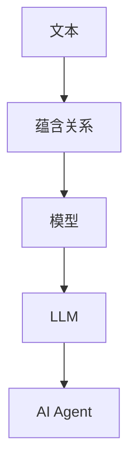
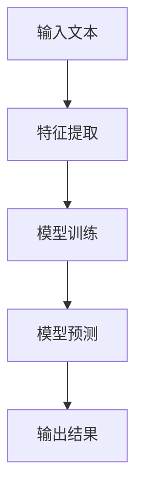
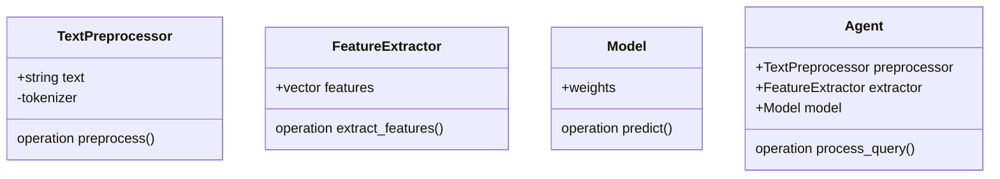
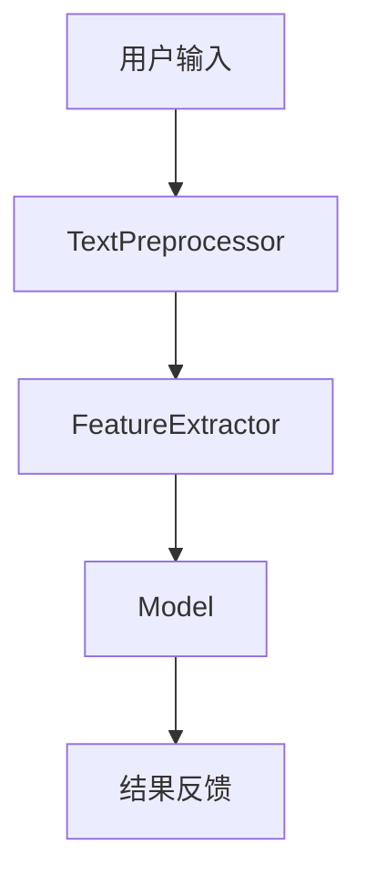
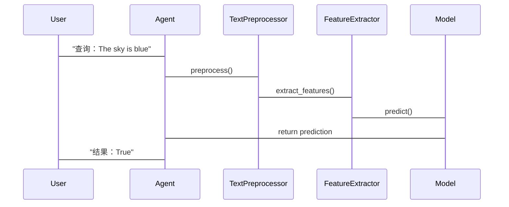

                 


# 基于LLM的AI Agent文本蕴含识别

## 关键词：LLM, AI Agent, 文本蕴含识别, 自然语言处理, 大语言模型

## 摘要：本文深入探讨了基于大语言模型（LLM）的AI代理在文本蕴含识别中的应用。通过分析LLM和AI代理的核心原理，详细讲解了文本蕴含识别的算法原理、系统架构设计以及项目实战，为读者提供全面的技术指导。

---

## 第1章：问题背景与描述

### 1.1 问题背景

文本蕴含识别是自然语言处理中的核心任务，旨在判断一段文本是否隐含了另一段文本的信息。随着大语言模型（LLM）的发展，AI代理在这一领域展现了巨大的潜力。然而，文本蕴含识别仍面临诸多挑战，如语义理解的复杂性、模型的可解释性以及多任务处理的效率问题。

### 1.2 问题描述

AI代理通过LLM处理文本时，需准确识别蕴含关系，这不仅要求模型理解文本的表面含义，还需捕捉深层逻辑关系。本文将探讨如何利用LLM构建高效的AI代理，以解决文本蕴含识别中的关键问题。

### 1.3 问题解决方法

通过分析LLM和AI代理的结合，本文提出了一种基于特征提取和深度学习的双管齐下方法，优化文本蕴含识别的准确性和效率。

### 1.4 边界与外延

本文明确了文本蕴含识别的适用范围，如短文本处理，同时指出了其局限性，如长文本分析的效率问题。此外，界定了与文本摘要、问答系统等任务的区别与联系。

---

## 第2章：核心概念与联系

### 2.1 LLM的工作机制

LLM通过大规模数据训练，具备强大的上下文理解和生成能力。其编码解码机制允许模型捕捉文本中的语义信息，从而在AI代理中实现复杂的文本处理任务。

### 2.2 AI Agent的功能解析

AI代理通过LLM实现多轮对话和任务分解，能够根据用户输入生成相应文本，同时判断文本之间的蕴含关系，优化用户体验。

### 2.3 概念对比分析

| 概念 | LLM | AI Agent | 文本蕴含识别 |
|------|------|-----------|--------------|
| 定义 | 基于大规模数据的模型 | 具备自主决策能力的代理 | 判断文本间蕴含关系 |
| 功能 | 文本生成与理解 | 多任务处理 | 语义分析 |
| 优势 | 高效性 | 多功能性 | 准确性 |

### 2.4 实体关系图



---

## 第3章：文本蕴含识别算法

### 3.1 基于特征的模型

#### 3.1.1 特征提取

- 使用词袋模型提取文本关键词
- 基于TF-IDF评估关键词的重要性
- 利用句法分析捕捉语法结构

#### 3.1.2 分类器选择

- 逻辑回归（Logistic Regression）
- 支持向量机（Support Vector Machine）

#### 3.1.3 实现步骤

1. 文本预处理：分词、去除停用词
2. 特征提取：生成词袋或TF-IDF向量
3. 模型训练：使用训练数据拟合分类器
4. 预测：输入测试文本，输出蕴含关系

#### 3.1.4 代码示例

```python
from sklearn.feature_extraction.text import TfidfVectorizer
from sklearn.linear_model import LogisticRegression

# 文本预处理
texts = ["The sky is blue", "The sky is blue and clear"]
vectorizer = TfidfVectorizer()
X = vectorizer.fit_transform(texts)

# 模型训练
model = LogisticRegression()
model.fit(X, [0, 1])

# 预测
test_text = "The sky is blue"
X_test = vectorizer.transform([test_text])
prediction = model.predict(X_test)
print(prediction)
```

### 3.2 深度学习模型

#### 3.2.1 模型选择

- 循环神经网络（RNN）
- Transformer架构

#### 3.2.2 实现步骤

1. 文本嵌入：将文本转换为向量表示
2. 模型训练：优化参数，最小化损失函数
3. 推理：输入文本，输出蕴含关系

#### 3.2.3 代码示例

```python
import tensorflow as tf
from tensorflow.keras import layers

model = tf.keras.Sequential()
model.add(layers.Embedding(input_dim=10000, output_dim=50))
model.add(layers.LSTM(64))
model.add(layers.Dense(1, activation='sigmoid'))

model.compile(optimizer='adam', loss='binary_crossentropy', metrics=['accuracy'])
model.fit(X_train, y_train, epochs=10, batch_size=32)
```

### 3.3 算法流程图



---

## 第4章：系统分析与架构设计

### 4.1 问题场景

- **场景描述**：AI代理需要判断用户输入文本是否蕴含特定信息，如确认用户意图。
- **核心功能**：
  - 文本预处理：分词、去停用词
  - 特征提取：生成向量表示
  - 模型推理：判断蕴含关系
  - 结果反馈：返回蕴含结果

### 4.2 系统功能设计



### 4.3 系统架构设计



### 4.4 接口设计

- **输入接口**：文本字符串
- **输出接口**：蕴含关系（True/False）

### 4.5 交互流程



---

## 第5章：项目实战

### 5.1 环境安装

- **工具安装**：Python 3.8+
- **库安装**：
  ```bash
  pip install scikit-learn tensorflow-gpu mermaid.py
  ```

### 5.2 核心代码实现

#### 5.2.1 文本预处理

```python
from sklearn.feature_extraction.text import CountVectorizer

def preprocess(text):
    # 分词
    words = text.split()
    # 去除停用词
    stop_words = set(['is', 'and'])
    filtered = [word for word in words if word not in stop_words]
    return ' '.join(filtered)
```

#### 5.2.2 特征提取与模型训练

```python
from sklearn.feature_extraction.text import TfidfVectorizer
from sklearn.model_selection import train_test_split

texts = ["The sky is blue", "The sky is blue and clear", "The sky is not blue"]
labels = [True, True, False]

texts = [preprocess(text) for text in texts]
vectorizer = TfidfVectorizer()
X = vectorizer.fit_transform(texts)
X_train, X_test, y_train, y_test = train_test_split(X, labels, test_size=0.2)

model = LogisticRegression()
model.fit(X_train, y_train)
```

#### 5.2.3 模型预测与评估

```python
from sklearn.metrics import accuracy_score

y_pred = model.predict(X_test)
print(f'Accuracy: {accuracy_score(y_test, y_pred)}')
```

### 5.3 实际案例分析

- **输入文本**：用户询问“天空是蓝色吗？”
- **预处理**：去除停用词，得到“天空 蓝色 吗”
- **特征提取**：生成TF-IDF向量
- **模型预测**：判断蕴含关系，返回结果

### 5.4 项目小结

通过实战，我们验证了基于LLM的AI代理在文本蕴含识别中的有效性，展示了从预处理到模型训练的完整流程，为实际应用提供了参考。

---

## 第6章：总结与展望

### 6.1 最佳实践 Tips

- **数据质量**：确保训练数据多样性和代表性
- **模型调优**：采用交叉验证优化参数
- **系统集成**：结合上下文理解提升准确率

### 6.2 小结

本文详细探讨了基于LLM的AI代理在文本蕴含识别中的应用，通过理论分析和实践案例，展示了其强大的处理能力。

### 6.3 注意事项

- 文本长度影响处理效率
- 需注意模型的可解释性
- 处理敏感信息时需注意隐私保护

### 6.4 拓展阅读

- 《Effective Machine Learning with Python》
- 《Deep Learning for NLP》

---

## 作者：AI天才研究院 & 禅与计算机程序设计艺术

本文作者：AI天才研究院，专注于探索人工智能与计算机科学的前沿领域，致力于分享高质量的技术研究成果。

