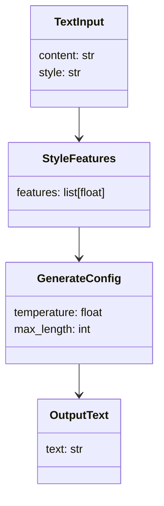
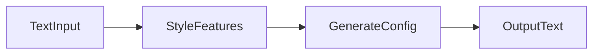
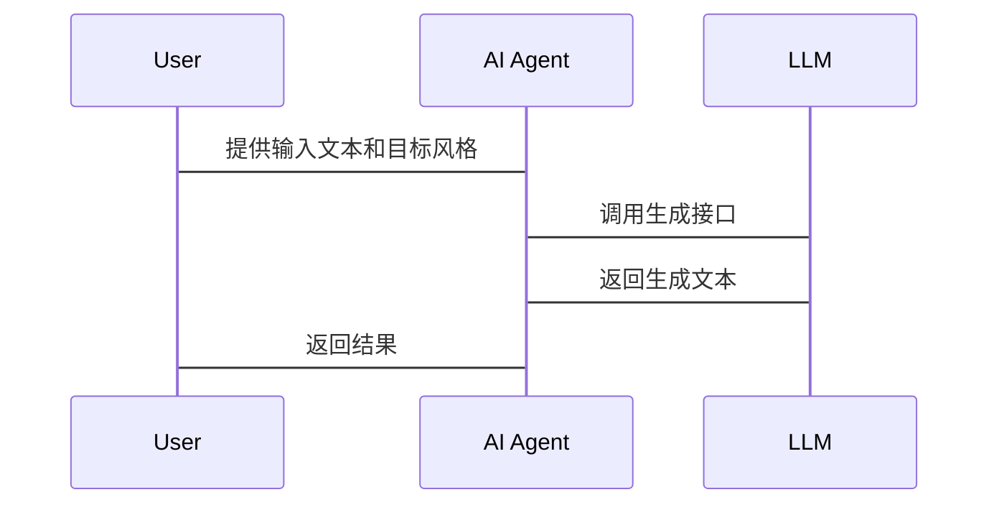

                 


# 基于LLM的AI Agent文本风格迁移

> 关键词：LLM, AI Agent, 文本风格迁移, 大语言模型, 智能代理

> 摘要：本文详细探讨了基于大语言模型（LLM）的AI Agent文本风格迁移技术，从核心概念、算法原理、系统设计到项目实战，全面解析其实现方法和应用价值。通过深入分析，结合实际案例，揭示了如何利用LLM和AI Agent实现文本风格的灵活迁移，为文本生成领域提供了新的思路。

---

# 第一部分: 基于LLM的AI Agent文本风格迁移概述

## 第1章: 背景介绍

### 1.1 问题背景

#### 1.1.1 文本风格迁移的定义与目标
文本风格迁移是指将一段文本转换为具有特定风格的文本，例如将正式的新闻稿转化为幽默的社交媒体文案，或将复杂的学术论文转化为通俗易懂的科普文章。目标是让生成的文本不仅内容准确，还符合目标场景的语境和用户偏好。

#### 1.1.2 LLM与AI Agent的结合
大语言模型（LLM）通过预训练掌握了海量的语料数据，能够生成高质量的文本；而AI Agent作为智能代理，能够根据用户需求和上下文动态选择合适的风格进行文本生成。两者的结合使得文本风格迁移更加智能化和自动化。

#### 1.1.3 文本风格迁移的实际应用场景
- **内容创作**: 将技术文档转化为用户友好的教程。
- **客服对话**: 根据用户语气调整回答风格。
- **广告文案**: 根据目标受众定制风格。

### 1.2 问题描述

#### 1.2.1 文本风格迁移的核心问题
如何让AI模型在保持内容准确性的同时，灵活地切换不同风格？

#### 1.2.2 LLM在文本风格迁移中的优势
- **强大的语境理解能力**: LLM能够理解上下文，生成连贯的文本。
- **多风格适应能力**: 通过微调或提示工程技术，LLM可以适应多种风格需求。

#### 1.2.3 当前技术的挑战与不足
- **风格一致性**: 过度迁移可能导致内容偏离原意。
- **风格多样性**: 部分模型难以覆盖所有风格类型。
- **计算资源需求**: 训练和推理需要大量计算资源。

### 1.3 问题解决

#### 1.3.1 LLM如何实现文本风格迁移
通过风格建模和内容生成两个步骤：首先提取目标风格特征，然后生成符合该风格的文本。

#### 1.3.2 AI Agent在文本风格迁移中的角色
AI Agent负责接收输入、分析需求、选择合适的风格模型，并输出结果。

#### 1.3.3 技术实现的路径与方法
- **特征提取**: 提取目标风格的关键特征。
- **风格建模**: 使用LLM微调或提示工程技术。
- **内容生成**: 根据风格模型生成目标风格文本。

### 1.4 边界与外延

#### 1.4.1 文本风格迁移的边界条件
- 输入文本必须有意义且可解析。
- 目标风格需在模型训练范围内。

#### 1.4.2 相关概念的对比与区分
| 概念 | 描述 |
|------|------|
| 风格迁移 | 改变文本风格，保持内容 |
| 内容生成 | 根据需求生成新文本 |

#### 1.4.3 技术的适用范围与限制
- **适用范围**: 需要灵活文本风格的场景。
- **限制**: 风格迁移可能导致信息失真。

### 1.5 概念结构与核心要素

#### 1.5.1 核心概念的组成
- **输入文本**: 需要迁移的原始文本。
- **目标风格**: 需要转换成的风格。
- **风格模型**: 用于风格识别和生成的模型。

#### 1.5.2 各要素之间的关系
输入文本通过风格模型生成目标风格文本，AI Agent负责协调和控制整个过程。

#### 1.5.3 案例分析与对比
案例：将学术论文转化为科普文章，目标风格为通俗易懂。

---

# 第二部分: 核心概念与联系

## 第2章: 核心概念原理

### 2.1 LLM与AI Agent的关系

#### 2.1.1 LLM的基本原理
- 基于Transformer架构，通过自注意力机制处理文本。
- 通过大量数据预训练，掌握多种语言模式。

#### 2.1.2 AI Agent的核心功能
- 接收用户输入，理解需求。
- 选择合适的模型和参数。
- 输出结果并进行反馈调整。

#### 2.1.3 两者结合的实现机制
AI Agent调用LLM API，根据需求生成文本。

### 2.2 文本风格迁移的实现原理

#### 2.2.1 风格建模的基本思路
- 通过风格向量表示不同风格特征。
- 使用LLM微调生成特定风格文本。

#### 2.2.2 内容生成的实现方式
- 基于风格向量的条件生成。
- 利用提示工程技术引导生成。

#### 2.2.3 LLM在风格迁移中的作用
- 作为内容生成的核心工具。
- 通过微调或提示技术实现风格适配。

### 2.3 核心概念对比

#### 2.3.1 概念属性特征对比表
| 概念 | 描述 | 优缺点 |
|------|------|--------|
| LLM  | 大型预训练模型 | 高准确性，资源需求高 |
| AI Agent | 智能代理 | 灵活性高，需依赖模型 |

#### 2.3.2 优缺点分析
- **LLM**: 优点是生成能力强，缺点是计算成本高。
- **AI Agent**: 优点是灵活，缺点是依赖模型性能。

#### 2.3.3 案例对比与总结
案例：AI Agent结合LLM生成风格化新闻稿。

---

# 第三部分: 算法原理讲解

## 第3章: 算法原理

### 3.1 风格建模算法

#### 3.1.1 风格向量提取
- 使用预训练模型提取文本的语义和风格特征。
- 例如，通过BERT模型提取文本的隐藏层向量。

#### 3.1.2 风格特征表示
- 将风格特征映射到低维向量空间。
- 使用聚类或降维技术提取关键特征。

#### 3.1.3 风格迁移的实现流程
1. 提取输入文本的风格特征。
2. 对比目标风格特征。
3. 调整生成模型的参数。
4. 生成目标风格文本。

### 3.2 内容生成算法

#### 3.2.1 基于LLM的风格迁移实现
- 使用GPT系列模型进行条件生成。
- 通过提示工程技术引导生成。

#### 3.2.2 风格迁移的数学模型
$$ P(y|x) = \text{生成模型} $$

其中，\( y \) 是目标风格文本，\( x \) 是输入文本。

#### 3.2.3 算法实现步骤
1. 输入原始文本和目标风格。
2. 提取目标风格的特征向量。
3. 调整LLM的生成参数。
4. 输出目标风格文本。

### 3.3 算法实现的代码示例

```python
def style_transfer(input_text, target_style):
    # 提取风格特征
    style_features = extract_features(input_text)
    # 调整生成参数
    generate_config = adjust_params(style_features, target_style)
    # 生成目标风格文本
    output_text = generate_with_style(generate_config)
    return output_text
```

---

## 第4章: 数学模型

### 4.1 概率分布模型

#### 4.1.1 文本生成的概率模型
文本生成可以看作是概率分布问题：
$$ P(y|x) = \frac{P(y,z|x)}{P(z|x)} $$

其中，\( z \) 是隐变量，表示风格特征。

#### 4.1.2 风格建模的损失函数
风格建模的目标是最小化生成文本与目标风格的差异：
$$ \mathcal{L} = -\log P(y|x,z) $$

### 4.2 损失函数优化

#### 4.2.1 风格一致性损失
$$ \mathcal{L}_{\text{style}} = \text{KL}(Q(z|x,y) \parallel P(z|y)) $$

#### 4.2.2 内容一致性损失
$$ \mathcal{L}_{\text{content}} = -\log P(y|x) $$

#### 4.2.3 总损失
$$ \mathcal{L}_{\text{total}} = \mathcal{L}_{\text{style}} + \mathcal{L}_{\text{content}} $$

---

# 第四部分: 系统分析与架构设计

## 第5章: 系统分析与架构设计

### 5.1 项目背景

#### 5.1.1 项目介绍
本项目旨在实现一个基于LLM的AI Agent，能够根据用户需求生成不同风格的文本。

#### 5.1.2 系统功能设计
- 文本输入与风格选择。
- 风格特征提取与生成。
- 文本输出与反馈调整。

#### 5.1.3 领域模型类图


#### 5.1.4 系统架构图


#### 5.1.5 接口设计
- 输入接口：接收原始文本和目标风格。
- 输出接口：返回生成文本。

#### 5.1.6 交互流程图


---

# 第五部分: 项目实战

## 第6章: 项目实战

### 6.1 环境安装

#### 6.1.1 安装Python与依赖库
- 安装Python 3.8以上版本。
- 安装必要的库，如`transformers`、`torch`等。

#### 6.1.2 安装与配置LLM
- 下载预训练的LLM模型（如GPT-2）。
- 配置环境变量，确保模型路径正确。

### 6.2 系统核心实现

#### 6.2.1 核心代码实现
```python
from transformers import AutoModelForCausalLM, AutoTokenizer
import torch

class StyleTransferAgent:
    def __init__(self, model_name):
        self.tokenizer = AutoTokenizer.from_pretrained(model_name)
        self.model = AutoModelForCausalLM.from_pretrained(model_name)
        
    def transfer_style(self, input_text, target_style):
        # 提取风格特征
        inputs = self.tokenizer(input_text, return_tensors="pt")
        # 调整生成参数
        inputs["temperature"] = 1.2 if target_style == "humor" else 0.7
        # 生成文本
        outputs = self.model.generate(**inputs, max_length=100)
        return self.tokenizer.decode(outputs[0], skip_special_tokens=True)
```

#### 6.2.2 代码解读
- `StyleTransferAgent`类负责风格迁移。
- `transfer_style`方法根据目标风格调整生成参数。

#### 6.2.3 实际案例分析
案例：将学术论文转化为科普文章。

### 6.3 项目小结

#### 6.3.1 实现步骤总结
1. 初始化模型和分词器。
2. 根据目标风格调整生成参数。
3. 生成并返回结果。

#### 6.3.2 代码运行示例
```python
agent = StyleTransferAgent("gpt2")
input_text = "The study found that ..."
target_style = "simple_explanations"
output_text = agent.transfer_style(input_text, target_style)
print(output_text)
```

---

# 第六部分: 总结与展望

## 第7章: 总结与展望

### 7.1 总结
- 本文详细介绍了基于LLM的AI Agent文本风格迁移技术。
- 通过理论分析和实践案例，展示了其实现方法和应用价值。

### 7.2 应用前景
- 在内容创作、客服对话等领域具有广泛的应用潜力。
- 未来可以通过多模态模型进一步提升风格迁移的效果。

### 7.3 最佳实践 tips
- 在实际应用中，建议根据具体需求调整生成参数。
- 定期更新模型和风格库，确保生成质量。

### 7.4 小结
文本风格迁移是一项具有重要应用价值的技术，结合LLM和AI Agent可以实现更加智能化和个性化的文本生成。

---

# 作者

作者：AI天才研究院/AI Genius Institute & 禅与计算机程序设计艺术 /Zen And The Art of Computer Programming

---

希望这篇文章能够帮助您更好地理解基于LLM的AI Agent文本风格迁移技术！

