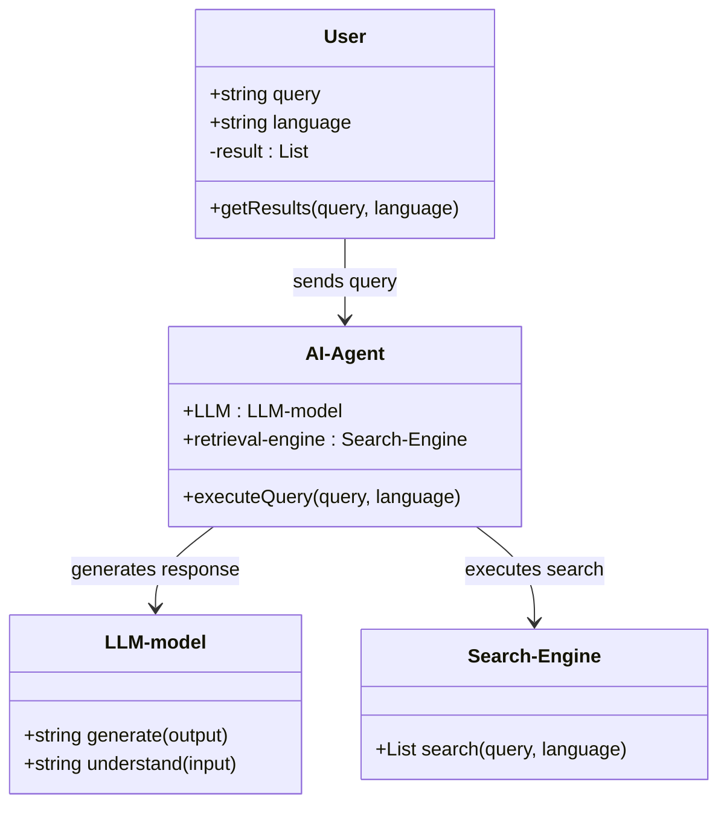

                 


# 基于LLM的AI Agent跨语言信息检索

## 关键词：大语言模型、AI Agent、跨语言信息检索、自然语言处理、智能系统设计

## 摘要：本文探讨了基于大语言模型的AI Agent在跨语言信息检索中的应用，分析了其核心概念、算法原理、系统架构，并通过实际案例展示了如何构建高效的跨语言检索系统。文章旨在为技术从业者提供深入的技术洞察和实践指导。

---

## 第一章: 背景介绍与核心概念

### 1.1 问题背景

#### 1.1.1 多语言信息检索的挑战
在当今全球化的信息时代，信息的多语言性使得跨语言信息检索变得尤为重要。用户可能需要在多种语言的文档中查找信息，但由于语言差异，传统的检索方法难以准确理解和匹配跨语言内容。

#### 1.1.2 大语言模型的崛起
大语言模型（LLM）如GPT-3、PaLM等，凭借其强大的语言理解和生成能力，为跨语言信息检索提供了新的可能性。LLM能够处理多种语言，理解上下文，并生成相关的内容。

#### 1.1.3 AI Agent的定义与作用
AI Agent是一种智能体，能够根据环境信息自主决策并执行任务。在跨语言信息检索中，AI Agent可以作为用户代理，帮助用户在多种语言的文档中检索所需信息。

### 1.2 问题描述

#### 1.2.1 跨语言信息检索的核心问题
跨语言信息检索的核心问题是如何在多种语言的文档中准确找到相关的信息，并将其转化为用户所需的语言。这涉及到语言转换、语义理解等多个技术挑战。

#### 1.2.2 基于LLM的AI Agent的优势
基于LLM的AI Agent能够利用大语言模型的强大能力，实现跨语言的语义理解、信息提取和生成。这种结合使得AI Agent在跨语言信息检索中具有更高的准确性和智能化。

#### 1.2.3 当前技术的局限性与改进方向
当前技术在跨语言信息检索中仍存在一些问题，例如模型对某些语言的支持不足、语义理解的准确性有待提高等。未来的研究方向包括优化模型的跨语言能力、提高检索效率等。

### 1.3 问题解决与边界

#### 1.3.1 跨语言信息检索的关键技术
关键技术包括多语言模型训练、语义理解、跨语言检索算法等。这些技术共同支撑着跨语言信息检索的实现。

#### 1.3.2 基于LLM的AI Agent的实现路径
实现路径包括：构建多语言模型、设计智能代理机制、优化检索算法等。

#### 1.3.3 技术边界与外延
技术边界包括模型支持的语言种类、检索的准确率等；外延则包括将技术应用于实际场景，如客服系统、搜索引擎等。

### 1.4 核心概念与结构

#### 1.4.1 LLM与AI Agent的关系
LLM为AI Agent提供了强大的语言理解和生成能力，而AI Agent则为LLM提供了应用场景和用户交互界面。

#### 1.4.2 跨语言信息检索的核心要素
核心要素包括多语言模型、语义理解、检索算法、结果转换等。

#### 1.4.3 系统架构与功能模块
系统架构包括用户接口、AI Agent、LLM、检索引擎等模块，各模块协同工作完成跨语言信息检索任务。

---

## 第二章: 核心概念与原理

### 2.1 大语言模型（LLM）原理

#### 2.1.1 模型结构与训练方法
大语言模型通常采用Transformer架构，通过自注意力机制和前馈网络进行训练。训练数据包括多种语言的海量文本。

#### 2.1.2 注意力机制与Transformer架构
注意力机制使模型能够关注输入文本中重要的部分，而Transformer架构通过多层堆叠进一步增强了模型的表达能力。

#### 2.1.3 模型的可解释性与局限性
尽管LLM表现出色，但其可解释性较差，且在某些小语种或领域知识较少的语言上效果有限。

### 2.2 AI Agent的核心原理

#### 2.2.1 智能体的定义与分类
AI Agent是一种智能实体，能够感知环境、自主决策并执行任务。分类包括基于规则的Agent和基于模型的Agent。

#### 2.2.2 基于LLM的智能体构建
通过将LLM嵌入到AI Agent中，使其能够理解多种语言的输入，并生成相应的输出。

#### 2.2.3 智能体的决策与执行机制
AI Agent通过分析用户需求，调用LLM进行信息检索，并将结果反馈给用户。

### 2.3 跨语言信息检索的实现原理

#### 2.3.1 多语言模型的训练策略
多语言模型通常采用联合训练策略，使模型能够同时学习多种语言的特征。

#### 2.3.2 跨语言文本表示方法
通过将不同语言的文本映射到同一向量空间，实现跨语言的语义匹配。

#### 2.3.3 跨语言检索的评估指标
常用的评估指标包括准确率、召回率、F1值等。

---

## 第三章: 算法原理与数学模型

### 3.1 大语言模型的算法流程

#### 3.1.1 Transformer模型的训练流程
1. 输入文本经过词嵌入层转化为向量。
2. 进行长短期记忆网络（LSTM）处理，生成上下文表示。
3. 通过自注意力机制，计算每个词的重要性。
4. 前馈网络生成最终的输出。

#### 3.1.2 注意力机制的计算过程
$$ \text{Attention}(Q, K, V) = \text{softmax}\left(\frac{QK^T}{\sqrt{d_k}}\right)V $$
其中，\( Q \) 是查询向量，\( K \) 是键向量，\( V \) 是值向量。

#### 3.1.3 模型的推理过程
给定输入，模型通过解码器生成对应的输出文本。

### 3.2 跨语言信息检索的算法实现

#### 3.2.1 多语言嵌入的生成方法
通过预训练模型生成多语言嵌入向量，实现跨语言的语义匹配。

#### 3.2.2 跨语言相似度计算
$$ \text{similarity}(x, y) = \frac{x \cdot y}{\|x\|\|y\|} $$
其中，\( x \) 和 \( y \) 是不同语言的文本向量。

#### 3.2.3 检索结果的排序与优化
通过学习排序模型，优化检索结果的相关性和准确性。

### 3.3 数学模型与公式

#### 3.3.1 Transformer模型的数学公式
$$ \text{Output} = \text{LayerNorm}(x + \text{MHA}(x)) $$
其中，MHA表示多头注意力机制。

#### 3.3.2 自注意力机制的计算公式
$$ \text{MHA}(Q, K, V) = \text{Concat}(\text{Head}_1, \text{Head}_2, ..., \text{Head}_n) $$
其中，\( \text{Head}_i \) 是第 \( i \) 个头的注意力输出。

---

## 第四章: 系统分析与架构设计

### 4.1 问题场景介绍

#### 4.1.1 背景介绍
假设我们有一个多语言搜索引擎，用户可以通过输入多种语言的查询，获取相关结果。

#### 4.1.2 项目介绍
项目目标是构建一个基于LLM的AI Agent，实现跨语言信息检索。

### 4.2 系统功能设计

#### 4.2.1 领域模型类图


#### 4.2.2 系统架构设计
```mermaid
graph TD
    User -> AI-Agent: sends query
    AI-Agent -> LLM-model: generates response
    AI-Agent -> Search-Engine: executes search
    Search-Engine -> Database: retrieves documents
    LLM-model -> Database: retrieves context
```

#### 4.2.3 系统接口设计
接口设计包括用户接口、AI Agent接口、LLM接口和检索引擎接口。

#### 4.2.4 系统交互流程
用户发送查询请求，AI Agent调用LLM进行理解，检索引擎执行搜索，最终返回结果。

### 4.3 交互流程

#### 4.3.1 用户查询
用户通过输入框输入查询内容和选择语言。

#### 4.3.2 AI Agent解析
AI Agent解析查询内容，调用LLM进行语义理解。

#### 4.3.3 检索引擎执行
检索引擎根据解析结果，在数据库中执行搜索，返回相关文档。

#### 4.3.4 结果反馈
AI Agent将检索结果返回给用户。

---

## 第五章: 项目实战

### 5.1 环境安装

#### 5.1.1 安装Python
安装Python 3.8或更高版本。

#### 5.1.2 安装依赖
安装必要的库，如transformers、numpy等。

### 5.2 核心代码实现

#### 5.2.1 LLM集成
使用Hugging Face的transformers库集成LLM。

#### 5.2.2 检索引擎实现
实现一个多语言检索引擎，支持多种语言的文档存储和查询。

### 5.3 代码应用解读

#### 5.3.1 LLM调用
```python
from transformers import AutoTokenizer, AutoModelForCausalLM

tokenizer = AutoTokenizer.from_pretrained("gpt2")
model = AutoModelForCausalLM.from_pretrained("gpt2")

inputs = tokenizer("Hello, my name is", return_tensors="np")
outputs = model.generate(**inputs)
print(tokenizer.decode(outputs[0], skip_special_tokens=True))
```

#### 5.3.2 跨语言检索
```python
import numpy as np

def calculate_similarity(embedding1, embedding2):
    return np.dot(embedding1, embedding2) / (np.linalg.norm(embedding1) * np.linalg.norm(embedding2))
```

### 5.4 案例分析

#### 5.4.1 实际案例
构建一个跨语言问答系统，支持中英文的查询和回答。

#### 5.4.2 优化与改进
通过微调模型、优化检索算法等方式，提高系统的准确率和响应速度。

### 5.5 项目总结

#### 5.5.1 成果展示
展示项目的实际运行效果和性能指标。

#### 5.5.2 经验总结
总结项目中的经验教训，为后续工作提供参考。

---

## 第六章: 最佳实践与总结

### 6.1 最佳实践 tips

#### 6.1.1 模型选择与优化
选择适合任务的模型，并通过微调等方法优化性能。

#### 6.1.2 系统架构设计
合理设计系统架构，确保系统的可扩展性和可维护性。

#### 6.1.3 跨语言处理技巧
注意处理不同语言的语义差异，避免误解和错误。

### 6.2 小结

#### 6.2.1 核心内容回顾
回顾文章的核心内容，强调基于LLM的AI Agent在跨语言信息检索中的重要性。

#### 6.2.2 未来展望
展望技术的发展趋势，提出未来的研究方向。

### 6.3 注意事项

#### 6.3.1 模型的局限性
注意模型的局限性，避免过度依赖技术。

#### 6.3.2 数据隐私与安全
重视数据隐私和安全问题，确保系统的合规性。

### 6.4 拓展阅读

#### 6.4.1 推荐书籍
推荐相关的技术书籍和论文。

#### 6.4.2 技术博客与资源
推荐相关的技术博客和开源项目，供读者进一步学习。

---

## 附录

### 附录A: 术语表
列出文章中涉及的专业术语及其解释。

### 附录B: 参考文献
列出文章中引用的文献和资料。

---

## 作者：AI天才研究院/AI Genius Institute & 禅与计算机程序设计艺术 /Zen And The Art of Computer Programming

