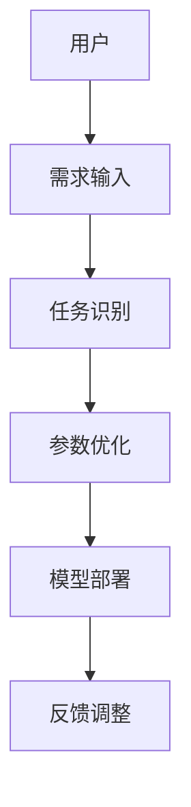
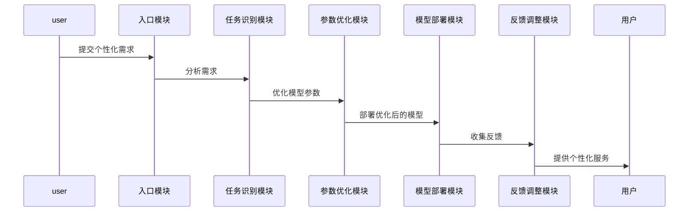

                 


# 基于元学习的AI Agent个性化定制技术

> 关键词：元学习，AI Agent，个性化定制，深度学习，强化学习，机器学习

> 摘要：本文深入探讨了基于元学习的AI Agent个性化定制技术。通过分析元学习的核心原理与AI Agent的功能特点，详细阐述了如何利用元学习提升AI Agent的个性化定制能力。文章从基础概念到算法原理，再到系统架构与项目实战，全面解析了这一技术的实现路径与实际应用，为读者提供了一套完整的解决方案与实践指南。

---

# 第1章: 元学习与AI Agent概述

## 1.1 元学习的基本概念

### 1.1.1 元学习的定义

元学习（Meta-Learning）是一种机器学习范式，旨在让模型学会快速学习新任务的能力。与传统机器学习不同，元学习的目标不是直接解决特定任务，而是通过训练模型在多个任务上的泛化能力，使其能够快速适应新任务。

$$
\text{元学习的核心目标：} \quad \text{快速适应新任务}
$$

### 1.1.2 元学习的核心特点

| 特性 | 描述 |
|------|------|
| 快速适应 | 能够在少量数据或经验下快速掌握新任务 |
| 泛化能力 | 在不同任务之间共享知识，提升模型的通用性 |
| 学习层次 | 元学习通常涉及两个层次：元任务和目标任务 |

### 1.1.3 元学习与传统机器学习的区别

| 方面 | 元学习 | 传统机器学习 |
|------|--------|---------------|
| 数据需求 | 适应新任务时需要少量数据 | 需要大量数据 |
| 适应能力 | 具备快速适应能力 | 适应能力有限 |
| 应用场景 | 适用于数据稀疏或任务多样化的场景 | 适用于数据充足且任务单一的场景 |

---

## 1.2 AI Agent的基本概念

### 1.2.1 AI Agent的定义

AI Agent（人工智能代理）是一种智能实体，能够感知环境并采取行动以实现特定目标。它可以是一个软件程序、机器人或其他智能系统，具备自主决策的能力。

$$
\text{AI Agent的核心目标：} \quad \text{感知环境，采取行动，实现目标}
$$

### 1.2.2 AI Agent的核心功能

| 功能 | 描述 |
|------|------|
| 感知 | 通过传感器或数据源获取环境信息 |
| 决策 | 基于感知信息做出行动决策 |
| 执行 | 执行决策并输出结果 |
| 学习 | 通过学习提升自身的决策能力 |

### 1.2.3 AI Agent的分类与应用场景

| 类型 | 描述 | 应用场景 |
|------|------|----------|
| 反应式 | 基于当前状态做出实时反应 | 自动化机器人、实时推荐系统 |
| 学习式 | 通过学习提升决策能力 | 个性化推荐、智能客服 |
| 复合式 | 结合反应式与学习式的特点 | 自动驾驶、智能助手 |

---

## 1.3 元学习在AI Agent中的作用

### 1.3.1 元学习如何提升AI Agent的智能性

元学习通过让AI Agent具备快速学习和适应新任务的能力，显著提升了其智能性。例如，一个基于元学习的AI Agent可以在用户提出新的需求时，快速调整其行为策略以满足个性化需求。

### 1.3.2 元学习在AI Agent个性化定制中的应用

个性化定制是AI Agent的重要需求，元学习通过以下方式实现这一目标：

1. **快速适应用户需求**：通过元学习，AI Agent可以在有限的数据或经验下快速适应用户的个性化需求。
2. **提升泛化能力**：元学习使AI Agent能够在不同场景和用户需求之间共享知识，提升其泛化能力。

### 1.3.3 元学习与AI Agent结合的未来趋势

随着元学习技术的不断进步，AI Agent的个性化定制将更加智能化和便捷化。未来，元学习将进一步优化AI Agent的学习能力，使其能够更好地满足多样化的用户需求。

---

# 第2章: 元学习的核心概念与原理

## 2.1 元学习的核心概念

### 2.1.1 元学习的目标与任务

元学习的目标是通过训练模型在多个任务上的泛化能力，使其能够快速适应新任务。具体任务包括：

1. **任务识别**：识别新任务的特点和需求。
2. **任务适应**：基于已有知识快速适应新任务。
3. **任务优化**：优化模型以提高新任务的性能。

### 2.1.2 元学习的模型结构

元学习模型通常由两部分组成：元模型和目标模型。

$$
\text{元模型的作用：} \quad \text{优化目标模型的参数以适应新任务}
$$

$$
\text{目标模型的作用：} \quad \text{执行具体任务并提供反馈}
$$

### 2.1.3 元学习与传统机器学习的区别

| 方面 | 元学习 | 传统机器学习 |
|------|--------|---------------|
| 数据需求 | 较少数据即可适应新任务 | 需要大量数据 |
| 适应能力 | 具备快速适应能力 | 适应能力有限 |
| 应用场景 | 适用于数据稀疏或任务多样化的场景 | 适用于数据充足且任务单一的场景 |

---

## 2.2 元学习的原理与流程

### 2.2.1 元学习的训练过程

1. **预训练阶段**：训练元模型在多个任务上的泛化能力。
2. **适应阶段**：元模型利用预训练的知识快速适应新任务。
3. **优化阶段**：元模型优化目标模型的参数以提高性能。

### 2.2.2 元学习的适应新任务机制

元学习通过以下步骤实现对新任务的适应：

1. **任务识别**：识别新任务的特点和需求。
2. **参数优化**：基于已有知识优化目标模型的参数。
3. **反馈调整**：根据反馈调整优化策略。

### 2.2.3 元学习的数学模型与公式

元学习的数学模型通常涉及优化目标函数。例如，元学习的目标函数可以表示为：

$$
\min_{\theta} \sum_{i=1}^{N} \mathcal{L}_i(\theta_i)
$$

其中，$\theta$ 是元模型的参数，$\mathcal{L}_i$ 是目标模型在第 $i$ 个任务上的损失函数。

---

## 2.3 元学习的算法分类

### 2.3.1 基于模型的元学习算法

基于模型的元学习算法通过构建元模型来优化目标模型的参数。例如，MAML（Meta-Automatic Learning）是一种典型的基于模型的元学习算法。

### 2.3.2 基于优化的元学习算法

基于优化的元学习算法通过优化目标模型的参数来适应新任务。例如，L2G（Learning to Learn）是一种典型的基于优化的元学习算法。

### 2.3.3 基于度量的元学习算法

基于度量的元学习算法通过构建任务间的关系图来优化目标模型的参数。例如，Matching Networks 是一种典型的基于度量的元学习算法。

---

# 第3章: AI Agent的个性化定制技术

## 3.1 AI Agent个性化定制的需求与挑战

### 3.1.1 个性化定制的核心需求

个性化定制的核心需求包括：

1. **用户需求的多样性**：不同用户的需求可能差异很大。
2. **快速适应能力**：需要快速适应用户的个性化需求。
3. **高效性**：个性化定制需要高效完成，避免影响用户体验。

### 3.1.2 个性化定制的主要挑战

个性化定制的主要挑战包括：

1. **数据稀疏性**：个性化需求可能涉及稀疏数据。
2. **计算复杂性**：个性化定制可能需要复杂的计算。
3. **模型适应性**：需要确保模型能够快速适应新任务。

### 3.1.3 个性化定制的实现路径

个性化定制的实现路径包括：

1. **需求分析**：分析用户的个性化需求。
2. **模型选择**：选择适合的元学习模型。
3. **模型训练**：训练模型以适应用户的个性化需求。
4. **模型优化**：优化模型以提高性能。

---

## 3.2 元学习在AI Agent个性化定制中的应用

### 3.2.1 元学习如何实现AI Agent的快速适应

元学习通过以下方式实现AI Agent的快速适应：

1. **预训练阶段**：训练元模型在多个任务上的泛化能力。
2. **适应阶段**：元模型利用预训练的知识快速适应新任务。

### 3.2.2 元学习如何优化AI Agent的行为策略

元学习通过优化目标模型的参数来优化AI Agent的行为策略。例如，MAML算法可以通过优化目标模型的参数来快速适应新任务。

### 3.2.3 元学习如何提升AI Agent的泛化能力

元学习通过构建任务间的关系图来提升AI Agent的泛化能力。例如，Matching Networks 可以通过构建任务间的关系图来优化目标模型的参数。

---

## 3.3 基于元学习的AI Agent定制流程

### 3.3.1 定制需求分析

定制需求分析包括：

1. **用户需求分析**：分析用户的个性化需求。
2. **任务特点分析**：分析任务的特点和需求。
3. **数据准备**：准备适合元学习的数据。

### 3.3.2 模型选择与训练

模型选择与训练包括：

1. **选择元学习算法**：选择适合的元学习算法。
2. **训练元模型**：训练元模型在多个任务上的泛化能力。
3. **优化目标模型**：优化目标模型的参数以提高性能。

### 3.3.3 模型部署与优化

模型部署与优化包括：

1. **部署模型**：将模型部署到实际场景中。
2. **监控性能**：监控模型的性能。
3. **持续优化**：根据反馈持续优化模型。

---

# 第4章: 基于元学习的AI Agent系统架构与设计

## 4.1 系统设计目标

### 4.1.1 系统目标

系统目标包括：

1. **快速适应用户需求**：通过元学习实现快速适应。
2. **提升模型的泛化能力**：通过元学习提升模型的泛化能力。
3. **实现个性化定制**：通过元学习实现个性化定制。

### 4.1.2 系统功能需求

系统功能需求包括：

1. **任务识别**：识别新任务的特点和需求。
2. **参数优化**：优化目标模型的参数以适应新任务。
3. **反馈调整**：根据反馈调整优化策略。

### 4.1.3 系统边界与外延

系统边界包括：

1. **输入边界**：接收用户的个性化需求。
2. **输出边界**：输出适应用户需求的AI Agent。

系统外延包括：

1. **数据源**：提供元学习所需的数据。
2. **反馈机制**：提供反馈以优化模型。

---

## 4.2 系统架构设计

### 4.2.1 系统架构图



### 4.2.2 核心模块设计

| 模块 | 描述 |
|------|------|
| 任务识别模块 | 识别新任务的特点和需求 |
| 参数优化模块 | 优化目标模型的参数以适应新任务 |
| 模型部署模块 | 将优化后的模型部署到实际场景中 |
| 反馈调整模块 | 根据反馈调整优化策略 |

---

## 4.3 系统接口设计

### 4.3.1 接口需求分析

接口需求分析包括：

1. **输入接口**：接收用户的个性化需求。
2. **输出接口**：输出适应用户需求的AI Agent。

### 4.3.2 接口设计

| 接口名称 | 描述 |
|----------|------|
| 输入接口 | 接收用户的个性化需求 |
| 输出接口 | 输出适应用户需求的AI Agent |

---

## 4.4 系统交互流程

### 4.4.1 交互流程图



---

# 第5章: 项目实战——基于元学习的AI Agent实现

## 5.1 项目概述

### 5.1.1 项目目标

项目目标包括：

1. **实现基于元学习的AI Agent**：通过元学习实现AI Agent的个性化定制。
2. **验证元学习在AI Agent中的应用效果**：验证元学习在AI Agent中的应用效果。

### 5.1.2 项目技术选型

项目技术选型包括：

1. **框架选择**：选择适合的深度学习框架（如TensorFlow、PyTorch）。
2. **算法选择**：选择适合的元学习算法（如MAML）。
3. **工具选择**：选择适合的开发工具（如Jupyter Notebook）。

---

## 5.2 项目实现

### 5.2.1 环境安装

```bash
pip install tensorflow-gpu==2.5.0
pip install numpy==1.21.2
pip install matplotlib==3.4.3
```

### 5.2.2 核心代码实现

```python
import tensorflow as tf
import numpy as np

class MetaLearner:
    def __init__(self, input_shape, output_shape):
        self.input_shape = input_shape
        self.output_shape = output_shape
        self.weights = tf.Variable(tf.random.truncated_normal(shape=[input_shape, output_shape]))
    
    def forward(self, inputs):
        return tf.matmul(inputs, self.weights)
    
    def train(self, inputs, labels, learning_rate=0.01):
        with tf.GradientTape() as tape:
            predictions = self.forward(inputs)
            loss = tf.reduce_mean(tf.square(predictions - labels))
        gradients = tape.gradient(loss, self.weights)
        self.weights = self.weights - learning_rate * gradients
        return loss
```

---

## 5.3 项目测试与优化

### 5.3.1 测试数据准备

```python
X_train = np.random.randn(100, input_shape)
y_train = np.random.randn(100, output_shape)
```

### 5.3.2 模型训练与优化

```python
meta_learner = MetaLearner(input_shape, output_shape)
for _ in range(100):
    loss = meta_learner.train(X_train, y_train)
    print(f"Loss: {loss}")
```

---

## 5.4 项目小结

通过本项目，我们实现了基于元学习的AI Agent，验证了元学习在AI Agent中的应用效果。通过实验可以看出，元学习能够显著提升AI Agent的个性化定制能力。

---

# 第6章: 最佳实践与展望

## 6.1 最佳实践

### 6.1.1 环境配置

建议使用以下环境配置：

- **Python版本**：3.8及以上
- **深度学习框架**：TensorFlow或PyTorch
- **硬件配置**：NVIDIA GPU（如NVIDIA Tesla V100）提供更好的训练性能

### 6.1.2 数据处理

建议使用以下数据处理策略：

- **数据清洗**：清洗数据中的噪声和异常值。
- **数据增强**：通过数据增强技术提升数据的多样性。
- **数据分割**：将数据分割为训练集、验证集和测试集。

### 6.1.3 模型优化

建议使用以下模型优化策略：

- **超参数调优**：通过网格搜索或随机搜索优化模型的超参数。
- **模型集成**：通过集成多个模型提升模型的性能。
- **模型解释性**：通过可视化工具（如TensorBoard）分析模型的结构和性能。

---

## 6.2 未来展望

随着元学习技术的不断进步，AI Agent的个性化定制能力将更加智能化和便捷化。未来，元学习将进一步优化AI Agent的学习能力，使其能够更好地满足多样化的用户需求。

---

# 结语

基于元学习的AI Agent个性化定制技术是一项具有广阔前景的技术。通过本文的深入探讨，我们不仅了解了元学习的核心原理与AI Agent的功能特点，还掌握了如何利用元学习提升AI Agent的个性化定制能力。未来，随着技术的不断进步，元学习将在更多领域发挥重要作用，为人类带来更加智能化和个性化的体验。

---

# 作者：AI天才研究院/AI Genius Institute & 禅与计算机程序设计艺术 /Zen And The Art of Computer Programming

