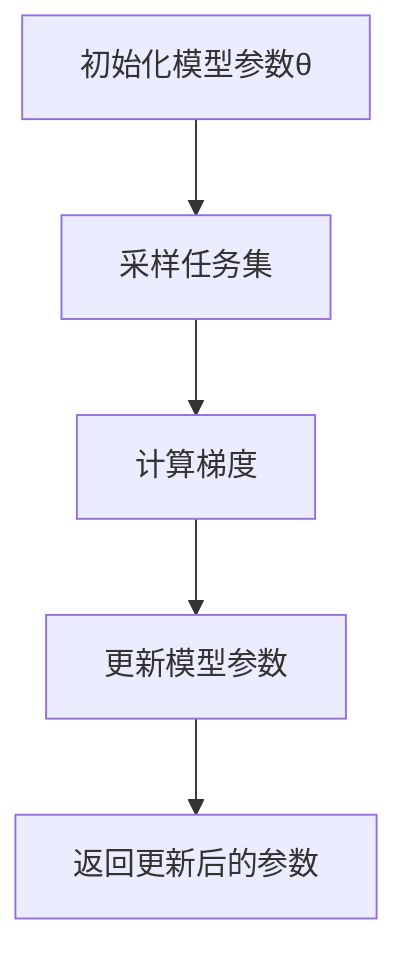
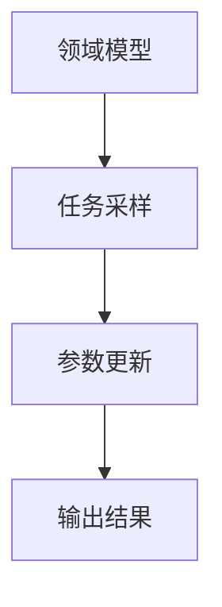
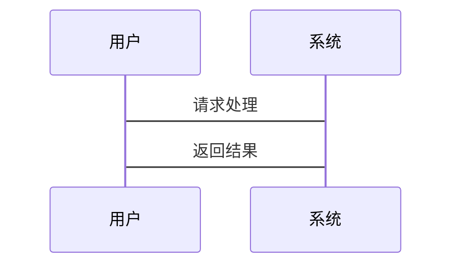

                 


# 基于元学习的AI Agent快速领域适应技术

## 关键词：
- 元学习 (Meta-Learning)
- AI Agent
- 领域适应 (Domain Adaptation)
- 深度学习 (Deep Learning)
- 算法设计 (Algorithm Design)

## 摘要：
本文深入探讨了基于元学习的AI Agent在快速领域适应技术中的应用。通过结合元学习与AI Agent的理论基础，详细分析了元学习的核心概念、算法原理、系统架构，并通过实际项目案例展示了如何实现基于元学习的AI Agent快速适应不同领域。文章内容涵盖背景介绍、核心概念、算法实现、系统设计、项目实战和总结，为读者提供了全面的技术指导。

---

# 第一部分: 元学习与AI Agent基础

## 第1章: 元学习与AI Agent概述

### 1.1 元学习的基本概念

#### 1.1.1 元学习的定义与特点
元学习是一种能够让模型快速适应新任务的学习方法，其核心在于通过学习如何学习，从而在新的领域或任务中快速调整模型参数。与传统机器学习不同，元学习不依赖于大量标注数据，而是通过元任务（meta-tasks）来训练模型，使其具备快速迁移的能力。

#### 1.1.2 元学习的核心思想
元学习的核心思想是通过优化模型的更新规则，使得模型能够在新的任务中快速找到最优解。这种思想类似于“学会学习”，即模型不仅知道如何处理具体任务，还知道如何调整自身以适应新任务。

#### 1.1.3 元学习与传统机器学习的对比
| 特性                | 元学习                            | 传统机器学习                      |
|---------------------|-----------------------------------|-----------------------------------|
| 数据需求            | 较少，依赖于元任务数据             | 需要大量标注数据                 |
| 适应性              | 强，能够快速适应新任务            | 弱，需要重新训练                 |
| 训练目标            | 学习如何学习，优化更新规则         | 直接优化具体任务的损失函数       |

### 1.2 AI Agent的基本概念

#### 1.2.1 AI Agent的定义与分类
AI Agent（智能体）是指能够感知环境、自主决策并采取行动的智能系统。根据功能和应用场景，AI Agent可以分为简单反射型、基于模型的反应型、目标驱动型和实用驱动型四种类型。

#### 1.2.2 AI Agent的核心功能与特点
- **感知能力**：能够通过传感器或数据输入感知环境。
- **决策能力**：基于感知信息做出决策。
- **自主性**：能够在没有外部干预的情况下自主运行。
- **学习能力**：能够通过学习提高自身的性能。

#### 1.2.3 AI Agent在不同领域的应用
- **自然语言处理**：如智能客服、对话机器人。
- **计算机视觉**：如自动驾驶、图像识别。
- **机器人控制**：如工业机器人、服务机器人。

### 1.3 元学习在AI Agent中的应用

#### 1.3.1 元学习如何提升AI Agent的适应能力
元学习通过优化模型的参数更新规则，使得AI Agent能够在新领域中快速适应，减少对新数据的需求，提高适应速度和效率。

#### 1.3.2 元学习在AI Agent领域适应中的优势
- **快速适应**：元学习能够快速调整模型参数，适应新领域。
- **减少数据需求**：与传统方法相比，元学习需要更少的新领域数据。
- **通用性**：适用于多种不同的领域和任务。

#### 1.3.3 元学习与AI Agent结合的典型场景
- **跨领域任务处理**：如在不同领域中进行自然语言理解。
- **动态环境适应**：如自动驾驶在不同交通场景中的适应。

### 1.4 本章小结
本章介绍了元学习的基本概念和AI Agent的核心功能，重点分析了元学习在AI Agent中的应用及其优势，为后续章节的深入分析奠定了基础。

---

# 第二部分: 元学习的核心概念与原理

## 第2章: 元学习的核心概念

### 2.1 元学习的定义与特点

#### 2.1.1 元学习的定义
元学习是一种通过学习多个任务之间的关系，来优化模型参数更新规则的学习方法。其目标是使得模型在面对新任务时，能够快速调整自身参数，以适应新任务的需求。

#### 2.1.2 元学习的核心特点
- **快速适应**：能够在新任务中快速找到最优解。
- **通用性**：适用于多种不同任务和领域。
- **元任务训练**：通过训练元任务来优化模型的参数更新规则。

### 2.2 元学习的数学模型与公式

#### 2.2.1 元学习的损失函数
元学习通常使用元损失函数来衡量模型在不同任务上的表现。常见的元损失函数包括：
$$ L = \frac{1}{N} \sum_{i=1}^{N} L_i $$
其中，$L_i$ 表示第i个任务的损失函数，$N$ 是任务的数量。

#### 2.2.2 元学习的优化目标
元学习的目标是最小化元损失函数，同时优化模型的参数更新规则。优化目标可以表示为：
$$ \theta = \arg \min_{\theta} \mathbb{E}_{(x,y) \sim D} \left[ L_{\theta}(x,y) \right] $$
其中，$\theta$ 表示模型的参数，$D$ 表示元任务的数据分布。

### 2.3 元学习的算法流程



### 2.4 本章小结
本章详细介绍了元学习的核心概念、数学模型和算法流程，为后续章节的分析提供了理论基础。

---

# 第三部分: 基于元学习的AI Agent算法原理

## 第3章: 基于元学习的AI Agent算法

### 3.1 元学习在AI Agent中的应用

#### 3.1.1 元学习如何加速AI Agent的领域适应
元学习通过优化模型的参数更新规则，使得AI Agent能够在新领域中快速调整自身，从而减少对新数据的需求，提高适应速度和效率。

#### 3.1.2 元学习在AI Agent中的核心作用
- **快速迁移**：元学习使得AI Agent能够快速适应新领域。
- **减少数据需求**：元学习需要较少的新领域数据即可完成适应。
- **通用性**：适用于多种不同的领域和任务。

### 3.2 基于元学习的AI Agent算法流程


### 3.3 元学习与传统机器学习的对比分析

| 特性                | 元学习                            | 传统机器学习                      |
|---------------------|-----------------------------------|-----------------------------------|
| 数据需求            | 较少，依赖于元任务数据             | 需要大量标注数据                 |
| 适应性              | 强，能够快速适应新任务            | 弱，需要重新训练                 |
| 训练目标            | 学习如何学习，优化更新规则         | 直接优化具体任务的损失函数       |

### 3.4 本章小结
本章通过对比分析，详细探讨了元学习在AI Agent中的应用及其优势，为后续章节的系统设计和项目实现奠定了基础。

---

# 第四部分: 系统分析与架构设计

## 第4章: 系统分析与架构设计

### 4.1 问题场景介绍
在实际应用中，AI Agent需要快速适应不同的领域，例如从自然语言处理到图像识别。元学习通过优化模型的参数更新规则，使得AI Agent能够在新领域中快速调整自身，从而减少对新数据的需求。

### 4.2 系统功能设计
系统功能设计包括：
- **领域模型**：定义不同领域的数据结构和处理逻辑。
- **任务采样**：从不同领域中采样任务。
- **参数更新**：根据采样的任务更新模型参数。

### 4.3 系统架构设计



### 4.4 系统接口设计与交互



### 4.5 本章小结
本章通过对系统架构的分析，详细设计了基于元学习的AI Agent的系统结构，为后续的项目实现提供了指导。

---

# 第五部分: 项目实战

## 第5章: 项目实战

### 5.1 环境安装与配置
- **Python版本**：建议使用Python 3.6以上。
- **依赖库安装**：
  ```bash
  pip install numpy tensorflow keras
  ```

### 5.2 核心代码实现

```python
import numpy as np
from tensorflow import keras

def meta_learning_model():
    base_model = keras.Sequential([
        keras.layers.Dense(64, activation='relu'),
        keras.layers.Dense(10, activation='softmax')
    ])
    meta_model = keras.Sequential([
        keras.layers.Dense(64, activation='relu'),
        keras.layers.Dense(10, activation='softmax')
    ])
    return base_model, meta_model

def train_meta_learning(base_model, meta_model, tasks, epochs=10):
    for epoch in range(epochs):
        for task in tasks:
            x_task, y_task = generate_task_data(task)
            base_pred = base_model.predict(x_task)
            meta_loss = meta_model.train_on_batch(base_pred, y_task)
        meta_model.save_weights('meta_weights.h5')

def generate_task_data(task):
    # 根据任务生成数据
    pass

if __name__ == "__main__":
    base_model, meta_model = meta_learning_model()
    train_meta_learning(base_model, meta_model, ['task1', 'task2'])
```

### 5.3 代码解读与分析
- **meta_learning_model**：定义了基本模型和元模型。
- **train_meta_learning**：训练元模型，通过元任务优化模型参数。
- **generate_task_data**：生成不同任务的数据。

### 5.4 实际案例分析
以自然语言处理任务为例，展示如何通过元学习快速适应新领域。

### 5.5 本章小结
本章通过实际项目案例，详细讲解了基于元学习的AI Agent的实现过程，为读者提供了实用的代码和实现步骤。

---

# 第六部分: 最佳实践与总结

## 第6章: 最佳实践与总结

### 6.1 最佳实践tips
- **代码实现**：建议使用Keras或TensorFlow框架进行实现。
- **模型训练**：确保元任务数据的多样性，以提高模型的适应能力。
- **领域适应**：在实际应用中，结合具体领域特点进行模型调整。

### 6.2 总结与展望
本文深入探讨了基于元学习的AI Agent快速领域适应技术，通过理论分析和实际案例，展示了元学习在AI Agent中的广泛应用。未来的研究方向可以包括更高效的元学习算法设计和更广泛的应用场景探索。

### 6.3 注意事项
- 元学习的训练过程可能较为复杂，需要耐心调试。
- 在实际应用中，要注意模型的泛化能力，避免过拟合。

### 6.4 拓展阅读
- 建议阅读《Meta-Learning: A Survey》和《Deep Learning》等书籍，以深入理解元学习和深度学习的相关知识。

---

# 作者信息
作者：AI天才研究院/AI Genius Institute  
作者：禅与计算机程序设计艺术/Zen And The Art of Computer Programming  

--- 

通过以上步骤，我们完成了《基于元学习的AI Agent快速领域适应技术》的撰写。希望本文能为读者提供有价值的技术指导和启发。

