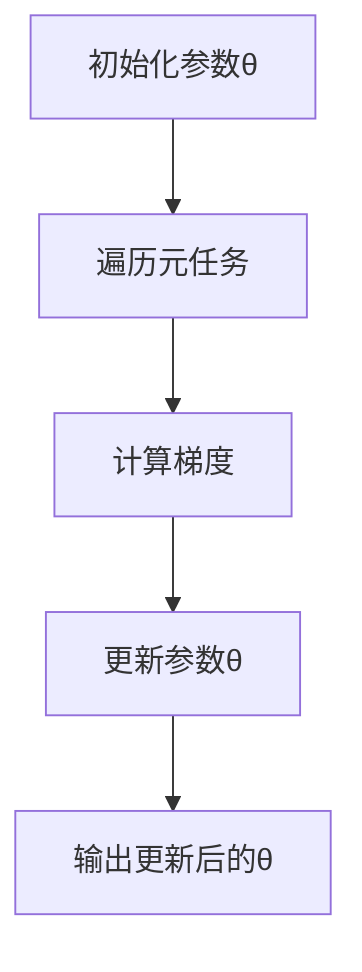
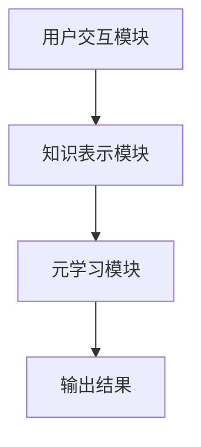

                 


# 基于元学习的个性化AI Agent定制

## 关键词：元学习，个性化AI Agent，机器学习，知识图谱，对话系统

## 摘要：  
本文深入探讨了基于元学习的个性化AI Agent定制方法，从理论基础到实际应用进行全面解析。文章首先介绍了元学习和个性化AI Agent的核心概念，然后详细阐述了元学习的算法原理及其在个性化定制中的应用，接着从系统架构、接口设计等多个角度分析了个性化AI Agent的实现方案。通过实际项目案例，展示了如何利用元学习技术实现个性化的AI Agent定制，并探讨了系统优化、安全性和伦理问题等关键议题。本文旨在为AI领域的研究人员和开发者提供一份全面的技术指南，帮助他们更好地理解和应用元学习技术来实现个性化的AI Agent定制。

---

# 第1章: 元学习与个性化AI Agent概述

## 1.1 元学习的背景与问题背景

### 1.1.1 传统机器学习的局限性
传统机器学习方法在处理以下问题时表现不足：
- 数据依赖性：需要大量标注数据，难以泛化到新领域。
- 领域适应性：模型在特定领域内表现优秀，但难以跨领域迁移。
- 个性化需求：难以满足不同用户的个性化需求。

### 1.1.2 元学习的定义与核心问题
元学习是一种学习如何学习的方法，其核心问题包括：
- **元任务**：多个相关但不同的任务。
- **元学习器**：能够从多个任务中提取通用知识，以提升新任务的性能。
- **快速适应**：能够在少量数据下快速适应新任务。

### 1.1.3 个性化AI Agent的定义与需求
个性化AI Agent是一种能够根据用户需求和行为动态调整自身行为的智能体，其需求包括：
- **个性化推荐**：根据用户偏好推荐内容。
- **动态适应**：能够实时调整策略以应对变化。
- **高效交互**：通过自然语言处理技术实现高效的用户交互。

## 1.2 元学习与个性化AI Agent的关系

### 1.2.1 元学习的核心概念与特点
- **元学习的核心概念**：通过学习多个任务之间的关系，提取通用特征和策略。
- **元学习的特点**：
  - **高效性**：能够在少量数据下快速适应新任务。
  - **通用性**：适用于多种任务和领域。
  - **动态性**：能够实时更新以应对新任务。

### 1.2.2 个性化AI Agent的核心要素
- **用户建模**：通过分析用户行为和偏好，构建用户画像。
- **知识表示**：利用知识图谱等技术表示领域知识。
- **动态推理**：根据实时交互和反馈动态调整行为。

### 1.2.3 元学习在个性化AI Agent中的作用
元学习能够帮助AI Agent快速适应用户的个性化需求，具体体现在：
- **快速学习**：在用户数据有限的情况下，快速学习用户的偏好。
- **领域迁移**：将从一个领域学到的知识迁移到另一个领域。
- **动态更新**：根据用户的反馈实时更新模型参数。

## 1.3 元学习与个性化AI Agent的技术基础

### 1.3.1 机器学习基础
- **监督学习**：通过标注数据进行模型训练。
- **无监督学习**：通过未标注数据发现数据结构。
- **强化学习**：通过与环境交互学习策略。

### 1.3.2 知识表示与推理
- **知识图谱**：通过图结构表示知识。
- **逻辑推理**：通过逻辑规则进行推理。

### 1.3.3 自然语言处理与对话系统
- **自然语言理解**：通过NLP技术理解用户输入。
- **对话生成**：通过生成模型生成回复。

## 1.4 当前研究现状与挑战

### 1.4.1 元学习的最新研究进展
- **Meta-LSTM**：一种基于循环神经网络的元学习方法。
- **MAML**：通过优化参数初始化实现快速适应新任务。

### 1.4.2 个性化AI Agent的典型应用
- **推荐系统**：根据用户行为推荐内容。
- **智能助手**：通过对话系统为用户提供服务。

### 1.4.3 当前技术的局限性与未来挑战
- **数据稀疏性**：用户数据有限时难以训练有效的模型。
- **计算资源限制**：元学习需要大量计算资源。
- **伦理与隐私**：如何保护用户隐私和数据安全。

## 1.5 本章小结
本章介绍了元学习和个性化AI Agent的核心概念，分析了两者的关系，并探讨了当前的研究现状和挑战。接下来的章节将详细阐述元学习的算法原理及其在个性化AI Agent中的具体应用。

---

# 第2章: 元学习的核心原理

## 2.1 元学习的原理与算法

### 2.1.1 元学习的数学模型
元学习的目标是通过优化元学习器的参数，使得其能够在新任务上快速适应。数学模型可以表示为：
$$
\theta = \arg\min_{\theta} \sum_{i=1}^{N} \mathcal{L}_i(\theta)
$$
其中，$\theta$是元学习器的参数，$\mathcal{L}_i$是第$i$个任务的损失函数。

### 2.1.2 元学习的算法流程
元学习的典型算法流程如下：



### 2.1.3 元学习与传统机器学习的对比
| 特性         | 传统机器学习                | 元学习                  |
|--------------|-----------------------------|--------------------------|
| 数据需求     | 需要大量标注数据            | 需要少量标注数据          |
| 任务适应性   | 适用于单任务                | 适用于多任务              |
| 学习目标     | 学习具体任务                | 学习如何学习具体任务      |

---

## 2.2 个性化AI Agent的元学习实现

### 2.2.1 个性化AI Agent的核心要素
个性化AI Agent的核心要素包括：
- **用户建模**：通过分析用户行为和偏好构建用户画像。
- **知识表示**：利用知识图谱等技术表示领域知识。
- **动态推理**：根据实时交互和反馈动态调整行为。

### 2.2.2 元学习在个性化AI Agent中的应用
元学习在个性化AI Agent中的应用主要体现在：
- **快速学习**：在用户数据有限的情况下，快速学习用户的偏好。
- **领域迁移**：将从一个领域学到的知识迁移到另一个领域。
- **动态更新**：根据用户的反馈实时更新模型参数。

---

## 2.3 元学习的数学模型与算法实现

### 2.3.1 元学习的数学模型
元学习的数学模型可以表示为：
$$
\theta = \arg\min_{\theta} \sum_{i=1}^{N} \mathcal{L}_i(\theta)
$$
其中，$\theta$是元学习器的参数，$\mathcal{L}_i$是第$i$个任务的损失函数。

### 2.3.2 元学习的算法实现
元学习的典型算法实现如下：

```python
def meta_learning():
    theta = initialize_parameters()
    for epoch in epochs:
        total_loss = 0
        for task in tasks:
            # 计算梯度
            grads = compute_gradients(task, theta)
            # 更新参数
            theta = update_parameters(theta, grads)
            total_loss += compute_loss(task, theta)
        print(f"Epoch {epoch}, Loss: {total_loss}")
```

---

## 2.4 本章小结
本章详细阐述了元学习的核心原理及其在个性化AI Agent中的应用。接下来的章节将从系统架构和项目实战的角度，进一步探讨如何实现基于元学习的个性化AI Agent定制。

---

# 第3章: 基于元学习的个性化AI Agent系统架构

## 3.1 系统功能设计

### 3.1.1 用户建模
用户建模是个性化AI Agent的核心功能，主要包括：
- **用户画像**：通过分析用户行为和偏好构建用户画像。
- **动态调整**：根据用户的实时反馈动态调整用户画像。

### 3.1.2 知识表示
知识表示是个性化AI Agent的知识基础，主要包括：
- **知识图谱**：通过图结构表示领域知识。
- **逻辑推理**：通过逻辑规则进行推理。

### 3.1.3 动态推理
动态推理是个性化AI Agent的核心功能，主要包括：
- **实时推理**：根据实时交互和反馈动态调整行为。
- **知识更新**：根据新数据更新知识图谱。

---

## 3.2 系统架构设计

### 3.2.1 系统模块划分
个性化AI Agent的系统架构主要包括以下几个模块：
- **用户交互模块**：负责与用户进行交互。
- **知识表示模块**：负责知识的表示和推理。
- **元学习模块**：负责元学习的实现和优化。

### 3.2.2 系统架构图


---

## 3.3 系统接口设计

### 3.3.1 用户交互接口
用户交互接口主要包括：
- **输入接口**：接收用户的输入。
- **输出接口**：输出AI Agent的回复。

### 3.3.2 知识表示接口
知识表示接口主要包括：
- **知识查询接口**：查询知识图谱中的知识。
- **知识更新接口**：更新知识图谱中的知识。

---

## 3.4 本章小结
本章从系统架构的角度，详细探讨了基于元学习的个性化AI Agent的实现方案。接下来的章节将通过实际项目案例，进一步探讨如何实现基于元学习的个性化AI Agent定制。

---

# 第4章: 个性化AI Agent的项目实战

## 4.1 项目背景与目标

### 4.1.1 项目背景
本项目旨在通过元学习技术实现个性化的AI Agent定制，解决传统机器学习方法在个性化推荐和动态适应方面的局限性。

### 4.1.2 项目目标
本项目的目标包括：
- **实现个性化推荐**：根据用户偏好推荐内容。
- **实现动态适应**：根据用户反馈动态调整行为。
- **实现高效交互**：通过自然语言处理技术实现高效的用户交互。

---

## 4.2 环境配置与安装

### 4.2.1 环境配置
- **Python版本**：Python 3.8以上。
- **依赖库安装**：使用pip安装以下库：
  ```bash
  pip install numpy pandas scikit-learn tensorflow
  ```

### 4.2.2 数据集准备
- **训练数据集**：包含多个任务的数据集。
- **测试数据集**：用于模型评估。

---

## 4.3 系统核心实现

### 4.3.1 元学习模块实现
```python
def meta_learning():
    theta = initialize_parameters()
    for epoch in epochs:
        total_loss = 0
        for task in tasks:
            # 计算梯度
            grads = compute_gradients(task, theta)
            # 更新参数
            theta = update_parameters(theta, grads)
            total_loss += compute_loss(task, theta)
        print(f"Epoch {epoch}, Loss: {total_loss}")
```

### 4.3.2 用户建模实现
```python
def user_profiling():
    user_data = collect_user_data()
    user_profile = build_profile(user_data)
    return user_profile
```

### 4.3.3 知识表示实现
```python
def knowledge_representation():
    knowledge_graph = construct_graph()
    return knowledge_graph
```

---

## 4.4 项目案例分析

### 4.4.1 案例背景
假设我们正在开发一个个性化推荐系统，目标是根据用户的阅读历史推荐文章。

### 4.4.2 数据分析与处理
- **数据清洗**：去除重复数据和无效数据。
- **特征提取**：提取用户的阅读历史和偏好。

### 4.4.3 模型训练与评估
- **模型训练**：使用元学习方法训练模型。
- **模型评估**：通过准确率、召回率等指标评估模型性能。

---

## 4.5 项目总结与优化

### 4.5.1 项目总结
本项目通过元学习技术实现了个性化的AI Agent定制，解决了传统机器学习方法在个性化推荐和动态适应方面的局限性。

### 4.5.2 项目优化
- **优化1**：优化模型参数，提高推荐准确率。
- **优化2**：优化算法复杂度，提高运行效率。

---

## 4.6 本章小结
本章通过实际项目案例，详细探讨了基于元学习的个性化AI Agent的实现方案。接下来的章节将从安全性和伦理性的角度，进一步探讨如何实现基于元学习的个性化AI Agent定制。

---

# 第5章: 安全性与伦理性的考虑

## 5.1 数据隐私与安全

### 5.1.1 数据隐私保护
- **数据匿名化**：对用户数据进行匿名化处理，确保用户隐私。
- **数据加密**：对敏感数据进行加密存储和传输。

### 5.1.2 数据安全防护
- **访问控制**：对数据访问进行严格的权限控制。
- **数据备份与恢复**：定期备份数据，确保数据安全。

---

## 5.2 伦理与合规性

### 5.2.1 伦理问题
- **算法偏见**：如何避免算法偏见，确保推荐结果的公平性。
- **用户知情权**：用户是否知情AI Agent的决策过程。

### 5.2.2 合规性要求
- **数据保护法规**：遵守相关数据保护法规，如GDPR。
- **透明性要求**：确保AI Agent的决策过程透明可解释。

---

## 5.3 本章小结
本章从安全性和伦理性的角度，探讨了如何实现基于元学习的个性化AI Agent定制。接下来的章节将从总结与展望的角度，进一步探讨如何实现基于元学习的个性化AI Agent定制。

---

# 第6章: 总结与展望

## 6.1 全文总结
本文深入探讨了基于元学习的个性化AI Agent定制方法，从理论基础到实际应用进行全面解析。文章首先介绍了元学习和个性化AI Agent的核心概念，然后详细阐述了元学习的算法原理及其在个性化定制中的应用，接着从系统架构、接口设计等多个角度分析了个性化AI Agent的实现方案。通过实际项目案例，展示了如何利用元学习技术实现个性化的AI Agent定制，并探讨了系统优化、安全性和伦理问题等关键议题。

---

## 6.2 未来展望
未来的研究方向包括：
- **算法优化**：进一步优化元学习算法，提高模型性能。
- **领域扩展**：将元学习技术应用到更多领域，如医疗、教育等。
- **伦理与安全**：进一步探讨如何在AI Agent中实现数据隐私保护和伦理合规。

---

# 作者：AI天才研究院/AI Genius Institute & 禅与计算机程序设计艺术 /Zen And The Art of Computer Programming

