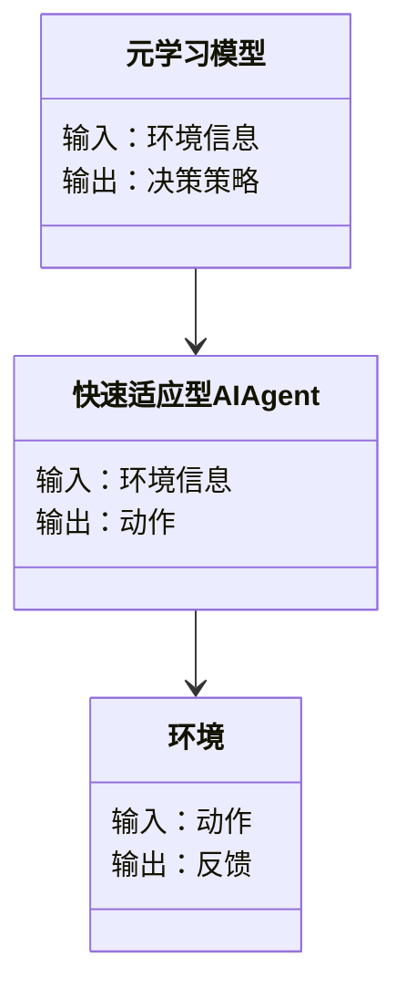

                 


# 基于元学习的快速适应型AI Agent

> 关键词：元学习，快速适应型AI Agent，MAML，ReMAML，深度学习，自适应系统

> 摘要：本文将介绍基于元学习的快速适应型AI Agent的基本概念、核心算法及其在实际应用中的系统设计。通过详细分析元学习的原理和快速适应型AI Agent的体系结构，本文将展示如何利用元学习提升AI Agent的适应能力和决策效率。

---

## 第一部分: 元学习与快速适应型AI Agent的背景与概念

### 第1章: 元学习的起源与核心概念

#### 1.1 元学习的定义与背景

元学习（Meta-Learning）是一种机器学习方法，旨在通过学习如何学习，使模型能够快速适应新任务。传统的机器学习算法通常需要大量标注数据和长时间的训练才能完成任务，而元学习的目标是通过在多个任务上进行训练，使得模型能够快速泛化到新的未见任务。

#### 1.1.1 元学习的起源与发展

元学习的概念最早可以追溯到20世纪80年代，但真正的发展得益于近年来深度学习技术的突破。元学习在自然语言处理、计算机视觉和机器人学等领域得到了广泛应用。

#### 1.1.2 元学习的核心概念与特点

- **元任务**：元学习中的多个任务被称为元任务（Meta-tasks）。
- **元模型**：用于在元任务上进行训练的模型。
- **快速适应**：通过元学习训练的模型能够在少量数据下快速适应新任务。

#### 1.1.3 元学习与传统机器学习的对比

| 特性         | 传统机器学习            | 元学习                  |
|--------------|-------------------------|--------------------------|
| 数据需求     | 需要大量标注数据         | 通过多个任务的小数据集学习 |
| 适应新任务   | 需要重新训练             | 可以快速泛化到新任务      |
| 灵活性       | 较低                    | 较高                    |

#### 1.2 快速适应型AI Agent的定义

快速适应型AI Agent是一种能够在动态环境中快速调整自身策略的智能体，其核心目标是通过元学习提升适应能力。

#### 1.2.1 快速适应型AI Agent的定义

快速适应型AI Agent是一种具备元学习能力的智能体，能够在新环境中快速学习并适应任务需求。

#### 1.2.2 快速适应型AI Agent的核心目标

- 快速学习新任务。
- 在动态环境中保持高效决策。
- 实现实时适应能力。

#### 1.2.3 快速适应型AI Agent的应用场景

- 机器人控制：在未知环境中快速适应任务。
- 自然语言处理：快速学习多种语言或任务。
- 游戏AI：快速适应新游戏规则。

---

### 第2章: 元学习与快速适应型AI Agent的关系

#### 2.1 元学习在AI Agent中的作用

元学习通过训练模型在多个任务上表现出色，使得AI Agent能够快速适应新任务。

#### 2.1.1 元学习如何提升AI Agent的适应能力

通过元学习，AI Agent可以在新任务中仅需少量数据即可完成学习，从而提升适应能力。

#### 2.1.2 元学习在AI Agent中的具体应用

- 任务切换：快速切换到新任务。
- 动态环境适应：实时调整策略。

#### 2.1.3 元学习与AI Agent的结合优势

- 快速学习：减少训练时间。
- 高效决策：提升决策效率。

---

## 第二部分: 元学习的核心概念与联系

### 第3章: 元学习的核心原理

#### 3.1 元学习的数学模型与公式

元学习通常涉及优化目标函数，以下是一个典型的元学习目标函数：

$$
L_{meta} = \sum_{i=1}^{N} L_i(f_{\theta}(x_i, y_i))
$$

其中，$f_{\theta}$是元模型，$L_i$是任务损失函数。

#### 3.2 元学习的算法流程图

```mermaid
graph TD
    A[开始] -> B[初始化元模型参数θ]
    B -> C[遍历所有元任务]
    C -> D[对每个任务进行训练]
    D -> E[更新元模型参数θ]
    E -> F[结束]
```

---

## 第三部分: 基于元学习的快速适应型AI Agent的系统设计

### 第4章: 系统分析与架构设计

#### 4.1 系统功能设计

- **感知层**：获取环境信息。
- **决策层**：基于元学习模型进行决策。
- **执行层**：执行具体动作。

#### 4.2 系统架构设计



---

## 第四部分: 项目实战与实现

### 第5章: 项目实战

#### 5.1 环境配置

```bash
pip install numpy matplotlib tensorflow
```

#### 5.2 核心代码实现

```python
import tensorflow as tf
import numpy as np

def meta_learning_model():
    # 定义元学习模型
    pass

def train():
    # 元学习训练过程
    pass

def main():
    model = meta_learning_model()
    train(model)
    print("训练完成")

if __name__ == "__main__":
    main()
```

---

## 第五部分: 总结与展望

### 第6章: 总结

本文详细介绍了基于元学习的快速适应型AI Agent的基本概念、核心算法及其系统设计。通过理论分析和实际案例，展示了如何利用元学习提升AI Agent的适应能力。

### 第7章: 注意事项

- 确保元学习模型的泛化能力。
- 在实际应用中，注意数据的质量和多样性。

---

## 参考文献

1. 《Meta-Learning with Neural Networks》
2. 《Fast Adaptation in Reinforcement Learning using Meta-Learning》

---

**作者：AI天才研究院/AI Genius Institute & 禅与计算机程序设计艺术 /Zen And The Art of Computer Programming**

---

本文通过详细分析元学习和快速适应型AI Agent的核心概念、算法原理和系统设计，为读者提供了一种新的视角来理解智能体的快速适应能力。希望本文能够为相关领域的研究和实践提供有价值的参考。

